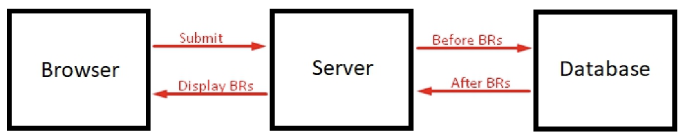

# ServiceNow Development Handbook

[Tim Woodruff](https://www.linkedin.com/in/sn-timw/)

## Resources

- [books](http://books.snc.guru/)
- [blog](http://snprotips.com/)
- [code examples](https://github.com/thisnameissoclever/sn_dev_handbook_3/tree/a31e35c9f09a61dd021bf4883159307222b00f58)

## Code & Coding Guidelines

- use _pure functions_: functions without side effects
  - avoid pass-by-reference (PBR) problems:
    - primitive types (string, number, boolean) are passed by value <- no side effects as the original reference is not changed
    - objects are passed by reference <- side effects as the original reference points to the same object
  - declare variables used in the function

```js
function sayHello(myName) {
  alert("Hello, " + myName + "!");
}
```

- Don't Repeat Yourself: **DRY**
  - use objects or arrays to loop over data
- use _Constructors_ to create objects
  - capital function name: `function Person(name, age) {...}`
  - use `new` keyword to create object: `var myPerson = new Person("John", 30);`
  - find object constructor name: `myPerson.constructor.name`

```js
var i, grRecord, stateChange, stateChangeDetails;

//constructor
function StageChangeDetail(table, query, state) {
  this.table_name = table;
  this.encoded_query = query;
  this.state_value = state;
}

stateChangeDetails = [
  //An array of StateChangeDetail objects
  new StageChangeDetail("incident", "some_query", 3),
  new StageChangeDetail("problem", "some_other_query", 4),
  new StageChangeDetail("change_request", "yet_a_third_query", 5),
];

for (i = 0; i < stateChangeDetails.length; i++) {
  stateChange = stateChangeDetails[i];
  grRecord = new GlideRecord(stateChange.table_name);
  grRecord.addEncodedQuery(stateChange.encoded_query);
  grRecord.query();
  while (grRecord.next()) {
    //set state to work in progress
    grRecord.setValue("state", stateChange.state_value);
    grRecord.update();
  }
}
```

- or use functions

```js
changeState("incident", 3, "some_query");
changeState("problem", 4, "some_other_query");
changeState("change_request", 5, "third_query");

/**
 * Update the state of all records in the provided table, which match the provided encoded query.
 * @param {string} tableName - The name of the table to run this operation against
 * @param {string|number} newState - The new value for the state field. This may be an integer or string, depending on the value expected by the table provided.
 * @param {string} [encodedQuery] - A string containing the encoded query to filter the records on which to perform this operation. If no query is provided, ALL records in the table will be modified.
 * @return {number} - The number of records on which this operation was performed.
 */
function changeState(tableName, newState, encodedQuery) {
  var grRecord = new GlideRecord(tableName);
  if (encodedQuery) {
    grRecord.addEncodedQuery(encodedQuery);
  }

  grRecord.setValue("state", newState); //set state to work in progress
  grRecord.updateMultiple();

  return grRecord.getRowCount();
}
```

- getter and setter
  - use `.getValue()` and `.setValue()` to get and set field values and avoid pass-by-reference problems
    - exceptions: 
      - Journal fields - write directly: `grRecord.work_notes = "some text";`
        - use `grRecord.work_notes.getJournalEntry(1)` to read the latest work note
        - use `grRecord.work_notes.getJournalEntry(-1)` to get all work notes (delimiter: `\n\n`)
      - Catalog variables - get values with `.toString()` and avoid PBR issues
      - Dot-walking
        - also use `.toString()` to avoid PBR issues
        - do not dot-walk for more than three layers - if necessary use `grRecord.getRefRecord()` to get the server-side GlideElement object
- be consistent
  - string declaration: single `'` or double quotes `"`
  - curly-brace placement - see [One True Brace Style (1TBS)](https://en.wikipedia.org/wiki/Indentation_style#Variant:_1TBS_(OTBS))
  - indentation - use a Code Editor with (auto) formatting to avoid manual errors
- field security vs. field obscurity
  - client-side measure (UI Policy, Client Script) can be bypassed and are only to be used for user convenience
  - use server-side measures (ACL, Business Rule, Data Policy) to enforce security
  - combine client-side and server-side measures for best results
- UI Policies vs. Client Scripts
  - UI Policies are simpler and do not allow for complex logic
    - use UI Policies for simple field visibility, mandatory, and read-only settings
  - only use Client Scripts when complex scenarios make it necessary
    - document why you habe to use a Client Script
    - include logic to:
      - handle the reverse-if-false scenario or when the condition is no longer true
      - consider first-time load (if `isLoading` is true)
      - consider triggering field of an `onChange` Client Script
  - setVisible() vs. setDisplay() (Client Script)
    - `g_form.setVisible()` hides the field and its label, but leaves a blank space
    - `g_form.setDisplay()` hides the field and its label, and collapses the blank space
- Business Rule Order: `current.update()`
  - 
  - always triggered by database operations: `insert`, `update`, `delete`, `query`
  - when - in relation to db operations:
    - `before`
      - alter the record before it is written to the db, do not use to alter other records
      - `current.setAbortAction(true)` - stop the operation
        - or use the _Abort action_ checkbox in the Business Rule
      - no need for `current.update()`, as the operation is already on the way to the db
      - avoid long scripts - user has to **wait** for execution!
    - `after`
      - after db operation but before the record is displayed
      - very good to update related records that should be displayed in the current view - for example related list records
        - use async for related records that are currently not displayed
      - be careful with `current.update()`, as it triggers the Business Rule again (infinite loop potential!)
      - avoid long scripts - user has to **wait** for execution!
    - `async`
      - will be executed in a few seconds - but the user does not have to wait
      - for related records that are currently not displayed
      - caveat: previous state of `current` record is not available
      - be careful not to run into race conditions
    - `display`
      - triggered after the record is _retrieved_ from the db
      - modify displayed data **without** altering the record (as long as `current.update()` is not used - do not!)
      - often used to populate the _scratchpad_ for client scripts