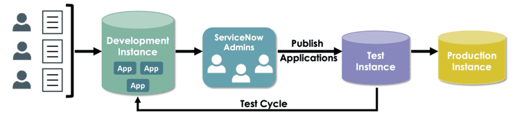

# App Engine Studio

## TODO

## Resources

### 📘 Courses

- [Introduction to App Engine Studio for Citizen Developers (Xanadu)](https://learning.servicenow.com/lxp/en/app-engine/introduction-to-app-engine-studio-for-citizen-developers?id=learning_course_prev&course_id=cc8d200e87629650cc49bbb5cebb35b7)

### 📄 ServiceNow Documentation

- [Consider the application’s characteristics before deciding to build](https://docs.servicenow.com/csh?topicname=before-you-begin.html&version=latest)
- [Build new roles](https://docs.servicenow.com/csh?topicname=build-new-role-application.html&version=latest)
- [ServiceNow Field Types](https://docs.servicenow.com/csh?topicname=r_FieldTypes.html&version=latest)

### 📜 Reference Notes

- [Flow Designer in detail](./sn-flow-designer.md)

## ServiceNow No-code and Low-code Solutions

- ServiceNow enables developers of all skill levels (citizen developers and IT developers) to collaborate seamlessly within a shared environment:

  - Citizen developers quickly initiate and prototype applications.
  - IT developers enhance applications by adding advanced functionality (integrations, sophisticated UI).

- **Good Fit for Now Platform Applications:**

  - Data structured in relational databases.
  - Frequent form-based interactions.
  - Requires robust reporting and dashboards.
  - Workflow or process automation needs.

- **Bad Fit for Now Platform Applications:**

  - Unstructured data (audio, video).
  - Graphics-intensive applications or multiplayer gaming.
  - Applications without defined business processes.

- Consider the application’s characteristics before deciding to build:

  - Focus on solving business problems or improving productivity.
  - Prioritize increasing responsiveness, productivity, and user satisfaction.
  - [Before you begin building an app](https://docs.servicenow.com/csh?topicname=before-you-begin.html&version=latest)

- **Flow Designer** allows rapid automation and integration:

  - Visual workflows simplify automation of routine tasks.
  - Pre-built integrations for on-premise and cloud services.
  - Built-in notifications and real-time tracking of process status.

- Multi-device support ensures user adoption:

  - Adaptive user interfaces on mobile and web (e.g., Service Portal).
  - Allows tasks (requests, approvals, monitoring) from anywhere, anytime.

- Citizen developers hold a critical role in application transformation:
  - Leverage deep knowledge of business processes.
  - Accelerate development and continuous improvement without extensive coding expertise.

## Application Development Lifecycle in App Engine Studio

- Follow the standard development cycle for consistency and quality:

  1. **Development Instance:**

     - Initial application creation.
     - Development and prototyping of features.

  2. **ServiceNow Admin Review:**

     - Application review and initial publishing to test instance.

  3. **Test Instance:**

     - Comprehensive testing.
     - Identify defects or required enhancements.
     - Fixes and refinements made back in the development instance.
     - Continuous loop between development and test instances until application is stable.

  4. **Production Instance:**
     - Publish fully-tested and stable application to production.
     - No direct development or testing occurs in production instance.

- Citizen developers should work closely with ServiceNow System Administrators throughout the lifecycle:

  - Admins handle publishing applications between instances.
  - Citizen developers focus primarily on development and iterative refinement.

- 

## Build an Application in App Engine Studio

- **Application Components**

  - **Data**: Tables and fields to store information.
  - **Experience**: Interfaces such as forms, portals, workspaces, mobile apps.
  - **Logic and Automation**: Flows and emails for automated task management.
  - **Security**: Roles controlling feature access and permissions.

- **Application Creation Steps**

  - **Begin with the end-user perspective** (e.g., safety issue reporting interface).
  - **Create Application Container**
    - Define basic info: Name, Description.
    - Assign initial roles for basic security.
    - hands-on see [Lab 1](#lab-1---create-the-application-framework)
  - **Configure Application via App Home**
    - Setup guided through Data → Experience → Automation.
    - Submit button to request admin review.

- **Configuring Application Components**

  - **Data**
    - Import spreadsheet, create table from scratch, or set up integrations.
    - Add and configure additional fields, auto-numbering, and access permissions.
  - **Experience**
    - User interaction options: Catalog item, Record producer, Workspace, Portal, Mobile.
  - **Automation**
    - Customize or select pre-built flows.
    - Automated email notifications triggered by conditions.
  - **Security (Roles)**
    - Assign standard roles (`admin`, `user`) or scoped custom roles (`security_admin`).
    - Work closely with system administrators (see: [Build new roles](https://docs.servicenow.com/csh?topicname=build-new-role-application.html&version=latest)).

- **Launch Application**

  - Submit to system administrator for testing and deployment.
  - Application lifecycle statuses visible on dashboard:
    - In Development → Pending Approval → In Validation → Rejected/Published.

- **Flexibility**
  - Post-creation configuration allowed: additional tables, fields, roles, and user experiences can be added later.

### Store Information in Your App

- hands-on see [Lab 2](#lab-2---create-a-table-with-a-spreadsheet)
- **Creating Tables in App Engine Studio**
  - **Import a spreadsheet**
    - Quickly create tables using spreadsheets (.xlsx).
    - Ensure spreadsheets have horizontal columns with clear header labels.
  - **Create a blank table**
    - Start a table from scratch, manually adding fields as needed.
    - Optionally extend from existing extensible tables.
      - Extending incorporates original fields, system fields, and allows adding custom fields.
      - Reports on base tables (e.g., Task) include data from all derived tables.
  - **Create a data integration**
    - Configure, execute, and schedule automated imports from Excel files.

#### Transform Spreadsheets to ServiceNow Tables

- **Advantages of Using ServiceNow Tables**:
  - Data accessibility across the enterprise beyond personal desktops.
  - Seamless integration with existing company data, processes, and system integrations.
- **Spreadsheet Conversion Basics**:
  - Rows in spreadsheets become **records** in ServiceNow tables.
  - Columns become **fields** within those tables.
  - All data in ServiceNow (tables, forms, processes) is stored as records.
- **Types of Tables in Applications**:
  - **Base Tables**: Hold primary records of the application.
  - **Reference Tables**: Used to provide lookup values for fields, ensuring data consistency and accuracy.
- **Utilizing Existing ServiceNow Tables**:
  - Use reference fields to pull valid data from existing tables (e.g., Department values from ServiceNow's Department table).
  - Enhances data accuracy by avoiding manual spreadsheet cross-checking.
- **Common Field Types**:
  - **String**
  - **Date**
  - **Integer**
  - **True/False**
  - **Choice** (ideal for smaller lists)
  - **Reference** (ideal for large data sets stored separately)
- **Field Type Behavior**:
  - Field types automatically dictate UI behavior (formatting, validation, prompts).
- **Learn more about available field types**:
  - [ServiceNow Field Types](https://docs.servicenow.com/csh?topicname=r_FieldTypes.html&version=latest)

#### Import Data and Create a Table

- **Prepare Spreadsheet**
  - Clean data, use `.xlsx` format.
  - Ensure headers are in the first row.
- **Add Table**
  - App Home → Data → +Add a table → Import a spreadsheet → Continue.
- **Upload Spreadsheet**
  - Drag/drop or browse to upload.
  - Set header row (e.g., `1`).
  - Enable **Import spreadsheet data** → Continue.
- **Choose Table Structure**
  - Select **A new table** → Create new table → Continue.
- **Preview Imported Data**
  - Review field types.
  - Adjust using **Type** dropdown if needed → Continue.
- **Define Table Properties**
  - Table label → auto-generates table name.
  - Optional: enable **Extensible**, **Auto number** → Continue.
- **Add Permissions**
  - **admin**: Check **All**.
  - **user**: Check **Read** and **Write** → Continue.
- **Confirm Table**
  - Click **Edit table** to open Table Builder or **Done** to return to App Home.

#### Add and Edit Fields with Table Builder

- **Access Table Builder**

  - From **App Home → Data → Edit** next to table.
  - Or from the **table creation confirmation** window → Edit table.

- **Default Fields (non-editable)**

  - `sys_created_on` – Date/time record created.
  - `sys_created_by` – User who created the record.
  - `number` – Auto-numbered identifier (if enabled).
  - `sys_id` – Unique record GUID (hidden).
  - `sys_updated_on` – Date/time last updated.
  - `sys_updated_by` – User who last updated.
  - `sys_mod_count` – Number of updates.

- **Add a Field**

  - Click **+ Add new field** (top or bottom of field list).
  - Set:
    - Column label (field name)
    - Data type (String, Choice, Reference, etc.)
    - Additional properties (e.g., default value)
  - Save.

- **Edit a Field**

  - Click field → change label, name, type, reference, length, default value, display.
  - Press Enter to save.

- **Field Type Configuration**

  - **Choice**:
    - Type → Choice → set type:
      - Dropdown w/ --None--
      - Dropdown w/o --None-- (requires default)
      - Suggestion
    - Define label and value pairs.
  - **Reference**:
    - Type → Reference → select reference table.
  - **String**:
    - "String" → single-line plain text.
    - "String (Full UTF-8)" → allows UTF-8 characters.
  - **Default Value**:
    - Set a static value to auto-fill on record creation.
  - **Display Value**:
    - Toggle ON to make field the visible identifier of records.

- **Delete a Field**

  - User-defined fields only (default/inherited fields cannot be deleted).
  - Locate field → click trash icon → confirm delete.

- **Preview Table**

  - Click **Preview** (top right) to open list view.
  - Double-click records to test field behavior.

- **Field Design Guidelines**
  - Use clear, meaningful **column labels**.
  - **Column names**:
    - Lowercase
    - No spaces
    - Follow platform-safe naming practices
    - See: [Naming Conventions](./30-sn-dev-handbook.md/#tables)
  - Use **Choice** or **Reference** fields for controlled inputs.
  - Avoid changing field type after data entry—may cause data loss.

## UI Options (Experience)

- **User Experience Options (App Home → +Add an experience)**
  - **Catalog Item**
    - Self-service interface with workflow and approval automation.
    - Ideal for structured service requests.
  - **Record Producer**
    - Simplified input form that inserts a single record.
    - Best for lightweight, quick-start data entry.
  - **Workspace**
    - For agents and managers: unified interface with tools for resolution.
    - Includes playbooks, email client, and assistant features.
  - **Portal**
    - Modern web-like experience using ServiceNow Portal.
    - Responsive, simple UI usable across devices.
  - **Mobile Experience**
    - iOS/Android compatible, offline-capable.
    - On-the-go access to company resources.

### Create an Easy Input Form with Catalog Builder

- hands-on see [Lab 3](#lab-3---create-a-record-producer)
- **Add Record Producer**

  - App Home → Experience → +Add an experience → Record Producer → Begin.
  - Set:
    - **Name** – record producer title.
    - **Short Description** – brief instructions for user.

- **Configure in Catalog Builder**
  - **Details**
    - Edit name/description.
    - Add image and rich description (supports embedded media).
  - **Destination**
    - Select destination table for submitted records.
  - **Location**
    - Set catalog: Resources, Service Catalog, Technical Catalog.
    - Set category (appears under catalog item groupings).
  - **Questions**
    - Insert user input variables (fields):
      - **Text**: Single-line, Multi-line, Rich text
      - **Option**: Checkbox, Yes/No
      - **Choice**: Dropdown, Record reference, Multi-select, Radio
      - **Date/Time**: Date, Date & Time
      - **Display label**: Plain or rich text
    - Configure:
      - Label
      - Source table (for choices/reference)
      - Annotations
    - Insert → Preview
      - Preview options: Portal, Now Mobile, Virtual Agent
  - **Settings**
    - Hide “Add to wishlist”
    - Hide attachment
    - Make attachment mandatory
  - **Access**
    - Define user/group access rights (coordinate with Admin).
  - **Submit**
    - Submit record producer → success confirmation → return to App Home.

## Create Automation with Flow Designer

- **Overview**

  - Automate application tasks with no code using **Flow Designer**.
  - Create flows using triggers and actions to manage approvals, tasks, notifications, record updates, and integrations.
  - Visual interface supports:
    - Prebuilt integrations
    - Notifications
    - Reusable data pills
    - Real-time testing and execution logs

- **Start a New Flow**

  - App Home → **+Add a process or third-party integration**
  - Select **Flow** → **Build from scratch**
  - Define flow **Name** and **Description**
  - Click **Continue**, then **Edit this flow** to open Flow Designer

- **Flow Components**

  - **Trigger**
    - Defines when the flow starts:
      - Record created or updated
      - Scheduled time
      - Service Catalog request
    - Use **Condition builder** to filter trigger events
    - Set **Run Trigger** behavior:
      - _For each unique change_
      - _Once_
      - _Only if not currently running_
  - **Action**
    - Logic executed after trigger fires
    - Add from **Core Actions** (e.g., Update Record, Create Task, Send Notification)
    - Use **Data pills** from Trigger and Actions
      - Drag from Data pane or use **Data pill picker**

- **Example: Assign Safety Issues**

  - Trigger:
    - When Issue record is created/updated
    - Condition: Category = "Big"
  - Action:
    - Update record
    - Assign to: Joe Employee
    - Use Data pane to link fields

- **Flow Management**

  - **Save** flow after configuration
  - **Test** flow:
    - Opens **Execution Details** view with step-by-step results
  - **Activate/Deactivate**:
    - Activate = enable Trigger listening
    - Deactivate = pause flow execution

- **Resources**
  - 📜 [Flow Designer in detail](./sn-flow-designer.md)
  - 🧪 [Lab 4: Create a flow to assign safety issue requests](#lab-4---create-a-flow-to-assign-safety-issue-requests)
  - 🧪 [Lab 5: Create an Automated Email Notification](#lab-5---create-an-automated-email-notification)

## Labs

### Lab 1 - Create the Application Framework

🎯 **Goal**: Create a basic application framework for logging and tracking Safety Issues using App Engine Studio.

- **A. Access App Engine Studio**

  - Log in to your Now Learning instance.
  - Navigate to **All > App Engine > App Engine Studio**, select _Get Started_.

- **B. Create New Application**
  - On the App Engine Studio homepage, select _Create app_.
  - Enter application details:
    - Name: `Safety`
    - Description: `This application allows users to log and track Safety Issues.`
    - Upload logo: provide a logo for the app
  - Click _Continue_.
  - Accept default admin and user roles, click _Continue_.
  - Select _Go to app dashboard_.

### Lab 2 - Create a Table with a Spreadsheet

🎯 **Goal**: Import safety issue data from an Excel file to create and configure a new table in the Safety application.

- **A. Create a Table via Spreadsheet**

  - From the Safety App Home, select _+ Add a table or upload a spreadsheet or PDF_.
  - Select _Import a spreadsheet_, then click _Continue_.
  - Upload `safety-issues.xlsx`.
  - Check _Import spreadsheet data_.
  - Click _Continue_.
  - Choose _A new table_, then select _Create new table_ and click _Continue_.
  - Verify the 8 column headings match the spreadsheet.
  - Change data types:
    - Set `Opened by` to Type: `Reference`, Reference: `User [sys_user]`
    - Set `Assigned to` to Type: `Reference`, Reference: `User [sys_user]`
    - Set `Location` to Type: `Reference`, Reference: `Location [cmn_location]`
    - Set `State`, `Category`, and `Priority` to Type: `Choice`
  - Select _Continue_.
  - Set table properties:
    - Table label: `Issues`
    - Table name: auto-filled (leave as is)
    - Make extensible: unchecked
    - Auto-number: checked
      - Prefix: `SAFT`
      - Starting Number: `1000`
      - Number of digits: `7`
  - Click _Continue_.
  - Set permissions:
    - `admin`: Check _All_
    - `user`: Check _Read_ and _Write_
  - Select _Continue_.
  - On the confirmation screen, select _Edit table_.

- **B. Edit the Table Fields in Table Builder**
  - In Table Builder, advance through the introduction by selecting _Next_, then _Get started_.
  - Close the _Choose how to view data_ dialog.
  - In the Data tab, switch to _Fields view_.
  - Toggle _Display value_ ON for the `Number` field.
  - Configure the `Category` field:
    - Confirm Choice Type: _Dropdown with --None--_
    - Set Choices:
      - Label: `Big`, Value: `big`
      - Label: `Medium`, Value: `medium`
      - Label: `Small`, Value: `small`
    - Select _Done_
  - Repeat for `Priority` and `State` fields:
    - both without --None--
    - `Priority` Choices:
      - Label: `1 - Critical`, Value: `critical`
      - Label: `2 - High`, Value: `high`
      - Label: `3 - Moderate`, Value: `moderate`
      - Label: `4 - Low`, Value: `low`
    - `State` Choices:
      - Label: `Pending`, Value: `pending`
      - Label: `Open`, Value: `open`
      - Label: `Working`, Value: `working`
      - Label: `Closed`, Value: `closed`
  - Select _Save_ in the top-right corner.
  - Close the Table Builder tab by clicking _X_ on the "Data Table and Forms Issues" tab.

### Lab 3 - Create a Record Producer

🎯 **Goal**: Create a simplified Safety Issue intake form using a record producer and expose it in the Service Catalog.

- **A. Create a Record Producer**

  - From the Safety app homepage, under Experience, select _+Add_.
  - Select _Record producer_, then _Begin_.
  - Set:
    - Name: `Report a Safety Issue`
    - Short description: `See something, report something – be safe!`
  - Click _Continue_.
  - Select _Edit record producer_.

- **B. Configure the Record Producer Details**

  - In Catalog Builder, scroll to _Item details_ and select _Attach File_.
  - Upload `safety_logo.png`.
  - In the Description field, enter `Report a big, medium, or small safety issue.`
  - Select _Save_.

- **C. Configure the Record Producer Destination**

  - Select _Destination_.
  - Set _Record submission table_ to `Issues`.
  - Select _Save_.

- **D. Configure the Record Producer Location**

  - Select _Location_.
  - Under _Catalogs_, move `Service Catalog` to the Selected column.
  - Click _Save selections_.
  - Under _Categories_, move `Can We Help You?` to the Selected column.
  - Click _Save selections_.

- **E. Configure Catalog Item Questions**

  - Select _Questions_, then _Insert new question_.
  - Set:
    - Question type: `Choice`
    - Question subtype: `Dropdown (fixed values)`
    - Check _Map to a specific field on the table_, select `Category`
    - Question label: `What is the size of this issue?`
    - Check _Mandatory_
  - Select _Choices_ tab:
    - Check _Include none choice_
    - Add:
      - Display name: `Big`, Value: `big`
      - Display name: `Medium`, Value: `medium`
      - Display name: `Small`, Value: `small`
  - Select _Annotation_ tab:
    - Check _Show instructions_
    - Instructions: `If this is an emergency, call 911`
  - Select _Insert Question_
  - Select _Preview_ to verify question and choices, then close preview
  - Repeat steps to add 3 more questions:
    - `Due date`: Type: `Date`, Map to field: `Due date`, Label: `When should this issue be resolved?`, Mandatory
    - `Location`: Type: `Reference`, Map to field: `Location`, Source table: `Location [cmn_location]`, Label: `Where did the issue occur?`, Mandatory
    - `Short description`: Type: `Single Line Text`, Map to field: `Short description`, Label: `Briefly describe the issue`, Mandatory
  - Select _Save_ and _Preview_ to verify all 4 questions, then close preview

- **F. Configure the Record Producer Settings**

  - Select _Settings_.
  - Check _Hide 'Save as draft' button_
  - Click _Save_

- **G. Review and Submit the Record Producer**

  - Select _Review and Submit_
  - Verify all sections (Details, Destination, Location, Questions, Settings)
  - Select _Submit_
  - Select _Return to my application_

- **H. Test the Record Producer**
  - Navigate to **All > Service Portal > Service Portal Home**
  - Select _Request Something_
  - Under _Categories_, choose _Can We Help You?_
  - Select _Report a Safety Issue_
  - Fill out the form and click _Submit_
  - Note the record number at top-left of the confirmation page
  - Return to App Engine Studio
  - In the Safety app homepage, under Data, select _Preview_ for the Issues table
  - Locate the submitted record
    - If `Number` is not visible:
      - Click gear icon > move `Number` to Selected > click _OK_
  - Close the Issues record tab
  - Verify `Report a Safety Issue` is listed under Experience in the Safety app homepage

### Lab 4 - Create a Flow to Assign Safety Issue Requests

🎯 **Goal**: Automatically assign safety issues with Category `Big` to Joe Employee using Flow Designer.

- **A. Create a Flow**

  - From the Safety app homepage, under Logic and automation, select _+ Add a process or third-party integration_.
  - Select _Flow_.
  - Choose _+ Build from scratch_.
  - Enter:
    - Name: `Safety Issue Assignment Flow`
    - Description: `Assign Safety Issues based on Category`
  - Click _Continue_.
  - On the success page, select _Edit this flow_.
  - If prompted, select _Skip tour_

- **B. Configure a Trigger**

  - Select _Add a trigger_.
  - Set:
    - Trigger: `Created or Updated`
    - Table: `Issues [x_<vendor prefix>_safety_issue]`
    - Condition: `Category is Big`
    - Run Trigger: `For each unique change`
  - Click _Done_.

- **C. Configure an Action**

  - In the Actions section, select _Add an Action, Flow Logic, or Subflow_.
  - Select _Action_.
  - In the Action menu:
    - Category: _ServiceNow Core_
    - Action: _Update Record_
  - In the Record field, open the Data Pill Picker:
    - Select `Trigger > Issues Record`
  - Click _+ Add field value_.
  - Set:
    - Field: `Assigned to`
    - Value: `Joe Employee`
  - Click _Done_.

- **D. Test and Activate the Flow**
  - Click _Test_.
  - In the test window, select _Create new record_.
  - Enter:
    - Short description: `Broke my coffee cup`
    - Category: `Big`
  - Click _Submit_.
  - Back in the test window, click _Run Test_.
  - Click _Your test has finished running. View the flow execution details._
  - Expand the _Update Record_ action to confirm values.
  - Click the `Record link (SAFT000XXXX)` to preview the issue.
  - Verify `Assigned to` is set to `Joe Employee`.
  - Close the record and execution details tab.
  - Close the Test Flow window.
  - Click _Activate_.
  - Confirm by clicking _Activate_ again.
  - Close the Safety Issue Assignment Flow tab.
  - Verify `Safety Issue Assignment Flow` appears on the Safety app homepage.

### Lab 5 - Create an Automated Email Notification

🎯 **Goal**: Send an automated email notification to the assignee when a Safety Issue with Category `Big` is created or updated.

- **A. Create the Email Notification**

  - From the Safety app homepage, under Logic and automation, select _+Add_.
  - Select _Email_.
  - Set notification properties:
    - Name: `Safety Issue Assignment Notification`
    - Short description: `Notifies the person assigned to the safety issue request`
    - Send email notification: `When a record is created or updated`
    - Table: `Issues`
    - Condition: `Category is Big`

- **B. Add Email Recipients**

  - Scroll to the _Recipients_ section, select _+ Add_.
  - Choose `Assigned to > Email`.
  - Click _X Close_.

- **C. Configure Email Content**

  - In the _Email template_ field, select `Employee notification template`.
  - Select _Override template_.
  - From the Email variables section, add:
    - `Assigned to > First name`
    - `Number`
    - `Short description`
  - Set the following values:

    - **Subject**: `You have a safety issue request: ${number}`
    - **Body**:

      ```txt
      Hi ${assigned_to.first_name},

      You have been assigned to a safety issue. The safety issue reported: ${short_description}.
      ```

- **D. Create and Preview the Notification**

  - Select _Create_.
  - Scroll to the bottom and select _Preview_.
  - Use the search filter to find the record submitted in the previous lab.
  - Preview the email and verify content.
  - Select _Close_ to exit preview.
  - Select _X_ to close the email notification tab.

- **E. Verify Notification in App Home**
  - Return to the Safety app homepage.
  - Refresh if needed.
  - Confirm `Safety Issue Assignment Notification` is listed under Logic and automation.

### Lab 6 - Tying It All Together

🎯 **Goal**: Submit a safety issue through the Service Portal and verify its flow and notification behavior in App Engine Studio.

- **A. Submit a Safety Issue via Service Portal**

  - Navigate to **All > Service Portal > Service Portal Home**.
  - Select _Request Something_.
  - Under _Categories_, choose _Can We Help You?_.
  - Select _Report a Safety Issue_.
  - Fill out the Safety Issue form.
  - Select _Submit_.
  - Note the Safety Issue Number (e.g., `SAFT0001032`).

- **B. Verify the Safety Issue Assignment Flow**

  - From the Safety app homepage, select _Safety Issue Assignment Flow_.
  - Click _Test_.
  - Enter the ticket number (e.g., `SAFT0001032`).
  - Select _Run Test_.
  - Click _Your test has finished running. View the flow execution details._
  - Expand _Update Record_.
  - Click the record link (e.g., `SAFT0001032`).
  - Verify `Assigned to` is set to `Joe Employee`.
  - Close the Executions and Flow tabs.

- **C. Verify the Email Notification**
  - From the Safety app homepage, select _Safety Issue Assignment Notification_.
  - Scroll down and select _Preview_.
  - Confirm:
    - `Assigned To` is Joe Employee
    - Ticket number matches (e.g., `SAFT0001032`)
    - Short description is correct
  - Select _Close_ to exit the preview.
  - Close the Email Notification tab.
  - Verify no error messages appear on the Safety app homepage.
