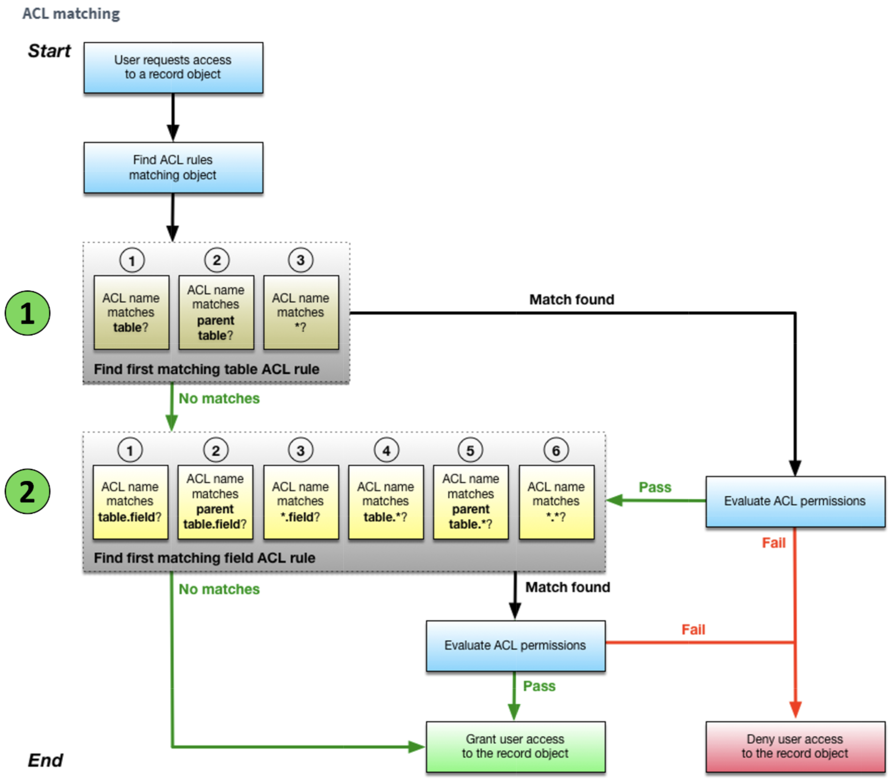

# Application Development

## Resources

### 📘 Courses

- [ ] [Application Development Fundamentals On Demand](https://learning.servicenow.com/lxp/en/now-platform/application-development-fundamentals-on-demand?id=learning_course_prev&course_id=35eefed887bb52d03a3a84c7cebb35f8)
- [ ] [Application Developer Skills Learning Path](https://learning.servicenow.com/lxp/en/app-engine/application-developer-skills?id=learning_path_prev&path_id=2a580f4447e96110ac2f89c2e36d4321)
- [ ] [Retrieving Update Sets from Remote Instances](https://learning.servicenow.com/lxp/en/now-platform/retrieving-update-sets-from-remote-instances?id=learning_course_prev&course_id=68875453db77585030c91fdc1396197c)
- [ ] [Introduction to Access Controls](https://nowlearning.servicenow.com/lxp/en/now-platform/introduction-to-access-controls?id=learning_course_prev&course_id=3c13324dc3de7d541ac0f60f05013187)
- [ ] [Introduction to Access Analyzer](https://nowlearning.servicenow.com/lxp/en/platform-security/introduction-to-access-analyzer?id=learning_course_prev&course_id=f20cef1347c10e582a090dcbd36d43fd)

### 📄 ServiceNow Documentation

- [Application Scope](https://docs.servicenow.com/csh?topicname=c_ApplicationScope.html&version=latest)
- [NowCreate: Create your own app](https://mynow.servicenow.com/now/best-practices/success-packs/create-your-own-app)
- [Build or modify applications in ServiceNow](https://www.servicenow.com/docs/bundle/yokohama-application-development/page/build/custom-application/concept/developing-applications.html)
- [System update sets](https://www.servicenow.com/docs/bundle/yokohama-application-development/page/build/system-update-sets/concept/system-update-sets.html)
- [Working with update sets in ServiceNow Studio](https://www.servicenow.com/docs/bundle/yokohama-application-development/page/build/servicenow-studio/concept/working-with-update-sets-in-servicenow-studio.html)
- [Domain scope](https://docs.servicenow.com/csh?topicname=c_DomainScope.html&version=latest)
- [Publish app changes to the application repository from ServiceNow Studio](https://www.servicenow.com/docs/bundle/yokohama-application-development/page/build/servicenow-studio/task/qs-publish-changes-to-app-using-app-repo.html)
- [ServiceNow application repository](https://www.servicenow.com/docs/bundle/yokohama-application-development/page/build/applications/concept/app-repo.html)
- [ACL rule types](https://www.servicenow.com/docs/bundle/yokohama-platform-security/page/administer/contextual-security/concept/acl-rule-types.html)
- [Create/configure an ACL rule](https://www.servicenow.com/docs/bundle/yokohama-platform-security/page/administer/contextual-security/task/t_CreateAnACLRule.html)
- [Access Control list rules](https://www.servicenow.com/docs/bundle/yokohama-platform-security/page/administer/contextual-security/concept/access-control-rules.html)
- [Access Analyzer](https://www.servicenow.com/docs/bundle/yokohama-platform-security/page/integrate/identity/concept/access-analyzer.html)
- [Access Analyzer Getting Started video](https://players.brightcove.net/6274575390001/nUx4EKfUz_default/index.html?videoId=6327544848112)
- [Delegated development](https://www.servicenow.com/docs/bundle/yokohama-application-development/page/build/applications/concept/c_DelegatedDevelopment.html)
- [Example: granting access to configuration records](https://www.servicenow.com/docs/bundle/yokohama-application-development/page/build/applications/concept/c_ExampleGrantingAccessToConfigRecs.html)
- [Flow Execution Details](https://www.servicenow.com/docs/bundle/yokohama-build-workflows/page/administer/flow-designer/concept/flow-execution-details.html)
- [Integration Hub Spokes List](https://www.servicenow.com/docs/bundle/yokohama-integrate-applications/page/administer/integrationhub/reference/spokes-list.html)
- [Ignore Cache Explained](https://www.servicenow.com/community/developer-blog/ignore-cache-checkbox-on-system-property-lt-sys-properties-gt/ba-p/2920941)
- [When to Use Ignore Cache](https://support.servicenow.com/kb?id=kb_article_view&sysparm_article=KB1000746)
- [Notification variables](https://docs.servicenow.com/csh?topicname=notification-variables.html&version=latest)

### 🧠 Community

- [Requirements: Ask Why](https://www.servicenow.com/community/in-other-news/ask-why/ba-p/2276663)

### 📚 Standards

-

## Overview

### Application development checklist

| Phase                                    | Checklist Item                          |
| ---------------------------------------- | --------------------------------------- |
| 1) Define Process                        | [ ] Business Problem                    |
|                                          | [ ] Outcomes                            |
|                                          | [ ] Input(s)                            |
|                                          | [ ] Output(s)                           |
|                                          | [ ] User personas / stakeholders        |
|                                          | [ ] Process steps                       |
| ---------------------------------------- | --------------------------------------- |
| 2) Design and Build Data Model           | [ ] Tables                              |
|                                          | [ ] Columns                             |
|                                          | [ ] Relationships                       |
| ---------------------------------------- | --------------------------------------- |
| 3) Design and Create User Interface      | [ ] Desktop / Tablet                    |
| ---------------------------------------- | --------------------------------------- |
| 4) [Apply Security](#controlling-access) | [ ] Roles                               |
|                                          | [ ] Access Control                      |
| ---------------------------------------- | --------------------------------------- |
| 5) Automate                              | [ ] Flow Designer                       |
|                                          | [ ] Scheduled Script Execution          |
|                                          | [ ] Email                               |
| ---------------------------------------- | --------------------------------------- |
| 6) Integrate                             | [ ] SOAP / REST / CSV / Microsoft Excel |
| ---------------------------------------- | --------------------------------------- |
| 7) Enhance User Interface                | [ ] Service Catalog                     |
| ---------------------------------------- | --------------------------------------- |
| 8) Test                                  | [ ] Test                                |

### Application development concepts

- **Cloud-based application**
  - ServiceNow manages computing resources and provides the platform
  - Developers configure ServiceNow and extend functionality using JavaScript
  - Users access applications via a web browser (no installation)
  - Delivered via the internet
  - Built on an existing platform
  - Provides access to data
- **Why develop custom applications**
  - Replace outdated or inadequate business applications and processes
  - Extend the value of ServiceNow
  - Extend service delivery and management across enterprise departments
  - Increase automation and consolidate enterprise services
  - Address gaps where existing custom apps only partially meet business or user needs
  - Outcomes
    - Increased responsiveness
    - Increased productivity
    - Improved user satisfaction
- **Should I build it**
  - Good fit
    - Data modeled in a relational database
    - Request–fulfill process pattern
    - Form-based data interaction
    - Reporting requirements
    - Workflow / Flow Designer usage
    - Extendable via JavaScript
  - Bad fit
    - Unstructured data (audio, video)
    - Proprietary libraries without APIs
    - Multi-player or graphics-engine-based applications
    - No defined process flow
- **Custom application examples**
  - Timecard, Gift Card, Contract, Invoice, Accounts Payable
  - PO Reconciliation, IP Address Management, Document Workflow
  - Incident Response, Field Safety, Game/Venue Issue Management
  - Customer Feedback, Insurance Claims, Truck Maintenance
  - Lab Mouse Reports, Postal Equipment Management, Pig Lifecycle

### Scoped Application Model

- **Philosophy**
  - Applications should be uninstallable
  - Applications should not break the system
  - Applications should not break other applications
  - Applications should be self-contained
  - Dependencies must be clearly defined
  - Least-privilege access enforced
  - Scope isolates applications from each other
  - Out-of-scope access must be explicitly allowed
- **Evolution of scopes**
  - Pre-Fuji (≤ Dublin)
    - All applications built in Global scope
    - Deployed using Update Sets
  - Fuji (2014)
    - Scoped applications introduced
  - Geneva (2015)
    - Studio IDE introduced
    - Delegated Development introduced
  - Present
    - All new applications are scoped
    - Major apps (e.g., HR, CSM) rewritten as scoped
- **Scopes and records**
  - Global scope
    - Baseline applications
    - Legacy custom applications (no migration path)
  - Private scoped
    - Custom applications
  - Scope is immutable once saved
  - Platform warnings prevent accidental out-of-scope changes
  - Scope switching via temporary link or Application Picker
- **Scoped vs. Global**
  - Scoped applications
    - Separate namespace
    - Sandboxed for security and stability
    - Delegated Development support
    - Publishable to Application Repository
    - Restricted data access (even Admin access can be limited)
  - Global applications
    - All artifacts exist in Global
  - Artifacts
    - Access Controls, Business Rules, Script Includes, Tables, Client Scripts
  - Baseline access
    - Read access across app tables
    - No write/update/delete without explicit permission
- **Namespace**
  - Format: `x_{company_code}_{application_id}`
  - `x_` prefix required
  - Company code from `glide.appcreator.company.code` (2–5 characters)
  - Application name truncated as needed
  - Maximum length: 18 characters
  - Example: `x_acme_book_rooms`
  - Reference: [Application Scope](https://docs.servicenow.com/csh?topicname=c_ApplicationScope.html&version=latest)
- **Delegated Development**
  - Allows non-admin users to develop, deploy, and delete scoped applications
  - Application-specific permissions
  - File-type access control
  - Instance-specific user roles
  - Optional access to security records and script fields
  - Managed in Studio
    - Application Details → App Settings (gear) → _Manage Developers_
  - Permissions set per application
- **Determining scope**
  - General rule
    - Use scoped applications whenever possible
  - Use scoped for
    - Custom applications
    - Utilities, integrations, services
    - Customizations to scoped applications
  - Use global when required
    - Legacy global customizations
    - Pre-scoping production applications
    - Base instance code changes
    - Required global resources unavailable to scopes
    - Excessive global dependencies

### Application Development vs. Deployment

- **Development**
  - Incremental work during build
  - Tool: Update Sets
  - Supports multiple work streams
- **Deployment**
  - Package completed functionality
  - Tools
    - Update Sets
    - Application Repository
    - ServiceNow Store
  - Supports formal change management
- **Git integration**
  - Xanadu or earlier (legacy Studio)
    - Git Integration available
  - Yokohama and later
    - Git Integration not available
    - Planned future reinstatement
- **Course application context**
  - Build a scoped Loaner Request application
  - Create tables, fields, and forms
  - Apply Access Controls
  - Use Flow Designer
  - Send notifications
  - Integrate external data sources
  - Test incrementally
  - Publish and install via Application Repository
- **Development approach**
  - Analyze → Design → Develop → Test → Deploy
  - Scrum / Agile / Sprint-based
  - Each module delivers a shippable product
  - Labs are sequential and interdependent
- **Required skills**
  - Administration
    - Forms, lists, users, Access Controls
    - Workflow / Flow Designer
    - Service Catalog and Record Producers
  - Scripting
    - Script type selection
    - Client vs. server APIs
    - JavaScript mode selection
- **JavaScript engine modes**
  - ECMAScript 2021 (ES12)
    - Default mode
    - Modern syntax (`let`, `const`, `for...of`, default parameters)
    - Partial ES2022 support
  - ES5 Standards Mode
    - ES5 syntax and features
    - Native JSON support
  - Compatibility Mode
    - Pre-Helsinki and all Global scripts
    - Legacy JSON behaviors supported
    - No third-party JavaScript libraries
- **Key takeaways**
  - ServiceNow is a cloud-based application platform
  - Request–fulfill apps align well with the Now Platform
  - Choose the correct development and deployment tools
  - Use scoped applications as the default approach
  - Apply course patterns to real-world business solutions

## Application analysis and design

- **Purpose**
  - Analyze requirements
  - Design a scalable, maintainable ServiceNow application
- **Understand the business problem**
  - What needs to be automated, tracked, or improved
  - Why the process exists
  - What success looks like (measurable outcomes)
  - Typical outcome drivers
    - Efficiency gains
    - Cost reduction
    - Retirement of legacy tools
- **Identify stakeholders**
  - Requestors / Fulfillers
    - Simple UI
    - Desktop, tablet, mobile access
    - Status visibility (reports, dashboards)
    - Notifications
    - Automation
  - Application Administrators
    - Security
    - Logging and debugging
    - Single platform for build, test, run
  - Management
    - Business value
    - Centralized tooling
    - Automation
    - Real-time reporting
- **Define user personas**
  - Map personas to roles
  - Common personas
    - User
    - Admin
    - Manager
    - Fulfiller
    - Executive
  - Best practice
    - Minimum roles: User and Admin
- **Define inputs and outputs**
  - Inputs
    - Source (forms, spreadsheets, integrations)
    - Format
    - Frequency
    - Collision handling
    - Coalescing strategy
    - Retrieval method
  - Outputs
    - Format (reports, dashboards, email)
    - Frequency
    - Recipients
- **Define the process**
  - Break process into steps
    - Objective
    - Owner
    - Actions
  - Document using
    - Flowcharts
    - Swim lanes
    - Mind maps
  - Detailed process understanding simplifies workflow design
- **Design the data model**
  - Identify
    - Tables
    - Columns
    - Relationships
  - Consider reuse of platform tables
    - `user`
    - `task`
    - `cmdb_ci`
  - Data model is foundational to application behavior
- **Design application architecture**
  - Client-side
    - Forms
    - Client Scripts
    - UI Actions
  - Server-side
    - Script Includes
    - GlideAJAX
  - Best practices
    - Thin client-side logic
    - Centralize reusable logic in Script Includes
    - Prioritize maintainability and reuse
- **Design the user experience**
  - Supported devices
    - Desktop
    - Tablet
    - Mobile
  - Interaction models
    - Catalog Item
    - Record Producer
    - Workspace
    - Portal
    - Mobile experience
- **Apply security**
  - Roles aligned to personas
  - Access Controls for tables and records
  - Least-privilege principle
- **Plan automation**
  - Flow Designer
  - Scheduled script execution
  - Notifications (email)
- **Plan integrations**: SOAP, REST, CSV, MS Excel
- **Application Development Checklist (summary)**
  - Define business problem and outcomes
  - Identify stakeholders and personas
  - Define inputs, outputs, and process steps
  - Design data model
  - Design user interface
  - Apply security
  - Automate processes
  - Integrate external systems
  - Test
- **ServiceNow design recommendations**
  - Design before building
  - Build private scoped applications
  - Give each process its own scope
  - Track development tasks

## App Creation

### Application development tools overview

- **Tool selection depends on**
  - Application complexity
  - Developer experience
- **Primary build tools**
  - ServiceNow Studio
    - Integrated development environment for custom applications
    - Centralized, tabbed interface to create/review/update application files
    - Opens automatically when editing a custom application
  - App Engine Studio (AES)
    - Guided low-code development tool
    - Requires App Engine subscription (or packaged product)
- **Supporting build tools**
  - Flow Designer
    - No/low-code automation using reusable steps
    - Approvals, tasks, notifications, record operations
  - Integration Hub
    - Reusable integrations to third-party systems
    - Callable across the Now Platform
  - Table Builder
    - Create/design/administer tables and forms
  - UI Builder
    - Build/customize workspace pages
  - Playbooks
    - UI layer on top of flows (visual process interaction)
  - Creator Workflows
    - Low-code workflow apps (connected digital workflows)
- **References**
  - [Build or modify applications in ServiceNow](https://www.servicenow.com/docs/bundle/yokohama-application-development/page/build/custom-application/concept/developing-applications.html)
  - [Application Developer Skills learning path](https://learning.servicenow.com/lxp/en/app-engine/application-developer-skills?id=learning_path_prev&path_id=2a580f4447e96110ac2f89c2e36d4321)

### Create a custom application (Module 3.2)

- **App creation inputs (requirements → configuration)**
  - Application configuration
    - Name
    - Description
    - Scope (auto-generated)
  - Roles
    - Default created: Admin role + User role
    - Option: use defaults or assign existing roles
  - Tables
    - Option: existing table
    - Option: create new table
    - Option: extend existing table
    - Option (license-limited): upload spreadsheet/PDF to create table
  - Table configuration
    - Label
    - Auto-numbering
    - Manage access (Application Access settings)
  - Next steps after basic creation
    - ServiceNow Studio (add artifacts)
    - Flow Designer (automation)
    - Set up another app
- **Scope naming (namespace)**
  - Scope prefix appears on many artifacts
  - Constructed as `x_` + `<glide.appcreator.company.code>` + truncated application name
  - `glide.appcreator.company.code`
    - ServiceNow-set value (not user-changeable)
    - Typically 2–5 characters
    - Class example: `calta`

#### ServiceNow Studio usage and capabilities

- **Access Studio**
  - **App Engine > ServiceNow Studio**
- **Open an app in Studio**
  - Option 1: **App Engine > ServiceNow Studio** → select application
  - Option 2: **System Applications > My Company Applications** → select _Edit in ServiceNow Studio_
- **What Studio supports**
  - Open/edit app files in any scope (global or custom)
  - Tabbed navigation + app file navigator
  - Code search
  - Quick creation of scripts/files
  - Deployment via Update Sets or internal Application Repository
  - Manage global application files
  - Testing integration (opens ATF in a Studio tab)
- **What Studio does NOT support**
  - Push to external source control → use Update Sets
  - Script IP protection → manage project access
- **Working model**
  - Build in Studio
  - Use the application in the main ServiceNow UI
- New application defaults and configuration
  - **New application contains**
    - App details (type, scope, created date, `sys_id`)
    - Default roles: admin + user
    - Embedded Help Role Priority
  - **Scope truncation behavior**
    - Scope value can truncate app name
    - System may append numeric suffix to maintain uniqueness (increments if needed)
  - **Create application files**
    - In Studio: select _Create_ → _File_ → choose file type (pop-up selector)
    - Typical foundational artifacts
      - Tables
      - Access Controls
      - Modules
      - Forms

#### Data table choices and creation patterns

- **Decision importance**
  - Extend existing table to inherit built-in behavior (“for free”)
  - Create new table for full control of behavior
  - Applications commonly use multiple tables
    - Primary/base table(s) for core records
    - Reference/lookup tables for controlled values
- **Table options**
  - Extend a table
    - Copies base table structure + inherits behavior
    - Add new fields on child table
  - Create a table
    - Use when no suitable base table exists
  - Upload spreadsheet/PDF (App Engine Enterprise license only)
- **Add a scope-specific column to an existing table (no custom table)**
  - Studio → open app
  - _Create_ → _File_
  - Select _Table Column_ → _Continue_
  - Complete fields → _Submit_
  - Result: existing table gains an additional column in your application scope
- **Create a custom table by extending**
  - _Create_ → _File_ → _Table_ → _Continue_
  - Label → enter table name
  - Extends table → select base table
  - _Save_ (not Submit)
  - Columns tab → add fields
  - _Update_
- **Create a custom table from scratch**
  - _Create_ → _File_ → _Table_ → _Continue_
  - Label → enter table name
  - Extends table → leave empty
  - _Submit_
- **Inspect existing business logic on a table**
  - From list view → column context menu (ellipsis) → _Configure_ → _All_
  - Navigator search → `<table_name>.config`
- **Default fields on all new tables**
  - `sys_created_by` (string) – display name of user who inserted record
  - `sys_created_on` (glide_date_time) – timestamp on insert
  - `sys_id` (GUID) – unique record identifier
  - `sys_updated_on` (glide_date_time) – timestamp on update
  - `sys_updated_by` (string) – display name of last updater
  - `sys_mod_count` (numeric) – update count since creation
  - If Extensible=`true`
    - `sys_class_name` (system class name) – identifies child table that contains the record
- **Inherited fields (when extending)**
  - Child table inherits parent fields
  - Field is inherited when the Table column value differs from table Name
- **Extend vs create guidance**
  - Extend when
    - Similar table exists and built-in scripts/workflows are useful
    - Approval activities needed via Task-based approvals (non-User Approval activities require Task extension)
  - Create new when
    - No similar table exists
    - You want to implement behaviors yourself
    - Table is reference-only with seeded/sample data for lookup
  - Constraints
    - Parent table must be Extensible to extend it
    - Cannot extend system tables or database view tables

#### Application Access and cross-scope behavior

- **Application Access (runtime protection for app tables)**
  - Protects read/write/create/delete via
    - Scripts
    - Web service calls
  - Accessible
    - `This application scope only` (complete runtime protection)
    - `All application scopes` (allow access from other privately scoped apps)
  - Caller Access (cross-scope request handling)
    - `None`
    - `Caller Tracking`
    - `Caller Restriction`
  - Can read / create / update / delete
    - Controls whether scripts from other scopes can perform DB operations
    - Never applies to current application scope
  - Allow access to this table via web services
    - Allows other-scope scripts to call web services against the table
    - Calling user still needs table permissions
  - Allow configuration
    - Allows developers in other scopes to write scripts for this table
- **Cross-scope privileges (permission handshake)**
  - Use case: App B needs access to App A resources/data
  - Requirements (both sides)
    - App A: allow access via Application Access tab (enables requests)
    - App B: request via Cross-scope privilege record
  - Operational notes
    - Run all scripts during testing to generate required cross-scope privilege records
    - After publication, runtime requests require a valid cross-scope privilege record
  - Risk
    - Misconfiguration can expose sensitive data

#### Application menu and modules

- **Menu/module creation behavior**
  - Application menu created once a table exists in the scope
  - Module can be created when table is created
  - Default module name = plural of table name (editable)
  - Default module shows list of all records (no default records)
  - After adding menus/modules: reload the ServiceNow browser window
- **View modules**
  - Studio → navigator panel → expand _Module_ → select module
- **Create a module**
  - Studio → _Create_ → _File_
  - Application field = your application
  - File type: _Module (sys_app_module)_
  - _Continue_ → configure → _Submit_
- **Module configuration fields**
  - Title (module name)
  - Application Menu (defaults to current app)
  - Order (menu ordering)
  - Hint (tooltip)
  - Roles (restrict module access; blank → inherits application roles)
  - Active (show/hide module)
  - Override application menu roles (allow access even if user can’t see menu; module role still required)
  - Link type (controls destination)
  - Table (table accessed by module)
  - View Name (view to open)
  - Filter (list filtering)
  - Note: link type may require additional fields (Filter/Content Page/Arguments)

#### Scope visibility and avoiding scope mistakes

- **Studio scope indicators**
  - Current file scope shown bottom-left
  - Multiple scopes can be open in Studio
  - Best practice: verify scope before creating records
  - Preference: Organize tab groups by scope
    - Color-coded grouped tabs = same scope
    - Tabs without colors = global scope
  - Hover over tab to view file scope
- **Main UI scope pickers**
  - Scope menu (globe icon) available to users with roles permitting scope pickers
  - Application scope picker
    - Sets where changes apply (defaults to newly created application)
    - Reference: [Application Scope](https://www.servicenow.com/docs/bundle/yokohama-application-development/page/build/applications/concept/c_ApplicationScope.html)
  - Update set picker (admin)
    - Reference: [Update set administration](https://docs.servicenow.com/csh?topicname=update-set-administration.html&version=latest)
  - Domain scope picker (domain separation only)
    - Reference: [Domain scope](https://docs.servicenow.com/csh?topicname=c_DomainScope.html&version=latest)

### Application management and sharing

- **Sharing methods**
  - Publish to Application Repository
    - Available to: all instances assigned to the same company
    - Use: move app to test/prod within company
  - Publish to ServiceNow Store
    - Available to: all ServiceNow customers
    - Use: share/sell apps externally
  - Publish to Update Set
    - Available to: any instance that can import the update set file
    - Use: backup/audit snapshot; manual transfer between instances
- **Publish to Update Set (snapshot packaging)**
  - Captures latest version of each application file
  - Marks update set as Complete
  - Uses
    - Package all app files together
    - Export XML (same family release recommended)
    - Move changes dev → test → prod
  - Data note
    - Configuration captured by default; data typically not included
  - References
    - [System update sets](https://www.servicenow.com/docs/bundle/yokohama-application-development/page/build/system-update-sets/concept/system-update-sets.html)
    - [Working with update sets in ServiceNow Studio](https://www.servicenow.com/docs/bundle/yokohama-application-development/page/build/servicenow-studio/concept/working-with-update-sets-in-servicenow-studio.html)
- **Update set deployment cautions**
  - Newer → older family release can break functionality; may risk outage/data loss
  - Prefer moving older → newer (still test)
  - Similar constraints for Store apps with differing versions
  - Manual effort expected
    - Preview
    - Collision resolution
    - Commit
- **Publish to Update Set (Studio)**
  - Studio → App details → App settings (gear) → _Publish to Update Set..._
  - Select _Publish_ → _Done_
  - Review contents on Customer Updates tab
- **Make update set retrievable from connected instance**
  - Studio home → Deployment tab → select update set → State=`Complete`
- **Retrieve completed update sets (target instance)**
  - Main UI (not Studio) → **System Update Sets > Update Sources** → _New_
  - Configure connection → _Test Connection_ → _Save_ (not Submit)
  - Select _Retrieve Completed Update Sets_
  - View: **System Update Sets > Retrieved Update Sets**
  - Auto-preview
    - `glide.update_set.auto_preview`=`true` → preview starts automatically after retrieval
- **Training**
  - [Retrieving Update Sets from Remote Instances](https://learning.servicenow.com/lxp/en/now-platform/retrieving-update-sets-from-remote-instances?id=learning_course_prev&course_id=68875453db77585030c91fdc1396197c)

#### Application Repository (publish/install/update)

- **What it is**
  - Central repository for scoped apps published by your organization
  - Supports install/uninstall/update as a package across company instances
  - Visibility limited to apps published by your organization
- **Requirements/constraints**
  - Valid subscription
  - Matching application scope across instances
  - Network access
  - Company code must match on all instances (`glide.appcreator.company.code`)
  - Personal developer instances cannot connect
  - Admin role required for install/update
- **Publish to repository (versions must be unique)**
  - Studio → App details → _Publish_
  - Set version number (unique)
  - Add release notes
  - Select _Publish_ → _Done_
- **Install / update**
  - Install
    - Main UI → **System Applications > My Company Applications** → Not Installed tab → _Install_
    - Do not develop on instances where app is installed (develop in dev)
  - Update
    - Main UI → **System Applications > My Company Applications** → Installed tab → _Update_
    - Badges indicate available updates; no forced updates
- **Rollback / uninstall**
  - Rollback
    - Returns to previous installation
    - Does not affect the global application record
  - Uninstall
    - Removes app from instance (remains in repository)
    - Can reinstall later
  - Steps (rollback)
    - **System Applications > My Company Applications** → All Apps/Installed → open app (name link)
    - Select _Rollback_ related link → _Rollback_ → _Done_
  - Steps (uninstall)
    - **System Applications > My Company Applications** → All Apps/Installed → open app (name link)
    - Select _Uninstall_ related link → _OK_ → type `uninstall` → _OK_ → _Done_
- **References**
  - [Publish app changes to the application repository from ServiceNow Studio](https://www.servicenow.com/docs/bundle/yokohama-application-development/page/build/servicenow-studio/task/qs-publish-changes-to-app-using-app-repo.html)
  - [ServiceNow application repository](https://www.servicenow.com/docs/bundle/yokohama-application-development/page/build/applications/concept/app-repo.html)

#### ServiceNow Store (external distribution)

- **What it is**
  - Marketplace for downloading/installing ServiceNow apps
  - Free and fee-based apps
  - Apps certified for best-practice compliance
  - Publishing requires review/approval (not immediate)
  - Buyers responsible for testing and risk acceptance
- **Publish requirements (high-level)**
  - Build in private scope
  - Join Technology Partner Program
  - Certify application
- **References**
  - [ServiceNow Partner Program](https://www.servicenow.com/partners.html)
  - [Partner Developer: Developing as a Build Partner](https://nowlearning.servicenow.com/lxp?id=learning_course_prev&course_id=0de03d0187526d94bfe94088dabb3554&autologin=yes)

### Update sets during app development

- **Why use update sets during development**
  - Track configuration/file changes (version control concept)
  - Store customizations and rationale (why a change was made)
  - Export work-in-progress before a clone
  - Support SDLC traceability (stories, problems, bugs, enhancements)
  - Useful for
    - Baseline app customizations
    - Store app customizations
- **Mental model**
  - Create update set = start “recording”
  - Make changes = recorded into update set
  - Complete update set = stop “recording” and make retrievable
- **Create a new update set (Studio)**
  - Studio → Update Set widget → _+New_
  - Name → _Save_ → _Apply_
- **Complete an update set**
  - Studio home → Deployment tab → select update set → State=`Complete`
- **Practical usage pattern (example)**
  - After creating new app: _Publish to Update Set_ to capture baseline
  - Daily: save progress in update set
  - End of sprint: publish to Application Repository
  - Final product for external sale: publish to ServiceNow Store
- **Recommendations**
  - Design the data model before creating app tables
  - Extend existing tables where possible to inherit functionality
  - Choose deployment method based on audience (update set vs repository vs store)
  - Add documentation/comments throughout development where possible

## Application Forms

- **Module outcomes**
  - Create/modify tables
  - Design/create forms
  - Create view: Desktop
  - Write/test/debug client-side + server-side scripts
  - Complete an update set
  - Publish updated app to the Application Repository
- **User story**
  - Create appropriate fields, lists, forms, and views to ensure a positive user experience

- **Default lists/forms behavior**
  - New table (no parent)
    - Gets a default list and default form
  - Extended table
    - Default list/form inherits parent table fields + layout
    - Example: extending `Task` drives inherited list/form content

- **Add fields to a table (not the base table)**
  - Label convention: capitalize only first letter of the first word
  - Steps (Studio)
    - Open application in ServiceNow Studio
    - Open target table record
    - Select _Add new field_
    - Set Column label
    - Set Type
    - Configure remaining column parameters
    - Select _Save_

- **Field type selection (avoid data loss)**
  - Changing field type later can cause data loss → choose carefully up front
  - Avoid free-form text unless required
    - Do not use string for dates
    - Do not use string for people/object references
  - Prefer constrained/typed fields
    - Choice list + Reference to limit values
    - Date/Date-Time for correct formatting
  - Common field types
    - Date/Time (calendar widget)
    - Reference (records from another table)
    - True/False (checkbox)
    - Decimal (e.g., `12.34`)
    - String
  - Reference: [Database field types](https://docs.servicenow.com/csh?topicname=r_DatabaseFieldTypes.html&version=latest)

- **When to create new fields**
  - Prefer reuse when possible (especially when extending a table)
  - Options and tradeoffs
    - Use existing fields unchanged
      - Pro: no maintenance
      - Con: may not match process perfectly
    - Retitle existing fields (change Label)
      - Pro: label matches process
      - Con: column name ≠ label (can confuse)
    - Consolidate fields
      - Pro: simpler form
      - Con: risk oversimplifying requirements
  - Label change scope
    - Changing a field label affects only the current table (not parent tables)

- **Delete fields**
  - Can delete user-defined fields
  - Cannot delete inherited fields
  - Deleting a field does not delete table records
  - Steps
    - Table Columns list → select gear icon for field → select Delete field icon → confirm Delete → _Save_
  - Note (Table Builder)
    - To delete a column, delete existing data in that column first

- **Form design (UX rules of thumb)**
  - Keep forms short; users read top → bottom
  - Place key identifiers (record number/name) at top
  - Use sections to break up long forms
  - Use two-column layouts near top of a form/section
  - Use full-width single-column for long text fields
  - Use meaningful labels; avoid ambiguous labels like “Date”
  - Use Hint/Annotation/Help for longer guidance (keep labels short)
  - Differentiate desktop vs mobile needs (validate on tablet/smartphone)

- **Form sections as tabs (user preference)**
  - Tabs appear only when there are 2+ sections
  - Default platform behavior: sections displayed as tabs
  - Disable tabbed sections
    - User avatar → _Preferences_ → _Display_ → disable “display form sections as tabs” (slider left)

- **Change a field label (Form Builder)**
  - Studio → Form section → open form
  - Select field in Form Builder
  - Right-side config panel → Label
  - Select _Save_

- **Tooltips (field Hint)**
  - Keep to ~one line (brief, quick visibility)
  - Steps
    - Open table form (main UI)
    - Right-click field → _Configure Label_
    - Set Hint (mouse-over text)
    - _Save_

- **Real-time user feedback (client-side)**
  - Use Client Scripts + UI Action scripts for targeted feedback
  - Common APIs
    - `g_form.showFieldMsg()` (message under field, blue background)
    - `g_form.addInfoMessage()` (top-of-form message, blue background)
    - `g_form.addErrorMessage()` (top-of-form message, red background)
    - `alert()` (OK dialog)
    - `confirm()` (OK/Cancel dialog)

- **Field Styles (visual emphasis)**
  - Use tasteful, businesslike styling
  - Create a Style record (Studio)
    - _Create_ → _File_ → _Style_ → _Continue_
    - Set Table + Field name
    - Optional: Value (for styling a specific choice value)
    - Style field: CSS commands
    - _Submit_
  - Examples (CSS)
    - `font-weight:bold;`
    - `text-decoration:underline;`
    - `font-style:italic;`
    - `text-align:center;` / `text-align:right;`
    - `font-size:18px;`
    - `background-color:blue;`
    - `color:yellow;`

- **Form Builder (what it’s for)**
  - Add/configure form elements (fields, formatters, embedded lists)
  - Select views and apply layouts to views
  - Apply policies/rules and preview changes
  - Access
    - Record → Configure → _Form Builder_ (opens new window)
    - Also available via Related Links / Table Builder (Forms tab)

- **Views (form/list variants)**
  - View = saved configuration of fields + order for same record (form or list)
  - Use case: show the right fields to the right audience (ESS, ITIL, mobile)
  - Naming
    - Name = database name
    - Title = user-friendly label
    - Default view shows no view name next to form title
  - Scripting benefit
    - Client Scripts and UI Policy scripts can run selectively by View
  - Permission
    - Users need `view_changer` role to change views

- **Work with views (Form Builder)**
  - Create view
    - Form Builder → Select a form view → _+ Add_ → enter name → _Create_ → configure
  - Modify view
    - Select view from “Select a form view” → configure
  - Duplicate view
    - Ellipses next to current view → _Duplicate this form view_ → name → _Create_ → configure
  - Delete view
    - Main UI → **System UI > Forms** → filter by table + view → open → _Delete_ → confirm

- **View Rules (server-enforced view selection)**
  - Forces a view from the server (URL query string cannot override)
  - Conditions
    - Condition builder (contextual user/record relationship)
    - JavaScript condition
    - Server-side JavaScript can set `answer` to the view name
    - Complex logic can use `switch/case`

- **Scripting in ServiceNow (why)**
  - Enhance user experience
  - Extend/add functionality
  - Common examples
    - Set cursor focus on load
    - Send notifications
    - Log/debug output
    - Validate data
    - Prompt users (alerts/confirmations/messages)
    - Add widgets to forms/lists
  - Reference: [Scripting](https://www.servicenow.com/docs/bundle/yokohama-api-reference/page/script/topic/c_Script.html)

- **Client-side vs server-side execution**
  - Client-side (browser)
    - UI Policies
    - Client Scripts
  - Server-side (platform)
    - Business Rules
    - Scheduled Jobs
    - Script Actions
  - Each script type has its own trigger (“when”) + logic (“what”)
    - Trigger fields vary by script type
    - Description: document purpose/requirement/author context
    - Messages: localization keys (maps to `sys_ui_message`)
    - Script: logic executed when trigger/conditions are met

- **UI Policies (client-side form behavior)**
  - Typical actions (no code required for basics)
    - Mandatory, Visible, Read-only, Hide fields (via UI Policy Actions)
  - Performance guidance
    - Prefer Condition Builder over scripts
  - Re-evaluation limitation
    - Conditions re-check only when user manually changes a field on a form
    - Not evaluated for changes via UI Action/context menu/import/web services/list editor
    - Use Data Policies (non-scriptable) to enforce mandatory/read-only off-form
  - Create UI Policy (key fields)
    - Table, Application (scope), Active
    - Short description (pseudo-name; appears in debugging)
    - Order (executes low → high)
    - When to Apply conditions (Condition Builder)
    - Save required before Actions/Script fields appear
  - UI Policy Actions
    - Field name
    - Mandatory / Visible / Read only
    - Clear field value (checkbox)
  - Advanced view fields
    - Global (all views) vs View (specific)
    - Reverse if false + Execute if false
    - On load (form load + change)
    - Inherit (applies to extended tables)
  - UI Policy scripting (Advanced view)
    - Run scripts → Execute if true / Execute if false
    - Can handle complex conditions, data changes, show/hide sections (sections require scripts)

- **Client Scripts (browser)**
  - Use cases
    - React to field changes, validate values, set attributes, show/hide sections, modify choices
  - Types
    - `onChange` (field value changes)
    - `onLoad` (form load; use sparingly—impacts load time)
    - `onSubmit` (save/update/submit validation; may lead to form reload → onLoad runs again)
  - Trigger/config fields
    - Name (use consistent naming scheme)
    - Table
    - UI Type (Desktop/Tablet, Mobile, or both)
    - Type (onChange/onLoad/onSubmit/onCellEdit)
    - Field Name (required for onChange/onCellEdit)
    - Active
    - Inherited (apply to extended tables)
    - Global vs View (scope to specific view; script only acts on fields in that view)

- **UI Policies vs Client Scripts (selection cues)**
  - Prefer UI Policies when Condition Builder can handle it (better performance)
  - Use Client Scripts when you need
    - onSubmit validation
    - prior value access
    - list field value changes
    - complex scripted logic not suited to policy actions

- **Client-side APIs**
  - `g_form` (GlideForm)
    - Form/field methods (desktop/tablet vs mobile differences)
  - `g_user` (GlideUser)
    - Current user properties + role checks
    - Impersonation affects results (runs client-side)

- **Script editor assistance**
  - Ctrl+Space for contextual help/autocomplete in editor
  - Reference: [Syntax editor keyboard shortcuts and actions](https://www.servicenow.com/docs/bundle/yokohama-api-reference/page/script/general-scripting/reference/r_SyntxEdtrKybrdSrtctsActn.html)
- **API documentation**
  - Developer site: `developer.servicenow.com`
  - Navigation: Reference → APIs → select API type → select class → select method

- **Scoped vs global client scripts (API availability differences)**
  - Scoped scripts wrapped in an IIFE → some APIs modified/unavailable
  - Property to enable certain globals per application
    - `glide.script.block.client.globals`=`false` (enables some blocked globals)
    - Exception: GlideRecord cannot be re-enabled client-side
      - Use GlideAjax instead of GlideRecord client-side
  - Inaccessible APIs (scoped client)
    - GlideRecord, `window`, `document`
    - Prototype: `$`, `$$`
    - jQuery: `jQuery`, `$j`
    - `$F` (Sizzle shortcut)
  - Modified APIs
    - GlideAjax, GlideForm, GlideDialogWindow

- **Server-side script types (common triggers)**
  - Access Controls (operation-based)
  - Script Actions (event-driven)
  - Business Rules (DB access: Insert/Update/Delete/Query; Before/After/Display/Async)
  - Script Includes (on call)
  - Scheduled Jobs (schedule-driven)
  - UI Actions (user click)
  - Workflow / Flow (condition-driven)
- **Server-side API references**
  - Scoped: <https://developer.servicenow.com/dev.do#!/reference/api/xanadu/server>
  - Global: <https://developer.servicenow.com/dev.do#!/reference/api/xanadu/server_legacy/>

- **Business Rules (execution order matters)**
  - Server-side automation triggered by database access
  - Additional reference: [Types of Business Rules](https://www.servicenow.com/community/itsm-forum/types-of-business-rules-with-example/m-p/712624)

- **Client ↔ server data passing**
  - Display Business Rule populates `g_scratchpad` (values must be strings)
  - Client scripts can read `g_scratchpad`
  - Note: `g_scratchpad` not available on mobile

- **ServiceNow recommendations**
  - Create as few new fields as possible
  - Design lists/forms for usability (fields + sections)
  - Use scripts to enhance UX (but keep client logic efficient)
  - Test on tablet + smartphone (not only desktop)
  - Use Application Repository to move applications between instances

## Controlling Access

### Access Control

- **Purpose (user story)**
  - Ensure only appropriate users can access or manipulate data
- **Access can be restricted at**
  - Application menus
  - Modules
  - Records (rows)
  - Fields (columns)
- **User behavior to expect**
  - Users may attempt access via:
    - **System Definition > Tables** (table visibility ≠ record access)
    - `<table_name>.list` in Application Navigator
  - Outcomes when access is restricted
    - List loads but hides rows → “Number of rows removed… by Security constraints”
    - Page blocked → “Security constraints prevent access to request page”

- **Security model**
  - Deny by default
  - Access Control rules define required permissions for an operation

- **Menu access (role-based)**
  - Without role → menu not visible in navigator
  - With role → menu visible
  - Configure (Studio)
    - Application Menu → select menu → _Edit User Roles_ (pencil) → move roles to Selected → _Done_ → _Save_

- **Module access (role-based)**
  - Without role → module not visible
  - With role → module visible (record visibility still depends on ACLs)
  - Configure (Studio)
    - Module → select module → Visibility → _Edit User Roles_ (pencil) → assign roles → _Done_ → _Save_
  - `Override application menu roles`
    - Allows access to module even if user can’t see the application menu
    - User may then see the menu plus the authorized module(s)

- **Record and field ACL management**
  - Requirement to create/edit ACLs in Studio
    - Must elevate to `security_admin`
    - If elevated but still blocked, _Save_ any application file to refresh Studio permissions
  - CRUD ACLs
    - Basic table CRUD ACLs can be generated automatically during table creation
    - Description auto-populates when ACLs are created
  - Modify an ACL (high-level)
    - Elevate Role → `security_admin`
    - Open app in Studio → Security → Access Control → select rule → edit → _Save_
  - Create vs write default behavior
    - Wildcard create (`*.*` create) reuses write permissions
    - Create permissions == write unless an explicit create ACL is defined

- **Find the right ACLs to edit**
  - List view → Configure → _Security Rules_ (shows evaluated ACLs for a record)
  - Customize the ACL list to show **Description** for faster identification

- **Row vs field ACL types**
  - `table.None`
    - Row (record) access gate for list/form
    - If denied at row level → field ACLs cannot grant access
  - `table.field`
    - Secures a single field
    - If row allowed but field denied → field not visible
  - `table.*`
    - Secures all fields without field-specific ACLs
    - Acts as a broad include/exclude control

- **Using `table.None`, `table.field`, `table.*` (practical patterns)**
  - Allow both roles full row access
    - `table.None` Read includes RoleA OR RoleB
  - Deny one role from a specific field (without impacting other fields)
    - `table.None` Read includes RoleA OR RoleB
    - `table.u_field` Read includes RoleA only
  - Make RoleB see only one field while RoleA sees everything
    - Use `table.*` carefully (it can exclude other roles from all non-explicit fields)
    - Successful pattern requires field ACL to include both roles when needed
      - `table.None` Read: RoleA OR RoleB
      - `table.*` Read: RoleA
      - `table.u_field_3` Read: RoleA OR RoleB
- **Star guidance**
  - Want to **exclude** many fields easily → use `table.*`
  - Want to **include** fields selectively without broad exclusion → avoid `table.*`
- **Learning resources**
  - [Introduction to Access Controls](https://nowlearning.servicenow.com/lxp/en/now-platform/introduction-to-access-controls?id=learning_course_prev&course_id=3c13324dc3de7d541ac0f60f05013187)
  - [Super Access Control World - ACL Basics](https://nowlearning.servicenow.com/lxp?id=learning_course_prev&course_id=afb281609716ce94a916b4be2153afba)

- **ACL evaluation order**
  - 
  - Table-level evaluated first (most specific → most general)
    - If fail table ACL → deny all fields
  - Field-level evaluated next (most specific → most general)
    - If pass table ACL but fail field ACL → deny that field
  - Field-level processing stops at first successful match
  - Object hierarchy lookup (example pattern)
    - Explicit rule on self → explicit field rule on parent(s) → wildcard on self → wildcard on parent(s)
  - Example search path for `incident.number`
    - Table-level (`table.none`): `incident` → `task` → `*`
    - Field-level (`table.field`, `table.*`): `incident.number` → `task.number` → `*.number` → `incident.*` → `task.*` → `*.*`
  - References
    - [ACL rule types](https://www.servicenow.com/docs/bundle/yokohama-platform-security/page/administer/contextual-security/concept/acl-rule-types.html)
    - [Create/configure an ACL rule](https://www.servicenow.com/docs/bundle/yokohama-platform-security/page/administer/contextual-security/task/t_CreateAnACLRule.html)
    - [Access Control list rules](https://www.servicenow.com/docs/bundle/yokohama-platform-security/page/administer/contextual-security/concept/access-control-rules.html)

- **ACL rule configuration checks (all must pass)**
  - Role list (user has one listed role, or list empty)
  - Security attributes (Conditions Builder; empty = true)
  - Condition field (empty = true)
  - Script (advanced; returns/sets `answer=true`, or empty = true)
  - Evaluation order: role → security attribute → condition → script

- **ACL scripting**
  - Executes server-side
  - Performance guidance: avoid GlideRecord queries where possible
  - Useful methods
    - GlideSystem user methods: `hasRole()`, `getUserName()`, `getUserID()`
    - GlideRecord: `isNewRecord()`

- **Debugging ACLs**
  - Field-level debugging
    - Shows bug icon next to fields secured by ACLs
    - Clicking shows evaluated ACLs + pass/fail results
  - Enable/disable
    - **System Security > Debugging > Debug Security Rules**
    - **System Security > Debugging > Stop Debugging**
  - Studio option
    - Studio home → Resources → _Script Debugger_
  - Debug output meaning
    - Ordered by evaluation: roles → security attribute → condition → script
    - Color codes
      - Green/Blue check = passed
      - Red X = failed
      - Blue = cached
      - Gray = skipped (blocked by higher ACL)

- **Access Analyzer (tooling)**
  - Store app to summarize access permissions and diagnose why a user/group/role can/can’t access resources
  - References
    - [Access Analyzer](https://www.servicenow.com/docs/bundle/yokohama-platform-security/page/integrate/identity/concept/access-analyzer.html)
    - [Access Analyzer Getting Started video](https://players.brightcove.net/6274575390001/nUx4EKfUz_default/index.html?videoId=6327544848112)
    - [Introduction to Access Analyzer](https://nowlearning.servicenow.com/lxp/en/platform-security/introduction-to-access-analyzer?id=learning_course_prev&course_id=f20cef1347c10e582a090dcbd36d43fd)
  - Delegated development reference
    - [Delegated development](https://www.servicenow.com/docs/bundle/yokohama-application-development/page/build/applications/concept/c_DelegatedDevelopment.html)

- **Server-side security checks (preferred over client-side role checks)**
  - GlideSystem (server-side)
    - `getUser()`, `getUserDisplayName()`, `getUserNameByUserID()`, `getUserID()`, `hasRole()`
  - GlideRecord (server-side)
    - `canCreate()`, `canRead()`, `canWrite()`, `canDelete()`

### Application access (cross-scope runtime protection)

- **What it is**
  - Table-by-table runtime protection evaluated in addition to ACLs
  - Controls out-of-scope access via
    - Scripts (server-side)
    - Web services API
    - CRUD permissions on table data
- **Key behavior**
  - Applies to server-side scripts from other scopes
  - Does not apply to scripts executing in the same scope
  - If `Accessible from`=`All application scopes`
    - Default: read-only allowed
    - Web service + configuration options become selectable only in this mode
- **Runtime enforcement**
  - Unauthorized script access is blocked without throwing runtime errors
  - Disallowed operations are skipped; instance continues normally

- **Web service access only**
  - Prevents user UI login
  - `Internal Integration user` can bypass Web Services Security (WSS) system property setting
  - If unchecked → user cannot access the data

- **Allow configuration (cross-scope artifact creation)**
  - Allows other scopes to create configuration records for the table, e.g.
    - Dictionary entries
    - UI Actions
    - Client Scripts
  - Note: other metadata types can impact out-of-scope tables where `Can read` is allowed
  - Reference: [Example: granting access to configuration records](https://www.servicenow.com/docs/bundle/yokohama-application-development/page/build/applications/concept/c_ExampleGrantingAccessToConfigRecs.html)

- **Caller Access (restricted caller tracking/approval)**
  - Options
    - `-None-` (approved/denied based on `Accessible from`)
    - Caller Tracking
      - Auto-approved
      - Logged in Restricted Caller Access table
      - Status=`Allowed`
    - Caller Restriction
      - Manual approval required
      - Logged in Restricted Caller Access table
      - Status=`Requested`
  - Requires plugin
    - Scoped Application Restricted Caller Access (`com.glide.scope.access.restricted_caller`)
  - Requires role
    - Application admin or `admin` to set

### Protection policies (IP protection on install/migration)

- **Purpose**
  - Protect artifact logic (IP) when:
    - Migrated via Application Repository
    - Installed from ServiceNow Store
  - Does not restrict developers on the dev instance from viewing/editing artifacts
  - Not applied when migrating via Update Sets
- **Applies to**
  - UI Actions
  - Script Includes
- **Options**
  - `-None-` (viewable + editable)
  - Read-only (viewable, not editable)
  - Protected (not viewable)
- **Dev instance guidance**
  - Use roles/ACLs to restrict artifact visibility/editing (not protection policies)

### ServiceNow recommendations

- Plan security early in development
- Create user + admin roles for application modules
- Prefer role-based controls for maintainability
- Avoid client-side role checks (e.g., `g_user.hasRole()`) for security decisions
- Test features against security settings
  - Impersonate different users to validate expected access
- Use Application Access to control what tables/artifacts are available to other scopes

## Automation

### Flow Designer

- **Purpose**
  - Automate request processing (repeatable, error-free)
- **Flow building blocks**
  - Properties
  - Trigger (record-based or time-based)
  - Action(s) (operations; reusable)
  - Optional conditions (control when/how actions run)
  - Data Panel (variables as “pills”; drag/drop into inputs/outputs)
- **Trigger types (examples)**
  - Application: MetricBase, Service Catalog
  - Record: Created, Updated, Created or Updated
  - Scheduled: Daily, Weekly, Monthly, Run Once, Repeat
- **Create a flow (Studio)**
  - _Create_ → Application set correctly → Automation → _Flow_ → _Continue_ (opens Flow Designer tab)
- **Testing (built-in)**
  - Manual tests prompt for input data and run the flow (even if trigger conditions are not met)
  - No rollback; generates execution records + flow context (runtime values/state)
  - Use non-production instances
- **Execution details**
  - After test: “View the execution details”
  - More actions (⋮) → _Executions_
  - Docs: [Flow execution details](https://www.servicenow.com/docs/bundle/yokohama-build-workflows/page/administer/flow-designer/concept/flow-execution-details.html)

### Integration Hub

- **Purpose**
  - Extends Flow Designer with low/no-code integrations; reusable integration actions
- **Requirement**
  - Plugin: `com.glide.hub.integrations`
- **Spokes**
  - Scoped apps that package Flow Designer actions for a system/record type
  - Activated with their parent application (e.g., Visual Task Board → VTB Spoke)
  - Examples (default): Benchmarks, Connect, Customer Service, Field Service, ITSM, Security Operations, Visual Task Board
  - Some spokes require Integration Hub subscription
  - Docs: [Integration Hub Spokes List](https://www.servicenow.com/docs/bundle/yokohama-integrate-applications/page/administer/integrationhub/reference/spokes-list.html)

### Application properties (configurable settings)

- **Purpose**
  - Central admin-managed configuration values; retrievable in scripts
- **Constraint**
  - No properties for reference fields → use reference tables instead
- **Build workflow**
  - Create System Property Category → add properties → set order → expose via module
- **System Property Category**
  - Name appears in URL (avoid special characters; spaces allowed)
  - Title renders at top of properties page (supports HTML/links)
- **Property setup**
  - Typical: admin-configurable
  - Use `Ignore cache` to avoid stale cached values
  - References
    - [Ignore Cache Explained](https://www.servicenow.com/community/developer-blog/ignore-cache-checkbox-on-system-property-lt-sys-properties-gt/ba-p/2920941)
    - [When to Use Ignore Cache](https://support.servicenow.com/kb?id=kb_article_view&sysparm_article=KB1000746)
- **Ordering**
  - Properties display lowest→highest `Order`
- **Properties module**
  - Create Module [`sys_app_module`] that opens the properties UI
  - Set Read/Write roles = application admin role
  - Arguments syntax
    - `system_properties_ui.do?sysparm_title=<title>&sysparm_category=<category_name>`
    - `%20` optional for spaces
  - Optional Separator module (Arguments text appears on separator line; no title → renders as a line)

### Scheduled Script Executions (time-based scripts)

- **Purpose**
  - Run server-side logic on a schedule (not user/record-change triggered)
- **Trigger configuration**
  - `Run` sets periodicity; 24-hour time; available date/day/time fields depend on Run
  - Time zone behavior
    - No TZ specified → scheduler uses the scheduling user’s time zone
    - `Use System Time Zone` → uses instance time zone
- **Execution characteristics**
  - Server-side; no `current/previous` record context by default
  - Condition Script variables available to the main script
- **Testing**
  - _Execute Now_ available only after saving
- **Visibility**
  - **System Scheduler > Scheduled Jobs > Today's Scheduled Jobs**
  - **System Scheduler > Scheduled Jobs > Scheduled Jobs**
  - Ready (red) = overdue (Next action time passed); typically runs soon unless delay is large

### Events (Event Queue + decoupled responses)

- **Definition**
  - Event = entry in Event Queue; requires response logic to do work
- **Workflow**
  - Register Event → generate Event → respond (Email Notification and/or Script Action)
- **Register (Event Registry)**
  - Key fields
    - Suffix / Event name (auto)
    - Table
    - Priority (lower = higher)
    - Queue (blank=default; custom queues lowercase_with_underscores)
    - Description (keep accurate as meaning changes)
    - Caller Access (restricted caller access)
- **Generate (server-side)**
  - `gs.eventQueue("<event_name>", object, parm1, parm2);`
  - `object`: `current`, `previous`, or GlideRecord
  - Conventions if parms unused: `parm1`=`gs.getUserID()`, `parm2`=`gs.getUserName()`
- **Inspect**
  - **System Logs > Events**
    - Created vs Processed, duration (ms), state, queue, parm1/parm2 resolved values

### Email Notifications (outbound email)

- **Triggers**
  - Record insert/update OR Event fired (Events optional for notifications)
- **Core fields**
  - Name (use naming standard), Table, Category (avoid Uncategorized), Description
  - Type (EMAIL/Meeting invitation), Active, Digest
  - Send when: Triggered / Event is fired / Record is inserted or updated
  - Conditions, Weight
- **Weight rules**
  - Same record + same recipients → highest weight sent
  - Same highest non-zero weight → all with that value sent
  - Weight `0` → always sent
- **Recipients**
  - Users (users or any email), Groups, Users/groups in field
  - Advanced: Exclude delegates, Send to event creator, Event parm1/parm2 contains recipient, Subscribable
  - Testing prerequisite: impersonate user → Preferences → Notifications > General → Allow Notifications active
- **Content**
  - Email template (Subject inherited; template Message replaced by notification Message)
  - Dynamic values
    - `${field}` (dot-walk: `${ref.field}`)
    - `${event.parm1}`, `${event.parm2}`
  - SMS alternate (140 chars)
  - Size limit: 26 MB incl. MIME encoding (attachments expand ~137%)
  - Docs: [Notification variables](https://docs.servicenow.com/csh?topicname=notification-variables.html&version=latest)
- **Record links**
  - Triggering: `${URI}` (LINK), `${URI_REF}` (display value)
  - Related: `${ref.URI}`, `${ref.URI_REF}`
- **Test**
  - _Preview Notification_ (pick Event Creator + Preview Record; review recipients/subject/body)

### Script Actions (respond to Events)

- **Purpose**
  - Server-side logic triggered by Event occurrence
- **Objects**
  - `current` (from `gs.eventQueue()` object)
  - `event.parm1`, `event.parm2`
- **Config**
  - Name, Event name, Active
  - Condition Script (must be true to execute)
  - Script (server-side)

### Script Includes (reusable server-side library)

- **Purpose**
  - Reusable server-side JavaScript functions; not executed unless called
  - Centralizes logic for maintainability/debugging
  - `initialize()` runs on instantiation; commonly loads properties via `gs.getProperty(<name>, <default>)`
- **Naming rules**
  - Script Include name must match class name
  - Allowed: letters + numbers; not allowed: spaces + special characters
- **Protection policy (Store installs only)**
  - `--None--` (view/edit), Read-only (view), Protected (hidden)
- **Note**
  - Legacy `gs.include('ScriptIncludeName')` may appear in baseline scripts; explicit include no longer required

### Recommended patterns

- Prefer Flow Designer/Workflow for process orchestration; reserve scripts for gaps/complexity
- Use application properties for admin-managed configuration
- Use Scheduled Script Executions + Events + Notifications for time-based automation + messaging
- Store reusable server-side logic in Script Includes (document params/returns)

## Labs

### Application Requirements Template

Application Overview

- **Application Name**: {Name}
- **Lab / Phase**: {Lab ID or Phase}
- **Purpose**: {One-line summary of what the application does}
- **Business Problem**:
  - {Current pain points}
  - {Why the existing approach fails}
- **High-Level Solution**:
  - {What the application will replace or improve}
  - {How it addresses the problem}

Desired Outcomes

- {Outcome 1}
- {Outcome 2}
- {Outcome 3}
- {Operational improvements}
- {Automation goals}

Example

- Single system for submitting and tracking requests
- Reduced missed deadlines
- Retirement of spreadsheets
- Improved requestor satisfaction
- Automation wherever possible

---

Stakeholders

- **Requestors / Fulfillers**
  - {UX expectations}
  - {Access requirements}
  - {Visibility needs}
  - {Notification needs}
- **Administrators**
  - {Logging / debugging}
  - {Security}
  - {Platform consolidation}
- **Management**
  - {Business value}
  - {Reporting / dashboards}
  - {Automation}
- **Approvers**
  - {Approval logic}
  - {Centralization}
- **Process Owners**
  - {Process consistency}
  - {Governance}

Personas & Roles

- **Employee Self Service (ESS)** _(No role)_
  - Submit requests via Service Catalog
- **User / Requester**
  - Create records
  - Read records where referenced
  - Limited modules and views
- **Administrator / Fulfiller**
  - Full CRUD access
  - Access to all modules and views

---

Inputs (Data Sources)

- **User Input – Form**
  - Frequency: As needed
  - Duplicate allowed: No
  - Unique key: System-generated `Number`
- **User Input – Service Catalog**
  - Frequency: As needed
  - Duplicate allowed: No
  - Unique key: System-generated `Number`
- **Spreadsheet Import**
  - Format: `.xls`
  - Frequency: One-time
  - Method: Import Set

Processes

- **Manage Request Tasks**
  - Owner: {Role or Name}
  - Create pre-fulfillment task after submission
  - Create post-fulfillment task after completion
- **Notify Ready for Pickup**
  - Scheduled check (daily)
  - Condition: Start date within next 24 hours
  - Action: Email requestor
- **Send Return Reminder**
  - Scheduled check (daily)
  - Condition: Upcoming return date
  - Action: Email requestor
- **Notify Overdue**
  - Scheduled check (daily)
  - Condition: Overdue items
  - Action: Repeated daily email until resolved

Visualizations: Flow Diagrams or similar for each process

Data Model

Primary Table: {Request Table Name}

- Number — String
- Requested for — Reference to User
- Configuration Item — Reference to CMDB
- Assignment Group — Reference to Group
- Assigned to — Reference to User
- State — Choice
- Start date — Date/Time
- End date — Date/Time
- Item type — Choice
- Location — String
- Short description — String
- Description — String

Child Table: {Task Table Name}

- Number — String
- Parent — Reference to Request
- Assigned to — Reference to User
- State — Choice
- Priority — Choice
- Short description — String
- Additional comments — String

Referenced User Data

- User name — String
- Manager — Reference to User
- Notifications — Boolean
- Email — String

### Lab 3.2.1 - Create an application

🎯 **Goal**: Create the initial foundation of a custom, scoped application in ServiceNow Studio and review the generated application files.

- **A. Create the scoped application in Studio**
  - In the Application Navigator, search for `Studio` and open **ServiceNow Studio** (either available module)
  - In Studio, select the _Create_ icon (next to the navigator panel) or select the _Create_ button
  - Select `App`
  - Configure the application:
    - Name=`Loaner Request`
    - Description=`App that enables users to check out loaner equipment.`
    - Scope=`Scoped` (selected)
  - Select _Continue_
  - At the roles step:
    - Leave the automatically defined default admin and user roles as-is
  - Select _Continue_
  - Select _Go to app dashboard_

- **B. Open the app and review generated files**
  - Select the _Refresh_ icon to refresh the app list
  - Select the `Loaner Request` application from the list
  - Review the application files created so far in Studio
  - To view application details at any time:
    - Select _App details_ (link in the navigation panel)

### Lab 3.3.1 - Create application files

🎯 **Goal**: Create and configure the core application files for the Loaner Request app, including a table, modules, roles, and user access.

- **A. Create the application table**
  - In **ServiceNow Studio**, select _Create_ > _File_
  - Application=`Loaner Request`
  - Select **Data**
  - Select **Table**
  - Select _Continue_
  - Configure the table:
    - Label=`Loaner Request`
    - Name=Auto-populated
    - Extends table=`Task`
    - Create mobile module=Unchecked
  - Select the **Controls** tab
    - Enable Auto-number
      - Prefix=`LNR`
      - Number=`2000`
      - Number of digits=`6`
    - Update **User role**:
      - Use lookup to select the application user role created earlier (`x_…loaner…user`)
  - Select _Submit_

- **B. Verify Application Access**
  - Open the **Application Access** tab
  - Verify settings:
    - Can read=Selected
    - Allow access to this table via web services=Selected
  - Review default behavior:
    - Access Controls created during table creation
    - Accessible from=`All application scopes`
    - Web services access=Enabled
  - Switch to **Columns**:
    - Note inherited columns from `Task`
    - Note system fields (e.g., _Created_, _Created by_)
    - Note `Number` column from Auto-number
  - Refresh the Application Navigator
  - Select _Show parent categories_
  - Review generated files under **Data**, **Security**, **User Interface**, **Other**
  - Note roles created with the application:
    - `x_…loaner…user`
    - `x_…loaner…admin`
  - Note Application Menu creation:
    - Created because a list module option is available during table creation

- **C. View and verify application scope**
  - In the main ServiceNow window (not Studio), refresh the browser
  - Hover over the **Scope Selection Menu** (globe icon)
  - Verify current scope is not Global (red ring indicator)
  - Select **Loaner Request** scope
  - Open and review the **Scope record**
  - In Studio:
    - Navigate to **Apps > Loaner Request > App details**
    - Verify scope displayed in bottom-left
    - Select _App settings_ (gear icon)
    - View the application record

- **D. Create application modules**
  - In **ServiceNow Studio**, select _Create_ > _File_
  - Application=`Loaner Request`
  - Select **User Interface**
  - File type=`Module [sys_app_module]`
  - Select _Continue_
  - Configure module:
    - Title=`Create New`
    - Application menu=`Loaner Request`
    - Order=`200`
    - Link type=`New Record`
    - Table=`Loaner Request`
  - Select _Submit_
  - Create additional modules:
    - **Open**
      - Application menu=`Loaner Request`
      - Order=`400`
      - Link type=`List of Records`
      - Table=`Loaner Request`
      - Filter=`Active is true`
    - **Open - Unassigned**
      - Application menu=`Loaner Request`
      - Order=`500`
      - Link type=`List of Records`
      - Table=`Loaner Request`
      - Filter=`Active is true` AND `Assigned to is empty`
    - **Closed**
      - Application menu=`Loaner Request`
      - Order=`600`
      - Link type=`List of Records`
      - Table=`Loaner Request`
      - Filter=`Active is false`
  - Note access behavior:
    - Modules inherit role requirements from the application
    - Required role=`x_…loaner…user`

- **E. Review and adjust modules**
  - In the main browser window, search for `Loaner Request` in the Navigator
  - Verify module order (200–600)
  - Open each module:
    - _Create New_ opens a new Loaner Request form
    - Other modules open list views
  - In **ServiceNow Studio**, navigate to:
    - **User Interface > Application Menu > Loaner Request**
  - Review modules in the related list
  - Open the default **Loaner Requests** module
    - Update:
      - Title=`All`
      - Order=`300`
  - Select _Update_
  - Close completed tabs in Studio to reduce clutter

- **F. Test application behavior**
  - In the main browser window, navigate to **Loaner Request > Create New**
  - Create test records:
    - Several with State=`Closed Complete`
    - Several with State=`Open`
  - Test modules:
    - _All_
    - _Open_
    - _Closed_
  - Troubleshoot and correct issues if needed

- **G. Create a user group**
  - Navigate to **User Administration > Groups**
  - Select _New_
  - Configure:
    - Name=`Loaner Request Users`
    - Description=`<your description>`
  - Select _Save_
  - In **Roles** related list:
    - Select _Edit_
    - Add the Loaner Request user role (`x_…loaner…user`)
    - Select _Save_

- **H. Add a user to the group**
  - Open the **Group Members** related list
  - Select _Edit_
  - Add user=`Beth Anglin`
  - Select _Save_
  - Select _Update_

### Lab 3.4.1 - Publish to update set

🎯 **Goal**: Publish all application changes created so far into a new update set and review the captured files.

- **A. Publish the application to an update set**
  - In **ServiceNow Studio**, open **Apps > Loaner Request > App details**
  - Select the _App settings and related links_ gear icon (upper right)
  - Select _Publish to Update Set..._
  - Verify:
    - Version=`1.0.0`
  - Update Description:
    - `Loaner Request app - module 3`
  - Select _Publish_
  - When publishing completes, select _Done_

- **B. Review published files**
  - Scroll down in the application record
  - Open the **Customer Updates** related list
  - Review the files included in the update set

### Lab 3.4.2 - Publish to the application repository

🎯 **Goal**: Publish the Loaner Request application to the Application Repository and understand how to install it on another instance.

- **A. Publish the application to the Application Repository**
  - In **ServiceNow Studio**, from the main landing page, select the **Deployment** tab
  - Select the **Applications** tab
  - Select the `Loaner Request` application to open the app details
  - Select _Publish_ (upper right)
  - Review:
    - Version
    - Release notes
  - Select _Publish_
  - Select _Done_
  - Note: The application is now available to other instances in the same stack

- **B. Install the application on a second instance**
  - Log in to the target (second) instance
  - Navigate to **System Applications > My Company Applications**
  - Select the **Not Installed** tab
  - Locate the `Loaner Request` application
  - Select _Install_
  - Select _Install_ again to confirm
  - When installation completes, select _Close_
  - Select the **Installed** tab
  - Verify the application appears in the list

### Lab 4.1.1 - Working with fields and views

🎯 **Goal**: Create an update set, configure fields and form layout for the Loaner Request application, and create a Self Service (ESS) view.

- **A. Create an update set**
  - In **ServiceNow Studio**, open **Apps > Loaner Request > App details**
  - Open the **Update set** widget
  - Select _+ New_
  - Name=`LR-Module 4`
  - Select _Save_
  - Select _Apply_

- **B. Add table fields and modify the form**
  - In the main browser window, open **Loaner Request > Create New**
  - Identify changes vs desired state:
    - Remove fields:
      - `Parent`
      - `Priority`
      - `Active`
    - Add fields:
      - `Requested for`
      - `Start date`
      - `End date`
      - `Item type`
      - `Location to be used`
      - `Depot`
  - In **ServiceNow Studio**, select _Create_ > _File_
  - Application=`Loaner Request`
  - Select **Data**
  - File type=`Form`
  - Select _Continue_
  - Search for table=`Loaner Request`
  - Select _Open_
  - Navigate Table Builder screens, select _Get started_

- **C. Remove fields from the form**
  - In the Form Editor, locate each field to remove
  - Hover field > select _Delete field_
  - Remove:
    - `Parent`
    - `Priority`
    - `Active`
  - Select _Save_

- **D. Add “Requested for” field**
  - Select _+ Add a field in the table_
  - Configure:
    - Column label=`Requested for`
    - Column name=`requested_for`
    - Type=`Reference`
    - Table to reference=`User`
    - Mandatory=`true`
  - Select _Add_
  - Select _Done_
  - Drag `Requested for` to desired form location
  - Select _Save_

- **E. Add Start date and End date fields**
  - Select _+ Add a field in the table_
  - Configure **Start date**:
    - Column label=`Start date`
    - Column name=`start_date`
    - Type=`Date/Time`
    - Mandatory=`true`
  - Select _Add another one_
  - Configure **End date**:
    - Column label=`End date`
    - Column name=`end_date`
    - Type=`Date/Time`
    - Mandatory=`true`
  - Select _Add_
  - Select _Done_
  - Drag both fields onto the form
  - Position:
    - `Start date` above `End date`
    - `Configuration item` above `Assigned to`
  - Select _Save_

- **F. Add Item type choice field**
  - Select _+ Add a field in the table_
  - Configure:
    - Column label=`Item type`
    - Column name=`item_type`
    - Type=`Choice`
  - Select _Add_
  - Select _Done_
  - Drag `Item type` to correct location
  - Edit **Choices**:
    - Laptop=`cmdb_ci_computer`
    - Mobile Phone=`cmdb_ci_mobile_device`
    - Projector=`cmdb_ci_projector`
  - Show choices as=`Dropdown`
  - Select _Apply_
  - Set Default value=`cmdb_ci_computer`
  - Select _Save_

- **G. Add Depot choice field**
  - Select _+ Add a field in the table_
  - Configure:
    - Column label=`Depot`
    - Column name=`depot`
    - Type=`Choice`
  - Drag field to correct form location
  - Configure **Choices**:
    - New York=`ny`
    - London=`london`
    - Buenos Aires=`ba`
    - Santa Clara=`sc`
    - Singapore=`singapore`
    - Sydney=`sydney`
    - Other=`other`
  - Show choices as=`Dropdown`
  - Select _Apply_
  - Set Default value=`sc`
  - Select _Save_

- **H. Configure State field**
  - Edit **State** field choices:
    - Requested=`13` (default)
    - Reserved=`14`
    - Deployment Prep=`15`
    - Ready for Pickup=`16`
    - Checked Out=`17`
    - Post Deployment=`18`
    - Closed Complete=`3`
  - Remove existing choices:
    - Mark inactive
    - _More actions_ > _Delete choice_
  - Show choices as=`Dropdown`
  - Select _Apply_
  - Confirm override creation
  - Set Default value=`13`
  - Select _Save_

- **I. Add Location to be used field**
  - Select _+ Add a field in the table_
  - Configure:
    - Column label=`Location to be used`
    - Column name=`location_to_be_used`
    - Type=`String`
  - Select _Add_
  - Select _Done_
  - Drag field to correct form location
  - Adjust top section layout as needed
  - Select _Save_

- **J. Create Log and Statistics sections**
  - Add new Section below existing sections
  - Rename section=`Log`
  - Drag fields into Log:
    - `Additional comments`
    - `Work notes`
  - Create new Section=`Statistics`
  - Configure two columns with fields:
    - `Opened` / `Opened by`
    - `Updated` / `Updated by`
    - `Closed` / `Closed by`
    -          / `Active`
  - Select _Save_

- **K. Create the ESS (Self Service) view**
  - From **Default** view:
    - _More actions_ > _Duplicate this form view_
  - View name entered=`ESS`
  - Select _Create_
  - Note resulting View name=`Self Service`
  - Configure two-column layout:
    - `Number` / `State`
    - `Requested for` / `Item type`
    - `Start date` / `Configuration item`
    - `End date` / `Assignment group`
    - (blank) / `Assigned to`
  - Keep merged section (one column):
    - `Short description`
    - `Description`
  - Remove all other fields and sections
  - Select _Save_

- **L. Test the Self Service view**
  - Open an existing Loaner Request record
  - Right-click form header > _View_ > _Self Service_
  - Verify layout
  - Switch back to _Default_ view if needed
  - Fix records with State=`1`:
    - Select a valid State
    - Complete mandatory fields
    - Save
  - Repeat for all affected records

### Lab 4.2.2 - Scripting

🎯 **Goal**: Create client scripts and business rules to automate field behavior, pass server data to the client via `g_scratchpad`, and validate date logic.

- **A. Create client script: Set Loaner Item Type**
  - In **ServiceNow Studio**, select _Create_ > _File_
  - Application=`Loaner Request`
  - Select **Client Development**
  - File type=`Client Script`
  - Select _Continue_
  - Configure:
    - Name=`Set Loaner Item Type`
    - Table=`Loaner Request [x_..._loaner_request]`
    - UI Type=`Desktop`
    - Type=`onChange`
    - Field name=`Configuration item`
    - Description=`Set Item type field automatically for mobiles`
  - Populate script using macro:
    - Delete default Script contents
    - Type `SetloanertemType` and press `<tab>`
  - Select _Submit_
  - Test:
    - Open a Loaner Request record
    - Set `Configuration item` to `Blackberry`
    - Verify `Item type` auto-sets to `Mobile Phone` and becomes read-only
  - Script behavior (reference notes):
    - If CI name matches `/.*blackberry.*/i`, `/.*iphone.*/i`, or `/.*android.*/i`:
      - Set `item_type`=`cmdb_ci_mobile_device` (display `Mobile Phone`)
      - `item_type` read-only=`true`
    - Else if CI name matches `/.*macbook.*/i`:
      - Set `item_type`=`cmdb_ci_computer` (display `Laptop`)
      - `item_type` read-only=`true`
    - Else:
      - `item_type` read-only=`false`
  - Note on regex usage:
    - Regex `/.../i` avoids case sensitivity (e.g., `iphone` vs `iPhone`)

- **B. Create Display Business Rule: Set Scratchpad Values**
  - In **ServiceNow Studio**, select _Create_ > _File_
  - Select **Server Development**
  - File type=`Business Rule`
  - Configure:
    - Name=`Set Scratchpad Values`
    - Table=`Loaner Request [x_..._loaner_request]`
    - Active=`true`
    - Advanced=`true`
    - When=`display`
    - Order=`100`
  - On **Advanced** tab, populate script using macro:
    - Delete default Script contents
    - Type `SetScratchpadValues` and press `<tab>`
  - Verify script sets:
    - `g_scratchpad.city = current.requested_for.city`
    - `g_scratchpad.country = current.requested_for.country`
  - Select _Submit_

- **C. Create client script: Set Loaner Location**
  - In **ServiceNow Studio**, select _Create_ > _File_
  - Application=`Loaner Request`
  - Select **Client Development**
  - File type=`Client Script`
  - Select _Continue_
  - Configure:
    - Name=`Set Loaner Location`
    - Table=`Loaner Request [x_..._loaner_request]`
    - UI Type=`All`
    - Type=`onLoad`
    - Description=`Automatically set Location to be used field value based on user location.`
  - Populate script using macro:
    - Delete default Script contents
    - Type `SetLoanerLocation` and press `<tab>`
  - Select _Submit_
  - Script behavior (reference notes):
    - If `location_to_be_used` is not empty: do nothing
    - Read from scratchpad:
      - `var city = g_scratchpad.city`
      - `var country = g_scratchpad.country`
    - Set `location_to_be_used` to:
      - `city + ', ' + country` (if both)
      - `city` (if only city)
      - `country` (if only country)
    - If city or country present:
      - Show info message on field: `Value set automatically - you may override by editing`

- **D. Test scratchpad + onLoad script behavior**
  - Open `sys_user.list`
  - Personalize list: add `City` and `Country code`
  - Edit a user record:
    - Set `City` and `Country code` to known values (if blank)
  - Navigate to **Loaner Request > All**
  - Add columns to the list:
    - Use _Column controls_ > _Configure_ > _List Layout_
    - Add `Requested for`
    - Add `Location to be used`
    - Select _Save_
  - On the list (not the form):
    - Locate a Loaner Request record where `Location to be used` is empty
    - Set `Requested for` to the user you updated (with City/Country code)
    - Save the row
  - Open the record
  - Verify `Location to be used` populated from the user’s `City` and `Country code`

- **E. Create Business Rule: Validate Start and End Dates**
  - In **ServiceNow Studio**, select _Create_ > _File_
  - Select **Server Development**
  - File type=`Business Rule`
  - Configure:
    - Name=`Validate Start and End Dates`
    - Table=`Loaner Request [x_..._loaner_request]`
    - Active=`true`
    - Advanced=`true`
    - When=`before`
    - Insert=`true`
    - Update=`true`
  - On **Advanced** tab, populate script using macro:
    - Delete default Script contents
    - Type `ValidateStartEndDates` and press `<tab>`
  - Script behavior (reference notes):
    - If `end_date < start_date`:
      - `gs.addErrorMessage('End date must be later than start date!')`
      - `current.end_date = ''`
      - `current.setAbortAction(true)`
  - Select _Submit_
  - Test:
    - Create a new Loaner Request
    - Set `End date` earlier than `Start date`
    - Verify error messages:
      - `End date must be later than start date!`
      - `Invalid update`

- **F. View policies and rules from Form Builder**
  - In **ServiceNow Studio**, open the form:
    - **Form > x\_...\_loaner_request**
    - Ensure **Default** view
  - Open **Policies and Rules** for the form to review associated:
    - UI Policies
    - Access control rules
    - Client Scripts
    - Business Rules
    - Workplace view rules

### Lab 4.2.3 - Complete the update set

🎯 **Goal**: Mark the Module 4 update set as complete so it can be retrieved by a connected instance.

- **A. Complete the update set in Studio**
  - In **ServiceNow Studio**, return to the main landing page
  - Select the **Deployment** tab
  - Select the **Update sets** tab
  - Expand **Application: Loaner Request**
  - Select update set=`LR-Module 4`
  - Set:
    - State=`Complete`
    - Description=`Module 4 labs complete`
  - Select _Update_
  - Close the `LR-Module 4` update set tab

### Lab 4.2.4 - Publish and install the updated app via the application repository

🎯 **Goal**: Publish the updated application (optionally including demo data) to the Application Repository, then update the installed application on a second instance.

- **A. Include demo data as application files (optional)**
  - In the main ServiceNow browser window, navigate to **Loaner Request > All**
  - Hover over the `Number` column header > select _Column options_
  - Select _Create Application Files_
  - Set Load When=`New Install and Upgrades`
  - Select _OK_

- **B. Publish the updated app to the Application Repository**
  - In **ServiceNow Studio**, from the main landing page, select the **Deployment** tab
  - Select the **Applications** tab
  - Select the `Loaner Request` application
  - Select _Publish_
  - Review details
  - Select _Publish_
  - When complete, select _Done_

- **C. Update the app on a second instance**
  - Log in to the second instance
  - Navigate to **System Applications > My Company Applications**
  - Select the **Installed** tab
  - Refresh the browser window (allow 1–2 minutes for version info to update)
  - Open the version number dropdown
  - Select the updated version
  - Select _Update_
  - Select _Install_
  - When complete, select _Close_
  - Return to the **Installed** tab and verify the updated app is listed
  - If prompted to map applications with custom tables:
    - Select _Install_
    - Select _Close_

- **D. Verify update and demo data**
  - Navigate to **Loaner Request > All**
  - Verify Loaner Request records appear in the list
  - If records do not appear:
    - Debug and re-test
