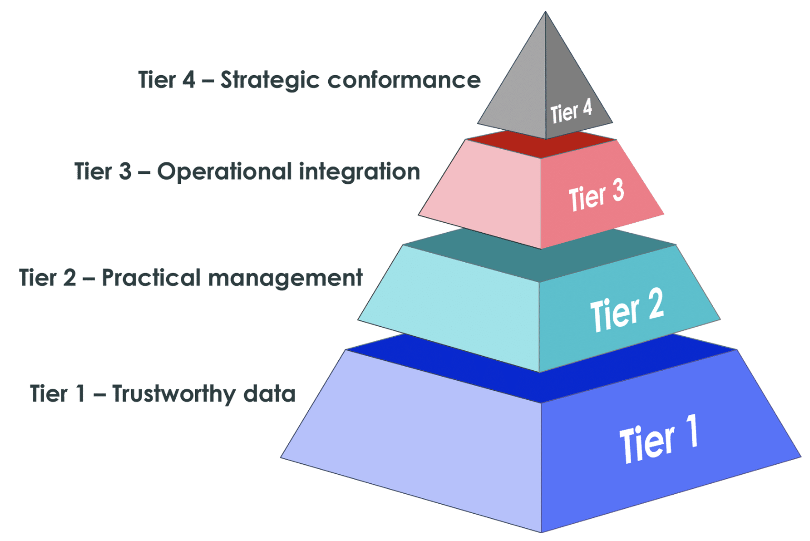

# Hardware Asset Management (HAM)

back to [Asset Management](./sn-asset.md)

## TODO

- [ ]

## Resources

### Courses

- [x] [Hardware Asset Management (HAM) Fundamentals On Demand (Washington)](https://nowlearning.servicenow.com/lxp/en/it-asset-management/hardware-asset-management-ham-fundamentals-on-demand?id=learning_course_prev&course_id=944ea00847908654db63fb25126d4320)
- [ ] Hardware Asset Simulator
- [ ] Hardware Asset Workspace Overview
- [ ] Mobile Hardware Asset Management Fundamentals

### Links

- Non-ServiceNow ITAM Resources:
  - **International Organization for Standardization (ISO)**
    - Largest developer of voluntary international standards
    - Basic info is free; detailed standards are fee-based
    - [Website](https://www.iso.org/home.html)
  - **Asset Management ISO Standards**
    - Covers ISO 55000 for Asset Management
    - Owned/maintained by The Woodhouse Partnership Ltd
    - Offers comprehensive details on the developing standard
    - [Website](http://www.assetmanagementstandards.com/)
  - **ITAM Review**
    - News, reviews, and resources for ITAM, SAM, and licensing professionals
    - [Website](https://www.itassetmanagement.net/)
  - **The International Association of Information Technology Asset Managers (IAITAM)**
    - Premier organization for IT Asset Managers
    - Membership-based resources and multiple asset management certifications
    - [Website](http://iaitam.org/)
  - **IT Service Management ISO Standards**
    - Based on ISO/IEC 20000 (for IT Service Management)
    - Incorporates IT asset management practices
    - [Website](https://www.bsigroup.com/en-GB/iso-20000-it-service-management/)

### Labs

#### L1:Prepare the Asset Management Environment (W)

- [lab steps](https://nowlearning.servicenow.com/sys_attachment.do?sys_id=4f92791b974a0e54524eb3cf9153af67)

##### L1: Objective

1. Validate that ITSM Asset Management and Hardware Asset Management (HAM) functionality are installed and activated.
2. Grant appropriate access to the asset manager for these applications.
3. Download supporting files for future labs.

##### L1-A: Validate Plugins

1. Log in as the System Administrator
2. Navigate to **System Definition > Plugins**. Switch to **Classic Application Manager** if prompted.
3. Verify the following plugins are installed:
   - Asset Management, Asset Management Workspace, Contract Management, Cost Management, Data Certification, Extended CMDB, Hardware Asset Management, Managed Documents, My Assets, Procurement.
   - Install and activate any missing plugins (optionally include demo data).

##### L1-B: Create a User Account

1. Navigate to **User Administration > Users** and create a new user with the following details:
   - User ID: hamm.dalorian
   - First Name: Hamm
   - Last Name: Dalorian
   - Title: Asset Manager
   - Email: `hamm.dalorian@example.com`
   - Time Zone: US/Pacific (optional).
2. Save the user record.

##### L1-C: Add User to a New Group

1. On Hamm’s user record, navigate to the **Groups** section and select **New**.
2. Create and save a group named **Asset Managers**.
3. Verify Hamm appears in the **Group Members** related list.

##### L1-D: Add Roles to the Group

1. Navigate to the **Roles** section of the **Asset Managers** group and select **Edit**.
2. Add the following roles to the group:
   - `asset`, `catalog_admin`, `discovery_admin`, `financial_mgmt_admin`, `flow_designer`, `ham_admin`, `inventory_admin`, `itil`, `procurement_user`.
3. Save the changes.

##### L1-E: Add User to Another Group

1. On Hamm’s user record, under the **Groups** section, select **Edit**.
2. Add **Field Services** to the group list.
3. Verify both **Asset Managers** and **Field Services** groups are listed.

##### L1-F: Verify Actions

1. Impersonate Hamm Dalorian through the **User Menu**.
2. Verify the following are available in the application navigator:
   - Asset Management
   - Hardware Asset Dashboard
   - Hardware Model Normalization
3. End impersonation.

##### L1-G: Download Supporting Files

1. Navigate to **Self-Service > Knowledge** as the System Administrator.
2. Open the **Class knowledge base** and download the SupportingFiles.zip.
3. Save and unzip the file in an easily accessible location.

#### L2: Manage hardware assets

- [lab steps](https://nowlearning.servicenow.com/sys_attachment.do?sys_id=91157d5b978a0e54524eb3cf9153af20)

##### L2: Objective

1. Create a hardware asset manually.
2. Create a new model category and hardware model.
3. Create a new bundled model and asset bundle.

##### L2-A: Add Asset

1. Impersonate Hamm Dalorian.
2. Navigate to **Asset > Portfolios > All Assets**. Add this to your Favorites by selecting the star icon if desired.
3. Select **New**, and when prompted, select **Hardware**.
4. In the form:
   - **Model category:** Computer
   - **Model:** Dell Inc. Alienware M17x
   - **Asset tag:** DELL0123456
   - **Assigned to:** Beth Anglin
   - **Serial number:** DELLM17X-000
5. Save the asset record.

##### L2-B: Create a New Model Category

1. Navigate to **Product Catalog > Product Models > Model Categories**.
2. Select **New**, and complete the form:
   - **Name:** Handheld Device
   - **Asset class:** Hardware [alm_hardware]
3. Submit the record.

##### L2-C: Create a New Hardware Model

1. Navigate to **Product Catalog > Product Models > Hardware Models**.
2. Select **New**, and complete the form:
   - **Manufacturer:** Creative Labs
   - **Name:** Scanner CL1000
   - **Short description:** Warehouse inventory scanner
   - **Model categories:** Handheld Device
   - **Model number:** CL1000
   - **Cost:** $100.00
3. Save the record.
4. Create a hardware asset using the new model:
   - **Model category:** Handheld Device
   - **Model:** Creative Labs Scanner CL1000
   - **Asset tag:** CLS123456
   - **State:** In stock
   - **Stockroom:** Southern California Warehouse
   - **Serial number:** CLSCN1000-001
5. Submit the record.

##### L2-D: Create a New Bundled Model

1. Navigate to **Product Catalog > Product Models > Bundled Models**.
2. Select **New**, and check flag **Bundle assets**.
   - flag sets state to `Build` and model category to `Bundle`
3. Complete the form:
   - **Name:** Support Agent Bundle
   - **Short description:** Standard support agent bundle
   - **Model number:** SUPAGTBUNDLE
4. Save the record.
5. Add components to the bundle:
   - Navigate to the **Model Components** tab and add the following components:
     - **Computer:** Hewlett-Packard HP Compaq dc7700p Ultra-slim Desktop
       - set **Is main component** to true
     - **Monitor:** Samsung SyncMaster 27" 3D LED LCD Monitor
     - **Consumable:** Logitech Logitech Desktop Keyboard
     - **Consumable:** Logitech Logitech Desktop Optical Wireless Mouse
     - **Printer:** Canon imageCLASS Laser Printer
6. Change the **Status** to In Production and save the bundled model.

##### L2-E: Create an Asset Bundle

1. Navigate to **Asset > Portfolios > Bundled Assets**.
2. Select **New**, and complete the form:
   - **Model:** Support Agent Bundle
   - **Asset tag:** BUN0006
   - **Stockroom:** Southern California Warehouse
3. Save the record.
4. Select **Auto-select assets** to automatically add available components to the bundle.
5. Change the **State** to In Stock and save.

#### L2.2: Hardware Model Normalization

- [lab steps](https://nowlearning.servicenow.com/sys_attachment.do?sys_id=6ff6b5d397ca0e54524eb3cf9153af3a)

##### L2.2: Objective

1. Establish Content Service participation.
2. Exclude a hardware model from Content Service participation.
3. Validate hardware model Content Service download.
4. Normalize an unnormalized hardware model.

##### L2.2-A: Opt-in to Content Service

1. Impersonate Hamm Dalorian.
2. Navigate to **Asset > Hardware Model Normalization > Content Service Setup**.
3. Select the **Opt-In Agreement** link, read the details, and select **Done**.
4. Check **Yes, I have read and accept the Opt-In Agreement**.
5. Select **Opt-In**.
6. Expand each **HARDWARE ASSET DATA** section to review the details sent to ServiceNow.

##### L2.2-B: Exclude a Hardware Model from Content Service

1. Navigate to **Product Catalog > Product Models > Hardware Models**.
2. Open the **Gamer Supreme** hardware model.
3. Select the **Normalization** tab and check **Exclude from content service**.
4. Select **Update**.

##### L2.2-C: Opt-in to License Resource Categories

1. Navigate to **Asset > Hardware Model Normalization > HAM Resource Categories**.
2. Open the **Network Gear** resource category and review associated model categories.
3. Select **Opt out**, confirm in the popup, and verify the **Opt in** checkbox is deselected.
4. Return to the list of HAM Resource Categories and confirm the **Network Gear** category is marked as false in the **Opt in** column.
5. Opt back into the **Network Gear** category, ensuring all categories are set to **true**.

##### L2.2-D: Validate Hardware Model Content Service Download

1. Navigate to **Asset > Hardware Model Normalization > Overview**.
2. Review the **Hardware Model Content Service Download** section for:
   - Days until the next content library download.
   - Days since the last content library download.

##### L2.2-E: Review Fully Normalized Hardware Model

1. Navigate to **Product Catalog > Product Models > Hardware Models**.
2. Select the **Personalize List** gear icon and add **Normalization status** to the displayed columns.
3. Open the **Macbook Pro 15** hardware model with a normalization status of **Normalized**. (e.g., Model number MR962LL/A)
4. Review the **General** tab for the display name and other normalized data.
5. Open the **Compaq Evo Notebook PC** (n610c) model and review its **Hardware Model Lifecycles** tab for lifecycle data provided by the Content Service.

##### L2.2-F: Normalize an Unnormalized Hardware Model

1. Navigate to **Product Catalog > Product Models > Hardware Models** and select **New**.
2. Enter the following details:
   - **Manufacturer:** `Dell Inc.`
   - **Name:** junk text
3. Save the record and review the **Normalization** tab.
4. Update the **Model number** to **PS6000X** and save again.
5. Review the updated **Normalization** tab for changes.

#### L2.3: Asset and Configuration Item (CI) Relationships

- [lab steps](https://nowlearning.servicenow.com/sys_attachment.do?sys_id=c655a12397468294524eb3cf9153af73)

##### L2.3: Objective

1. Create a configuration item (CI).
2. Synchronize CI and asset.

##### L2.3-A: Create a Configuration Item and Associated Asset

1. Impersonate Hamm Dalorian.
2. Navigate to **Configuration > Base Items > Computers**.
3. Select **New** and complete the form:
   - **Name:** Serenity
   - **Asset tag:** DELL1234567
   - **Manufacturer:** Dell Inc.
   - **Serial number:** DELLM17X-001
   - **Model ID:** Dell Inc. Alienware M17x
   - **Assigned to:** Felipe Gould
4. Save the record.

To create the associated asset: 5. End impersonation 6. Navigate to **System Definition > Scheduled Jobs**. 7. Locate the job **Asset - Create asset delayed sync** and select **Execute Now**. 8. Re-impersonate Hamm Dalorian and return to **Configuration > Base Items > Computers**. 9. Open the record for **Serenity** and verify the **Asset** field is populated.

##### L2.3-B: Define Model Asset Tracking Strategy

1. Navigate to **Product Catalog > Product Models > Hardware Models**.
2. Open the record for **MacBook Pro 17”**.
3. Set **Asset tracking strategy** to **Don’t create assets** and save.
4. Navigate to **Configuration > Base Items > Computers** and create a new record:
   - **Name:** Enterprise
   - **Manufacturer:** Apple
   - **Serial number:** APPLMBP17-001
   - **Model ID:** Apple MacBook Pro 17"
   - **Assigned to:** Fred Luddy
5. Save the record and verify the **Asset** field is not populated due to the tracking strategy.

##### L2.3-C: Enforce CI Verification

1. Navigate to **Product Catalog > Product Models > Model Categories**.
2. Open the record for **Computer** and enable **Enforce CI Verification**. Save the changes.
3. Navigate to **Configuration > Base Items > Computers** and create a new record:
   - **Name:** Destiny
   - **Manufacturer:** Dell Inc.
   - **Serial number:** DELLM17X-002
   - **Model ID:** Dell Inc. Alienware M17X
   - **Assigned to:** Felipe Gould
4. Save the record and add **DELL2345678** to the **Asset tag** field, save the changes
5. End impersonation and execute the **Asset – Create asset delayed sync** job.
6. Re-impersonate Hamm Dalorian, open the record for **Destiny**, and select **Create Asset**.
7. Verify the asset record is created by confirming the **Asset** field is populated or by searching for **DELL2345678** under **Asset > Portfolios > Hardware Assets**.

#### L3.1: Manage Consumables

- [lab steps](https://nowlearning.servicenow.com/sys_attachment.do?sys_id=079da127974a8294524eb3cf9153af51)

##### L3.1: Objective

1. Create a consumable record and associate it with a new consumable model.
2. Consume a consumable asset.

##### L3.1-A: Create a Consumable Product Model

1. Impersonate Hamm Dalorian.
2. Navigate to **Product Catalog > Product Models > Consumable Models**.
3. Select **New** and complete the form:
   - **Manufacturer:** Logitech
   - **Name:** M510 wireless mouse
   - **Short description:** Wireless computer mouse
   - **Model categories:** Consumable
   - **Model number:** M510
   - **Cost:** $19.00
4. Save the record.

##### L3.1-B: Create a Consumable Asset Record

1. Navigate to **Asset > Portfolios > Consumables**.
2. Select **New** and complete the form:
   - **Model category:** Consumable
   - **Model:** Logitech M510 wireless mouse
   - **Quantity:** 50
   - **State:** In stock
   - **Substate:** Available
   - **Stockroom:** Southern California Warehouse
3. Verify the cost is automatically calculated as $950.00 (50 units x $19 each).
4. Save the record.

##### L3.1-C: Consume a Consumable Asset

1. On the created consumable asset record, select the **Consume** button.
2. In the **User** field, select **Beth Anglin**.
3. Select **OK** and verify the results:
   - The quantity is updated to 49 (50 - 1 consumed = 49).
   - The cost is updated to $931.00 ($950 - $19 for 1 consumed = $931).
4. Save the record.

##### L3.1: Lab Challenge: Validate Asset Assignment

1. Impersonate Beth Anglin.
2. Navigate to **Self-Service > My Assets**.
3. Verify that one Logitech M510 wireless mouse has been assigned.

#### L3.2: Manage Stock

- [lab steps](https://nowlearning.servicenow.com/sys_attachment.do?sys_id=c6ed21e7974a8294524eb3cf9153af45)

##### L3.2: Objective

1. Transfer assets out of a stockroom.
2. Transfer assets into a stockroom.

##### L3.2-A: Create a Transfer Order

1. Impersonate Hamm Dalorian.
2. Navigate to **Inventory > Transfer Orders > Create Transfer Order**.
3. Complete the form:
   - **From stockroom:** Southern California Warehouse
   - **To stockroom:** San Diego South Warehouse
4. Save the transfer order.
5. In the **Transfer Order Lines** related list, select **New** and complete the form:
   - **Model:** Logitech M510 wireless mouse
   - **Quantity requested:** 20
6. Submit the transfer order line.
7. Create two additional transfer order lines for one Apple MacBook Pro 15" laptop each, selecting assets with a state of **In stock** and a substate of **Available**.
8. Validate that there are three lines:

   - One line for 20 Logitech M510 wireless mice.
   - Two lines for Apple MacBook Pro 15" laptops.

9. Open the **Transfer Order Line** for the Logitech mice and review the **Transfer Order Line Tasks** related list.
10. Select **Close Task** to complete fulfillment and begin the asset transfer process.
11. Repeat the process for the other transfer order lines for the laptops, ensuring their stages progress to **In Transit**.

##### L3.2-B: Receive a Transfer Order

1. Impersonate Luke Wilson.
2. Navigate to **Inventory > Transfer Orders > Transfer Orders** and open the created transfer order.
3. Open the **Transfer Order Line** for the Logitech mice and review it.
4. Open the **Open Transfer Order Line Task** and:
   - Enter **Quantity received:** 10.
   - Select **Close Task**.
5. Repeat the process for the Apple MacBook Pro 15" laptops to mark them as received.
6. Process the remaining 10 Logitech mice when they are delivered and mark them as received.

##### L3.2: Verify Actions

1. Navigate to **Inventory > Stock > Stockrooms**.
2. Open **San Diego South Warehouse** and validate that 20 Logitech M510 wireless mice are in stock and available.

##### Lab Challenge: Consume a Consumable

1. Consume one Logitech M510 wireless mouse from the San Diego South Warehouse.
2. Assign it to **Alejandro Mascall** and validate that the mouse appears in Alejandro’s assigned assets.

#### L3.3: Import Assets

- [lab steps](https://nowlearning.servicenow.com/sys_attachment.do?sys_id=312ee16b974a8294524eb3cf9153af41)

##### L3.3: Objective

1. Load hardware asset data.
2. Transform hardware asset data into ServiceNow tables.
3. Import hardware asset data via the advanced shipment notification (ASN) template.

##### L3.3-A: Load Asset Data

1. use the **System Administrator** account
2. Navigate to **System Import Sets > Load Data**.
3. Select **Create table**, and add a **Label:** Asset Import.
4. Under **Source of the import**, select **File**, and upload `3.3-assets_for_import.xls`.
5. Submit the import.

##### L3.3-B: Create Transform Maps

1. Define the **Hardware Model Import Map**:
   - Next steps: Create transform map
     - **Name**: Hardware Model Import Map
     - **Target table:** Hardware Model [cmdb_hardware_product_model].
     - Save the map.
     - Use **Auto Map Matching Fields**
     - Use **Mapping Assist** to configure mappings for:
       - **Source field:** model_name → **Target field:** Name
       - Save
     - set **Coalesce** to true for: u_model_name, manufacturer
     - Update
2. Define the **Asset Import Map**:
   - Next steps: Create transform map
     - **Name**: Asset Import Map
     - **Target table:** Hardware [alm_hardware].
     - Use **Auto Map Matching Fields**
     - set **Coalesce** to true for: u_asset_tag
     - adapt date format for `u_warranty_expiration` by opening the record and clicking Suggestion behind the date format field
       - format: `yyyy-MM-dd`
     - create two new mappings:
       - **Source field:** model_name → **Target field:** Model (**Choice action:** reject, **Reference value**: name).
       - **Source field:** category → **Target field:** Model category (**Choice action:** reject).
     - Save.

##### L3.3-C: Transform Data

1. Stay on the Asset Import Map record and select **Transform**.
2. Move both maps to **Selected maps** and arrange them:
   - Run **Hardware Model Import Map** first.
   - Run **Asset Import Map** second.
3. Execute the transform and verify the import:
   - Navigate to **Asset > Portfolios > Hardware Assets**.
   - Confirm `A71001` imported data matches the spreadsheet.

##### L3.3-D: Update Asset Data

1. Navigate to **System Import Sets > Load Data**.
2. Select **Existing table:** Asset Import [u_asset_import].
3. Upload `3.3-assets_for_update.xls` and submit.
4. Transform the data using the maps in the correct order (Hardware Model Import Map, Asset Import Map)
5. Verify updates to assets, such as **State**, **Substate**, and **Assigned to**.
   - A71008, A71022

##### L3.3-E: Import Advanced Shipment Notification (ASN) Data

1. Add a new shipping carrier:
   - Navigate to **sn_itam_common_shipping_carrier.list** and select **New**.
   - **Name:** FedEx, **Email:** `fedex@example.com`, **Status:** Active.
2. Navigate to **Procurement > Orders > Import Shipment Notifications**.
3. Upload `3.3-sn_hamp_import_template.xlsx` and process the import.
4. Verify the results in the **Import Set Runs** and **Import Set Rows** related lists.
   - All > Procurement > Orders > Import Status
   - **Import Set Rows**, one record shows comment `Shipping address is invalid;Ignored by s...`
5. Correct any errors (e.g., invalid shipping address) and re-import as needed.

##### L3.3: Verify Actions

1. Navigate to **Asset > Portfolios > Hardware Assets**.
2. Validate imported records, confirming their **State** as **In transit**.

##### L3.3: Lab Challenge: Fix Errors in ASN Template

1. Update the ASN template for Asset tag **AA0124** with a valid shipping address.
2. Remove already imported rows and re-import the updated template.

#### L3.4: Retire Assets

- [lab steps](https://nowlearning.servicenow.com/sys_attachment.do?sys_id=f07e25eb974a8294524eb3cf9153af08)

##### L3.4: Objective

1. Create a retirement change workflow.
2. Retire assets both manually and using a workflow.

##### L3.4-A: Apply Update Set

1. Impersonate the **System Administrator**.
2. Navigate to **System Update Sets > Retrieved Update Sets**.
3. Under **Related Links**, select **Import Update Set from XML**.
4. Upload `3.4-Asset Retirement Workflow.xml` and select **Upload**.
5. Select **Asset Retirement Workflow** and then **Preview Update Set**.
6. After the preview completes, select **Commit Update Set**.
7. Close the completion message.

##### L3.4-B: Review Retirement Workflow

1. Navigate to **Workflow > Workflow Editor**.
2. Search for and open the **Retire Asset** workflow.
3. Validate the following acceptance criteria:
   - A change request is created to track the retirement process.
   - Sequential tasks are created for:
     - Backing up user files.
     - Wiping the asset's drive.
     - Removing entitlements and installations.
     - Returning leased assets to the vendor or sending purchased assets to a disposal vendor.
   - The asset's **State** changes to **Retired** and **Substate** updates to **Vendor Credit** (leased) or **Disposed** (purchased).
   - The change request is closed after all tasks are completed.
4. Close the workflow tab.

##### L3.4-C: Retire an Asset Manually

1. Impersonate Hamm Dalorian.
2. Navigate to **Asset > Portfolios > Hardware Assets**.
3. Open the asset with Asset tag **P1000228**.
4. Update the **State** to **Retired** and **Substate** to **Disposed**.
5. Select **Update**.

##### L3.4-D: Use Retirement Workflow

1. Navigate to **Asset > Portfolios > Hardware Assets**.
2. Open the asset with Asset tag **P1000145**.
3. Under **Related Links**, select **Retire Asset** to initiate the workflow.
4. Review the newly created **Change Request** and its associated tasks.
5. Complete each task sequentially:
   - Close the backup task with a close note: "User files backed up."
   - Close the wipe task with a close note: "Hard drive wiped."
   - Close the disposal task with a close note: "Sent to disposal vendor."
   - Close the certificate task with a note: "Certificate of disposal attached."
6. Review the **Change Request**:
   - Confirm its **State** is **Closed** with **Close notes**: "Asset retired successfully."
7. Return to the asset record and verify its **State** as **Retired** and **Substate** as **Disposed**.

##### L3.4: Lab Challenge - Validate Workflow for Leased Assets

1. Open an "In use" asset (e.g., P1000056).
2. Set its **Acquisition method** to **Lease** and save.
3. Retire the asset using the workflow.
4. Confirm the asset is returned to the vendor:
   - **State:** Retired.
   - **Substate:** Vendor Credit.

#### L3.5: Validate Asset Lifecycle Automation

- [lab steps](https://nowlearning.servicenow.com/sys_attachment.do?sys_id=17ae692f974a8294524eb3cf9153af15)

##### L3.5: Objective

1. Dispose of assets using the HAM Hardware Asset Disposal flow.
2. Update associated CI and asset records via the automated process flow.
3. Copy the Hardware Stock Order Flow for modification.
4. Resolve customer incidents and update associated CI/asset records automatically.

##### L3.5-A: Validate HAM Flows Availability

1. Impersonate Hamm Dalorian.
2. Navigate to **Process Automation > Flow Designer**.
3. Verify the following HAM flows exist:
   - Hardware Asset Disposal Flow
   - Hardware Asset Reclamation Flow
   - Hardware Asset Reclamation Line Flow
   - Hardware Asset Refresh Flow
   - Hardware Asset Refresh Line Flow
   - Hardware Stock Order Flow
   - Standard Hardware Asset Request
4. (Optional) Open a flow (e.g., Hardware Asset Disposal) to view its logic.
5. Close the Flow Designer tab.

##### L3.5-B: Create Disposal Order

1. Navigate to **Inventory > Disposal Orders > Create Disposal Order**.
2. Complete the form:
   - **Stockroom:** Southern California Warehouse
   - **Assigned to:** Rob Woodbyrne
3. Save the order.
4. Add assets:
   - Select the **Planned Assets** tab and click **Edit**.
   - Move three assets with **State:** In stock and **Substate:** Pending disposal to the Planned Assets list.
   - Save.
   - Save the order.
5. Process tasks:
   - Navigate to the **Hardware Disposal Tasks** tab.
   - Open the first task, **Verify Assets**, and confirm that all planned assets are listed.
   - Select all assets on the list and choose **Actions on selected rows > Verify** to confirm their presence.
   - Verify that the **Stage** of the assets is updated to **Verified**.
   - Select **Close Task** to complete the verification.
   - Save the updated disposal order.
6. Schedule vendor pickup for the assets:
   - Enter **Vendor:** IngramMicro, **Scheduled date:** Tomorrow, **Vendor order ID:** IM-5597, **Pickup contact:** Luke Skye, and **Pickup details:** Loading dock is slippery in winter.
   - Close the task.
   - Save the updated disposal order.
7. Mark assets as **Departed** once the vendor picks them up.
8. Confirm vendor receipt:
   - Open the **Vendor Confirmation** task.
   - Review the list of Planned Assets and verify their **State:** Retired and **Substate:** Pending disposal.
   - Confirm vendor receipt and close the task.
9. Provide disposal documentation:
   - Open the **Disposal Documentation** task.
   - From the **Certificate of disposal** dropdown, select **Yes**.
   - Attach the file `3.5-Certificate_of_Disposal.txt` using the **Manage Attachments** icon.
   - Mark all assets as **Disposed**:
     - Select all assets on the **Planned Assets** list.
     - Choose **Actions on selected rows > Dispose**.
   - Verify that the final **State:** Retired and **Substate:** Disposed is updated for all assets.
   - Close the task and save the disposal order.

##### L3.5-C: Copy Hardware Stock Order Flow

1. As System Administrator, navigate to **Process Automation > Flow Designer**.
2. Open the **Hardware Stock Order Flow** and select **Copy flow** from the **More actions menu**.
3. Name the new flow **Hardware Stock Order Flow – CloudD**.
4. Select **Edit flow** and explore adding actions, flow logic, or subflows.
5. Close the Flow Designer tab.

##### L3.5-D: Resolve Hardware Incident and View Auto-Updates

1. Impersonate Hamm Dalorian, create a test incident:
   - Navigate to **Incident > Create New**.
   - Complete the form:
     - **Caller:** Florine Willardson
     - **Category:** Hardware
     - **Configuration Item:** MacBook Air 13"
       - use search to find the one assigned to Florine Willardson
     - **Short description:** Broken screen – can’t work.
   - Save the incident.
   - Add the following fields to the **Affected CIs** tab:
     - Asset Action
     - Swapped CI
     - Updated
2. Resolve the incident:
   - Update **Asset Action** to **Swap** and **Swapped CI** to a new CI (e.g., Apple - MacBook Pro 15" for Technical Staff).
     - use search to find an unassigned CI
   - Enter **Resolution code:** Solution provided and **Resolution notes:** Swapped for new laptop.
   - Resolve the incident and validate updates to the associated CI/asset records.

##### L3.5-E: Configure Asset Lifecycle Category

1. Impersonate Hamm Dalorian, navigate to **Self-Service > Service Catalog**.
2. Add the **Asset Lifecycle** category:
   - Select **Add content** and locate the **Asset Lifecycle** section.
   - Select the desired location for the category and close the form.
3. Verify the **Asset Lifecycle** card is added

##### L3.5: Lab Verification - Asset Refresh Order

1. Impersonate Hamm Dalorian, navigate to **Self-Service > Service Catalog**.
2. Open the **Asset Lifecycle** card and select **Hardware Asset Refresh Order**.
   - Type of refresh: Single model
   - Replacement model: Lenovo ThinkPad T20 264744U
3. Modify the **Filter Criteria** to include non-eligible assets:
   - Set **Eligible for refresh** to **false**.
   - Add a filter for **Model:** Hewlett-Packard HP EliteBook 2540p.
4. Select **Run Filter** and confirm assets are listed in the **Available** list.
5. Move 10 assets to the **Selected** list.
6. Select **Order Now** to submit the request.
7. Navigate to the **Requests** tab and verify the **Requested Items**:
   - Confirm the requested 10 assets are listed under the variables section.
   - Ensure the replacement model is **Lenovo ThinkPad T20 264744U**.

#### L4.1: Report on Hardware Assets

- [lab steps](https://nowlearning.servicenow.com/sys_attachment.do?sys_id=ee85bda7974e8294524eb3cf9153af73)

##### L4.1: Objective

1. Identify the quantity of assets by model.
2. Identify total spend by vendor.
3. Identify computers still under warranty.
4. Navigate the Hardware Asset Dashboard.

##### L4.1-A: Create a Bar Chart of Assets by Model

1. Impersonate Hamm Dalorian.
2. Navigate to **Asset > Portfolios > Hardware Assets**.
3. Select the **Personalize List** gear icon and update columns to include:
   - **Asset tag**, **Model category**, **Model**, **Assigned to**, **Company**, **State**, **Substate**, **Cost**, and **Configuration item**.
4. Select **OK** to save changes.
5. In the **Model category** column, right-click on **Computer** in any record and select **Show Matching**.
6. Right-click the **Model** column header and select **Bar Chart**.
7. In the **Create a report** designer panel:
   - Rename the report to **Computer Assets by Model**.
   - Save the report.

##### L4.1-B: Report on Total Spend by Vendor

1. Navigate to **Reports > View / Run**.
2. Select **Create a report**.
3. Configure the report:
   - **Report name:** Vendor Spend
   - **Source type:** Table
   - **Table:** Hardware [alm_hardware]
   - **Type:** Pivot table
4. Under **Configure** options:
   - Row: **Vendor**
   - Column: **Model category**
   - Aggregation: **Sum > Cost**
5. Save the report and hover over data to analyze spend by vendor.

##### L4.1-C: Report on Computers Still Under Warranty

1. Navigate to **Reports > Create New**.
2. Configure the report:
   - **Report name:** Computers Still Under Warranty
   - **Source type:** Table
   - **Table:** Hardware [alm_hardware]
   - **Type:** Pivot table
3. Under **Configure** options:
   - Row: **Model category**
   - Column: **Warranty expiration**
   - Aggregation: **Sum > Quantity**
4. Open the **Condition Builder** and filter:
   - **Model category:** is **Computer**
   - **Warranty expiration:** after **Today**
5. Save the report.

##### L4.1-D: Navigate Hardware Asset Dashboard

1. Navigate to **Asset > Hardware Asset Dashboard**.
2. Explore the **Asset Health** tab to review:
   - **Incomplete assets** (e.g., missing purchase information).
   - **Assets with most incidents**.
   - **Assets due for refresh**.
   - **Undiscovered assets** within the last month.
3. Navigate to the **Model Management** tab and analyze:
   - Hardware and consumable models nearing **End of Life**.
   - Normalization status and lifecycle overview for models.
4. Explore additional tabs:
   - **Procurement** for sourcing requests.
   - **Inventory** for stock orders, open audits, and new hardware findings.
   - **End of Life** for disposed assets and lifecycle status.

#### L4.2: Manage Request and Procurement

- [lab steps](https://nowlearning.servicenow.com/sys_attachment.do?sys_id=7306fdeb974e8294524eb3cf9153af07)

##### L4.2: Objective

1. Publish a hardware model to the service catalog.
2. Request a hardware model from the service catalog.
3. Source and receive a hardware model from a vendor.

##### L4.2-A: Publish to Hardware Catalog

1. Impersonate Hamm Dalorian.
2. Navigate to **Product Catalog > Product Models > Hardware Models**.
3. Open **Scanner CL1000**.
4. On the **Product Catalog** tab, enter the description: _Wireless scanner used in warehouses and distribution facilities to manage inventory_.
5. Save the changes.
6. Under **Related Links**, select **Publish to Hardware Catalog**.
7. In the **Publish to Hardware Catalog** popup, set the **Category** to **Hardware** and select **OK**.
8. Navigate to **Self-Service > Service Catalog**, select **Hardware**, and confirm **Scanner CL1000** is listed with accurate information.

##### L4.2-B: Create Vendor Catalog Items

1. Navigate to **Product Catalog > Catalog Definitions > Vendor Items**.
2. Select **New** and complete the form:
   - **Vendor:** `Cloudward Inc`
   - **Product Model:** `Creative Labs Scanner CL1000`
   - **Product ID:** `CDW-CL1000`
   - **List Price:** `$100`
   - **Vendor Price:** `$90`
   - **Product Catalog Item:** `Scanner CL1000`
3. Save the record.
4. Add a second vendor:
   - Navigate to **Product Catalog > Catalog Definitions > Hardware & Software Items**.
   - Open **Scanner CL1000**.
   - In the **Vendor Catalog Items** related list, select **New** and complete the form:
     - **Vendor:** `Amazon`
     - **Product Model:** `Creative Labs Scanner CL1000`
     - **Product ID:** `AMZ-CL1000`
     - **List Price:** `$110`
     - **Vendor Price:** `$105`
   - Submit the record and confirm both vendor catalog items are listed.

##### L4.2-C: Request Items from the Service Catalog

1. Impersonate Luke Wilson.
2. Navigate to **Self-Service > Service Catalog**, select **Hardware**, and open **Scanner CL1000**.
3. Set **Quantity** to 2 and select **Order Now**.
4. Take note of the **REQ number** for tracking.

##### L4.2-D: Source the Request

1. Impersonate Hamm Dalorian and navigate to **Procurement > Requests > Requests**.
2. Open Luke Wilson's request.
3. In the **Catalog Tasks** related list, open the task record and select **Source Request**.
4. Review the available stock:
   - Transfer one scanner from **Southern California Warehouse** to **San Diego South Warehouse**:
     - Complete the **Transfer Order** form with the required stockroom details and submit.
   - Purchase the second scanner:
     - Select **Vendor:** Cloudward Inc ($90.00).
     - Submit the purchase order.
5. Confirm both a purchase order and a transfer order were created and are associated with the request.

##### L4.2-E: Order the Item

1. Impersonate Beth Anglin.
2. Navigate to **Procurement > Orders > Purchase Orders**.
3. Open the purchase order for the second scanner and select **Order**.

##### L4.2-F: Create the Asset Before Delivery

1. Impersonate Hamm Dalorian and return to **Procurement > Requests > Requests**.
2. Open Luke Wilson's request and access the purchase order.
3. Under **Related Links**, select **Create hardware assets prior to delivery**.
4. In the **Assets** related list, enter an **Asset Tag** (e.g., HHD12345) and save the record.

##### L4.2-G: Receive the Request

1. On the purchase order, select **Receive**.
2. If needed, capture **Asset Tag** and **Serial Number** information upon receipt.
3. Submit the receipt and confirm:
   - The purchase order status is now **Received**.
   - The asset state is **In stock**, with a substate of **Available** and a cost of $90.

##### L4.2-H: Lab Verification Steps

1. Confirm the following actions were completed:
   - **Scanner CL1000** is published to the service catalog and accurately listed.
   - Vendor catalog items for **Cloudward Inc.** and **Amazon** are created.
   - A request for 2 scanners is successfully placed by Luke Wilson.
   - The request is sourced using a combination of stock transfer and vendor purchase.
2. Verify the asset state for the received scanner:
   - **State:** In stock.
   - **Substate:** Available.
   - **Cost:** Matches the vendor price ($90).
3. Confirm all associated orders (purchase and transfer) are completed and listed under the request record.

#### L4.3: Automate Stock Management

- [lab steps](https://nowlearning.servicenow.com/sys_attachment.do?sys_id=b146fd6f974e8294524eb3cf9153affa)

##### L4.3: Objective

1. Replenish internal stock from a central warehouse.
2. Replenish central warehouse stock from a vendor.
3. Verify replenishment rules.
4. Replenish stock using HAM bulk stock order.

##### L4.3-A: Replenish Stock from a Stockroom

1. Impersonate Hamm Dalorian.
2. Navigate to **Inventory > Stock > Stock Rules** and click **New**.
3. Complete the form:
   - **Model**: `Acer Notebook Battery`
   - **Stockroom**: `San Diego South Warehouse`
   - **Threshold**: `3`
   - **Restocking option**: `Stockroom`
   - **Order size**: `5`
   - **Parent stockroom**: `Southern California Warehouse`
4. Click **Submit**.

##### L4.3-B: Replenish Stock from a Vendor

1. Navigate to **Inventory > Stock > Stock Rules** and click **New**.
2. Complete the form:
   - **Model**: `Acer Notebook Battery`
   - **Stockroom**: `Southern California Warehouse`
   - **Threshold**: `10`
   - **Restocking option**: `Vendor`
   - **Order size**: `20`
3. Click **Submit**.
4. Verify the stockroom manager:
   - Navigate to **Inventory > Stockrooms**.
   - Open the Southern California Warehouse stockroom.
   - Update the **Manager** to `Rob Woodbyrne`.
   - Click **Update**.

##### L4.3-C: Verify Stock Rules Operate as Expected

1. **Consume stock to trigger replenishment**:
   - Navigate to **Inventory > Stockrooms** and open the `San Diego South Warehouse`.
   - Under the **Consumables** tab, open the `Acer Notebook Battery` record.
   - Consume one battery to drop the quantity below the threshold of `3`.
   - Navigate back to the `Southern California Warehouse` stockroom.
   - Under the **Consumables** tab, consume batteries to drop the quantity below the threshold of `10`.
2. **Run the stock rule job manually**:
   - Impersonate System Administrator and navigate to **System Scheduler > Scheduled Jobs > Scheduled Jobs**.
   - Open `Stock Rule Runner` and set the **Next action** date to yesterday.
   - Click the checkmark to save and then select **Update**.
3. **Validate stock rules**:
   - Impersonate Rob Woodbyrne and navigate to **Inventory > Transfer Orders > Transfer Orders**.
   - Open the transfer order for `Acer Notebook Batteries` to confirm it was triggered by the first stock rule.
   - Navigate to **Procurement > Requests > Requests** and locate the request triggered by the second stock rule for vendor replenishment.
4. **Review the workflow**:
   - Open the request triggered by the vendor replenishment stock rule.
   - Under **Related Links**, select **Show Workflow**.
   - Verify the workflow opened in a new tab, noting that the request is over `$1000` and has moved to the second-line approval step.
   - Close the workflow tab.
5. **Approve the request**:
   - Impersonate Eric Schroeder.
   - Navigate to **Procurement > Requests > Requests** and open the pending request from Rob Woodbyrne.
   - Set the **Approval status** to `Approved`.
   - Click **Update** to finalize the approval.

##### L4.3-D: Replenish Stock Using HAM Bulk Stock Order

1. Impersonate Rob Woodbyrne.
2. Navigate to **Inventory > Stock > Submit Stock Order** and complete the form:
   - **Model**: `Acer Notebook Battery`
   - **Quantity**: `10`
   - **Stockroom**: `Southern California Warehouse`
   - Click **Order Now**.
3. Navigate to **Procurement > Requests > Requests** and review the submitted request.
4. Under **Related Links**, select **Show Workflow** to review the auto-generated workflow.

##### L4.3-E: Replenish Stock from Service Catalog

1. Navigate to **Self-Service > Service Catalog**.
2. Select **Asset Lifecycle** and choose **Hardware Inventory Stock Order**.
3. Complete the form:
   - **Model**: `Acer Notebook Battery`
   - **Quantity**: `5`
   - **Stockroom**: `Southern California Warehouse`
4. Click **Order Now**.
5. Navigate to **Procurement > Requests > Requests** and confirm the submission.

##### L4.3: Remarks

- Related Link "Show Workflow" was not available during the lab. Maybe no longer available in newer instances?

#### L4.4: Certify Data

- [lab steps](https://nowlearning.servicenow.com/sys_attachment.do?sys_id=4686f563978e8294524eb3cf9153af7d)

##### L4.4: Objective

1. Configure a data certification user.
2. Configure stockroom managers.
3. Schedule monthly stockroom inventory.

##### L4.4-A: Prepare to Use Certification

1. Impersonate System Administrator.
2. Navigate to **User Administration > Users** and click **New**.
3. Complete the form:
   - **User ID**: `data.manager`
   - **First name**: `Data`
   - **Last name**: `Manager`
4. Save the record.
5. Under the **Groups** tab, click **New** and set:
   - **Name**: `Data Managers`
6. Save the group.
7. Under the **Roles** tab, click **Edit** and add:
   - `certification_admin`
8. Save the changes.

##### L4.4-B: Configure Stockroom Managers

1. Impersonate Hamm Dalorian.
2. Navigate to **Inventory > Stock > Stockrooms**.
3. Update the **Manager** for each stockroom:
   - **San Diego Border – Pickup/Dropoff**: `Allyson Gillispie`
   - **San Diego North – Pickup/Dropoff**: `Bertie Luby`
   - **San Diego North Central – Pickup/Dropoff**: `Candice Bruckman`
   - **San Diego South – Pickup/Dropoff**: `Dorthy Alexy`
   - **San Diego South Central – Pickup/Dropoff**: `Enrique Oroark`
   - **San Diego South Warehouse**: `Felipe Gould`
   - **Santa Monica Warehouse**: `Aileen Mottern`
   - **Southern California Warehouse**: `Rob Woodbyrne`

##### L4.4-C: Create Data Certification Filter

1. Impersonate Data Manager.
2. Navigate to **Data Certification > Schedules > Certification Filters** and click **New**.
3. Complete the form:
   - **Name**: `In stock assets`
   - **Description**: `Assets listed as In stock for monthly inventory`
   - **Table**: `Asset [alm_asset]`
   - **Filter condition**:
     - `State | is | In stock`
     - AND `Stockroom | is not empty`
4. Click the **Update count refresh** button to update the matching record count.
   - Double-Arrows above _Add Filter Condition_
5. Submit the filter.

##### L4.4-D: Define Certification Schedule

1. Navigate to **Data Certification > Schedules > Create New**.
2. Complete the form:
   - **Name**: `Monthly Stockroom Inventory`
   - **Filter**: `In stock assets`
   - **Display fields**:
     - `Model.Display name`
     - `Model category`
     - `Substate`
   - **Certification fields**:
     - `Asset tag`
     - `Quantity`
   - **Assignment type**: `User Field`
   - **Assign to**: `Stockroom Manager`
   - **Days to complete**: `3`
   - **Task description**: `Monthly Stockroom Inventory`
3. Save the record.
4. Complete additional fields:
   - **Run**: `Monthly`
   - **Day (run_dayofmonth)**: `1`
   - **Instructions**: `Validate that the actual stock in the stockroom matches what is listed in ServiceNow. Certify items that match and fail certification for those that do not.`
5. Save the changes.
6. Under **Related Links**, select **Preview Certification Tasks** and review the results.
7. Click **Execute Now**.
8. Navigate to **Data Certification > Schedules > Instances** and verify a new instance was created.

##### L4.4-E: Verify a Certification Task

1. Impersonate Rob Woodbyrne.
2. Navigate to **Service Desk > My Work** and open the task for `Monthly Stockroom Inventory`.
3. Sort the **Assets** list by **Display name** in ascending order.
4. Identify discrepancies:
   - Select the asset `3Com Cat 5 Cable (10ft)` and enter `Only 95` in the **Optional comment for checked elements** field.
   - Click **Fail certification for checked elements** (red exclamation mark).
5. Certify all correct elements:
   - Select all remaining elements and click **Certify checked elements** (green check mark).
   - Wait for the **Percentage complete** to update or manually save the form.
6. Repeat as necessary to certify all remaining records.

#### L5.1: Manage Contracts

- [lab steps](https://nowlearning.servicenow.com/sys_attachment.do?sys_id=a1db3da39742c294524eb3cf9153aff1)

##### L5.1: Objective

1. Create a hardware lease contract.
2. Associate hardware assets with the lease contract.
3. Manage the hardware lease contract lifecycle.

##### L5.1-A: Enter a New Contract

1. Impersonate Hamm Dalorian.
2. Navigate to **Contract > Contracts > Leases** and click **New**.
3. Complete the form:
   - **Vendor**: `Lenovo`
   - **Contract number**: `LNVO-1001`
   - **Start date**: `<the first day of this year>`
   - **End date**: `<the last day of this year>`
   - **Description**: `Lease for Lenovo end user computers`
   - **Contract administrator**: `Hamm Dalorian`
   - **Approver**: `Beth Anglin`
4. Save the record.
5. Under the **Financial** section, set:
   - **Payment amount**: `$500.00`
6. Update the record.

##### L5.1-B: Add Terms and Conditions

1. Navigate to **Contract > Contracts > Terms & Conditions** and click **New**.
2. Create the first record:
   - **Name**: `Lenovo Use of Equipment`
   - **Description**: `USE OF EQUIPMENT: Lessee shall only use the Equipment in a careful and proper manner and will comply with all laws, rules, ordinances, statutes, and orders regarding the use, maintenance, and storage of the Equipment.`
3. Submit the record.
4. Create the second record:
   - **Name**: `Lenovo Lease Maintenance`
   - **Description**: `MAINTENANCE, DAMAGE, AND LOSS: Lessee will, at Lessee's sole expense, keep and maintain the Equipment clean and in good working order and repair during the Lease Term. If lost or damaged, Lessee shall pay replacement costs.`
5. Submit the record.
6. Return to **Contract > Contracts > Leases** and open the Lenovo contract.
7. Under the **Terms and Conditions** tab:
   - Insert `Lenovo Use of Equipment` with an order of `100`.
   - Insert `Lenovo Lease Maintenance` with an order of `200`.
8. Save the record.
9. Under **Related Links**, select **Build Terms and Conditions**.

##### L5.1-C: Add Covered Assets

1. In the **Assets Covered** related list, click **Edit**.
2. In the **Collection** field, search for `*Lenovo ThinkStation S20`.
3. Select all displayed assets and move them to the **Assets Covered** list.
4. Save the record.
5. Verify that the **Date added** field for each asset is updated to today.

##### L5.1-D: Approve and Adjust Contract

1. In the contract record, select **Submit For Review**.
2. Impersonate Beth Anglin.
3. Navigate to **Contract > My Approvals**, sort by **Created** (descending), and open the Lenovo contract.
4. Review the contract details and select **Approve**.
5. Verify the contract is updated to:
   - **State**: `Approved`
   - **Substate**: `None`
6. Re-impersonate Hamm Dalorian and open the Lenovo contract.
7. Select **Adjust** and update:
   - **Payment amount**: `$600.00`
8. Submit the adjustments and update the record.

##### L5.1-E: Extend Contract

1. Impersonate Beth Anglin.
2. Navigate to **Contract > Contracts > Leases** and open the Lenovo contract.
3. Select **Adjust** and update:
   - **End date**: `<30 June next year>`
4. Submit the adjustments.
5. Navigate to **Contract > My Approvals**, open the Lenovo contract, and verify:
   - **State**: `Active`
   - The adjustment is applied without additional approval.

#### L5.2: Manage Contract Financials

- [lab steps](https://nowlearning.servicenow.com/sys_attachment.do?sys_id=f50c71679742c294524eb3cf9153af87)

##### L5.2: Objective

1. Create contract rate cards.
2. Process contract costs.

##### L5.2-A: Add Contract Rate Cards

1. Impersonate Hamm Dalorian.
2. Navigate to **Contract > Contracts > Leases** and open the Lenovo lease contract created earlier.
3. Under the **Contract Rate Cards** related list, select **New** and complete the form:
   - **Name**: `Payment for Support Systems`
   - **Short description**: `Monthly payment for support systems.`
   - **Base cost** (Financial tab): `$100.00`
   - **Distribute cost** (Financial tab): `Allocate and distribute cost per asset`
4. Save the record.
5. Under the **Assets Covered** related list, select **New** and:
   - Use the magnifying glass to search for the asset `P1000235`.
   - Set the **Date added** to the first day of the current year.
   - Click **Submit**.
6. Repeat step 5 for the asset `P1000236`.
7. On the **Contract Rate Card** form, click the reference icon next to the **Contract** field and select **Open Record** to return to the contract.
8. View the **Financial** tab to verify the **Total cost**.

###### Challenge: Create Another Rate Card

1. Create another rate card under the **Contract Rate Cards** related list:
   - **Name**: `Payment for Development Systems`
   - **Short description**: `Monthly lease payment for development systems.`
   - **Base cost**: `$500.00`
   - **Distribute cost**: `Allocate and distribute cost per asset`
2. Add three more assets to this rate card, following steps 5 and 6, with the **Date added** set to the first day of the current year.
3. View the **Financial** tab to verify the updated **Total cost** reflects both rate cards.

##### L5.2-B: Process Costs

1. Impersonate the System Administrator.
2. Navigate to **System Scheduler > Scheduled Jobs > Scheduled Jobs**.
   - **not** under System Definitions > Scheduled Jobs
3. Open **Process FM Costs** and update the **Next action** date to day before yesterday
4. Click **Update** to save the changes and return to the list of scheduled jobs.
5. Wait for the job to complete. The **State** will be updated to `Ready` when processing is finished.
6. Verify:
   1. Impersonate Hamm Dalorian.
   2. Navigate to **Contract > Contracts > Leases** and open the Lenovo lease contract.
   3. In the **Assets Covered** related list, open the asset `P1000235 – Lenovo ThinkStation S20`.
   4. View the **Expense Lines** tab to validate that at least one entry reflects the lease contract.

#### L5.3: Calculate Depreciation

- [lab steps](https://nowlearning.servicenow.com/sys_attachment.do?sys_id=244c3da79742c294524eb3cf9153af89)

##### L5.3: Objective

1. Calculate depreciation for hardware assets.
2. Create custom depreciation schedules.
3. Group assets as fixed assets and sum their residual values.

##### L5.3-A: Run Depreciation

1. Impersonate Hamm Dalorian.
2. Navigate to **Asset > Portfolios > Hardware Assets**.
3. Open the record for the asset with **Asset tag**: `AA0005`.
4. Navigate to the **Depreciation** tab and complete the form:
   - **Depreciation**: `SL 3 Years`
   - **Depreciation effective date**: `<the first day of this year> 00:00:00`
   - **Salvage value**: `$100.00`
5. Save the record using the **Save** option under **Additional Actions**.
6. Under **Related Links**, select **Calculate Depreciation**.
7. Review the calculated values:
   - **Residual date**, **Residual value**, and **Depreciated amount**.
   - Note: Values vary depending on the day depreciation is run.
8. Repeat steps 4–7 for the asset with **Asset tag**: `AA0007` using:
   - **Depreciation**: `SL 1 Year`
   - **Depreciation effective date**: `<the first day of this year> 00:00:00`
   - **Salvage value**: `$100.00`
9. Compare results to observe the faster depreciation rate for the 1-year schedule.

##### L5.3-B: Create Custom Depreciation Schedules

1. Navigate to **Cost > Depreciation**.
2. Open the depreciation schedule **Straight Line | SL 3 Years**.
3. Modify the schedule:
   - **Name**: `SL 2 Years`
   - **Script**: Replace the number `3` with `2`.
   - Add a semicolon (`;`) at the end of the script for completeness.
4. Use the **Insert** option under **Additional Actions** to save the new schedule.
5. Open the depreciation schedule **Declining Balance | DDB 4 Years**.
6. Modify the schedule:
   - **Name**: `DDB 6 Years`
   - **Script**: Replace the number `4` with `6`.
   - Add a semicolon (`;`) at the end of the script for completeness.
7. Use the **Insert** option to save the new schedule.

##### L5.3-C: Create a Fixed Asset

1. Navigate to **Cost > Fixed Assets** and click **New**.
2. Complete the form:
   - **Fixed Asset**: `Asus G Series Purchase`
3. Save the record using the **Save** option.
4. Under the **Covers Assets** related list, click **Edit**.
5. Filter assets:
   - **Model**: `Asus G Series`
6. Select **Run Filter** and move all matching assets to the **Selected** list.
7. Save the changes.
8. Under **Related Links**, select **Sum Residual Value** to calculate the total residual value for the grouped assets.

#### L5.4: Identify Total Cost of Ownership

- [lab steps](https://nowlearning.servicenow.com/sys_attachment.do?sys_id=a87cb92b9742c294524eb3cf9153af83)

##### L5.4: Objective

1. Create and apply a task rate card.
2. Identify the total cost of ownership of an asset.

##### L5.4-A: Activate Task Rate Card

1. Impersonate Hamm Dalorian.
2. Navigate to **Cost > Costs > Task Rate Cards**.
3. Locate the **Incident non-P1** rate card.
4. Double-click the whitespace next to `false` in the **Active** column and set it to `true`.
5. Click the checkmark to save.

##### L5.4-B: Apply the Task Rate Card

1. Impersonate Eric Schroeder.
2. Navigate to **Incident > Create New** and complete the form:
   - **Caller**: `Joe Employee`
   - **Configuration item**: `*JEMPLOYEE-IBM`
   - **Short description**: `Cannot connect to network`
3. Save the incident.
4. Resolve and close the incident:
   - Under the **Resolution information** tab:
     - **Resolution code**: `Solution provided`
     - **Resolution notes**: `Network cable was disconnected`
   - Under the **Affected CIs** tab:
     - Personalize the list to include the **Asset action** field.
     - Set **Asset action** to `No action`.
   - Select **Resolve**.
   - Navigate to **Incident > Resolved**, locate the incident, and select **Close Incident**.

##### L5.4-C: Generate Expense Lines

1. Impersonate System Administrator.
2. Navigate to **System Definition > Scheduled Jobs**.
3. Locate and open the **Process Expense Allocation** job.
4. Select **Execute Now**.

##### L5.4-D: View New Expense Lines

1. Impersonate Hamm Dalorian.
2. Navigate to **Configuration > Base Items > Computers**.
3. Open the record for `*JEMPLOYEE-IBM`.
4. Click the reference icon next to the **Asset name** and select **Open Record**.
5. Navigate to the **Expense Lines** tab to review:
   - Two expense lines:
     - One for the asset's original purchase.
     - One for the incident cost.

##### L5.4-E: Report on Total Cost of Ownership

1. Navigate to **Reports > Create New** and complete the form:
   - **Report name**: `Average Hardware Total Cost of Ownership by Model`
   - **Source type**: `Table`
   - **Table**: `Expense Line [fm_expense_line]`
2. Select **Next**.
3. Choose **Bar graph** under the **Bars** section, and select **Next**.
4. Configure the report:
   - **Group by**: `Asset ● Model`
   - **Aggregation**: `Average`
5. Save the report.
6. Open the condition builder and set:
   - **Asset**: `is not empty`
   - **AND Asset.Class**: `is Hardware`
7. Save the conditions and close the condition builder.
8. Review the resulting graph.

## Topics

### Introduction

- separately licensed Hardware Asset Management (HAM)
- differentiation
  - **Asset**:
    - tracked throughout its life for financial, contractual, and lifecycle data
    - procurement, receiving, maintenance, or retirement
    - track inventory
    - manage associated license, warranty, lease, or maintenance contracts
    - track monetary value or incurred costs
    - document the service status, end-of-life, and/or decommission
    - who is using it and/or how often it is being used
    - examples: HW, SW Licenses, Data, Buildings
  - **IT Asset**: technology component managed throughout its lifecycle for value, cost, contractual compliance, and usage
    - created or acquired, used to support business activities, managed financially and operationally, and then retired or expired at the end of their useful life
    - records stored in an asset repository and include all relevant data, such as asset tag, model category, model, depreciation
    - examples: SW Entitlement, router, server, switch
  - **CI**: track operational and relationship information
    - may have financial values assigned to it; however
    - does not have any depreciation linked to it
    - stored in the CMDB
    - purpose:
      - monitor and track its technical specifications
      - associated with an Incident, Problem, or Change record
      - relationship to other items
    - examples: servers, routers, switches, websites, storage devices
  - **Asset vs CI**:
    - overlap: Servers, Workstations / desktops, Enterprise network HW / appliances, SAN enterprise & local storage devices
    - organization may decide to track a component as just an asset, just a CI, or as both
- risks without HAM: wasted resources, limited visibility, inaccurate inventory, lack of accountability, and fulfillment or service delays
- HAM purpose: **mitigate risk** and **optimize cost**
  - What hardware assets do you have?
  - Where are they?
  - Who uses them?
  - How are they used?
  - How are they configured?
  - What do they cost?
  - What value to they deliver?
- HAM definition: stewardship of IT assets from planning through sunset
  - also:
    - set of business practices that joins financial, contractual, procurement, and inventory functions to support the lifecycle management and strategic decision-making for assets in an IT environment
    - Visibility to what you have, where it is, and how much it costs
- encompasses:
  - people:
    - Defined authority for controlling IT assets
    - Roadmap for growing and improving IT asset management
    - Dedicated resources responsible for managing IT assets
    - Stakeholders that champion IT asset management throughout the organization
  - process:
    - Well-defined and -adopted IT asset management processes
    - Clear and controlled integration with other processes, such as incident management, change management, contract management, procurement, and others as required
  - technology:
    - IT asset tracking and management software that brings together, inventory and installations, to provide a clear compliance and financial position
    - Automation applications for discovering, managing, inventorying, and retiring IT assets
    - An easy method, such as a service catalog, for the requesting of IT assets
    - Integrations with the applications used to support defined process integrations (e.g., integration with purchasing system)
- ITSM: configuration and delivery of IT services to users
- Goals of IT asset management (ITAM)
  - **improve productivity**: new hire process, asset requisition, share asset data, HW refresh
  - **financial reporting**: accurate and automated depreciation, accurate tax calculation, charge-back costs, project accounting
  - **cost optimization**: optimize contracts, standardize assets, employee separation, avoid penalities
  - **decision support**: asset reporting, asset dashboard, ad-hoc queries, data integration
- IT HW Asset Lifecycle
  - 1 Request: LC begins with a plan or a request - someone needs an asset to achieve a goal
  - 2 Procure: fulfillment by existing stock or through procurement from a vendor
  - 3 Receive: process
  - 4 Stock: process
  - operational phase:
    - 5 Deploy
    - 6 Monitor
    - 7 Support
    - 8 MAC: Move, add, and change
  - 9 Dispose
- Manage the Lifecycle
  - IT Financial Management
    - Fulfillment
    - Auditing
    - Active Asset Management
    - Disposition
  - Governance

### Requirements and Recommended Practices

- ISO 19770-1 IT Asset Management process standard: Capability Blueprint
  - Trustworthy Data: Know what you have so you can manage your assets.
  - Practical Management: Improve management controls and drive immediate benefits.
  - Operational Integration: Improve efficiency and effectiveness through integration with other areas, such as request, procurement, and IT Service Management.
  - Strategic Conformance: Achieve best in-class.
  -  
- Phased Approach: **IT Asset Management Disciplines**
  - Inventory management
    - Access stock information
    - Create and manage stock information
    - Edit stock rules, stockrooms, and stockroom types
  - Financial management
    - Manage fixed assets, depreciation, and distribution costs
    - Work with expense lines and rate cards
    - Handle expense allocations
  - Contract management: Create, edit, renew/extend, and deactivate/delete contracts
  - Model management
    - Manage models and their critical processes that ensure good data for procurement and finance
    - Manage model categories
  - Vendor management
    - Manage vendor costs
    - Manage vendor SLAs
    - Manage related contracts
  - Hardware asset management
    - All of the items above, plus
    - Manage hardware and consumable assets

### Hardware Asset Management Implementation

#### ServiceNow IT Asset Management Products

1. **ITSM Asset Management Foundation Plugin**:
   - Provides the baseline for managing IT assets (hardware, software, and contracts).
   - Enables:
     - Inventory control.
     - Cost reduction for purchasing and managing assets.
     - Full asset lifecycle management from planning to disposal.
     - Compliance with standards and regulations.
     - Improved IT service delivery to end-users.
     - Establishing asset management standards and processes.
     - Mobile Asset Receiving & My Assets
2. **Hardware Asset Management (HAM)**:
   - Expands upon ITSM Asset Management with advanced automation and lifecycle insights.
   - Key Features:
     - **Hardware Model Normalization**: Normalizes asset models with a content library, lifecycle data, and HAM resource categories.
     - **Asset Lifecycle Automation**:
       - Automated flows: Asset order, disposal, stock orders, asset refresh, RMA, and more.
       - Tasks: Deploy, swap, retire assets.
     - **Asset Inventory Audit (Mobile)**: Supports mobile audits, disposal scanning, and remote receiving.
     - **Hardware Asset Manager Dashboard**: Centralized view for managing hardware assets.
   - Automates full asset lifecycle from procurement to disposal with enhanced CMDB integration.
   - Requires a separate license and activation by ServiceNow.
3. **Software Asset Management (SAM) Professional**:
   - Tracks and manages software licenses, compliance, and optimization.
   - Key Capabilities:
     - Reclaims unused software rights.
     - Manages allocations and purchases for software entitlements.
   - Requires a separate subscription
   - [SAM notes](./sn-asset-sam.md)

#### Differences Between HAM and ITSM Asset Management

- HAM enhances ITSM Asset Management in four key areas:
  1. **Hardware Model Normalization**.
  2. **Asset Lifecycle Automation**.
  3. **Asset Inventory Audit (Mobile)**.
  4. **Hardware Asset Manager Dashboard**.
- While ITSM Asset Management provides foundational capabilities, HAM focuses on automation, advanced workflows, and integration for hardware assets.

#### HAM Benefits

- **Comprehensive Lifecycle Management**:
  - Covers pre-production planning to post-production retirement.
  - Tracks financial, contractual, and inventory details.
- **Integrated with CMDB**:
  - Eliminates challenges like data integration and normalization.
  - Offers a unified platform for IT and asset management.

#### Required Plugins for Hardware Asset Management

**Active by Default**:

1. **ITSM Asset Management** (`com.snc.asset_management`)
   - Part of the ITSM Asset Application.
   - Active by default on ITSM and CSM instances upon activation.
2. **Contract Management**
3. **Depreciation**
4. **Expense Line**
5. **Fixed Asset**
6. **My Assets**

**Inactive by Default**:

1. **Hardware Asset Management** (sn_hamp)
   - Available via the ServiceNow Store.
   - Includes **Hardware Model Normalization** and **Normalization Data Services Client** plugins.
2. **Cost Management** (com.snc.cost_management)
3. **Data Certification**
   - plugin does not exist on Xanadu
   - exists on Vancouver
4. **Managed Documents** (com.snc.document_management)
5. **Procurement** (com.snc.procurement)
6. **Asset Management Workspace** (com.sn_itam_workspace)

**Optional Plugins**:

Might require additional subscriptions:

1. **ITSM Software Asset Management Foundation**
2. **Software Asset Management (SAM) Professional**
3. **Governance, Risk, and Compliance (GRC)**
4. **Vendor Performance**
5. **Field Service Management**
6. **Performance Analytics**

### Hardware Asset Management (HAM) Plugin Installation

1. **Obtain License**:
   - Acquire a HAM license from the **ServiceNow Store**.
   - Ensure your instance is running **Paris or later**.
2. **Install HAM**:
   - Navigate to: **System Applications > All Available Applications > All**.
   - Search for **Hardware Asset Management** (`sn_hamp`).
3. **Role Requirement**:
   - Assign the **ham_admin** role for installation and configuration.

HAM updates are released on the **ServiceNow Store** independently of major product releases.
Check also [Lab 1](#l1-a-validate-plugins) for plugin validation.

#### Asset Management Modules

1. **Default ITSM Asset Management Modules**:
   - **Asset**:
     - Overview, Portfolios, All Assets, Consumables, Hardware Assets, License Assets, Other Assets, Software.
   - **Administration**:
     - Manage and configure asset-related settings.
   - **My Assets**:
     - Self-service module for end users.
2. **Additional HAM Modules (Activated with HAM Plugin)**:
   - **Asset**:
     - Hardware Asset Dashboard, Hardware Asset Workspace, Asset Tasks.
   - **Hardware Model Normalization**:
     - Overview.
   - **Loaner Management**:
     - All Loaner Asset Orders, Waitlisted Orders.
   - **Disposal Orders**:
     - Create Disposal Order, Disposal Orders.
   - **Return Merchandise Authorization (RMA)**:
     - All RMA Requests, RMA Line Items.
   - **Asset Audits**

#### Asset Management Process Relationships

- **Request/Catalog Management**:
  - Asset Output: Hardware and consumable models published in the Service Catalog.
- **Content Library Curation**:
  - Asset Output: Details from Discovery models and/or manufacturer lifecycle information that are not in the Central Software Library
- **Contract Management**:
  - Asset Input: Contract expiration dates, costs, terms, and conditions.
- **Procurement Management**:
  - Asset Input: Purchase order details from procurement systems.
- **Change Management**:
  - Asset Input: Hardware details for models or CIs supporting business services.
  - Asset Output: Cost allocation and assignment details.
- **Application Portfolio Management**:
  - Asset Input: Hardware lifecycle and model information tied to applications.
  - Asset Output: Hardware lifecycle data to support business applications.

#### Personas, Roles, and Groups

1. **Personas**:
   - **Process Owner**: Defines and oversees process.
   - **Asset Manager**: Handles operations, administration, and finances.
     - role: ham_admin - includes inventory_admin, asset, procurement_user
   - **Asset Administrator**: Performs procurement and inventory activities.
   - **System Administrator**: Maintains asset data and integrations.
   - **Configuration Manager**: Manages CI classes and health guidelines.
   - **Other Personas**: IT Finance Manager, IT Procurement Manager, IT Contract Manager, IT Vendor Manager.
2. **Roles**:
   - **asset**: Manages assets and records.
   - **catalog_admin**: Manages the service catalog.
   - **discovery_admin**: Configures and executes Discovery.
   - **flow_operator**: Views flow execution details and logs.
   - **ham_admin**: Manages HAM advanced features (requires HAM plugin).
   - **inventory_admin**: Manages stockrooms, rules, and stock information.
   - **itil**: Handles incident, problem, and change management tasks.
   - **procurement_user**: Manages purchase orders and transfer orders.

### HAM Trustworthy Data - - Tier 1 Capability Blueprint

- Importance of Trustworthy Data
  - Good data is essential for effective IT asset management (ITAM).
  - **Management Principle**: "You cannot manage what you do not measure."
- Four Components of Trustworthy Data
  1. **Dependability**: Data is consistent and accurate.
  2. **Reliability**: Data is validated.
  3. **Credibility**: Data is believable.
  4. **Transferability**: Data is useful and applicable.
- Significance
  - Trustworthy data is a critical foundation for successful asset management.
  - Enables accurate inventory management, a top management priority.
- **Common Terms**
  - **Discovery**: Identifies applications and devices on a network and updates the CMDB with the discovered data.
    - [Discovery notes](./sn-discovery.md)
  - **Normalization**: Reorganizes database data to eliminate inconsistencies and redundancies, ensuring related items are stored together.
  - **Model**: Represents a type of asset (e.g., hardware or consumable) and includes common data attributes.
  - **Model Category**: Groups similar asset types (e.g., Computers) to link configuration management with asset management.
  - **Model Number**: Unique identifier for a model record, corresponding to the manufacturer's part number for an asset configuration.
  - **Normalization Status**: Indicates the level of normalization based on Manufacturer, Model Name, and Model Number.
  - **Manual Normalization**: Updating hardware or consumable model data manually.
  - **IT Asset**: Includes hardware, software, consumables, and data that require financial tracking.
  - **Configuration Item (CI)**: Operationally managed items that may or may not be assets.
  - **CMDB**: A data repository that stores information describing Configuration Items (CIs).
    - [CMDB notes](./sn-cmdb.md)
- **Managing the Lifecycle**
  - Focus of This Tier: Establish a reliable data foundation through physical inventory management.
  - Key questions to address:
    - **What do you have?**
    - **Who has it?**
    - **Where is it?**
    - **When and how should it be retired?**
  - Policy and Process Considerations
    1. **Tracking Information**:
       - Define what asset data needs to be tracked (e.g., location, ownership, lifecycle).
    2. **Data Sources**:
       - Identify data sources or tools to integrate for information collection.
    3. **Handling Inventory Changes**:
       - Plan for inventory updates over time and define processes for inventory changes
    4. **Ensuring Data Quality**:
       - Establish methods to validate and maintain data accuracy.
    5. **User Education**:
       - Educate users to adhere to data policies and maintain data integrity.
    6. **Asset Refresh and Disposal**:
       - Define asset refresh cycles and disposal policies.
  - Reporting on Trustworthy Data: Develop a reporting strategy to track and demonstrate lifecycle management at this tier.

#### TD: Asset Data

- **Foundation for Effective Asset Management**
  - **Tracking Requirements**:
    - Users, locations, and manufacturers.
    - Define the type of information and its intended use.
  - **Cost Consideration**:
    - Tracking data incurs costs (collection and maintenance). Assess the value of tracking specific data.
- **Key Questions for Data Tracking**
  1. **Operational or Financial?**
     - Is the data operational, financial, or both?
  2. **Specific or General?**
     - Is the data unique to a specific asset or general to all assets of the same type?
  3. **Storage Location**:
     - Determine if the data belongs in:
       - **Asset record**: Static, financial/ownership details.
       - **Configuration item (CI) record**: Operational details.
       - **Model record**: Shared information for asset and CI records.
- **Basic Tracking Information**
  1. **What is it?** (Model-related data).
  2. **Who uses it?** (Asset and configuration management).
  3. **Where is it?** (Asset and configuration management).

##### Data Categorization

| **Asset Management (Static Data)** | **Model Record (Shared Data)** | **Configuration Management (Dynamic Data)** |
| ---------------------------------- | ------------------------------ | ------------------------------------------- |
| Cost                               | Manufacturer                   | Operating system                            |
| Serial number                      | Model                          | Memory                                      |
| Asset tag                          |                                | CPU                                         |
| Warranty                           |                                | Network information                         |
| Contracts                          |                                | Installed software                          |
|                                    |                                | File system                                 |

##### TD: Model Records

- A **model record** consolidates common characteristics of a type of asset (e.g., hardware or consumable) in a single location.
- Promotes **data consistency**, simplifies **reporting**, and ensures shared attributes are centralized.
- A model can be in more than one Model Category.

- **Key Components of a Model Record**
  1. **Model Name**:
     - Identifies the general model type (e.g., "HP EliteBook 850 G1").
  2. **Model Number**:
     - Represents specific configurations (e.g., "G4U54UT" for a 240 GB SATA SSD).
     - Enables reporting on specific configurations for tasks like recalls or planning.
  3. **Manufacturer**
     - Specifies the asset's manufacturer (e.g., "HP").
  4. **Short Description**:
     - Provides high-level details (e.g., "Notebook PC, Intel® Core™ i5, 4 GB RAM, 500 GB HDD").
  5. **Description**:
     - Includes comprehensive details stored in the **Product Catalog** section.
- **Model Structure**
  - **Hierarchy**:
    - **Model Category**: Groups similar models (e.g., "Computers" includes laptops and desktops).
    - **Model**: Defines the type and shared characteristics of the asset.
    - **Assets**: Individual records tied to a model.

##### TD: Asset Records

- **Asset States**:
  - **On order**: Ordered but not received.
  - **In stock**: In stockroom; Requires a Stockroom
    - Available
    - Reserved
    - Defective
    - Pending repair
    - Pending install
    - Pending disposal
    - Pending Transfer
    - Pre-allocated
  - **In transit**: Transferring locations.
    - Available
    - Reserved
    - Defective
    - Pending install
    - Pending disposal
    - Pre-allocated
  - **In use**: Non-consumable asset in active use (often a CI).
  - **Consumed**: Consumable asset used.
  - **In maintenance**: Undergoing maintenance.
  - **Retired**: End-of-life; use instead of deleting, Automatically sets Retired date
    - Disposed
    - Sold
    - Donated
    - Vendor credit
  - **Missing**: Cannot be located after investigation.
    - Lost
    - Stolen
- **State-Specific Functionalities**:
  - "In stock": Requires a Stockroom.
  - "In stock (Pending)" / "In transit (Pending/Reserved)": Locked for use.
  - "Retired": Automatically sets Retired date.
- **Key Asset Details**:
  - **General Tab**: Display name, model category, model, location, assigned to.
  - **Financial**: Tracks invoice number, cost, and vendor details.
  - **Disposal**: Records disposal order number and vendor information.
  - **Depreciation**: Details depreciation method, start date, and salvage value.
  - **Contract**: Includes lease and warranty contract information.
  - **Allocation**: Tracks software entitlements allocated to the device.
  - **Activities**: Logs specific actions performed on the asset.
  - **Audit**: Lists audit number and date for asset-related audits.
  - **Mobile**: Displays IMEI, Carrier, Phone number, and Service contract details; visible only for Mobile Device model category assets.
- **New Asset Creation**:
  - Click **New**; select **Model category** and **Model**.
  - Fields lock after saving.
  - Typically created via discovery/procurement; manual creation aids understanding.
  - Display name for the Asset is automatically generated as a combination of the Asset tag and the Model.

##### TD: Bundled and Pallet Assets

- **Bundled Assets**:
  - **Overview**: Group multiple assets into a single entity for tracking, reserving, deploying, and retiring.
  - **Bundled Models**:
    - Define the type of assets in the bundle (e.g., laptop, mouse, keyboard).
    - Enable asset/stockroom managers to manage complete bundles.
  - **Bundle Types**:
    - **Abstract**: Main component and additional components; allows for many-to-many relationships.
    - **Concrete**: Fixed configuration with no many-to-many relationships.
  - **Guidelines**:
    - Bundles can include hardware/consumable models but not software/contract models.
    - Nested bundles are allowed.
    - Only bundles (not components) can be part of transfer orders.
    - Pre-allocation of bundles is not allowed.
    - Actions on a parent bundle affect its child components.
    - Required roles: **model_manager** and **asset**.
- **Asset Bundles**:
  - **Overview**: Group multiple "In stock" and "Available" assets into a parent record for lifecycle management.
  - **Lifecycle**: Stock, reserve, deploy, service, retire as a single entity.
  - **Guidelines**:
    - Individual assets in a bundle are unavailable as standalone assets.
    - Individual assets cannot be transferred, disposed, or included in sourcing orders.
    - Individual assets can only be swapped if the bundle is "In maintenance" or "In stock (Pending repair)."
    - Retiring a bundle disassociates its assets, returning them to the stockroom for further actions.
    - no CIs are associated with Asset Bundles
    - Required role: **asset**.
- **Pallet Assets**:
  - **Overview**: Group and track assets using a pallet as the parent, with location details (Aisle, Space).
  - **Usage**: Transfer or dispose of pallets as a single entity.
  - Predefined pallet types: pallet, bin, box, container, and other.
  - **Guidelines**:
    - Pallets can contain base, hardware, bundle, consumable, or other asset types.
    - Cannot include software, enterprise, excluded assets, or assets already linked to another parent.
    - Assets must belong to the same stockroom as the pallet.
    - Adding a parent asset automatically adds its child assets to the pallet.
    - Pallets can be moved via transfer orders and disposed of via disposal orders.
    - assets can only be removed from a pallet, if the pallet is `In stock`
    - Assets are removed from pallets upon consumption in workflows.
    - Pallets must be empty to delete; all assets must be removed first.
    - pallet assets can not be part of an asset bundle
    - Required role: **asset**.

#### TD: Hardware Model Normalization

- **Overview of Hardware Model Normalization**
  - **Importance of HAM Installation**: Essential for utilizing Hardware Model Normalization features.
  - **Definition and Purpose**: Focuses on standardizing hardware and consumable asset data, enhancing lifecycle management through the ServiceNow platform.
  - **Key Features**:
    - Standardizes product model and asset data across the organization.
    - Generates clean, reliable CMDB data.
    - Automates population of lifecycle data using ServiceNow Content Library.
  - **Benefits**:
    - Ensures accurate asset inventory.
    - Improves IT service quality by providing necessary asset lifecycle data.
    - Automates hardware asset management processes.
  - **Potential Issues Addressed**:
    - Inconsistent asset data from multiple sources.
    - Error-prone manual data entry.
    - Inconsistent data gathering and audit processes.
    - Overlapping and duplicate records.
- **Hardware Model Normalization Functionality**
  - Normalized **Display name**: **manufacturer** + **product name** + **model number**
  - **Automatic Updates**: Lifecycle data such as end of support and life dates are populated automatically.
    - since Vancouver, this includes additional information like physical dimensions (e.g., height, width, length, and weight), energy ratings and power consumption, and manufacturer warranty information
    - does not overwrite data manually added to the information section of an asset
  - **Error Handling**: Normalizes inconsistencies found during asset intake or audits.
  - aligns assets under common **Display name (manufacturer + product name + model number)**
  - aligns models with the United Nations Standard Product and Services Code (**UNSPSC**)
- **Hardware Model Normalization Tables**
  - Device Type
  - Hardware Lifecycle Definition
  - Hardware Manufacturer
  - Hardware Model Library
  - Hardware Normalization Map
  - Hardware Product.
- **Hardware Asset Management Content Service**
  - **Functionality**: Offers ongoing improvement of hardware and consumable model recognition.
  - **Data Sharing**: Allows secure sharing of data with ServiceNow to enhance normalization processes.
  - **Opting Out**: Users can opt-out anytime, which impacts the visibility and normalization of non-standard data.
  - daily updates of custom data from your instance to ServiceNow (opt-in)
  - weekly updates from ServiceNow to the Content Service
    - scheduled job: _HAM - Apply latest content changes_
  - it is possible to opt-in, but exclude specific hardware / consumable models
  - data retrieved by ServiceNow stays anonymous and will be disposed after review
  - default: opted-out
- **On-premise Support for Hardware Content Library**
  - **Manual Upload and Export**: Allows manual upload of hardware library data and export of normalization content via a zip file for on-premise instances.
  - **Activation Requirements**:
    - Must opt-in to HAM Content Service through the Content Service Setup page.
    - Activate the on-premise feature by enabling the Manage Hardware Library module in System Definition > Modules.
  - **Functional Options**:
    - Import Hardware Library Content File.
    - Opt-in for exporting hardware normalization content.
- **HAM Class Licensing**
  - **Customization**: Allows subscription customization based on resource categories.
  - **Resource Categories**: Includes categories like End User Computers, Servers, Network Gear, Mobile Devices, and Telecom Network Inventory (TNI) (when TNI is purchased)
  - **Opting Process**: manual opting out available to save costs.
    - All > Asset > Hardware Model Normalization > HAM Resource categories
  - required to use normalization features for respective categories
- **Practical Application of Hardware Model Normalization**
  - **Creating Models**: Initiate by creating hardware or consumable models in the Product Catalog.
    - All > Product Catalog > Product Models >
      - Hardware Models
      - Consumable Models
  - **Normalization Process**:
    - Automatically runs upon model creation, whether added manually, discovered, or imported.
    - Fields such as manufacturer, product, and model are locked after normalization to prevent edits.
      - _Normalization Status_ is set to _Normalized_
      - _Device type_ is set to standard grouping based on the UNSPSC
      - _Display name_ is set to _Manufacturer_ + _Product Name_ + _Model Number_
    - lifecycle information and other Content Service data is added when record is saved (auto-normalization)
  - **Hardware Normalization Status Categories**
    - **New**: Model has not undergone normalization.
    - **Normalized**: Model is fully normalized with no editable fields necessary; aligns with data from the Hardware Asset Management Content Service.
    - **Partially Normalized**: Model is normalized based on manufacturer and product fields; the model field remains editable for further updates.
    - **Manufacturer Normalized**: Normalization is based solely on the manufacturer field; model and product fields remain editable. When data is added, normalization category is updated to _Manually Normalized_
    - **Manually Normalized**: manually updated one or more of manufacturer, product name, and/or model number fields
    - **Match Not Found**: No matching rule in the Hardware Library for the model's key fields; all fields remain editable until matched.
  - daily scheduled job **HAM - Hardware Normalization**: re-check/re-asses anything that is not in a fully Normalized status
  - **Normalization Reversion**: Enables resetting of model fields to their original values if needed.
    - required `ham_admin` role
- **Overview of Hardware Model Lifecycles**
  - **Function**: Tracks critical lifecycle dates and risk levels for hardware, for both internal management and publisher timelines.
  - **Integration**: Lifecycle data is auto-populated for fully normalized models via the Hardware Asset Management Content Service, with the option to manually add records.
  - Key Lifecycle Phases
    - **Pre-release**
      - Internal: Preparation for deployment.
      - Publisher: Announcement of release.
    - **General Availability**
      - Internal: Availability date within the organization.
      - Publisher: Market release date.
    - **End of Sale**
      - Internal: End of internal availability.
      - Publisher: Manufacturer stops sales and improvements.
    - **End of Support**
      - Internal: Supported only by internal teams.
      - Publisher: Manufacturer provides only fixes.
    - **End of Extended Support**
      - Internal: No internal support.
      - Publisher: No manufacturer support.
    - **End of Life**
- **Notes on Device Type in Hardware Model Normalization**
  - **Traditional Challenges**: Historically, linking models to model categories in ServiceNow has been arbitrary and inconsistent.
  - **Standardization with UNSPSC**: Device types (like computers, printers, monitors) are now standardized using the UNSPSC, a global classification system.
  - **Benefits of UNSPSC Alignment**:
    - Ensures consistent categorization of all products and services, from IT equipment to everyday items.
    - Facilitates accurate reporting and management of assets based on globally recognized standards, rather than arbitrary internal categorizations.
- **Common Service Data Model (CSDM) Integration**
  - **Purpose**: Provides standard terms and definitions for tracking product model lifecycle stages and statuses.
  - **Adoption**: Optional for HAM users, aligning product model status with CSDM values.
- **Hardware Model Normalization Overview** dashboard
  - **Usage**: Monitors normalization status and lifecycle data of hardware and consumable models.
  - **Updates**: Dashboard updates reflect real-time changes and scheduled content downloads.
- **Integration with Application Portfolio Management (APM)**
  - **Purpose**: Supports organizational goals by linking hardware assets to business services.
  - **Benefits**: Enables proactive planning and risk management by providing visibility into hardware lifecycle statuses.

#### TD: Assets and Configuration Items

- **Components of the Asset Lifecycle**
  - IT Asset Management (HAM) centers on the financial lifecycle of physical IT components:
    - Request, procure, receive, stock, and dispose
  - If tracking financial information, contracts, or ownership, you need an asset record
  - During the operational phase, an asset can also be a CI (configuration item) for support, monitoring, deployment, and changes
- **Difference Between Asset and Configuration Management**
  - Assets:
    - Financial and contractual information
    - Lifecycle details (request, procure, receive, stock, dispose)
    - Ownership and cost relationships
  - CIs:
    - Operational details (deploy, support, monitor)
    - Logical or physical resource relationships
    - Task tracking (incidents, problems, changes)
- **Purpose of Model Categories**
  - A model record is needed any time there is an asset or CI
  - Model categories link CI classes to asset classes
    - Example: The Computer model category links the cmdb_ci_computer CI class to the alm_hardware asset class
    - When a new CI is created (e.g., a computer), a corresponding hardware asset is also created (and removed in sync)
  - CI classes have a one-to-one relationship with model categories
  - Asset classes do not, so a model category must be specified when creating a new asset
  - Model category configuration determines:
    - Whether to create an asset from a CI
    - Which asset class to use (hardware, consumable, license, facility)
  - 
- **Asset and Configuration Item Process**
  - Two main approaches to creating and linking assets and CIs:
    1. Data sources (Discovery, SCCM, etc.) create CIs first; linked assets are then created if a model category exists
    2. Procurement or other tools create assets first; linked CIs are then created if a model category exists
  - Synchronization happens on key fields (e.g., State on asset ↔ Status on CI)
    - Best practice: update the asset State to drive the CI Status
  - Ensure unique identifiers (such as Asset tag) are used to merge or update existing records
    - especially when both approaches are used in parallel, as CI names might be based on the model -> they would not be unique identifiers
  - Sync mechanics:
    - **Business Rules** (examples on `alm_asset` and `cmdb_ci` tables)
      - **On alm_asset**:
        - Create CI on insert
        - Update CI fields on change
      - **On cmdb_ci**:
        - Create Asset on insert
        - Update Asset fields on change
        - Create asset on model change
    - **Script Includes**
      - **AssetandCI** or **AssetAndCISynchronizer**
        - Handle the core logic (e.g., which fields to update and how to handle exceptions)
    - **Asset > Administration Modules**
      1. **Asset CI Field Mappings (`alm_asset_ci_field_mapping`)**
         - Lists all synchronized fields and whether each mapping is active
      2. **Asset CI Install Status Mappings (`alm_asset_ci_state_mapping`)**
         - Maps asset states to CI install statuses
      3. **Asset CI Hardware State Mappings (`alm_hardware_state_mapping`)**
         - Maps hardware asset states to CI statuses
- **Enforcing CI Verification**
  - Some organizations do not want assets automatically created for certain CIs (e.g., contractor-owned devices)
  - If Enforce CI Verification is enabled on a model category:
    - The system will not create an asset automatically until the CI is verified
    - Verification options:
      - Create Asset: marks the CI as verified and creates the asset
      - Merge CI: merges the new CI with an existing CI that already has an asset
  - Configuration errors (incorrect sequencing of model/model category assignment) can also prevent automatic asset creation
- **Asset Tracking Strategy**
  - On individual model records, the Asset tracking strategy field can override model category settings:
    - Leave to category: follow the model category’s default behavior
    - Create consumable asset: treat items as consumables (e.g., low-end printers) instead of individually tracked assets
    - Do not create assets: no asset record is created for these CIs (useful if your company never owns/purchases them)

### HAM Practical Management - Tier 2 Capability Blueprint

- approach
  - **Policies** and **processes** to maintain hardware asset data
  - Any **areas of risks**, as well as opportunities for improvement and savings
  - **Automation** for maintaining trustworthy asset data
- **Common Terms**
  - **Consumable**: An asset that is consumed (used up rather than retired or returned) and ordered or managed in bulk.
  - **Stockroom**: A location where inventory items are physically stored and tracked.
  - **Transfer order**: A request to move assets between company stockrooms.
  - **Import**: Loading data via spreadsheets, done manually or automatically.
  - **Asset state**: The status of an asset throughout its lifecycle, from when it is received through final disposition.
  - **Contract**: Details related to warranties, maintenance agreements, and leases.
- **Practical Management Introduction**
  - **Tier 2** (Practical Management) sets up asset management as a continuous process and prepares the organization for the next tier (where assets integrate into operational processes).
  - Practical management typically starts once an organization realizes the problems that arise from untrustworthy data and the risks associated with it.
  - This tier focuses on establishing a basic management control environment:
    - Policies
    - Roles
    - Responsibilities
  - The primary objective:
    - Drive out “quick wins” and make those wins visible.
- **Manage the Lifecycle**
  - This tier intersects with the **Auditing** component of the asset lifecycle: 
  - Focus areas:
    - Managing automation
    - Ensuring compliance
    - Tracking key contract details
  - Contracts are essential in practical management, but full contract management (e.g., financials, rate cards) is covered later in Strategic Conformance (Module 5).
  - From a governance perspective, ensure that audits become routine rather than urgent:
    - What information needs to be tracked?
    - How to determine which assets are installed in the environment?
    - Which assets are most important to focus on?
    - If using Discovery, how to handle devices not discovered for a certain period?
    - Which contracts are most important to manage?
    - How much detail is needed for each contract?

#### PM: Consumables

- Consumable Asset Overview
  - **Consumables** are items purchased in quantity and distributed on request.
  - **Typical characteristics**:
    - Consumed (not returned or retired)
    - Managed in bulk (e.g., printer toner, mice, keyboards)
    - Not discoverable
    - Low value if lost or stolen
  - **Deciding which consumables to manage**:
    - Consider the item’s value
    - Determine if they expire or cannot be feasibly reclaimed
    - Assess how critical it is to have them always in stock
    - Factor in how frequently they are requested
  - **Simplified asset records**:
    - Track in bulk (quantity and cost)
    - Capture costs for financial insight (chargebacks, show backs)
      - Chargebacks: Costs are billed to the consuming department’s budget.
      - Showbacks: Costs are displayed for transparency but not formally billed.
      - Why they matter: Both models provide visibility into IT spending, driving accountability and better cost management.
    - Fewer attributes compared to standard IT assets
- Managing Consumable Assets
  - **Create Consumable Model**:
    - All consumables use the “Consumable” model category
    - No need to create a new model category
  - **Track Consumables**:
    - When receiving new consumables in a stockroom, if fields (model category, model, stockroom/location, assigned to, state, substate) match, quantities and costs merge
    - Costs are averaged for the updated total quantity
      - After merging 8 units at \$60 and 7 units at \$35, you end up with 15 units valued at \$95, resulting in an average cost of \$6.34 per unit.
  - **Consume Consumables**:
    - Prerequisites: Quantity > 0, asset in “In stock” state with “Available” substate
    - Consumption reduces the “In stock” quantity by the amount consumed
    - Record remains for reporting after consumption
  - **Alternate consumption methods**:
    - Through the Service Catalog fulfillment process
  - **Procurement**:
    - Once received, bulk consumable items update the quantity; individual items do not appear on receiving slip lines after merging

#### PM: Stock Management

- **Tracking Inventory Overview**
  - Assets are assigned to stockrooms.
  - **Stock rules** can notify or automatically transfer assets when the quantity in a stockroom falls below a threshold.
  - Stockrooms are separate entities in the Asset Management application.
- **Stockrooms**
  - Stockrooms identify locations where inventory is stored and tracked.
  - ServiceNow’s distributed stockroom model supports both simple and complex configurations. There are multiple types of stockrooms, such as:
    - Central Warehouse
    - Warehouse
    - Pick Up/Drop Off (PUDO)
    - Forward Shipping Location (FSL)
    - On site (i.e., local stockroom)
  - **All available stock** (consumable or non-consumable) is managed in stockrooms.
  - Transfer orders track the movement of assets between stockrooms, including “in transit” status.
  - **Stock rules** automate replenishment when quantities drop below certain levels.
  - A designated stockroom manager per stockroom oversees stock validation and transfers.
- **Transfer Orders**
  - Transfer orders move assets between stockrooms, with each asset on a separate transfer order line.
  - **Transfer order lines** allow multiple assets to be listed on a single transfer order.
    - displayed in a related list
  - **Transfer order line tasks**:
    - Automatically created based on the model category of the asset.
    - Move through stages (Requested, Shipment Preparation, In Transit, etc.).
    - Closing one task creates the next task (e.g., closing Ready for Fulfillment opens Ready for Shipment).
  - **Automatic Asset Updates**:
    - As tasks advance, the asset’s state (e.g., from Available to Reserved) is updated.
    - Mark line items as received to complete the transfer order.
  - **Important Considerations**:
    - Consumable assets can be transferred in bulk (quantity > 1); non-consumables are transferred individually (quantity = 1).
    - Order lines validate sufficient stock before transfer.
    - Canceling an order line or deleting a transfer order releases the assets (only possible before shipment).
    - Pre-allocated assets must be transferred in full.
    - A business rule prevents transferring the same asset concurrently.
- **Bulk Transfer Updates**
  - **Bulk Update** is part of the Hardware Asset Management (HAM) application and simplifies the transfer order process:
    - Single-click updates to multiple transfer order lines (e.g., move them all from Shipment Preparation to In Transit).
    - Stages supported: Requested, Shipment Preparation, Ship, Receive, Deliver.
    - Requires the **inventory_user** role.
  - **Bulk Update Procedure**:
    1. Click **Bulk Update** from the transfer order and select which transfer order lines to update.
    2. Choose the next **stage** to move the tasks to.
    3. Move desired lines from the **Available** box to the **Selected** box.
    4. Click **Update**. The tasks and sub-tasks are closed; the next tasks are created.
    5. Repeat until all line tasks for the transfer order are completed.

#### PM: Automated Asset Population

- **Automated Asset Population**
  - Manual vs. Data Import
    - Manual entry for small numbers of assets is not practical
    - Data import (e.g., via spreadsheets) is faster and more efficient
  - Data Sources may include
    - ServiceNow Discovery or Agent Client Collector
    - Spreadsheets
    - Deployment or inventory tools
    - Directory services
    - HR systems
    - ERP systems
    - Vendor Advanced Shipment Notifications (ASN)
- **Import Data**
  - System Import Sets
    - Load data into an import set table
    - Use a transform map to move data from the import set table to the target ServiceNow table (e.g., [alm_hardware])
  - Typical Data Import Steps
    - Load data (e.g., from a spreadsheet)
    - Create transform map to define mappings
    - Run transform to place data into the appropriate tables
- **Transform Data**
  - Transform Process moves data from the import set table to the permanent ServiceNow table
  - Transform Maps
    - Define how fields from imported data map to target table fields
    - Allow for basic data manipulation (e.g., date format changes, matching manufacturer names)
  - Mapping Options
    - Auto map matching fields or use Mapping Assist
    - More complex if you need to handle related tables (e.g., model/category references)
    - Missing references may require creating or updating records first
- **Create or Update Records During Import?**
  - Coalesce
    - Identify unique field(s) (e.g., asset tag) to update existing records instead of creating duplicates
    - If no match, a new record is created
  - Future Imports
    - Reuse spreadsheet/CSV templates for consistent formatting
    - Easy Import (admin role required) automatically creates a template and includes sys_ids for updates
- **Technical Tips for Complex Imports**
  - Challenges
    - Splitting one source into multiple ServiceNow tables
    - Missing critical fields
    - Misaligned date formats
    - Values not matching ServiceNow expectations
    - Extra fields in source data that may need new fields in ServiceNow
  - Guidelines
    - Compare source to ServiceNow requirements before import
    - Provide placeholders or correct formats (e.g., date conversions)
    - Determine which data to ignore or modify during transform
- **Advanced Shipment Notifications (ASN)**
  - Part of HAM
  - Enables creating “In transit” asset records before physical receipt
  - Vendors fill out a standard template with shipment details
  - You upload the template to create asset records in advance
  - ASN Template
    - Download from _All > Procurement > Orders > Import Shipment Notifications_
    - Fields include PO number, vendor, model, serial, asset tag, quantity, shipping details
    - Serialized assets must appear one row per asset (unique serial)
  - Import Procedure
    - Download template and provide to vendor
    - Vendor completes template and returns it
    - Upload to ServiceNow to create assets in “In transit” state
      - _All > Procurement > Orders > Import Shipment Notifications_
    - Check status at Procurement > Orders > Import Status
  - Guidelines
    - Always use the template version matching your HAM release
    - Admin role is required for this feature

#### PM: Asset Retirement

- **Asset Retirement Overview**

  - Asset retirement is more than just changing an asset’s state
  - Common reasons for retirement
    - Reducing maintenance costs, parts, and asset-related taxes
    - Assets have reached end of useful life (fully capitalized, seldom used)
    - Security and data exposure risks for non-networked assets
  - Asset States and Substates
    - States: On Order, In Stock, In Transit, In Use, Consumed, In Maintenance, Retired, Missing
    - Substates for some states (e.g., Available, Reserved, Defective, Donated, Sold)
      - 
    - When you opt-in to CSDM, these states may be replaced by Life Cycle Stage and Life Cycle Stage Status
      - 
  - Importance of Selecting a Substate
    - Indicates what actually happened to the asset (e.g., Sold, Disposed)
    - Helps meet internal/external regulations governing asset retirement
  - Good Practices
    - Use the Retired state at asset end of life
    - Only delete asset records created by mistake
    - Ensure the correct substate is set for auditing and compliance

- **Asset Retirement Process**
  - Retirement Involves More Than a State Change
    - Multiple tasks are typically needed, such as wiping drives or removing software
    - Policies and procedures define when and how to retire an asset
  - Asset Policy and Disposal Procedure
    - Asset policy dictates retirement conditions
    - Disposal procedure details removing software, data, parts reuse, destruction, or vendor returns
  - Things to Remember
    - Retiring an asset sets related CI status to retired
    - Selecting a substate is best practice (though not required out of the box)
  - Use Workflow to Drive Consistency
    - Workflows can automate multi-step processes (approvals, notifications, tasks)
    - Activities might include backing up data, wiping drives, removing software entitlements
    - Leased assets may require a different workflow (returning to vendor instead of disposal)
    - Updating the underlying asset records automatically
  - **Asset Retirement Workflow Template**
    - **Back up/remove user files**
      - Create a task for backing up or moving user files from the retiring asset to the new device
      - Clarify who is responsible (IT or another team) for ensuring local files are preserved
    - **Wipe drive**
      - Create a task for wiping the retiring asset’s drive (and possibly reimaging, if it will be repurposed)
      - Define who performs the wipe to ensure proper data sanitization
    - **Remove device entitlements**
      - Automate removing associated software entitlements and reclaim them as available
      - Prevent these entitlements from counting against software usage or compliance reports
    - **Remove software installations**
      - Automate uninstalling software from the device prior to or during retirement
      - Ensure any reclaimed licenses are documented
    - **Determine if the asset is leased**
      - If yes, create a task to return it to the vendor
      - If no, create a task to send it to the disposal vendor for secure destruction or recycling
    - **Update asset record**
      - Automate updating the asset record to a retired state (with appropriate substate)
      - Attach relevant disposal certificates from the vendor to meet compliance requirements
      - Use reports to track monthly retirements, retirement status, and scheduled retirements

#### PM: Asset Lifecycle Automation

- **Asset Lifecycle Automation Overview**
  - Requires installation of the Hardware Asset Management (HAM) application
  - Automates updates to asset records throughout their lifecycle, from procurement to disposal
  - Uses workflows and asset tasks to reduce manual record updates and improve data accuracy
  - Flow Designer can be leveraged to configure standard practice with low-code automation
  - Eliminates risk of data inaccuracy by reducing manual entry
- **Asset Lifecycle Automation – Flows**
  - These out-of-the-box flows automatically update assets and CIs as work progresses
  - Focus on Plan through Deploy phases, ensuring assets remain accurate from purchase to disposal
  - Examples of standard flows provided:
    - Standard Hardware Asset Request (request, source, deploy)
    - Loaner Asset Request (borrow hardware/consumables temporarily)
    - Hardware Stock Order (bulk ordering for stockrooms)
    - Hardware Asset Refresh (replace aged assets with new ones)
    - Zero Touch Refresh (fulfill refresh requests via external vendor)
    - Hardware Asset Reclamation (integrate with HR to reclaim assets when employees leave)
    - Hardware Asset Disposal (dispose end-of-life assets)
    - Asset Donation (donate assets to charity)
    - Asset RMA (handle returns and replacements of faulty products)
    - Lease Contract Expiration (buyout, extend, or return leased assets)
    - Contract Renewal (renew expiring contracts)
  - Flows are read-only by default; copy them before customizing
  - **Accessing flows from the Service Catalog**
    - Navigate to **Self-Service > Service Catalog**
    - To display the “Asset Lifecycle” category, click the add icon (+) beside the search bar
    - Choose **Asset Lifecycle** from the list and drag it onto the catalog home page
    - Once added, flows like **Hardware Asset Refresh**, **Stock Order**, and **Loaner Asset Request** can be triggered from there
  - **Triggering flows from the application navigator and elsewhere**
    - Navigate to **Inventory > Stock > Submit Stock Order**, fill out the form, and **Order Now** to trigger the **Hardware Stock Order Flow**
    - Navigate to **Inventory > Disposal Orders > Create Disposal Order**, submit the form to trigger the **Hardware Asset Disposal flow**
    - Navigate to **Inventory > Asset Reclamation > Asset Reclamation Requests** and click **New** to trigger the **Hardware Asset Reclamation Flow**
    - Lease Contract flows, Contract Renewal flows, and others may be triggered automatically or from the appropriate Contract/Lease records
- **Asset Lifecycle Automation – Tasks**
  - Provides automated accuracy during Deploy through Dispose phases
  - Tasks are automatically enabled for Incident, Change, and Work Order (if Field Service Management is in use)
  - Eliminates the need for manual asset or CI record updates on these tickets
  - Based on the resolution (Asset action) selected, HAM updates relevant records:
    - Retires or swaps assets/CIs
    - Reclaims or reallocates software licenses
    - Ends or starts maintenance contracts
  - Asset actions include No Action, Update/Repair, Swap, or Retire
    - Swap and Retire trigger behind-the-scenes record changes
  - **Asset action process**:
    - Open an Incident (or other ticket type) and navigate to the **Affected CIs** related list
    - Select an **Asset action** (e.g., Swap, Retire) and enter the **Swapped CI** if applicable
    - Upon resolving the ticket, HAM automatically updates:
      - The affected CI (removed from service if retired, replaced if swapped)
      - The corresponding asset record (e.g., sets to Retired or updates the location/assignment)
      - Any associated software entitlements (reclaimed or transferred to the new CI)
      - Maintenance contracts (ends on the old asset, starts on the new one)
    - Requires **itil** or **admin** role for completing the process
  - Reduces data inaccuracy risks by automating changes that would otherwise rely on agent effort

### HAM Operational Integration - Tier 3 Capability Blueprint

- **Operational Integration Introduction**
  - IT asset management (ITAM) operating in a silo leads to duplication of effort, complexity, and extra costs
  - Integrating HAM with existing operational processes yields:
    - Process efficiency and time/cost savings
    - Better visibility into asset data
  - Focuses on:
    - Reporting and dashboards to know asset status and lifecycle stage
    - Streamlined requests and procurement
    - Managing integrated data for consistency and accuracy
  - Primary objective: Improved hardware asset management efficiency, spotlight on continual improvement
- **Common Terms**
  - **Report**: Display of data in easy-to-consume formats
  - **Dashboard**: Central location to view multiple related reports
  - **Service Catalog**: Self-service portal for requesting products and services
  - **Product Catalog**: Set of information about models
  - **Vendor Catalog**: List of products available from various vendors
  - **Classes**: Default are Hardware, Software License, and Consumable
  - **Data Accuracy**: Certified correctness of data
- **Managing the Lifecycle**
  - Emphasis on tying IT asset management into operational practices (requests via catalog, ties between assets and CIs)
  - Considerations when planning asset policy and processes:
    - Vendor catalog management responsibilities
    - Which items are visible to end users in the catalog
    - Procurement process approach
    - Stock management for key items
    - Tracking items as assets, CIs, or both
    - Automation standards and critical data points for accuracy

#### OI: Reporting, Dashboards, and Other Asset Tracking

- **Asset Reports**
  - Navigate to **Reports > View/Run** to create, modify, and view saved reports
  - Easily create reports from a list by selecting the column menu (bar chart, pie chart, etc.)
  - Report types include pie chart, bar chart, list, pivot table, and more
  - Permissions
    - Adjust sharing to limit who sees the report
    - ACLs control underlying data access for the _reporting_ user
    - List reports only show records the user is permitted to view
- **Asset Dashboards and Home Pages**
  - Dashboards combine multiple reports/widgets on a single screen, sharable with multiple users
  - Homepages can be customized with relevant asset reports for your daily work
  - **Asset > Overview** dashboard offers default overview reports
  - **Self-Service > My Assets** shows each user’s assigned assets, entitled software, and refresh dates (requires My Assets plugin for older instances)
  - **Hardware Asset Dashboard** (requires HAM)
    - Centralizes key metrics for hardware and consumable assets, e.g., inventory, disposal status, end-of-life data
    - Updated in real-time except for daily lifecycle jobs
    - Access via **Asset > Hardware Asset Dashboard** (role: asset)
    - Tabs include:
      - **Asset Health**: Track defective, missing, aging, or undiscovered assets
        - Incomplete Assets: Shows hardware and consumable models missing critical purchase data (e.g., PO number, PO lines, or receiving lines).
          - Visibility to incomplete records helps ensure data completeness.
        - Eligible for Refresh Assets: Lists assets flagged as nearing end-of-life or scheduled for retirement.
          - Reduces risk by proactively identifying and prioritizing upgrades.
        - Asset Incident Frequency: Displays assets associated with frequent incidents.
          - Helps identify problematic hardware to address or retire.
        - Active Assets - Not Discovered: Reports on assets that have not been discovered for over 30 days.
          - Ensures deployment data accuracy by highlighting assets possibly overlooked by discovery.
      - **Model Management**: Monitor model end-of-life and normalization status
      - **Procurement**: View pending deliveries, orders by vendor, sourcing
      - **Inventory**: Track open stock orders, stock rules, transfer orders, and audits
        - show the value from maintaining inventory accuracy
      - **End of Life**: Monitor assets nearing warranty end, disposal status, and methods
- **Hardware Asset Workspace – Overview**
  - Introduced in San Diego as an alternative interface to manage hardware assets (requires HAM, Asset Management Workspace plugin)
  - Provides multiple tabs/icons for quick navigation:
    - **Hardware asset overview** (landing page)
    - **Asset analytics** (TCO, overall performance)
    - **Inventory** (stockrooms, audits, disposal orders)
    - **Asset estate** (fulfill requests, act on expiring assets)
    - **Model management** (end-of-life models, normalization)
    - **Procurement** (requests, POs, sourcing)
    - **Contract management** (renewals, expirations)
    - **Success portal** (evaluate HAM performance)
    - **Asset operations** (stock rules, stock orders, warranty details)
  - required plugins:
    - ITSM Asset Management (com.snc.asset_management)
    - Hardware Asset Management (sn_hamp)
    - Asset Management Workspace (com.sn_itam_workspace)
- **Asset Management Executive Dashboard – Overview**
  - Provides a single view for critical KPIs across HAM, SAM, and Cloud Insights
  - Displays metrics like total spend, fulfillment time, missing assets, expiring contracts, EOL models, etc.
  - Requires HAM or SAM to be installed
  - Access via **Asset Executive Workspace > Asset Management Executive Dashboard** (role: sn_itam_common.asset_exec)
- **Other Asset Tracking Strategies & Integrations**
  - Integrate RFID solutions (e.g., Zebra MotionWorks) to auto-track hardware asset location changes
  - RFID tags ping assets’ real-time location; movements get captured automatically in HAM
  - All RFID transactions are stored as activities for auditing

#### OI: Requests and Procurement

- **Requests and Procurement**
  - Automating request and procurement processes:
    - Improves process efficiency, visibility, and data consistency
    - Reduces duplication of effort, time, and cost
  - Examples of automation:
    - Product, vendor, and service catalogs simplify asset requests and sourcing
    - Stock rules and automated stock flows streamline stock management
    - Asset mobile applications help with new hire onboarding and inventory management
  - **ITAM and Service Catalog**
    - Tying asset management into the service catalog makes it easier to maintain standards
    - Standards reduce complexity and cost (similar to having a uniform fleet in aviation)
    - Defined standards improve service costing, employee profiles, and overall consistency
- **Catalogs**
  - **Service Catalog**: A single location for end users to request products/services
    - When integrated with asset management, you can create assets automatically, source from existing stock, and standardize asset requests
  - **Product Catalog**: A listing of hardware/software items (models) available in the Service Catalog
    - Same models used for assets, CIs, vendor catalog items, etc.
  - **Vendor Catalog**: Items available from specific vendors
    - Maintains product listing and pricing for each vendor
  - **Catalog Relationships**:
    - Models are the connection point between assets, CIs, and catalog items
    - **Publishing Options**:
      - From a model (updates driven by the model data)
      - From a vendor item (details managed by the vendor record)
- **Procurement**
  - Ask: “Does the item need to be procured?”
  - **Basic Procurement Flow**:
    - 
    - User request → Manager approval
      - Prerequisites:
        - Define standards
        - Service costing
        - Employee profiles
    - Source from stock (transfer order) or purchase (purchase order)
    - Purchased assets can be pre-created in ServiceNow based on the purchase order
    - Receiving slips track incoming items and generate asset records if needed
- **Requests**
  - **Request Structure**:
    - Request (top-level record)
    - Requested items (the individual items requested)
    - Approvals (manager or others)
    - Purchase orders (if items must be purchased from a vendor)
    - Transfer orders (if items can be sourced from existing stock)
    - Catalog tasks (assigned to fulfill/prepare requested items)
  - **Source a Request**:
    - Send assets from a stockroom (transfer order) or create a purchase order to buy from a vendor
    - **Consume Local Stock** (HAM feature):
      - If the requested item is in a local stockroom, consume it directly, avoiding a transfer or purchase order
      - Reduces fulfillment time by leveraging local inventory
- **Purchase Orders**
  - Purchase orders group ordered items as PO lines
  - Integration with existing purchasing systems is possible (task or automation triggers existing system when you click Order in ServiceNow)
  - **Receiving Purchase Orders**:
    - Asset tags/serial numbers can be updated during receiving
    - If assets are pre-created, updates to tag/serial are preserved
    - Assets can be automatically created upon receiving if the model is specified
  - **Consolidate Purchase Orders**: schedule purchases
    - Combine multiple requests/items into a single PO
    - Decreases the number of vendor transactions
    - Potentially qualifies for better pricing

#### OI: Automated Stock Management

- **Thresholds**
  - Keeping a minimum level of inventory helps avoid productivity slowdowns
  - Stock rules define when to replenish critical items like laptops or toner
  - By automating stock level management, you ensure items are on hand when needed
- **Stock Rules**
  - Identify when a stockroom’s quantity for a specific model goes below a threshold
  - Actions:
    - Create a task for the stockroom manager (e.g., to generate a purchase order)
    - Create a transfer order to replenish stock from another stockroom
  - The **Stock Rule Runner** scheduled job (runs daily) initiates restocking actions
    - Prevents duplicate orders when a restock is already in progress
    - Requires Procurement to be active for automatic purchase order creation
- **Asset Lifecycle Automation – Standard Flows, Bulk Stock Order**
  - Part of the HAM application: provides OOB ready-to-use flows
  - **Bulk Stock Order** flow can be triggered in two ways:
    1. **Automatic**: When a stock threshold is breached (kicked off by the Stock Rule Runner)
       - caveat: will not trigger if a prior stock order is still in progress
    2. **Ad-hoc**: Manually from the Service Catalog (Asset Lifecycle category) or Flow Designer
       - for example to create an ad-hoc secondary order
  - Example scenario: If a stock rule indicates 10 MacBook Pros must be on hand, dropping to 9 can automatically initiate a PO or transfer order to replenish
- **Enhanced Inventory Management (Vancouver)**
  - **Service Locations**:
    - Link multiple service locations to a stockroom or multiple stockrooms to a service location
    - link between stockrooms and rank the linked stockrooms for preferred sourcing
    - Consume and reclaim assets locally if the location has inventory
    - If a stockroom runs low, additional sourcing can be done from assigned sourcing locations
    - Can also associate remote sites or user locations (with no local stockroom) to these service locations for automated fulfillment
  - **Distribution Channels**:
    - Rank preferred stockrooms for replenishing assets
    - Improve logistics by linking stockrooms geographically
  - These features help eliminate supply chain inefficiencies by automatically sourcing from the best location
  - Configured in the **Hardware Asset Workspace**

#### OI: Mobile Asset Management

- **NOW Mobile app** (for all employees):
  - View assigned hardware and consumables
  - Log incidents without contacting the service desk
  - Confirm physical receipt of delivered assets by scanning barcodes
- **Agent Mobile app – for ITAM agents**
  - **Create & Lookup Assets**:
    - Scan barcodes to create or find asset details (assignee, location, etc.)
    - Role: asset
  - **Receive Assets**:
    - View open POs, receive items via barcode scanning
    - Asset records update automatically (PO lines, stockroom location)
    - Roles: procurement_admin or procurement_user
  - **Scan, Verify, and Depart Assets**:
    - Disposal scanning (Quebec+) to retire assets via barcode
    - Role: asset
  - **Perform Asset Audits**:
    - Scan assets in a stockroom or location to reconcile inventory
    - Role: asset
- **Agent Mobile app: Inventory Audit**
  - **Mobile Asset Inventory Audit**:
    - Use the Agent app to capture on-site assets via barcode scanning
    - Compare scanned results with ServiceNow records to identify discrepancies
    - Create scheduled or on-demand audits (stockrooms, data centers, etc.)
    - Role: asset
  - **Procedure**:
    1. **Create Audit**: From the Now Platform or within the app (select stockroom/location)
       - Instance: All > Asset Audits > Asset Audits and click New
       - Mobile: navigate to Asset and tap either Stockroom audits or Location audits, New
    2. **Scan Assets**: Multi-scan capability; review and submit scans; duplicates removed automatically
    3. **Review Audit**: View results (found, missing, new) in the Now Platform
    - Once completed, no further modifications allowed
    - All > Asset Audits > Asset Audits > select the audit record
  - **Reviewing Audit Results**:
    - **Pie Chart** shows assets by status:
      - **Scanned and expected**: Assets found at this location as predicted (green slice).
      - **Scanned and not expected**: Assets physically there but not recorded at this location; record is auto-updated.
      - **Expected and not found**: Assets that should be there but were not scanned.
      - **New**: Assets not previously in the database; the audit creates these records automatically.
    - **Related Lists**:
      - **Expected Assets**: Populated once scanning begins; shows items assigned to that location/stockroom.
      - **Scanned Assets**: Shows all scanned items; updates with each new batch of scans.
    - Each asset record stores its last audited information, providing historical insight into location and status.
  - **Technical Tips**:
    - Works online/offline
    - Multiple agents can scan for the same audit
    - Scans can be uploaded in batches
    - After closing, the audit is locked
- **Agent Mobile app: Disposal Scanning**
  - **Overview**:
    - Use the Agent app to verify asset disposal via barcode scanning
    - Increases accuracy for disposal tasks by matching planned vs. scanned assets
    - Role: inventory_user
  - **Procedure**:
    1. Create or open a **Disposal Order** in Now Platform : All > Disposal Orders > Disposal Orders
    2. In the mobile app, go to **Asset disposal** (verify or depart tab)
    3. **Scan assets** for disposal or departure confirmation
    4. Compare scanned results to the disposal order record

#### OI: Extend Asset and Configuration Management

- **Overview**
  - Asset management is **not** configuration management
  - Default asset classes: **Hardware** (alm_hardware), **Consumable** (alm_consumable), **Software Entitlements** (alm_license), and **Facility** (alm_facility)
  - If these do not meet your needs, you can create a new asset class (e.g., for datacenter infrastructure like HVAC and generators)
  - Before creating new classes:
    - Check if existing classes suffice
    - Excessive classes can add unnecessary complexity
    - for CMDB configuration see notes on [CMDB](./sn-cmdb.md)
- **Asset Classes**
  - ServiceNow stores classes as database tables
  - Creating a **new asset class** means extending the **base asset table (alm_asset)**
    - By best practice, user-created table names follow the pattern `u_alm_<name>`
  - After creating the table:
    - Create an application/module
    - Update new and existing **model categories** to recognize the new class
- **Configuration Item (CI) Classes**
  - The platform provides many default CI classes (e.g., cmdb_ci_computer, cmdb_ci_printer)
  - Create a new CI class only if necessary, by extending the **appropriate CI table** (e.g., cmdb_ci_hardware)
    - User-created CI tables follow the pattern `u_cmdb_ci_<name>`
  - Once created:
    - Define **identification and reconciliation rules** for the new CI class
- **Product Model Classes**
  - Common examples:
    - **Application Model (cmdb_application_product_model)**
    - **Consumable Model (cmdb_consumable_product_model)**
    - **Contract Model (cmdb_contract_product_model)**
    - **Facility Model (cmdb_facility_product_model)**
    - **Hardware Model (cmdb_hardware_product_model)**
    - **Software Model (cmdb_software_product_model)**
  - Each product model class provides unique capabilities
  - Create a new one if existing classes do not satisfy your needs
- **Process to Extend**
  - **Identify existing capabilities** before creating new fields or tables
  - Best practice: “Don’t extend or build unless you must”
  - **Steps to follow**:
    1. Determine if the item is only a CI, only an asset, or both
    2. Extend existing classes only if needed
    3. Keep non-asset CIs out of asset management (e.g., ports, IP addresses, patches, VMs)
    4. Keep asset and CMDB in sync (state, location)
    5. Ensure supportable assets are also CIs (so incidents, changes, etc. can reference them)
    6. Create an asset record for anything requiring **financial or contractual tracking** (e.g., warranty repairs, maintenance contracts)
- **Asset vs. CI Recommended Practice Review**
  - Often, servers, desktops, network hardware, and storage devices are both assets and CIs
  - Some items might be **just an asset** or **just a CI**, depending on organizational policies
  - **Key Best Practices**:
    - Exclude non-asset CIs from asset management
    - Keep states (Operation vs. Asset Status) and locations in sync
    - Ensure any supportable asset is also a CI (to leverage incidents, maintenance, warranties)
    - Asset data should support operational needs (repair under warranty, maintenance contracts)

#### OI: Data Accuracy

- **Data Certification**
  - Some data requires manual validation to ensure accuracy
  - **Certification Role**: Each person performing certifications needs the certification role; they do not need other process roles
  - **What Data Certification Can Do**:
    - Schedule or run on-demand data validation
    - Ensure certain fields have correct data or any data at all
    - Assign certification tasks automatically
    - Validate specific fields on specific tables
  - **Data Certification Process**:
    1. **Create Certification Filter**: Define which records need to be certified
       - All > Data Certification > Schedules > Certification Filters
       - Test the filter carefully to target only desired records
    2. **Create Certification Schedule**: Identify how often to run certification, assign tasks, specify fields to display and certify
       - All > Data Certification > Schedules > Create New
       - Details include:
         - Frequency, due dates, assignment, instructions
         - Filter (which records)
         - Display and Certification fields (the actual fields to validate)
       - Provide a clear **Task description** and **Instructions** for assigned users
       - **Preview** certification tasks to confirm they match expectations before finalizing
    3. **Run Certification**
       - Generates tasks (grouped into an “Instance”) for users with the certification role.
       - They review each record, mark it as certified (or not), and add work notes as needed.
  - **Tracking Progress**:
    - **Navigation**: **All > Data Certification > Schedules > Instances**
    - Review real-time status of certifications in the Instance record.
    - Each task links back to this Instance for easy reporting.
- **Ensure Accurate Data Best Practices**
  - **Leverage existing data** and processes (e.g., requests, discovery)
  - **Perform checks during deployment** to update asset records
  - **Barcode common attributes** for easy scanning
  - **Use request records** for accurate user/location info
  - **Incorporate data checks** into install processes
  - **Configure discovery** to read files or registry for location/user details
  - **Pull user info** from the OS (most frequent user over past 30 days)
  - **Define change processes** to keep data updated
  - **Use data certification** to validate fields that automation can’t confirm

### HAM Strategic Conformance - Tier 4 Capability Blueprint

- **Strategic Conformance (Tier 4) – Key Points**
  - Final tier of the hardware asset management (HAM) capability blueprint
  - Focuses on **financial integration** and strategic planning (e.g., Business Service Management, Financial Management)
  - Primary goal: **Financial tracking** of assets throughout their lifecycle (purchase, operational costs, and potential chargebacks)
- **Common Financial Terms**
  - **Contract financials**: Expenses tracked at the contract level
  - **Rate card**: Expenses tracked at the expense line level
  - **Original cost**: Purchase-related costs (e.g., purchase price, taxes, delivery, storage)
  - **Operational expense**: Costs while the asset is in use (e.g., maintenance agreements, support labor, parts)
  - **Depreciation expense**: An accounting concept allocating a portion of an asset’s cost over time
  - **Total cost of ownership (TCO)**: Original cost + operational expense
- **Lifecycle Management – Strategic Considerations**
  - Emphasis on **financial aspects** to achieve maturity and stability in hardware asset management
  - Possible **chargebacks/showbacks** for IT services or assets
  - **Reporting on asset finances** (e.g., depreciation for tax purposes)
  - Incorporate cost data into **organizational planning** and **financial management** processes
- **Asset Financials – Core Components**
  - **Original Cost**:
    - Purchase price or lease cost
    - Taxes, delivery, installation, warranty, and storage expenses (before deployment)
  - **Operational Expense**:
    - Ongoing costs (maintenance, support resources, replacement parts)
  - **Depreciation**:
    - Allocation of the asset’s original cost over its useful life
    - An accounting entry, not a direct cash transaction

#### SC: Contract Management

- **Overview**
  - A contract is a binding agreement tracked by the ServiceNow **Contract Management** application (active by default).
  - Typical data stored:
    - Contract number, start/end dates, and renewal info
    - Terms and conditions (T&Cs), attachments, documents
    - Financial terms (e.g., cost breakdowns)
  - Managing contracts lets you:
    - Track warranties, maintenance agreements, lease details
    - Know when contracts expire (and take action if needed)
    - Align covered assets with their respective contract(s)
    - Reduce risk by ensuring contract coverage and timely renewals
- **Contract Types**
  - Examples of valid contract types:
    - Insurance
    - Lease
    - License Bundle
    - Maintenance
    - Non-Disclosure
    - Purchasing Agreements
    - Purchase Order
    - Service
    - Software License
    - Subscription
    - Warranty
- **Notifications**
  - ServiceNow sends automatic **expiration notifications** at 90, 60, and 30 days before expiration and on the expiration date.
  - Ensures contract administrators can renew, renegotiate, or end contracts in a timely manner.
- **Lifecycle and States**
  - **Contract States**:
    - **Draft**: Information is added; user can edit fields freely
    - **Active**: Approved, within valid dates; most fields become read-only
    - **Expired**: End date has passed
    - **Cancelled**: Contract is discontinued
- **Terms and Conditions (T&Cs)**
  - You can create multiple T&Cs records and associate them with the contract
  - T&Cs changes over time are tracked in **Contract history**
    - Shows modifications to contract start/end dates and T&Cs
  - Related documents can be attached for reference
  - **Contract Approval History**
    - Tracks details of contract approvals
    - **Enable**: System Administrator must activate **Log user approval activity**  
      (**All > Workflow > Administration > Properties**)
    - Stores approval details in the **Contract history** for audit and reference
- **Adjusting a Contract**
  - **Renew**: Moves to a new contract record (active upon approval); old contract references remain
  - **Extend (Adjust)**: Keeps the contract record; updates the end date (and cost/terms if needed)
  - **Adjust (Extend)** vs. **Renew**:
    - Adjusting extends the existing contract’s end date (possibly changes cost)
    - Renewing creates a new contract record referencing the old one (often has new terms or conditions)
    - Conditions for both:
      - State is Active or Expired
      - Substate is None or Rejected
  - **Cancel**: Sets state to **Cancelled**, halts any future activities, and inactivates related condition checkers and rate cards
    - Condition: State is Active
  - **Automated Flow**:
    - A standard **Contract Renewal** flow is available (navigate to **All > Contracts > Contract Renewal**)
    - Copies assets, T&Cs, rate cards from the old contract to the new one
    - Maintains a history of the original contract data
    - roles required: _asset_ or _contract_manager_
- **Tracking Covered Assets**
  - Important for leases, warranties, or maintenance contracts
  - **Add covered assets** via the “Assets Covered” related list on the contract record
  - Dates on the assets adjust to match changes to the contract’s end date
  - For large asset sets, consider using an **Import Set** to associate assets in bulk

#### SC: Contract Financials

- **Contract Financials – Core Concept**
  - Each contract has associated costs that can be tracked either at a **contract level** (on the Financial tab) or **individual expenses** using **rate cards**.
  - Critical information for contract financials:
    - Responsible cost center (e.g., IT cost center or another)
    - Applicable taxes and rates (or tax exemption)
    - Rate card association (if needed for expense line tracking)
    - Payment terms (e.g., Net 30)
    - Payment schedule and amounts
- **Contract Rate Cards**
  - **Purpose**: Break down contract expenses and apply them to different assets or users via **expense lines**.
  - **Overrides** the contract’s Financial section for a more detailed expense breakdown.
  - Multiple rate cards can be associated with the same contract.
  - **Adding covered assets**: Similar to adding covered assets on a contract, but do it under the **rate card’s Assets Covered** list, specifying the coverage dates.
  - **Cost Management plugin** must be activated to use rate cards.
    - included when installing HAM
- **Contract Expense Lines**
  - **What they are**:
    - Detailed, recurring expense records generated by rate cards or by the contract’s cost structure.
    - They appear on both the contract and any associated asset records if the asset is attached to a rate card.
  - **Generation**:
    - The **Process FM Costs** scheduled job runs nightly (by default) to apply rate cards and produce expense lines.
    - Adjust the schedule via **System Scheduler > Scheduled Jobs > Scheduled Jobs**, modifying **Process FM Costs**.
    - Set the Next action date to a past time to run it immediately.

#### SC: IT Cost Management

- **Depreciation & Residual Value**
  - **Depreciation**: The decrease in asset value over time (wear and tear, tech obsolescence), used as a tax deduction in some countries.
  - **Residual Value**: The asset’s current estimated worth after depreciation is subtracted from its original cost.
  - Only **hardware assets** depreciate; software is **amortized**.
  - ServiceNow computes depreciation nightly once you set:
    - Depreciation schedule (e.g., Straight line or Double-declining balance)
    - Depreciation effective date (defaulted to the asset’s In Use date)
  - **Straight line (SL)**: Depreciates the same amount each period.
  - **Double-declining balance (DDB)**: Uses twice the **straight line percentage** each year, applied to the **current residual value**.
    - Example: If the straight line rate is ~33% per year over 3 years, DDB uses ~66% each year but calculates it against whatever the asset’s residual value is at the start of that year.
- **Fixed Assets**
  - Typically larger or long-term investments (land, buildings, vehicles, machinery, computers, etc.).
  - Many IT assets can be considered **fixed assets** for favorable tax treatment.
  - In ServiceNow, multiple smaller IT assets can be grouped under a single fixed asset number; each asset tracks its own depreciation schedule.
  - Depreciation calculations (and residual value updates) run nightly or on demand for accurate finance data.
- **Total Cost of Ownership (TCO)**
  - Combines **original cost** (purchase, delivery, storage) with **operational expense** (maintenance, repairs, resource labor, disposal).
  - TCO often exceeds the initial purchase cost (e.g., hardware purchase is ~30% of total).
  - **TCO Dashboard** (in Hardware Asset Workspace):
    - Lets asset managers capture and report on all costs (procurement, repairs, maintenance, disposal).
    - Rate cards for tasks/time tracking help attribute labor costs.
    - Benchmark costs against similar assets or models.
    - Used for strategic planning and decision-making.
