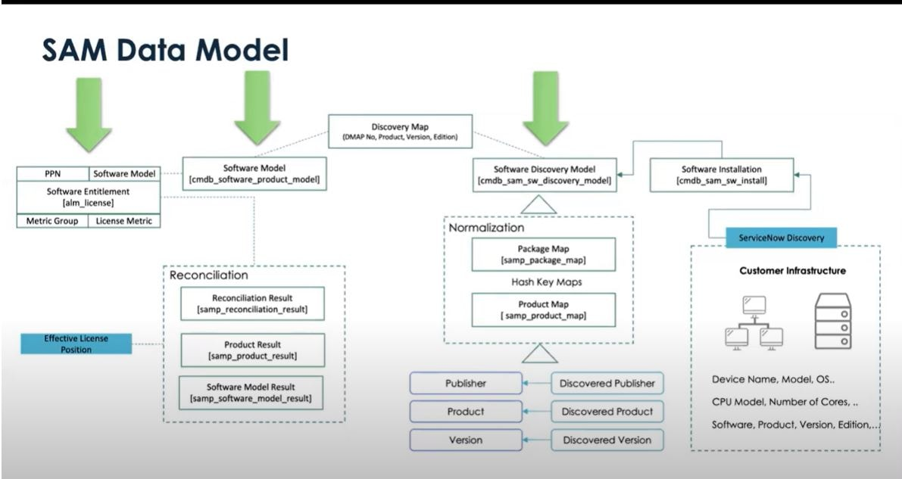
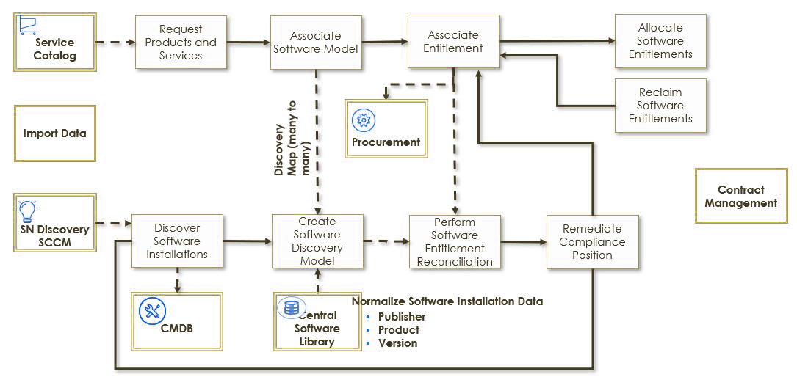

# Software Asset Management (SAM)

back to [Asset Management](./sn-asset.md)

## TODO

- [ ]

## Resources

### Courses

- [x] Software Asset Management (SAM) Professional Fundamentals
- [x] [Discovery Extras (Course)  Discovery and Software Asset Management](https://nowlearning.servicenow.com/lxp?id=learning_content_prev&course_id=675590131bf104d056c70fe0cd4bcb0f)
- [ ] Agent Client Collector Essentials

### Links

- [docs: Base System Roles](https://docs.servicenow.com/bundle/washingtondc-platform-administration/page/administer/roles/reference/r_BaseSystemRoles.html)
- [SAM Community](https://www.servicenow.com/community/sam/ct-p/it-asset-management)
- [Exam Blueprint](https://nowlearning.servicenow.com/lxp/en/certified-implementation-specialist-software-asset-management-mainline-exam?id=kb_article_view&sysparm_article=KB0011570)
- [community: Enable SAM Workspace on PDI](https://www.servicenow.com/community/sam-forum/how-to-enable-software-asset-workspace-in-pdi/m-p/2657928)
  - Developer Portal: activate all SAM plugins
  - All > System Definition > Plugins: install “Software Asset Management Playbooks and Guided Setups”
  - result: SAM Workspace
    - deficiency: no Content Library Updates

### Labs

- []

## Topics

### SAM Architecture

### SAM and CMDB

- ServiceNow SAM has a high dependency on the CMDB.
- SAM queries specific CMDB classes and attributes and relationships between CIs during reconciliation.
- SAM heavily relies on discovery tools (ServiceNow Discovery, ACC-V, or third party) to collect all the relevant data on installed software and usage.
- ITOM discovery activities can be carried out while collecting Contracts & Entitlements
- Reconciliation
  - Reconciliation is the process that calculates the compliance status of software products and vendors by comparing software usage with purchased rights.
  - If CI records or attributes are not detected in the expected CI class or attribute, they will be ignored during reconciliation, leading to an incorrect compliancy calculation result. SAM requires all CMDB classes and attributes that are in scope of SAM reconciliation to be out of the box.

### Discovery Extras (Course) Discovery and Software Asset Management

- both ServiceNow Discovery and Software Asset Management (SAM) Professional require separate licensing 

#### Extending Discovery for Software Asset Management

- required plugins
  - Software Asset Management PROFESSIONAL (com.snc.samp)
    - license required
    - optional demo data
    - optional publisher pack add-ons
    - optional supporting plugins
  - Discovery (com.snc.discovery)
    - license required - includes:
      - Cloud Management Core (com.snc.cloud.core)
      - ITOM Licensing (com.snc.itom.license)
- 25 additional tables for SAM, primary: - Software Discovery Model [cmdb_sam_sw_discovery_model] - Software Model [cmdb_software_product_model] - Software Installation [cmdb_sam_sw_install]
  
- Migrating Software Installation Data for SAM
  - pre SAM <> with SAM Pro
  - discovered software installations: [cmdb_ci_spkg] <> [cmdb_sam_sw_install]
  - run Migrate Software Installs script to copy pre-SAM records to the new table
    - Software Asset > Administration > Migrate Software Installs
  - related lists or customized reference fields added to CIs must be updated
- SAM Publisher Packs Supported by Discovery
  - Microsoft: Discovery can detect software products from Microsoft like MS SQL Server, Exchange, SharePoint, etc
    - especially relevant: Edition Information vor products like MS SQL Servers
  - Oracle: Discovery can detect software products from Oracle like Oracle Database, WebLogic, IAS, Oracle Clusterware, SUN OS, etc.
    - critical attributes like installed software name, version, edition, and installed location
    - can collect Information about the installed versus in-use options
    - “per processor” licensing metric: detect processor-level details like the number of CPUs and cores
  - VMWare: base system jobs to discover the vCenter and its topology
    - identify the license key assignments and its usage
  - Citrix:
    - supports concurrent licensing requirements collecting license usage information from Citrix License Server
    - detect all installed applications and their usage on a Citrix farm for XenApp
    - Citrix Netscaler - discover for inventory and application dependency use cases
- Discovery Patterns for SAM
  - patterns over probes
  - publisher packs require pattern based discovery
  - base system already provides patterns for:
    - SQL Server
    - Exchange
    - Oracle Database
  - custom patterns require a new record in the Software Installation Name Mapping [cmdb_sam_sw_name_mapping] table
    - paste its class name value into the record field
- High Level Discovery SAM Process
  - Discovery Source -> Software found
  - Create/Update Installation Record
    - Prod id
    - Install location
    - Install date
    - Revision
    - Instance key
    - Installed on
    - Uninstall string
    - ISO serial number
    - primary key is built (using Publisher, Display Name, and Version fields).
  - Find software Discovery Model
  - exists? if no: -> create new Discovery Model
  - Add reference in installation record
  - Normalization
- Discovery Models, Discovery Maps, and Software Models
  - Discovery Model: identify and normalize installed software
  - software discovery map is the predefined set of conditions that determine which software discovery models get mapped to which software models.
  - Software Model: connect purchased software rights with discovered software installations
- Troubleshooting
  - are you using probes? switch to the correct pattern
  - did you configure the required applicative credentials?
    - Oracle DB:
      - `ps ewww`
      - `bin/sqlplus -v`
      - Read access to context.xml, globalvariables.xml, tnsnames.ora
      - `netstat -tnp | grep -E tnslsnr`
    - SQL tables:
      - `select \* from product_component_version`
      - `select parameter from V\$option WHERE value='TRUE'`
      - `select value FROM GV$PARAMETER WHERE name LIKE`
      - `''%CONTROL_MANAGEMENT_PACK_ACCESS%';`

### Software Asset Management (SAM) Professional Fundamentals On Demand (Vancouver)

- stewardship of software assets from planning to sunset
- goals
  - Maintain compliance
  - optimize spend
  - support software audits
- process flow elements
  - Service Catalog
  - Procurement
  - Contract Management
  - Software Entitlements
  - Software Models: Classification of the acquired software
  - Content Data Service Library
  - Discovery Map: which software discovery models get mapped to which software models
  - additionally
    - Discovery/Imports
    - Software Installations
    - Discovery Models: identify and normalize software installed in an environment
- terminology
  - Software allocation: use rights assigned to a user / device
  - Software normalization
  - Software reconciliation: compare acquired software rights with software inventory to create a compliance position
  - Software remediation: options to resolve licensing issues fund via reconciliation
  - Software reclamation: identify and uninstall unused software
- Software Asset Lifecycle
  1. Plan
     - Goals and objectives of SAM
     - Governing policies
     - Controlled processes
     - Metrics
     - Software standards
     - Negotiated and approved contracts
  2. Request
     - identify required software
     - ensure that only approved software can be ordered
     - process for non-standard requests
  3. Approve
     - standard requests
     - non-standard requests
     - bulk requests (projects, …)
  4. Source
     - allocate available licenses
     - purchasing of new licenses
  5. Allocate
     - be aware of license metrics, e.g. per device, per user, …
  6. Manage:
     - ensure the organization is compliant and can quickly respond to a software audit
       - discovering software in the environment
       - normalizing installed software to standards
       - reconciling entitlements to discovered software
       - remediating detected variances
  7. Support
     - upgrading software:
       - does the license cover upgrades
       - should all instances be upgraded?
       - upgrade only upon request?
  8. Sunset
     - Policies and contracts drive this decision
     - Security: ensuring company information, especially data, is protected upon retirement

#### SAM Product Overview

- Name: ServiceNow® Software Asset Management (SAM) Professional
  - the ServiceNow SAM Foundation plugin does only offer manual normalization and reconciliation
- main features
  - Discovery and Normalization
  - Reconciliation
  - Licensing
  - Remediation
  - Optimization
  - Dashboards
- Plugins
  - general
    - for-fee plugins can only be activated after purchase
    - After a plugin is active, it cannot be disabled or deactivated. The functionality, however, may be hidden
  - SAM:
    - Activate all Software Asset Management Professional plugins including Software Asset Workspace\*
    - Software Asset Management Professional for Microsoft\*
    - Software Asset Management Professional for Oracle\*
    - Software Asset Management Professional for VMware\*
    - Software Asset Management Professional for IBM\*
    - Software Asset Management Professional for Citrix\*
    - Software Asset Management Professional for Adobe\*
    - Software Asset Management Professional for SAP\*
    - Service Graph Connector for Microsoft SCCM\*
    - Normalization Data Services Client
    - Normalization Data Services Configuration
    - Performance Analytics for Software Asset Management
  - supporting
    - Procurement
    - Cost Management
    - Contract Management
    - Data Certification
  - ServiceNow Store: SaaS integrations
    - com.sn_sam_spoke
    - som.sn_sam_saas
    - com.sn_sam_saas
    - com.sn_sam_saas_int
- SAM Professional Modules
  - Administration
    - custom products, custom part numbers
    - custom pattern normalization and reclamation rules
    - view SAM job results, refresh processor definitions & migrate SW installations
  - SaaS License: view SaaS and SSO usage data
    - SSO Applications
    - SSO Groups
    - SSO Users
  - Software Spend Detection: track, analyze, and optimize software spending
- SA Workspace
  - requires “Activate all Software Asset Management Professional plugins including Software Asset Workspace”
  - views:
    - Software asset overview
    - License usage
    - License operations
    - Software asset analytics
    - Success portal
    - Renewal calendar
    - Content lookup portal
- NOW Mobile app for SAM
  - My Items > My Assets > Software: view installed software and subscription software
    - last usage
    - installed on which devices
    - tap any asset to view details: business cost, last activity, …
  - tap “I don't need this anymore” to generate a removal candidate
- Personas and Roles
  - personas:
    - SAM Process Owner
    - SAM Manager
    - SAM Administrator
    - ServiceNow Administrator
  - roles:
    - sam_admin - contains:
      - sam_user
      - sam_spend_import
      - asset (allows to create, edit, manage, and delete (SW) assets)
      - model_manager (create, modify, and delete base model [cmdb_model] records)
      - contract_manager (create, edit, and delete contracts through the Contract Management application)
    - sam_user - contains:
      - pa_viewer (Performance Analytics Viewer)
      - cmdb_read
      - report_user (Create and view reports that have been shared with them)
      - sn_remote_dir_sync.reader
    - sam_developer - contains:
      - sam_admin
      - trained ServiceNow administrator
    - sam_integrator - contains:
      - sam_user
      - connection_admin (create and save Connections)
      - flow_operator
    - sam_spend_import - contains:
      - pa_viewer

#### SAM Requirements and Recommended Practices

- Capability Blueprint of ISO 19770-1 SAM process standard
  - Tier 4 - **Strategic Conformance**: Achieve best in-class
  - Tier 3 - **Operational Integration**: Improve the efficiency and effectiveness through integration with other areas, such as request, procurement and ITSM
  - Tier 2 - **Practical Management**: Improve management controls and drive immediate benefits
  - Tier 1 - **Trustworthy Data**: Know what you have so you can manage your assets
- Software Audits
  - purpose: determine compliance with signed vendor agreements/contracts
  - SNow provides controls to help self-audits
  - failure to understand contractual agreements, entitlements and allocations in place can lead to costly legal followup

#### Trustworthy Data

- common terms
  - Discovery pattern: discover software installations
    - pre-configured patterns for SQL Server, Exchange, and Oracle Database
  - Software installation: discovered installations written to [cmdb_sam_sw_install]
  - Software discovery model: automatically created during discovery / import to identify and normalize installed software
    - different to Software model
  - Software discovery map: predefined conditions to map software discovery models to software models
  - Pattern normalization rule: used to normalize specific software products based on a pattern
  - Normalization status: level of normalization based on publisher, product and version
  - Manual normalization: manually update software discovery model data
  - Normalization suggestion: auto-provided on detecting a variance between standard- and manual normalized discovery models
  - Machine learning normalization: used on raw discovery data
- data tracking
  - important to track to inform the Strategy:
    - Entitlements (license metrics, purchase rights, active rights, allocations available)
    - Allocations (user, device)
    - Software model (publisher, product, suite information, entitlements, end of life)
    - Foundation Data (users, departments, cost centers, locations, vendors)
- Import Software Entitlements
  - definition: Software entitlements provide software license details that define user rights. They play a part in determining your compliance position
  - benefits:
    - warning when license allotment is exceeded
    - information when licenses are over-provisioned
  - goals:
    - before: streamline gathering entitlement data by providing a spreadsheet template
    - during: systematic, automated method for bulk-import
    - after: efficiently remediate errors
  - table [samp_bulk_import] , roles sam_user or sam_admin.
  - Entitlement Import Template
    - Microsoft Excel template
    - validation during import: identification of errors and duplicates
    - entitlement import errors are tracked for resolution
    - Software Asset Workspace > Software asset overview > Create entitlement > Import multiple entitlements from an Excel file > Next > Download template
    - mandatory data: either “Publisher Part Number” or the four fields publisher, product, version, and edition to identify the software model
  - resolve import errors: Software Asset Workspace > License operations > Entitlement import errors
  - System Import Sets
    - formats: CSV, Excel, XML, JSON
    - sources: JDBC, LDAP
    - Transform Maps
      - use tools Auto map matching field and Mapping Assist
      - use multiple transform maps for a single data source
      - multiple import sets in a defined order
      - use transform map scripts for advanced logic
        - explicit: define explicit mapping relationships
        - event: modify processing events at different transformation stages
      - coalesce: identify one or more fields in the import map as unique identifiers
    - System Import Sets > Load Data > complete form and select file > Create Transform Map > Auto Map Matching Fields (related links) > set Coalesce values > Transform (Related links)
  - Software Discovery
    - accurate, up-to-date, single system of record
    - probes, sensors, and patterns in four phases to provide a scheduled classification
    - tools
      - SNow Discovery for data center SW
      - Microsoft SCCM for desktop SW
    - in SAM context:
      - provides access to discovery models, normalization suggestions, software usage & subscriptions
      - discovery models are tied to software models via discovery maps
      - creates custom tables:
        - Software Discovery Model [cmdb_sam_sw_discovery_model] - Installations
          - auto-created during discovery
        - Software Model [cmdb_software_product_model] - purchased rights to use
        - Software Installation [cmdb_sam_sw_install]
          - primary key based on Publisher, Display Name and Version fields
          - additional information: Prod ID, Installation location, Install date, Revision, Instance key, Installed on, Uninstall string, ISO serial number
- Software Normalization
  - delivers a definitive inventory of discovered publishers, products and versions
  - matches against a central library of recognized SW
  - adds normalized publishers, products and versions to the discovery model to reconcile with SW model entitlements
  - do not try to make normalization prefect, it is an intermediate reconciliation goal
  - two challenges for Discovery
    - Software nomenclatures that are unidentifiable or differ based on discovery method
    - correct processor names and core counts to calculate required SW licenses
  - Discovery model normalization status
    - Normalized: fully normalized based on publisher, product, and version, may also populate additional fields such as Edition
    - Partially Normalized: discovered publisher and discovered product, remaining attributes require manual input
    - Match Not Found: custom software often has this status
    - Manually Normalized
    - New: created, but nor yet run trough normalization
  - Normalization Automation
    - Create a Software Normalization: Business Rule running before insert/update and normalizing discovery models using exact match rules
      - samp_package_map, samp_product_map, cds_client_name
      - no pattern based rules
    - Discovery Model Normalization: Scheduled job running daily (sysauto_script)
      - process all discovery models != (manually) normalized
      - first tries exact match rules
      - than pattern based rules
    - normalization library content of SNow hosted instances is updated weekly, self-hosted instances might require data import
      - check “Last Updated On” for samp\_\* tables
      - updated samp_sw_package table should have 800k+ records
  - normalization suggestions: created when normalized values and manually normalized values differ
    - [samp_normalization_suggestions]
    - suggestion accepted:
      - publisher, product, version, edition, platform, and language are updated
      - manually normalized -> normalized
      - normalization suggestion status -> Accepted
      - normalization date updated
    - suggestion rejected: status -> Rejected
      - rejected package / rule will not be suggested again
- Content Data Services
  - opt-in, crowdsourced shared service that provides continual software recognition improvement
    - optionally use exclude from content service check box on the discovery model to exclude homegrown software
    - opt-in: Software Asset > Administration > Content Service Setup
    - detailed opt-in options: Software Discovery Models, Software Product Lifecycles, Part Numbers and Discovery Maps, Processor Names, Software Spend Transactions, Unrecognized Subscription Identifier
  - opt-out does not impact general incremental normalization service updates
  - scheduled jobs:
    - SAM - Apply latest content changes: Software Publishers (samp_sw_publisher), Software Products (samp_sw_product), Discovery maps (samp_sw_entitlement_definition), and Software Product Definitions (samp_sw_product_definition)
    - SAM - Create lifecycles and suites for a software model
  - use Allow automated content updates flag on the Software Model form to suppress / allow automated updates

#### Software License Management

- track, control, and reduce software costs, including non-compliance findings
  - compliance with EULAs
- encompasses the people, processes, and technology to monitor and control software licenses and how those licenses are used
- key benefits
  - no time and resources required for audits - compliance position is already known
  - maintain compliance to avoid additional costs
  - maintain compliance to avoid loss of reputation
- common terms:
  - Software Product: used in combination with publisher for discovery model normalization
  - Software Model: organize licenses, associated to defined product and software model category
  - Model Category: associate CI Class with Asset Class - automated and read-only
  - Software Suite: group of related SW products offered as one unit. Parent master model with one or more suite children.
  - Publisher Pack: publisher specific licensing metrics, results display after activation in a software publisher compliance dashboard
  - Software License Metric: set in software entitlements, used for software license reconciliation
  - CAL - Client Access License: software license measured by number of users or devices that can access a product
  - Software License Key
  - License Position Report: software compliance details for each software model in a single list
- [samp_sw_product]: pay-for-license SW products, updated from ServiceNow Content Library
- [samp_custom_sw_product]: custom software products
  - All > Software Asset > Administration > Custom Products
- Software Suits
  - discovery maps identify whether a suite is defined for a product
  - any software model can be a suit parent or child, and can be child of multiple models
  - inference percent: what percentage of a suite must be installed to be recognized as a suite
    - only used if the suite parent does not exit on the device
- SW License Metrics
  - can be defined for users, devices, processors, and cores
    - named device / named user: tied to a specific device / user
  - based on the metric group
    - common or tied to a software publisher
  - Concurrent licenses enable multiple users to share access to software applications from any computer on a network
  - publisher packs:
    - Performance Analytics > Dashboards > Search > Software Publisher Analytics
    - Adobe (com.sn_samp_adobe): per device / user / user subscription
    - Citrix (com.sn_samp_citrix): concurrent user / user / device / processor / user/device
    - IBM (com.sn_samp_ibm): device / named user / processor / user processor value unit / resource value unit / socket-pair (Red Hat)
    - Microsoft (com.sn.samp.microsoft): device CAL / core / core with CAL / device / processor / user / server (instance) / server (server) / user CAL / user subscription / software assurance
    - Oracle (com.sn.samp.oracle): named user plus / processor
      - Oracle Metric Group DB Options - makes unavailable: Remove Unallocated Installs & Remove Unlicensed Installs
    - SAP (com.sn_samp_sap): named user types / engines
    - VMWare (com.sn_samp_vmware): application instance / device / named user / OSI / processor
  - Custom License Metrics
    - roles:
      - create & update: sam_developer
      - read: sam_admin
    - allocation type: only user or device
    - calculation script field: calculate method
- Software Entitlement
  - match installation and usage data to determine compliance and control costs
  - define license details, track licenses allocated to user or systems and are associated with SW models
  - stored in [alm_license]
  - entitlement attributes: display name, asset tag, SW model, license type, license duration, license metric, agreement type, # purchased rights, # active rights, # available allocations
  - Publisher part number (PPN): facilitate entitlement creation by identifying whether SW already exists
- Software Allocation
  - do
    - grant one or many right(s)
    - identified on the entitlement record
    - assigned to a user or device
  - allocated through
    - the software request process (service catalog)
    - the software remediation process (based on reconciliation)
    - updated directly on the entitlement record
- Software Reconciliation
  - automated process calculating compliance based on:
    - how many rights are used
    - number of active rights purchased
  - keeps licensing position accurate
  - Discovery maps: predefined set of conditions determining which SW discovery model gets mapped to which software model
    - purchased rights are only applied when SW discovery model meet discovery map conditions
    - are provided in ServiceNow or conditions can be specified in the SW model
  - scheduled job (weekly)
  - can be grouped by country, region, company, cost center or department
  - for Oracle DB on VMWare: chose reconciliation from ESX level or Vcenter Cluster level
  - roles:
    - sam_admin: run on-demand reconciliation
    - sam_user: view reconciliation results
  - reconciliation results
    - four tiers:
      - SW publisher: results for all associated products and installations
      - SW product: results for all associated models and installations
      - SW model: results for all related license metrics
      - License metric: results for all associated license metrics
    - costs will only calculate for publishers, products, and models, if related entitlements have a cost identified
    - license metric right allocations:
      - allocated in use
      - not allocated in use
      - allocated not in use
      - not allocated
      - allocations needed
    - product result might show Not Compliant, but the SW model result shows as Compliant: stems from installations associated with a product that did not map to software models
  - Publisher Overview
    - Software Asset Workspace > License usage
    - simplified reconciliation overview by publisher
    - option to drill down into
      - Software products related to a publisher
      - Software models related to a product
        - License Metric Results
        - Removal Candidates
        - Entitlements
        - Remediation Options
      - License metrics related to a software model

#### Operational Integration

- gain process efficiencies, improved visibility, and significant time and cost savings
- focus:
  - Integration with contract management: tracking of SW license contracts & their relationship to SW entitlements
  - Integration with change management: projection of changes in licensing to support request for change
  - Integration with service catalog management, product management, and vendor management: publishing and requesting SW
  - Integration with purchasing/procurement: SW sourcing
  - all: remediation of software non-compliance
- common terms
  - Software license contract: binding agreement identifying license metrics, usage and maintenance
  - License change projection: insight into potential cost implications of changes to processing resources (CPU & CPU Core)
  - Service catalog: self-service for products and services
  - Software catalog: software products available via Service Catalog
  - Product catalog: set of information about software models
  - Vendor catalog: list of products and associated costs available from vendors
  - Software request: grouping of one or more items that have workflow associated with them to facilitate the requesting, approving, allocating, purchasing, ordering, and receiving of software
  - Remediation options: remediating license rights issues
- Software License Contract
  - software licenses, software license bundles, subscriptions and software maintenance
  - capture contracts and associate them with assets to easily access: contract numbers, contract start and end dates, terms and conditions, renewal information, financial terms, and related documentation
  - adjustments
    - Renewal: prolong end date
      - contract information & history is retained
      - condition: State=Active||Retired, Substate=None||Rejected
    - Extension: prolong end date
      - all other contract dates are recalculated
      - condition: State=Active||Retired, Substate=None||Rejected
    - Cancellation
      - condition: state=Active
      - state -> Canceled
      - .Condition checkers -> inactive
      - Renew/Extend -> inactive
      - .Contract rate -> inactive
- Software Spend Detection
  - SNow application to track, analyze, and optimize IT software spending from imported financial data
    - consolidate software products with similar functionality
    - view all software purchased in each department
    - manage unmanaged software by creating software models and entitlements with Software Asset Management
  - how?
    - import financial data
    - Predictive Intelligence labels transactions as software and matches to a publisher
    - Discover shadow software purchases, inefficient spend outside enterprise agreements, and overlapping or redundant functionality to gain control of unmanaged software
  - Dashboards
    - Software Spend
      - All > Software Spend Detection > Overview
      - categories: Total Publishers, Unmanaged Publishers, Total Products, Unmanaged Products, Total Detected Spend, Unmanaged Spend, Accounts Payable Spend, Expense Spend
    - Overlapping Software
      - All > Software Spend Detection > Overlapping Software
  - Implementing
    1. Request the Software Asset Management - Spend Detection (com.sn_sam_spend) plugin through the HI Service Portal (role: admin)
    2. Opt in to Content Service for Software Spend Transactions (role: sam_admin)
    3. Import financial transaction data into Software Spend Detection by navigating to Software Spend Detection > Administration > Import Transactions (role: sam_spend_import or sam_admin)
    4. Manually update imported software transactions that weren't automatically labeled with a software product and publisher to track all software spending (role: sam_user)
    5. Analyze data via Software Spend Detection Overview and Overlapping Software dashboards
    - installs three tables:
      - Software Spend Transactions [sam_spend_transaction] Financial transaction data
      - Software Spend Transactions Import [sam_spend_transaction_import] Import summary table showing number of rows imported and any import errors
      - Software Spend Transactions Import [imp_sam_spend_transaction] Staging table for financial transaction data imports
  - Prescribe True-up Cost
    - specify license cost (+ maintenance cost) in the software model to enable accurate true-up cost calculation
      - if not specified, an average software entitlement cost will be used
    - if license metric is used, an override license cost record is created
  - Microsoft Software Assurance (SA) licenses
    - Microsoft maintenance program
    - you can also upgrade, or step-up, a standard version of your software to an enterprise edition
    - Related Entitlements tab of the Software Entitlement form to link related versions of your software under active maintenance and upgrades
  - Microsoft Office 365 Reserved Licenses
    - You can only create a reserve entitlement from an existing Microsoft Office 365 entitlement. The existing entitlement must meet the following criteria:
      - License type – Subscription
      - Metric group – Microsoft
      - License Metric – User Subscription
      - Publisher – Microsoft for the product on the software model
      - Subscription software – selected for the product on the software model
- License Change Projection
  - integrating ServiceNow Change Management with SAM for insight into cost implications of changes like CPU & CPU Core
  - when a change request uses Propose Change or Mass Update CI involving CPU or CPU Cores, a new section “License change projection” in the change request form displays projected licensing costs
  - further details can be found in the related list “License Change Projections” for every involved CI:
    - number of impacted installations
    - current spend
    - projected spend
    - expected spend change
  - projection calculation is triggered when a change transitions from New > Assess (Normal) or from New > Authorize (Emergency)
  - requires plugin com.sn_samp_change
    - plugin populates the tables [samp_software_change_projection] and [samp_ci_projection_summary]
- Software Request and Sourcing
  - Catalogs: source from existing available rights or create a purchase order to source from a vendor
    - types:
      - Service catalog: self-service for products and services
      - Product catalog: set of information about software models
      - Vendor catalog: vendor offerings linked to models in the Product Catalog
    - models as connection point between software assets, catalog items, and vendor catalog items
      - software models get published to the Service Catalog to be available for end user
      - vendor catalog items are created on the software model to make the items available for procurement
    - working with catalogs:
      - a software catalog is part of a service catalog.
      - a product catalog item can be linked to multiple service catalogs and vendor catalog items or to a single model.
      - a model can only have one product catalog item.
      - a vendor catalog item can only have a single product catalog item.
  - Request Structure
    - requested items
    - approvals
    - purchase orders (requires Procurement)
    - allocations
    - catalog tasks
  - Virtual Agent Software Requests
    - enable automatic allocation with “Procurement Process Flow - Auto allocation enabled”
    - capabilities: end-to-end self-service and automation
      - end user requests software via the virtual agent
      - VA presents available software and assists the user in selecting SW and device
      - VA seeks request approval and automatically allocates the license to the user
      - VA triggers client software distribution (CSD) for auto-install
  - Source a request
    - add allocation: if rights are available
      - select entitlement
      - license Metric, Available Allocations, and Type will automatically populate based on entitlement (read-only)
      - rights can be updated to identify number of rights to be allocated
      - select device or user as Assigned / Allocated
    - add purchase order: will create purchase order if capability is available
      - select vendor
      - Metric Group and License Metric need to be selected
      - quantity can be updated
      - Destination Stockroom: chose dummy stock room like Corporate or Licenses for SW
    - Procurement workflow: make a decision to source internally (allocation of available rights) or externally (purchase)
  - Purchase Orders: record with the details and the line items ordered
    - specify assets to order from a single vendor
    - use to track procurement
    - can trigger purchase order in an external purchasing system
    - receive:
      - update the asset tag, serial number, and license keys from the receiving popup
      - mandatory field: asset tag
      - entitlement will be automatically created with the number of active rights identified as received
  - Software Remediation: establish an accurate compliance position
    - goals: maintain compliance, optimize spend, and support software audits
    - achieved by:
      - reconciling what is owned to what is allocated for use
      - remediating issues
    - Remediation Options
      - Software Asset Management Workspace > License usage > Publisher Detail
      - 4 options:
        - Purchase Rights
        - Create Allocations
        - Remove Allocations
        - Remove Unlicensed Installs
    - Employee off-boarding
      - a workflow that lets you request, assess, and remove assets
      - create an off-boarding catalog request, which initiates a prescriptive workflow to efficiently retrieve assets and restock them in the inventory, reassign them, send them for repair, or dispose as required

#### Strategic Conformance

- manage change within the SW environment to achieve and support business outcomes
- focus:
  - what is installed, how is it used and is it conform?
  - managing upgrading, downgrading & retirement of SW
  - reclaiming unused / unlicensed SW
  - retiring SW models and associated entitlements and entitlement allocations
- common terms:
  - Software lifecycle management: tracking, monitoring, and controlling of software shelf life
  - Downgrade rights: SW entitlement rights to use previous or future versions of a software product
  - Software usage record: Tracks the sum of software usage on a monthly basis.
  - Software reclamation rule: aggregate usage records and identify unused SW
  - Restricted software: SW not allowed in an environment
  - Software removal candidate: reclaim SW
  - Software subscription: rights to use SW for a specified time
  - Software retirement: elimination of a SW in an environment
- Software Product Lifecycle
  - Phases
    - Pre-release
      - Internal: SW has been purchased, plan for release is ongoing. May include pilot phase
      - Publisher: SW release has been announced
    - General Availability
      - Internal: track general availability release date
      - Publisher: tracks release date
    - Upgrade - only Internal: tracks date of upgrade availability
    - End-of-Life
      - Internal: date SW will no longer be available to request
      - Publisher: date indicated, that SW will no longer be marketed, sold or improved
    - End-of-Support
      - Internal: date from which SW will only have internal support
      - Publisher: date indicated, from which only security and reliability fixes will be released
    - End-of-Extended-Support
      - Internal: date from which not even internal support is available
      - Publisher: date indicated, from which not even security and reliability fixes will be provided
  - as part of the Software Asset Management Content Library, publisher general availability and end-of-life dates are provided via SW models
    - scheduled job “SAM - Create lifecycles” will generate new lifecycles for newly released content
  - Down- and Upgrade Rights
    - not part of the LC, but key to remain operationally aligned to the LC
    - must be allowed in the license
    - downgrading more common than upgrading
    - rights can be associated with a specific entitlement or with a SW model -> with all entitlements of that SW model
    - SAM Content Service generates downgrade rights
      - downgrade rights correspond to a discovery map
      - weekly job “Download software content: Downgrade Rights” gets rights from the Content Service and writes them into the Downgrade Rights [samp_dmap_downgrade_model] table
      - another scheduled job, “SAM - Create downgrades/upgrades for a software entitlement” propagates the information of that table onto the existing SW models and their entitlements, excluding Generic entitlements
      - if no SW model corresponds to a discovery map when populating [samp_sw_downgrade_model], a new SW model is created
      - if a discovery map corresponding to a SW model has downgrade rights, the Downgrade Rights related list is populated
      - downgrade rights written to [samp_sw_downgrade_model] and [samp_downgrade_model] can not be deleted
        - but can be deactivated
        - if the corresponding SW model is deleted, the downgrade rights will also be deleted from the tables
        - creation of duplicates is not allowed
  - Agent Client Collector and Software Asset Management
    - collect endpoint software inventory and usage data
    - required for endpoints only supporting outgoing connections, e.g. Laptops, isolated networks
    - no credentials, IP ranges or discovery schedules required
    - agent can be deployed via a deployment image or retroactively downloaded and installed (ServiceNow Store)
    - course: Agent Client Collector Essentials
- Software Installation Optimization
  - what license rights are installed, who’s using them, and reclaiming unused or unauthorized software
  - considerations
    - Software Usage: who’s using a software, when it was last used, how many times it has been accessed, and the total time (in seconds) that it has been used
      - monthly aggregated
      - automated import via “Service Graph connector for Microsoft SCCM Integration” store application
        - CI, user, product, and publisher values are used to identify a matching software installation
    - Software Subscriptions: who’s using a subscription software and the last time there was activity
    - Removal Candidates: list of software installs planned to be uninstalled from the environment
      - combination of remediation options, reclamation rules, and manual creation
      - possible states:
        - Attention Required: user field is empty and Notify user is selected
        - Ready
        - Awaiting User: Notify user is selected, user confirmation / rejection outstanding
        - Awaiting Approval: Notify user is selected, user rejection - user manager needs to approve / deny
        - Awaiting Revocation: waiting for weekly job “Updating Existing Reclamation Candidates” to run to remove software
        - Closed Complete: SW rights have been reclaimed
          - selecting Close Complete manually triggers reclaim without waiting for the scheduled job
        - Closed Skipped
    - Restricted Software Installations: list of software unauthorized to be used within the organization
      - danger of contractual non-compliance, security violations, and viruses
  - Software reclamation rules: aggregate usage data and define the length of time software must be unused to become a reclamation candidate
    - both for installed and subscription SW
    - based on total usage time or last date used
    - user notification can be triggered, by non-reaction automatic reclamation occurs
    - should be aligned with reclamation policy and processes
  - ServiceNow Client Software Distribution (CSD): remove/reclaim software
    - using SCCM, a scheduled job revokes un-entitled software and reclaims license rights
    - only the revocation/reclamation capability is entitled as part of SAM
    - full use requires “Orchestration - Client Software Distribution plugin (com.snc.orchestration.client_sf_distribution)”
- Software Retirement (End-of-Life)
  - Software Lifecycle Report: visibility into EOL and end-of-support SW
    - product lifecycle information is associated to a software publisher and product, not the DMAP
    - Software Assets Analytics dashboard
      - drill down into End of Life Products and view installs
    - Reports > View/Run
    - based on weekly job “SAM - Get install count for software model”
    - required roles: sam_user or model_manager
    - prioritizes user-entered LC information over Content Service information
  - once EOL planning is done, expire the identified active SW entitlements first to ensure additional license rights can not be allocated
  - SW entitlement record = Retired -> Active rights and Allocations available -> 0

#### Reporting and Analytics

- preconfigured dashboards and indicators: Performance Analytics Premium for Software Asset Management plugin (com.snc.pa.premium.sam) (included in SAM Professional)
- common terms:
  - Reporting: detail and / or summary data for a specific point in time
  - Performance Analytics: tacking, aggregating and visualizing of KPIs over time
  - Dashboards: displaying of reports and widgets in a single view
  - Widget: dashboard element displaying information and linking to further details
  - Scorecard: display data for a single indicator, with the ability to break the indicator down by different dimensions and changes over time
  - Overview Dashboard: SW asset true-up costs as well as license, compliance and removal summary trend charts
  - Publisher Dashboard: compliance analysis results by publisher
  - Subscription Dashboard: compliance analysis results for M365 and Adobe Cloud License Mgmt
  - Reporting vs Analytics
    - Report: data summary for a point in time
    - Analytics: series of measurements collected over time to provide historical trends and potential future projections
  - Performance Analytics: complement and expand operational reporting
    - Operational Reporting: real-time status updates as well as a summary of past information
      - e.g.: How many software licenses did each department have at this time last year?
    - Performance Analytics: trending information for processes to trigger action for performance degradation
      - e.g.: What is my weekly trend of software models out of compliance for the last month?
- ServiceNow Performance Analytics
  - visualize data collected and aggregated over time
  - reveal trends to make real-time adjustments and improve how business functions
  - align resources, systems and employees to strategic objectives and priorities
  - SAM examples:
    - identify that particular SW is being used less often -> investigate potential over-license
    - identify that particular SW is being used much more often -> renegotiate contracts to adapt pricing to anticipated demand
- Dashboards
  - Software Analytics Dashboard:
    - Performance Analytics > Dashboards > Software Asset Analytics
    - Overview
    - License Summary
    - Compliance Summary
    - Removal Summary
  - Software Asset Management Publisher Dashboard:
    - Performance Analytics > Dashboards > Software Publisher Analytics
    - Microsoft, Oracle, IBM, VMware, Citrix & SAP
  - Software Asset Management Subscription Dashboard
    - Software Asset > SaaS Overview
    - view subscription information by Subscription Software Models or Subscription Publisher
  - Engineering License Manager
    - Performance Analytics > Dashboards > Engineering License Overview
    - engineering applications: broad term used for SW used in - for example - aerospace, oil and gas, and construction
    - integrating third-party tool OpenLM:
      - collect data from license management servers (LMS)
      - data: license usage, denials, user activity, and alerts
      - to
        - Monitor concurrent license consumption for more accurate forecasting
        - Track and reduce software spend by optimizing license usage
        - Avoid employee productivity losses by monitoring license denials
        - Provide support for audits and contract renewals
    - Required Plugin: Software Asset Management Professional for Engineering Applications (com.sn_samp_eng_app)
  - Renewals calendar
    - Software Asset Workspace > Renewal calendar
    - upcoming and expired renewals for:
      - Contracts with contract model types such as Subscription, Software License, and Maintenance
      - Entitlements with license types such as Perpetual and Subscription
  - Software asset success portal and Value builder
    - Software Asset Workspace > Success Portal
    - identify success goals and assign activities to track the success of your goals
    - views:
      - Open success goals by status
      - Completed success goals
      - Projected success savings by status
      - Projected success savings by category
      - Past and upcoming success goals
      - Completed success savings by category
    - value builder tasks: integrations, playbooks and other features
  - Integrations
    - Azure Active Directory
      - view software usage for all connected SSO applications
      - integrating:
        1. Create an app in the Microsoft Azure portal to integrate with the Now Platform.
        2. Create an Azure AD integration profile in your ServiceNow instance.
        3. Connect with the SSO app to view all users and groups in the app. Track user login data and reclaim unused licenses.
    - Okta SSO App Usage
      - download applications, users, and user groups
      - integrating:
        - Okta role: admin
        1. From a web browser, open the Okta Developer Console.
        2. Sign in to your Okta account.
        3. Create an Okta application with OAuth 2.0 functionality.
    - Bring Your Own License (BYOL) to Public Cloud
      - determine the compliance of Microsoft products across hybrid infrastructures
      - AWS and Azure
      - Microsoft SQL Server and Microsoft Windows Server
      - Cloud Special Rights such as dual use rights, edition flexibility, and unlimited virtualization
      - remediation when software is out of compliance
