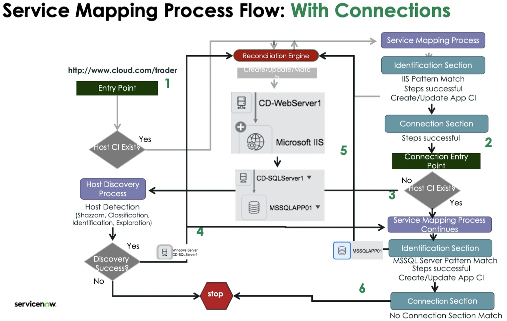

# SNow CIS Service Mapping

Back to [SNow ITOM](./sn-itom.md)

## Resources

### Requirements CIS Voucher

- [x] Service Mapping Fundamentals
- [ ] [Service Mapping Advanced](https://nowlearning.servicenow.com/lxp/en/it-operations-management/service-mapping-advanced?id=learning_course_prev&course_id=72774609c3b77d905922751ce00131d2)
  - [eBook](https://servicenow.read.inkling.com/a/b/19c4613ca7d841ee9b3cc5f1bd05302d/p/18356415fd69484b9dd3100dfd444379)
- [ ] [Service Mapping Advanced Simulator](https://nowlearning.servicenow.com/lxp/en/it-operations-management/service-mapping-advanced-simulator-washington?id=learning_course_prev&course_id=e3db6a8487760a1024e0bb39dabb35b7)
  - testing knowledge from SM Fundamentals and Advanced courses
- Recommended:
  - [ ] [Service Mapping Extras](https://nowlearning.servicenow.com/lxp/en/it-operations-management/service-mapping-extras?id=learning_course_prev&course_id=293e0527477d19505cbdaf44846d4383)
    - additional material on ML Power Mapping
    - additional material on integrating Service Mapping with Event Management
    - more stuff
  - [x] [Discovery Fundamentals](./sn-cis-discovery.md#discovery-fundamentals)
  - [ ] [Event Management Fundamentals](https://nowlearning.servicenow.com/lxp/en/it-operations-management/event-management-fundamentals?id=learning_course_prev&course_id=4f84d9c7c323315043395230a0013108)

### Links

- [Docs](https://docs.servicenow.com/)
- [Developer](http://developer.servicenow.com/)
- [CSC (Customer Success Center)](https://www.servicenow.com/success.html)
- [Community](https://www.servicenow.com/community/)
- [YouTube](https://www.youtube.com/user/servicenowinc)
- [Center of Excellence and Innovation (CoEI)](https://www.servicenow.com/success/playbook/center-excellence-innovation-coei.html)
- Additional Resources
  - [Mainline Exam Blueprint: Certified Implementation Specialist - Service Mapping (CIS-SM)](https://nowlearning.servicenow.com/lxp/en/credentials/certified-implementation-specialist-service-mapping-mainline?id=kb_article_view&sysparm_article=KB0011558)
  - [eBook: Service Mapping Advanced](https://servicenow.read.inkling.com/a/b/19c4613ca7d841ee9b3cc5f1bd05302d/p/18356415fd69484b9dd3100dfd444379)

### Labs

#### Labs: Service Mapping Advanced

#### Labs: Service Mapping Fundamentals

##### L1: Navigate Service Mapping

- [lab pdf](https://nowlearning.servicenow.com/sys_attachment.do?sys_id=db96f12b87828e54af9f213acebb3546)
- Service Mapping and Discovery Applications
  - All > Service Mapping > Home
    - Start point for Service Mapping Discovery
    - Access Service Mapping workflow tasks
    - Progress statistics: services with errors, waiting for approval, completed
    - -> Additional Options link (below statistics, left)
    - -> Readiness Checklist (cogwheel, top right)
  - All > Service Mapping > Administration > Discovery Dashboard
  - All > Pattern Designer > Discovery Patterns
    - Pattern is responsible for identifying a specific CI Type
  - All > Service Mapping > Administration > Credentials
  - All > Service Mapping > Administration > MID Servers
  - All > Discovery > Discovery Schedules
    - Quick Discovery
  - All > Service Mapping > Administration > Discovery Schedules

##### L2.1: MID Server Validation

- [lab pdf](https://nowlearning.servicenow.com/sys_attachment.do?sys_id=7f5f8cc9878642d052417445dabb3536)
- collect information
  - **ServiceNow Instance URL:**
    - `https://nowlearning-nlinst02158679-001.lab.service-now.com/`
  - **ServiceNow Instance Username/Password:**
    - `lab.midserver`
    - `?`
  - **Windows Server Public IP and FQDN (for RDP):**
    - `nowlearning-nlinst02158679-mid-001.lab.service-now.com`
  - **Windows Server Private IP**
    - `198.51.159.51`
  - **Windows Server Administrative Username/Password:**
    - `administrator`
    - `2MwFCKnxc6Qw`
- validate MID Server

##### L2.2: Run Horizontal Discovery

- [lab pdf](https://nowlearning.servicenow.com/sys_attachment.do?sys_id=5920100187c642d052417445dabb3593)
- Quick Discovery
  - All > Discovery > Discovery Schedules
  - _Quick Discovery_ button
    - Target IP
    - MID Server
  - check results via _Discovery Status_ record
- Discovery Status Details
  - All > Discovery > Discovery Status
  - _Discovery Status_ record
    - _Discovery Log_ related list
    - _Devices_ related list
      - Discovered CIs with links to CI records
    - _ECC Queue_ related list
    - _Show Discovery timeline_ related link
      - select probes and sensors to see individual runtimes
- Create Credentials
  - All > Discovery > Credentials
  - create Windows Credentials matching `Windows Server Administrative Username/Password`

##### L3: Map an Individual Service

- [lab pdf](https://nowlearning.servicenow.com/sys_attachment.do?sys_id=ff10a46f87020e54af9f213acebb3545)
- Create Credential
- Configure Service Mapping to Discover the EMEA Dispatch Scanning Service
- View the Service Mapping Discovery Log
- View the Results

##### L5.1: Delimited Text Parsing Strategy

- [lab pdf](https://nowlearning.servicenow.com/sys_attachment.do?sys_id=908a11d2874a8e1452417445dabb3505)
- Review Apache Configuration File
  - All > Service Mapping > Application Services > [EMEA Dispatch Scanning Service] > View Map
  - select [Apache] > Properties > Application
    - notice: no field _App Release Version_
- Add New Field Attribute to the Apache Web Server Class
  - All > Configuration > CI Class Manager
  - Hierarchy > Apache Web Server > Attributes > Tab _Added_
  - Insert a new row...
    - Column label: App Release Version
    - Column name: u_app_release_version
    - Type: string
    - Max length: 40
    - Save
- Modify an Existing Discovery Pattern
  - All > Pattern Designer > Discovery Patterns
  - select _Apache On Windows_ pattern
  - Extension Section
    - New
      - Name: Apache On Windows Extension
      - Done
    - select _Apache On Windows Extension_
      - rename first step: _Collect App Release Version_
      - activate Debug Mode:
        - Select MID Server: Automatic MID Server selection
        - Debug Type: Top down
        - Select Entry Point Type: HTTP(S) Endpoint
        - URL: `http://198.51.147.201`
        - Connect, wait to finish
      - configure _Collect App Release Version_
        - Operation: Parse File
        - Browse & Select File: `$install_directory+"/conf/apache.cfg.txt"`
        - Retrieve File Content
        - Includes Lines: `AppReleaseVersion`
        - Add Variable
          - Name: `u_app_release_version` (double click _Name_ and replace)
        - Delimiter: (space)
        - Positions: `2`
        - verify with _Test_ button
        - _Add step comments_: "Collect and store App Release for deployed Apache Server."
      - _Save_
  - verify via Discovery Run, Service Map Attributes & Discovery Log
- Navigate Easily to a Discovery Pattern
  - from _Discovery Log_:
    - select Extension section _Apache On Windows Extension_
    - select _Debug_ (top, next to _Incoming Connections_ Dropdown)

##### L5.2: Regular Expression Parsing Strategy

- [lab pdf](https://nowlearning.servicenow.com/sys_attachment.do?sys_id=ccbfd0c5874e42d052417445dabb3582)
- View Configuration File Using Command Line Console
- Add New Field Attribute for Apache Web Server
- Modify Apache on Windows Extension Section
  - activate Debug Mode
  - new step _Collect Country Name_
    - Operation: Parse File
    - Select File: `$install_directory+"/conf/apache.cfg.txt"`
    - Define Parsing: Regular Expression
    - Variable: `u_country_name`
    - Regular Expression: `CountryLocation (.*)`
    - Add step comments: "Collect and store Country Name for deployed Apache Server."

##### L7: Build Connection Section

- [lab pdf](https://nowlearning.servicenow.com/sys_attachment.do?sys_id=81bb24c1878282d052417445dabb355b)
- Add a New Connection Section
  - build an Apache to Tomcat connection section
  - All > Pattern Designer > Discovery Patterns
  - open _Apache On Windows_ pattern
    - Connection Section > New
      - Name: `CD Apache to Tomcat Connection`
      - _Done_
    - _Save_
    - open _CD Apache to Tomcat Connection_
      - activate _Debug Mode_
        - URL: `http://198.51.147.201`
      - rename step _Get Tomcat proxy params_
        - Operation: Parse File
        - Select File: `$process.currentDir+"conf\httpd.conf"`
        - Define Parsing: Delimited text
        - Include Lines: `ProxyPass`
          - (use `|` as OR to filter for multiple strings)
        - Exclude Lines: `Reverse`
        - Variables: Table
          - Name: `proxy_params_table`
          - Columns: `key_column`, `path_column`, `url_column`
        - Delimiter: (space)
        - Positions: `1,2,3`
      - _Test_
      - new step _Parse Proxy URL_
        - Operation: Parse URL
        - Source: `$proxy_params_table[*].url_column`
        - Target: `$proxy_url_table`
      - _Test_
      - new step _Create Tomcat Connection_
        - Connection Type: Apache to Tomcat
        - Operation: Create connection
        - Select Connection Type: Application Flow
        - Select Entry Point: HTTP(S) Endpoint
        - Connection attributes:
          - host: `$proxy_url_table[*].host`
          - port: `$proxy_url_table[*].port`
          - protocol: `$proxy_url_table[*].protocol`
          - url `$proxy_url_table[*].url`
      - _Test_
      - _Save_
      - _Publish_
- Verify via All > Service Mapping > Application Services > [EMEA Dispatch Scanning Service] > View Map > Run Discovery
  - should showcase new Apache to Tomcat connection

##### L9.1: Dynamic CI Groups

- [lab pdf](https://nowlearning.servicenow.com/sys_attachment.do?sys_id=34da985d87c6c6d052417445dabb354b)
- Create a CMDB Group
  - All > Configuration > CMDB Groups > New
    - Group Name: `Windows SAP Servers`
    - _Save_
    - Tab _CMDB Group Contains Encoded Queries_ > New
      - Group: `Windows SAP Servers`
      - Class: `Windows Server [cmdb_ci_win_server]`
      - Filter Condition (NOT “CI Overview Condition”): `Name` | `starts with` | `SAP`
      - _Submit_
    - _Show All CI_
      - _<_ (back)
    - _Update_
  - All > Service Mapping > Services > Dynamic CI Groups > New
    - Name `Windows SAP Dynamic Group`
    - Business criticality: `1 – most critical`
    - CMDB Group: `Windows SAP Servers`
    - _Save_

##### L9.2: Create a Tag-based Service

- [lab pdf](https://nowlearning.servicenow.com/sys_attachment.do?sys_id=696f281b878e8654af9f213acebb3599)
  - [cmdb key value import file](https://nowlearning.servicenow.com/sys_attachment.do?sys_id=9efbdc55870ac6d052417445dabb3552)
- Import Tagging Data in the CMDB
  - All > cmdb_key_value.list
    - delete old records
    - import new records from file
- Configure Tag Categories
  - All > Service Mapping > Administration > CI Tag Categories
    - delete old records
    - _New_
      - Tag category name: `Application`
      - CI tag keys: `Application`, `App`, `AppName`
      - _Submit_
    - _New_
      - Tag category name: `Environment`
      - CI tag keys: `Environment`, `Env`
      - _Submit_
- Create Tag-based Service Families and Service Candidates
  - All > Service Mapping > Administration > Tag-based Service Families
    - delete old records
    - _New_
      - Service family name: `Services by App-Env`
      - Tag category: `Application`, `Environment`
      - _Save_
      - Related Links > Manually update candidates
      - _View service candidates_
        - select candidates
        - _Map selected_
      - select _View Map_ for _hr::production_
        - _Service Map Form button_ (cogwheel)
          - Related Links > Recalculate Service
          - _View Map_

## Courses

### Service Mapping Advanced

#### Introduction

- ITOM Overview
  - ITOM Visibility
    - [Discovery](./sn-cis-discovery.md)
      - populate the CMDB with devices and applications
    - [Service Mapping](./sn-cis-service-mapping.md)
      - provide a service-centric CMDB
  - ITOM Health
    - Event Management
      - Event and Alert processing to provide overall service health
    - Agent Client Collector
    - Predictive AIOps
  - ITOM Optimization
    - Cloud Provisioning & Governance
    - Site Reliability Operations
  - holistic approach to eliminate service outages:
    1. map services to infrastructure
    2. keep service maps current
    3. ingest events from across the IT landscape
    4. prioritize issues and automate fixes
    5. gain visibility into services health
- Discovery vs. Service Mapping
  - Discovery provides a comprehensive inventory of IT resources and relationships
    - Horizontal Discovery: get a complete inventory
  - Service Mapping connects services with underlying infrastructure (service aware CMDB)
    - Top-Down Mapping: map services to infrastructure
  - both work together to decrease service outages and costs and increase service availability
- ServiceNow Store
- Service Mapping Business Value

#### Level Set ITOM Knowledge

#### Discovery Patterns

#### Identification Rules

#### Security

#### Engagement Readiness

### Service Mapping Fundamentals On Demand

- [course](https://nowlearning.servicenow.com/lxp/en/pages/learning-course?id=learning_course&course_id=8a3364af87bf71505aa9ca2d0ebb35a5&group_id=1b43ecefc33fbd14acc871f9d0013136&child_id=6f43ecefc33fbd14acc871f9d0013195&spa=1)

#### Service Mapping Overview

- Services Mapping
  - does: Map all software and hardware components associated with a service.
  - is:
    - agentless
      - service centric
      - configuration based (does not rely on network traffic)
  - top-down instead of bottom-up
  - does not map the whole inventory, but only the specific CIs supporting a given entry point
- service examples
  - Email Service - relies on: Unix Server, AD/LDAP, Storage/SAN, Network devices, ESX server
  - Internal Web Service - relies on: IIS, Windows Server, Load Balancer, MSSQL, Storage and Network
  - Database Service - relies on: Unix, ESX, Storage
  - Stock Trader Service - relies on: IIS, Windows Server, MSSQL
- ITOM Solutions: see [SMA Introduction](#introduction)
- business problem to be addressed: bridging The Gap between IT Operations managing Technology Silos and Business Users consuming software services
  - Which IT components deliver this service?
  - The fund transfer service is down. Which IT component caused it?
  - Which services are affected by this failure?
  - Will my change have a business impact? On which services?
- architecture
  - requires MID server (see [SNow MID Server](./sn-mid-server.md))

#### Horizontal Discovery

- Application Dependency Mapping (ADM)
  - Dependency View / Unified Map displays relevant dependency relationships:
    - App to Host
    - App to App
      - based on which app listens to which port on which host
      - not service aware
  - utilizes the _Application Dependency Mapping_ probe
  - Process Classifier
    - Locate unique process that reveals a specific application is running on a host
    - Determine unique conditions for process
    - Configure new or update process classifier and discovery pattern

#### Service Lifecycle

- Mapping Discovery Lifecycle Flow
  - **Start**: Readiness Checklist (All > Service Mapping > Home)
    - Mandatory
      - MID Server installation
      - Credentials configuration
      - Discover load balancers
      - Discover hosts
    - Optional
      - NetFlow
      - Cloud discovery
  - **Map**: Service Discovery
    - Bulk Discovery
      - Services suggested by discovering load balancers
      - CSV Import of candidate services
    - Single Creation
      - Manual creation
  - **Fix**: Error Handling
    - Bulk Error Handling
      - Category tiles
      - Fix one test all
    - Single Map Refinement
      - Group errors
      - Ignore errors
      - Next error
      - Skip and Resume
      - Create pattern from generic application
      - Pattern customization
  - **Review**: Review and Refine
    - Send for SME review
    - Interact with SME
    - Receive feedback from SME
    - Refine map
  - **Approve**: Activation of Service
    - Approval of service by application owner
    - Deployment of the service to production based on use case
    - Activation of the service on the Dashboard

#### Service Mapping

- focus on **Start** (details see [Service Lifecycle](#service-lifecycle))
  - ensure `Service Mapping` plugin is purchased and activated
  - prepare credentials:
    - hosts: SSH, SNMP, Windows
    - application specific credentials: VMware Center, CIM, Applicative Credentials
  - prepare MID Server
  - review Readiness Checklist (All > Service Mapping > Home)
- roles
  - **sm_admin** / admin:
    - Maps, fixes, and maintains services
    - Performs advanced configuration
  - **sm_user**:
    - Views service maps to plan change or migration
    - Analyzes maps for continuity and availability
  - **sm_app_owner**:
    - Reviews, approves, and owns service
- Credentials
  - security:
    - credentials are AES128 encrypted in the instance
    - for transport to MID server decrypted and re-encrypted with MID server key
    - never stored in clear text on MID server storage, only in memory
    - third-party credential providers are possible
  - permission requirements:
    - Windows:
      - credentials:
        - domain user with local admin rights
        - SMB admin access to C$
      - connectivity:
        - WMI port open
        - SMB port open
    - Linux & Unix: selective sudo access, SSH port open (TCP, default 22)
    - Network Devices
      - credentials:
        - SNMP v1/2/3 read only community string
        - ACL on network device must include MID Server IP
      - connectivity: SNMP port open (UDP, default 161)
    - Applicative Credentials: used in Discovery Patterns, tied to specific CI Type
      - examples: basic auth., NTLM, Windows, SSH
- focus on **Map** (details see [Service Lifecycle](#service-lifecycle))
  - Service Mapping Application
    - requirements:
      - Credentials
      - Entry Point (individual or in bulk)
    - provides:
      - baseline CI Types & Discovery Patterns (common enterprise applications and connections)
      - continuous collection of traffic-based connection information (ADM probes)
  - Entry Points
    - define top level applications that comprise services (e.g. `http://cloud.cd.com:8081)`)
    - starting point for mapping process
    - created via import from CSV, manually entered, or suggested by Discovery of Load Balancers
      - All > Service Mapping > Home > Additional Options
  - use **Bulk Mapping** to scale mapping process: parallel, speed and quality over time
  - tools
    - Service Mapping Homepage: All > Service Mapping > Home
      - Map Candidates: _Map your Services_
      - Fix Service maps: _Fix your Services_
      - Approve Service maps: _Approve your Services_
      - Completed Service maps: _View your Services_
    - Service Map Views:
      - Application View vs. Host View
      - show dependent Services
      - visibility to changes of discovered CIs (bubbles on the Timeline)
    - Discovery Log: All > Discovery > Discovery Status > [specific record] Related List
      - Discovery Patterns tried and executed
      - Identification and Connection sections tried
      - Identification and Connection steps executed
  - Data Structure and Flow
    - Application Services are comprised by
      - an Entry Point
      - Host CIs
      - Application CIs
      - connections between CIs
    - Patterns have three sections:
      - Identification
      - Extension
      - Connection (only for Application Patterns)
    - 
- focus on **Fix** (details see [Service Lifecycle](#service-lifecycle))
  - Errors
    - are categorized and displayed in prioritized tiles
    - Each group of errors may be assigned to an owner for resolution
    - Assignment may be done based on platform task
    - Information is provided on suggested actions for common errors
  - Focus on the first 5 categories
    - Resolve errors in order of the categories from top left to bottom right
    - Resolving an error in a category may yield errors in subsequent categories
    - Work by selecting a sample error in each group and diagnose the problem
    - User can drill down into specific category and error group and try to resolve multiple errors at once
    - User task to delegate work to other teams (e.g. network, Unix)
    - Define SLAs on tasks if needed
- focus on **Review** (details see [Service Lifecycle](#service-lifecycle))
  - **Review** <> **Fix** cycle until approval:
    - SM Admin adapts service map and sends for review
    - Owner reviews service map and sends back / approves
- focus on **Approve** (details see [Service Lifecycle](#service-lifecycle))
  - service after approval:
    - Process Status -> Approved
    - appears in SM > Home > Completed
    - Operational Status -> Operational
    - appears on the Event Management Dashboard
    - Discovery Schedule can be created to rediscover supporting application service / CIs
  - Event Management:
    - operational services are displayed on the Event Management Operator Workspace
    - Service health can be monitored (Nagios, SolarWinds, ...)
  - Discovery Schedules:
    - rediscover service CIs based on:
      - CI Type
      - Specific CI
      - Service Attributes
      - Service Group Attributes
    - use default `All Applications` schedule to rediscover all applications for all services

#### Extending Patterns

- CI Type/Class Definition
  - every application needs a corresponding CI type / classifier
  - CI type is used by Discovery Patterns to identify applications
  - used by Identification Rules to determine if application needs to be updated or inserted
- Patterns
  - pattern identify: applications, CI Type Attributes and Outgoing Connections
    - predefined patterns for common enterprise applications
    - create custom patterns for unique applications
  - structure: Identification, Extension, Connection Sections
    - Identification: determine if application is present
    - Extension: add additional attributes to CI
    - Connection: determine connections between CIs
  - steps: each Section leverages steps to: collect information, set variables and populate CI Type attributes
- Parsing Strategies
  - [Delimited Text Parsing](https://docs.servicenow.com/bundle/vancouver-it-operations-management/page/product/service-mapping/task/t_DelimitedTextParsStratPatDef.html)
  - [Regular Expression Parsing](https://docs.servicenow.com/bundle/vancouver-it-operations-management/page/product/service-mapping/task/t_RegularExpParsStratPatDef.html)
- Gathering
  - Command Prompt: Pattern Designer, requires active Debug Mode
  - Command Line Console: `[instance]/SaCmdManager.do?ip=[Target IP]`
    - Requires horizontal discovery to run if the host is not in the CMDB
    - Works only if the target IP is reachable by a validated MID Server
    - Leverages the credentials already entered into the credentials
  - helpful Unix commands
    - `find /home/ubuntu -name "Ibapp*"` - Determine if a file starting with Ibapp exists in the Ubuntu directory
    - `find. -name "Ibapp*"` - Search for a file starting with Ibapp in the current directory or one of its sub directories
    - `grep location /home/ubuntu/Ibappinfo` - Display any lines in the Ibappinfo file containing the word location
    - `sudo netstat-anp | grep :8080` - Returns the process ID listening on port 8080 as a non root user
  - tracked configuration files
    - requires Horizontal Discovery
    - supports file path variables
    - Tracked files have their changes collected and can be viewed by comparing them to previous versions
  - Pattern Orchestrator
    - allows to run multiple patterns in a specific order
    - can address issues with large datasets (or large payloads)
      - speed up discovery
      - avoid OOM (out-of-memory) issues on MID server

#### Building Identification Sections

- goals for application patterns Identification Section:
  - fail fast to apply the next pattern immediately
  - apply appropriate patterns (no Windows patterns for a Linux host)
  - if no specific pattern matches, apply generic application pattern
- patterns are tried in random order
  - use Run order on specific patterns to define dependencies (run after...)
    - Pattern, Tab Basic
- filter applied patterns based on host OS and Entry Point protocols
  - OS: Pattern, Tab Basic
  - Entry Point: Pattern, Identification Section
- steps:
  - Identify and match on process information
    - first to fail fast
  - Retrieve data from configuration files
  - Set variables
  - Perform evaluations
  - Populate variables, tables, and CI Type attributes
  - each step can have a precondition. Failure skips the step, but does not fail the Identification Section
  - example steps:
    - Get Registry Key
    - Match
    - Set Parameter Value
    - Parse File
- Shared Libraries
  - groups of reusable steps
  - to be used in multiple patterns
  - access in patterns via _Library Reference_ operation
- Variables
  - Scalar: single value
  - Tabular: multiple values like a table (column names, row numbers)
    - only option if a step wants to populate multiple variables
- Identification Section strategies
  - fails fast: identify the application or fail the pattern
  - populate any required attributes for the CI Type Identification Rule
  - populate any other required (mandatory) attributes
  - collect any recommended attributes and additional attributes requested by the customer
  - set variables for long file paths that may be referenced in following steps (both Identification and Connection Sections)
- Generic Application Pattern
  - when no discovery pattern matches the criteria of the application
    - Patterns fail because one step in each of its identification sections fail or terminate
    - Steps in an identification section terminate because some condition is not met such as performing a match on a process executable name
  - generic applications use a cog wheel icon
  - two ways to handle generic applications
    - manually create a CI Type and pattern
    - action "Create pattern from generic application": Service Map, right-click on generic application
      - creates CI Type, skeleton Pattern, and a Process Classifier

#### Building Connection Sections

- order of execution
  - if Identification Section succeeds, **all** Connection Subsections are tried
    - subsections for each Protocol and End Point Type
    - if all subsection steps are successful:
      - create connection
      - connection type defines connection relationship
- connection parameters
  - step _Create Connection_:
    1. Connection Type
    2. Entry Point
    3. Connection Attributes (specific to Entry Point Type)
    4. Target CI Type
  - obtain connection parameters:
    - research connection parameters via Google, application SMEs, application docs or configuration files
    - use _Command Prompt_ and _Command Line Console_ to determine parameters
  - target application
    - should have a valid CI Type and pattern to avoid generic applications
    - target application Entry Point Type determines Connection Attributes

#### CMDB Reconciliation

- Identification and Reconciliation Engine (IRE): centralized framework for identifying and reconciling data from different data sources
- IRE modules:
  - CI Identifier
    - for both hardware and application CIs
    - one or more identification entries that specify the attributes that uniquely identify a CI
  - Reconciliation Rules
    - which data sources can update which tables or table attributes
    - assign priorities to data sources
    - assign time window after which a lower priority data source can overwrite
  - De-Duplication Tasks: track duplicate Cls until resolved
  - Reclassification Tasks
    - either reclassify automatically or create tasks
    - sys properties:
      - allow upgrading: `glide.class.upgrade.enabled`
      - allow downgrading: `glide.class.downgrade.enabled`
      - allow switching: `glide.class.switch.enabled`
  - Metadata Rules Editor: defines dependency structure of the Cl types and relationship types in service definitions

#### Other Service Mapping Approaches

- Dynamic CI Groups
  - group CIs by shared criteria - example: all Windows Server in location X
- Tag-based Mapping
  - requires Cloud Discovery
  - used for (dynamic) cloud resources
  - requires tagging standards
  - includes tag normalization approach
  - advantages:
    - no configuration credentials required
    - no elevated user rights required
  - disadvantage: only correctly tagged CIs are discovered
  - relationships:
    - Application Services [svc_traversal_rules] table
    - preconfigured CI relationships can not be deleted or edited
  - configuration
    - All > Service Mapping > Administration > Properties
      - include CIs based on classes
      - exclude CIs based on installation status
    - Service Mapping > Administration > Tag-based Service Traversal Rules
      - Modify Cl relationships used for tag-based discovery
- ML Powered Mapping
  - Discovery of Running processes / TCP Traffic
  - requires Predictive Intelligence Plug-in
  - part of Service Mapping Plus, includes the Service Mapping Workspace
    - Application readiness dashboard
    - ML powered candidates
    - Unified map
      - required roles
        - access: sn_cmdb_user, sn_cmdb_editor or sn_cmdb_admin roles
        - access maps with operational application services: app_service_user, and sm_user or sm_admin
        - access maps with operational and non-operational application services: app_service_admin, and sm_user or sm_admin
        - access and view related items: itil
