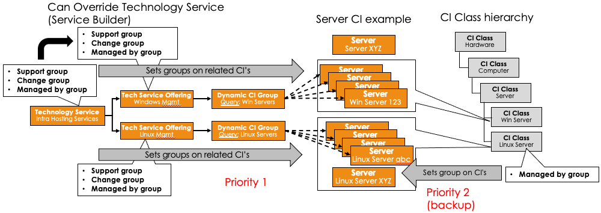

# CMDB Reference Notes

## 1. Introduction

- **Purpose**: Provide a single source of truth for configuration items (CIs) in ServiceNow, aligned with the Common Service Data Model (CSDM).
- **Goals**:
  - Deliver high-quality CMDB data for ITSM, ITOM, and other processes.
  - Ensure consistent service definitions and governance.
  - Drive continuous improvement using best practices and built-in ServiceNow capabilities.

### Marketing Numbers

- CMDB Fundamentals:
  - Gartner estimates that downtime can cost enterprises up to `$300K an hour`
    - can be much more for outages in the financial services industry
  - CMDB can save an organization up to `40%` with respect to ongoing IT efforts
- Health Matters: CMDBs with good health scores result in (CMDB Health Deep Dive):
  - 27% faster Time to resolve high priority Incidents
  - 46% fewer High priority Incidents overall
  - 20% faster Time to fulfill requests
  - 26% Fewer failed Changes
  - 14% Lower age of vulnerabilities
  - 12% Faster time to close Changes
  - 28% Lower age of critical vulnerabilities
  - 22% Fewer reopened Incidents
  - 485% Increase in Incidents resolved by Problem

---

## 2. Resources

### 2.1 Learning and Documentation

- **Courses**
  - [x] [Learning Path CMDB Fundamentals](https://learning.servicenow.com/lxp/en/it-operations-management/configuration-management-database-cmdb?id=learning_course_prev&course_id=c03ca22847ec66547faa0415f16d43f4)
  - [x] [CMDB Health Deep Dive](https://learning.servicenow.com/lxp/en/it-operations-management/cmdb-health-deep-dive?id=learning_course_prev&course_id=5c01c5fd93f90690fb94b4886cba109d)
  - [x] [MID Server Fundamentals](https://nowlearning.service-now.com/lxp?id=learning_course_prev&course_id=dcfdb5b5dbf5acd030c91fdc1396199a)
  - **CSDM: Getting Started with Services and Service Offerings**
    - [NowCreate: CSDM Workshop - Getting Started](https://nowlearning.servicenow.com/nowcreate?id=nc_asset&asset_id=dde64c62875255d0f2f443f7dabb354b)
    - [CSDM workshop](https://nowlearning.servicenow.com/nowcreate?id=nc_asset&asset_id=5c4d48bfdb998d100c912b691396198e)
    - [CMDB workshop](https://nowlearning.servicenow.com/nowcreate?id=nc_asset&asset_id=3054c3838795d9d8af9f213acebb35c5)
    - [CSDM Data model examples](https://nowlearning.servicenow.com/nowcreate?id=nc_asset&asset_id=c0ddb115db6d0d900c912b6913961987)
- **Documentation & Guides**
  - Help for customers:
    - [Jumpstart Your CMDB](https://docs.servicenow.com/bundle/washingtondc-impact/page/product/impact/reference/jumpstart-cmdb.html)
    - [TuneUp Your CMDB Accelerator](https://docs.servicenow.com/bundle/washingtondc-impact/page/product/impact/reference/tuneup-your-cmdb.html)
  - CMDB Best Practices
    - [CMDB Health](https://docs.servicenow.com/csh?topicname=c_CMDBHealth.html&version=latest)
    - [Tables and Classes](https://docs.servicenow.com/csh?topicname=r_TablesAndClasses.html)
    - [Table Hierarchy & the Extension Model](https://docs.servicenow.com/csh?topicname=t_TableHierarchyAndTheExtModel.html)
    - [Tree Picker](https://docs.servicenow.com/csh?topicname=c_TreePicker.html)
    - [Create a CI Class](https://docs.servicenow.com/csh?topicname=t_CreateCIType.html)
    - [Properties for CMDB Query Builder](https://docs.servicenow.com/csh?topicname=cmdb-querybldr-sysproprties.html)
    - [Suggested Class Relationships](https://docs.servicenow.com/csh?topicname=r_SuggestedRelationshipModel.html)
    - [Instance Customization FAQ](https://hi.service-now.com/kb_view.do?sysparm_article=KB0553407)
    - [Add or Edit a Business Application](https://docs.servicenow.com/csh?topicname=manage-business-appln.html)
  - [Activate Multisource CMDB](https://www.servicenow.com/community/itom-forum/task-07-enable-multisource-cmdb-how-to-add-the-property/m-p/967768)
    - [Now CMDB 360](https://docs.servicenow.com/bundle/washingtondc-servicenow-platform/page/product/configuration-management/concept/multisource-cmdb.html#d308326e158)
  - [Best Practices for CMDB Data Management](https://www.servicenow.com/community/cmdb-articles/best-practices-for-cmdb-data-management/ta-p/2841377)
  - CMDB Health References & Further Reading
    - [CMDB Remediation Rules (docs)](https://docs.servicenow.com/bundle/xanadu-servicenow-platform/page/product/configuration-management/task/t_CreateCMDBRemediationRule.html)
    - [CMDB Data Foundations Dashboards](https://docs.servicenow.com/csh?topicname=csdm-cmdb-foundations-dashboards.html)
    - [Attestation & Certification vs. CMDB Health (KB articles)](https://support.servicenow.com/kb?id=kb_article_view&sysparm_article=KB0829106)
    - [Dynamic Reconciliation](https://docs.servicenow.com/bundle/washingtondc-servicenow-platform/page/product/configuration-management/concept/multisource-cmdb.html)

### 2.2 Additional Links

- **Archiving**
  - [CMDB Data archiving (forum)](https://www.servicenow.com/community/cmdb-forum/cmdb-data-archiving/m-p/3077930/highlight/true#M13073)
  - [Non-CMDB Data Archiving Walkthrough](https://www.servicenow.com/community/now-platform-articles/data-archiving-walkthrough/ta-p/2316478)
- **Change & Proposed Changes**
  - [ServiceNow Change Management](https://docs.servicenow.com/csh?topicname=c_ITILChangeManagement.html&version=latest)
  - [Proposed Changes](https://docs.servicenow.com/csh?topicname=c_ProposedChanges.html&version=latest)
- **Identification & Reconciliation**
  - [Identification and Reconciliation Engine (IRE)](https://docs.servicenow.com/csh?topicname=ire.html&version=latest)

---

## 3. Implementation Approach

1. **Set Direction**
   - Define business outcomes and success criteria (e.g., reduce incidents by X%, improve change success rate).
   - “Scoping: only required data in the CMDB” for key processes like CMDB Health or data policies.
2. **Build a Team & Governance**
   - _Roles_:
     - **Configuration Management Executive Sponsor**: Oversees the plan, resolves cross-functional issues, communicates goals and objectives at a senior level.
     - **Configuration Management Process Owner**: Responsible for strategic development of the process, ensuring resources and consistent execution.
     - **Configuration Manager**: Manages day-to-day activities, resolves compliance issues, approves changes to the CMDB infrastructure.
     - **Configuration Management System Analyst**: Performs daily operational tasks, audits, and fulfillment of CM service requests.
     - **Configuration Management Specialist**: (Optional) Maintains expert-level knowledge of CI classes, discovery results, data integration points.
   - Implement a **Configuration Control Board (CCB)** as a steering committee for major CMDB changes:
     - Triggers for CCB review: new CI classes, significant changes to the CM plan, major updates from architecture or security processes.
   - Emphasize that _Configuration Management is an ongoing process_, not a one-time project.
3. **Design Your Configuration Plan**
   - Identify critical CI classes first; align data sources with the IRE to avoid duplicates.
   - **Start Small**: Only track the data you truly need (e.g., for CMDB Health, audits, or key governance requirements).
   - Implement minimal mandatory fields initially; expand to recommended fields before making them required (see [CMDB Health Dashboard](#63-cmdb-health-dashboard)).
   - Plan for **Asset–CI Synchronization** if financial lifecycles are relevant.
4. **Show Value**
   - Demonstrate improvements in incident or change management.
   - Tie CMDB data back to business drivers like cost savings, risk reduction, or better compliance.
   - Communicate changes clearly to business stakeholders for long-term CMDB health.

### 3.1 Key Implementation Best Practices

1. **Start Small**
   - Focus on key CI classes and attributes (e.g., servers, applications).
   - Don’t attempt to populate every table before validating your core needs.
2. **Automate Data Collection**
   - Use Discovery, IntegrationHub ETL, or Service Graph Connectors to reduce manual data entry.
3. **Leverage CMDB Health**
   - Continuously monitor for duplicates, orphans, stale records (see [CMDB Health Dashboard](#63-cmdb-health-dashboard)).
4. **Align with Change Management**
   - Use Proposed Changes to handle manual CI edits that need approval.
   - Store each CI update in the CMDB only after it’s fully authorized.
5. **Communicate**
   - Keep stakeholders informed about the CMDB plan and data model changes to maintain organizational buy-in.

- **Sources**
  - [Design a Successful CMDB Implementation](https://nowlearning.servicenow.com/lxp/en/pages/learning-course?id=learning_course&path_id=c120bb5bdbd0c8103e3aaca2ca9619bf&course_id=cd7d6ee5db1a7700760a7104399619f1&child_id=7abde9c3db804d109e32db85ca9619a3&spa=1)
  - [CMDB Implementation Best Practices (community)](https://www.servicenow.com/community/cmdb-articles/best-practices-for-cmdb-data-management/ta-p/2841377)

---

## 4. Service Modeling & CSDM

### 4.1 CSDM Overview

- **Service Definitions**:
  - Business Service Offerings (BSOs), Technical Service Offerings (TSOs), Application Services (mapped vs. dynamic).
- **Minimal Overlap**:
  - CSDM guidance: each CI should map to one TSO to avoid conflicting SLAs/OLAs.

### 4.2 Teams Related List (Multi-Level Support)

- Used on **Service** CI forms to track Approval, Change, Managed By, or Support groups.
- Enable the _Teams_ related list in the form layout.
- To add a custom group type, edit the `group_type` dictionary (roles: `itil_admin`, `asset`, or `cmdb_admin`).

- **Sources**
  - [Teams Related List docs](https://docs.servicenow.com/bundle/xanadu-servicenow-platform/page/product/configuration-management/concept/teams-related-list.html)

### 4.3 Synchronizing Group Assignment Attributes

- **Purpose**: Automate assignment of support or change groups to CIs:
  - Priority: _TSO_ > _Dynamic CI Group_ > _CI Class_ or individual CIs.
- **Dynamic CI Groups**:
  - Create a CMDB Group (query-based) → Link to a Dynamic CI Group → Optionally attach to a TSO.
    - or: Encoded Query and/or manual selection
- **Scheduled Job**:
  - _CSDM Data Sync_ (if enabled) propagates group assignments from TSOs to associated CIs.
- **Avoid Overlaps**:

  - If multiple TSOs or groups reference the same CI, they can conflict.
  - CSDM recommends one TSO per CI to avoid contradictory assignments.

- **Sources**
  - [Enable the CSDM Data Synchronize plugin](https://docs.servicenow.com/bundle/washingtondc-servicenow-platform/page/product/csdm-implementation/task/csdm-data-synchronize-enable.html)
  - [CMDB Groups (docs)](https://docs.servicenow.com/bundle/washingtondc-servicenow-platform/page/product/configuration-management/concept/cmdb-groups.html)
  - [Manage Technical Services domain (CSDM)](https://docs.servicenow.com/bundle/washingtondc-servicenow-platform/page/product/csdm-implementation/concept/manage-tech-servs-domain.html)

### 4.4 Incident Alignment with CSDM

- **Form Configuration**:
  - Service Offering first → auto-populate parent Service, filter relevant CIs.
- **Use Cases**:
  - End-users reference Business Services.
  - IT staff references Technical Services.
  - System-generated incidents link to discovered or monitored CIs.
- Recommendations
  - Service Management meets operations - Cls provide incident managers precision
  - Person resolving the incident needs the correct Cl - make field mandatory once state moves from In progress to Resolved
  - Don't use a generic Cl, be specific
  - Use reference qualifiers - category / sub-category (based on roles)
  - Configure Principle classes - expose typical Cl classes, not all to limit scope
  - Event management path - turn Events into an Incidents, identify impacted servicesIncident management advanced feature: related list of bus apps
- **Further Reading**: More details in an ee [Align Incident Management with CSDM](./sn-csdm-incident.md)

---

## 5. Security & Access Control

- **Role-Based Access**:
  - Typically `sn_cmdb_editor` or `sn_cmdb_admin` for editing.
  - _Class Ownership_ can restrict writes for specific CI classes or groups.
- **Auditing**:
  - Enable table audit for sensitive classes but monitor performance impact.
- **Change & Proposed Changes**:
  - [ServiceNow Change Management](https://docs.servicenow.com/csh?topicname=c_ITILChangeManagement.html&version=latest)
  - [Proposed Changes](https://docs.servicenow.com/csh?topicname=c_ProposedChanges.html&version=latest) for manual edits that need approvals.
- **Configure Permissions**:
  - Make sure only authoritative data sources can write to the CMDB.
  - Communicate any changes or expansions in access rights to stakeholders.

---

## 6. Data Maintenance & Quality

### Three Pillars

1. Ingest
   - Continuously bring in data, merge, update, delete
   - Automate Physical CIs and Cloud resources / structure
   - Merge separate sources into one trusted model
   - Connect the discoverable to non-discoverable
   - Ensure managed ownership
2. Govern
   - Governance team & roles
   - Ensure health metrics improve
   - Establish lifecycle processes
   - Manage & communicate structure and definitions
   - Support use and customization / extension needs
3. Insight
   - Establish analysis guidance
   - Provide operational support for incident, change mgmt.
   - Use in reporting and metrics
   - Leverage for planning
   - Support consuming products, roles, personas, processes

### 6.1 Tables, Classes, & Relationships

- **Extension Model**: Child classes inherit from parent classes.
- **Suggested Relationships**: Guides valid CI connections.

### 6.2 Data Ingestion & Reconciliation

- **Data Population Best Practices**:
  - _Scoping_: Only bring in data you need for key use cases or policies.
  - Use _Service Graph Connectors_ or _IntegrationHub ETL_ for large or external data imports.
  - Keep _Asset–CI Synchronization_ in mind if you track financial lifecycles.
- **Identification & Reconciliation Engine (IRE)**:
  - Ensure stable unique attributes to avoid duplicates (e.g., serial number).
  - Reconciliation rules define which source updates which fields.
  - [Multisource CMDB](https://www.servicenow.com/community/itom-forum/task-07-enable-multisource-cmdb-how-to-add-the-property/m-p/967768) can store full data history and revert incorrect updates.

## CMDB Health

### 6.3 CMDB Health Dashboard

ServiceNow’s **CMDB Health Dashboard** calculates an overall health score based on three major scorecards: **Completeness**, **Compliance**, and **Correctness**. Each category has its own set of rules and metrics (e.g., required and recommended fields for completeness, audits for compliance, and checks for duplicates/orphans/staleness for correctness).

1. **Health Remediation Rules**
   - After the CMDB Health jobs run, you can **auto-create remediation tasks** for stale CIs, missing fields, orphaned items, or duplicates.
   - To automate or standardize your remediation, define **CMDB Remediation Rules** via **All → Configuration → CMDB Remediations**.
     - Each rule specifies which health issues it targets (e.g., “stale CIs”) and which workflow to trigger for resolution (e.g., re-discover the CI, merge duplicates, or simply close the task).
   - System properties like `glide.class.upgrade.enabled` or `glide.class.switch.enabled` control whether reclassification happens automatically or creates manual tasks.
2. **Distinguishing CMDB Health From “Get Well” Metrics**
   - The **CMDB Health Dashboard** focuses primarily on the standard CCC (Completeness, Compliance, Correctness) checks.
   - ServiceNow also offers **CMDB & CSDM Data Foundations Dashboards** (sometimes called “Get Well” dashboards) that use Performance Analytics (PA) metrics to track additional data quality indicators (see [Section 6.7](#67-cmdb--csdm-data-foundations-dashboards) below).
   - Decide which metrics to enable based on your environment’s needs, since some may overlap with the main health checks.
3. **Scheduled Jobs & Task Creation**
   - Several OOB scheduled jobs (e.g., _CMDB Health Metric jobs_) recalculate scores daily or weekly.
   - Enabling the creation of tasks for each issue is optional; you can configure the “Create tasks” flag on each CMDB Health rule, or use additional remediation workflows to automate fixes.
4. **Performance Considerations**
   - If you have a large dataset, reduce overhead by limiting Health checks to only the classes you care about, using **Health Inclusion Rules** and disabling unneeded audits, staleness checks, or orphan rules.

- Overview over CMDB Health Rules
  - Staleness Rules: `cmdb_health_staleness_rule`
  - Orphan rule: `cmdb_health_orphan_rule`
  - Health Inclusion Rules: `cmdb_health_config`
- **Sources**
  - [CMDB Health (docs)](https://docs.servicenow.com/csh?topicname=c_CMDBHealth.html&version=latest)
  - [Manage Duplicate CIs (ServiceNow docs)](https://docs.servicenow.com)
- additional topics:
  - community
    - [CMDB Query used on Dynamic CI Group returns more CIs than expected](https://www.servicenow.com/community/developer-articles/cmdb-query-used-on-dynamic-ci-group-returns-more-cis-than/ta-p/2597546)
    - [what happens if a same CI is part of 2 different Dynamic CI Groups](https://www.servicenow.com/community/developer-forum/cmdb-dynamic-ci-group-data-sync/td-p/2833966)
    - [Support Group vs Manage by Group](https://www.servicenow.com/community/cmdb-forum/support-group-vs-manage-by-group/m-p/2840779)
    - [What exactly is Data Certification vs CI Attestation?](https://www.servicenow.com/community/cmdb-forum/what-exactly-is-data-certification-vs-ci-attestation/td-p/2695953/page/4)

### 6.4 CMDB Data Manager

**CMDB Data Manager** provides policy-driven automation for life cycle events such as **attestation**, **certification**, **archiving**, **retiring**, or **deleting** CIs. It includes subflows that create tasks for specific groups, handle approvals, and then execute the desired action (e.g., move a CI to ‘retired’ status, archive it, etc.).

#### 6.4.1 Attestation vs. Certification

- **Attestation**

  - Verifies whether the CI still exists or is valid in an operational sense.
  - Often functions as a simple survey: a user (potentially without any special role) confirms “Yes, this CI still exists” or “No, it’s defunct.”
  - A “Rejected” attestation can trigger follow-up actions (e.g., retire or delete the CI).
  - Key fields include `attested_by`, `attested_date`, and `attestation_status`.
  - Typically does **not** directly allow field edits; it’s more of a yes/no confirmation.

- **Data Certification**
  - Focuses on **verifying specific field values** (e.g., checking that the ‘Owner’ field is correct).
  - Usually requires roles such as `itil` or `sn_cmdb_editor` because users might need to update CMDB data.
  - If a field fails certification, the policy can create tasks to correct the data or update missing fields.

#### 6.4.2 Data Manager Flow

1. **Policies & Subflows**
   - Each **Data Manager policy** (Retire, Archive, Attestation, etc.) has an associated subflow that defines what to do with matched CIs.
   - Example: _Retire Policy_ uses a subflow to set `install_status` = ‘Retired’, then triggers a second policy to archive or delete after a defined retention period.
2. **Daily Scheduled Job**
   - Once a policy is active, a daily job evaluates matching CIs (based on the filter criteria).
   - It creates **tasks** for each unique “Managed By” group. If approval is required, the task must be approved before the subflow executes.
3. **Integration With Attestation / Certification**
   - A separate policy can be configured to retire or delete any CI that fails attestation or certification (e.g., `attestation_status` = ‘Rejected’).
   - Additional manual checks can be inserted in the flow if you want a final review step.
4. **Exclusion Lists**
   - Users assigned tasks can add certain CIs to an **exclusion list**, preventing them from being retired/archived/deleted if they are special exceptions.

- **Sources**
  - [CMDB Data Manager Overview (docs)](https://docs.servicenow.com/bundle/washingtondc-servicenow-platform/page/product/configuration-management/concept/cmdb-data-management-landing.html)
  - [Data Manager Retire policy example (KB0853633)](https://support.servicenow.com/kb?id=kb_article_view&sysparm_article=KB0853633)
  - [CMDB Data Archiving (forum)](https://www.servicenow.com/community/cmdb-forum/cmdb-data-archiving/m-p/3077930/highlight/true#M13073)
  - [Non-CMDB Data Archiving Walkthrough](https://www.servicenow.com/community/now-platform-articles/data-archiving-walkthrough/ta-p/2316478)

### 6.5 Dependent CI Management

- **Cascade Cleanup**: Automatically retire/delete child CIs when a parent is retired.
- **Orphan Rules**: 1 rule/class to detect missing relationships.
- **Properties**:
  - `cmdb.dependent.ci.cascade.op.enabled`, `cmdb.dependent.ci.cascade.retire.enabled`
- **Scheduled Jobs**:
  - _CMDB DependentCI Policy Processor_, _CMDB Cascade Retire Dependent CIs_
- **Cleanup Orphan CIs** can be activated for a one-time cascade cleanup of historical orphans.
- **Sources**
  - [Manage Dependent CI (docs)](https://docs.servicenow.com/bundle/washingtondc-servicenow-platform/page/product/configuration-management/concept/manage-dependent-ci.html)
  - [Dependent CI Retirement (community)](https://www.servicenow.com/community/cmdb-forum/dependent-ci-retirement/m-p/2983566)

### 6.6 CMDB Query Builder

- **Overview**: Build visual or logical queries across CI classes and relationships.
- required role: `cmdb_query_builder`
- **Common Use Cases**:
  - Validate orphan rule results, staleness checks, or discover specific topologies.
  - Generate CMDB Groups from saved queries.
- **Query Types**:
  - _CMDB Query_, _Service Mapping Query_, _Combination Query_.
- **System Properties**:
  - `glide.cmdb.query.max_results_limit` (default 10,000), etc.
- **Sources**
  - [Properties for CMDB Query Builder](https://docs.servicenow.com/csh?topicname=cmdb-querybldr-sysproprties.html)
  - [Tables and Classes docs](https://docs.servicenow.com/csh?topicname=r_TablesAndClasses.html)

### 6.7 CMDB & CSDM Data Foundations Dashboards

Beyond the standard Health Dashboard (Completeness, Compliance, Correctness), ServiceNow offers **Data Foundations** or **“Get Well” Dashboards** that use Performance Analytics (PA) to track a broader set of metrics:

- Free plugins
- OOB metrics (indicators) with links to Remediation playbooks

1. **Example Metrics**
   - “Hardware CIs Missing Serial Number”
   - “Business Applications Without an Owner”
   - “CIs Missing a Support Group”
   - Many others, found in the `sn_getwell_metric` table.
2. **Enabling / Disabling Indicators**
   - By default, numerous “get well” metrics are active. Evaluate which ones you truly need; excessive metrics can increase performance overhead.
   - **Deactivate** unneeded metrics by setting their `Active` field to false in **All → sn_getwell_metric**.
3. **Scheduled Collection Jobs**
   - These dashboards rely on data collection jobs such as _CMDB Get Well Metric Collection_ and _CSDM Get Well Metric Collection_.
   - You can manually run them or schedule them to run daily/weekly.
4. **Comparing to CMDB Health Dashboard**
   - **CMDB Health Dashboard** = standard CCC checks.
   - **Data Foundations Dashboards** = extended data quality insights (like owners, location data, or other recommended fields).
   - They can overlap, so you’ll want to disable any duplicate checks to avoid confusion or double-counting.
5. **Remediation**
   - You can still create tasks or workflows for these metrics, similar to the core Health Dashboard approach.
   - Performance Analytics allows you to chart trends over time, set improvement targets, and gauge data quality progress.

#### Deep Dive: Identifying and Remediating Duplicate Locations

- Problem: having duplicate locations does mean that location based queries will not find all CIs in a location
- Playbook for unique locations: CMDB Data Foundations Dashboard > Data Management Practices > Unique Locations Indicator
- If locations are provided by or to a third party system: keep in mind to fix them in the upstream system and make sure that fixes propagate to downstream systems

---

## 7. CMDB Delta (Advanced/Newer Features)

This section highlights features not always covered in the classic CMDB documentation.

1. **Recommended Fields (1-Level Dot-Walking)**
   - You can make certain fields “recommended” instead of “required.”
   - Recommended fields appear in Health checks but do **not** block record creation.
   - Supports **one-level dot-walking** (e.g., `location.u_region`) to encourage deeper data completeness.
2. **CMDB 360 & Multisource CMDB**
   - Provides a single view of attribute-level updates from multiple discovery sources.
   - Allows you to revert to a prior source if the current data is invalid.
   - Needs the property `glide.identification_engine.multisource_enabled = true`.
3. **Dynamic Reconciliation Rules**
   - In addition to standard precedence rules (“Source A overrides Source B” for certain attributes), **dynamic** rules can pick field values based on:
     - **First reported** (the earliest data is kept)
     - **Last reported** (the newest data is kept)
     - **Most reported** (the majority value from multiple sources)
     - **Largest or smallest** value (for numeric fields)
   - These rules can reduce manual conflict resolution when multiple data sources supply overlapping attributes.
4. **IRE for Non-CMDB Tables**
   - Extends the **Identification & Reconciliation Engine** to standard ServiceNow tables like `sys_user`, `cmn_location`, and custom app tables.
   - Requires setting the property `glide.identification_engine.non_cmdb_tables` appropriately.
   - Helpful if you want a consistent, “single source of truth” approach across non-CMDB data as well.
5. **Class Switch Properties**
   - Control whether or not the platform **automatically** reclassifies CIs when new data indicates a different class. Examples:
     - `glide.class.switch.enabled`
     - `glide.class.upgrade.enabled`
     - `glide.class.downgrade.enabled`
   - If disabled, the system raises a _Reclassification Task_ instead of switching automatically.
