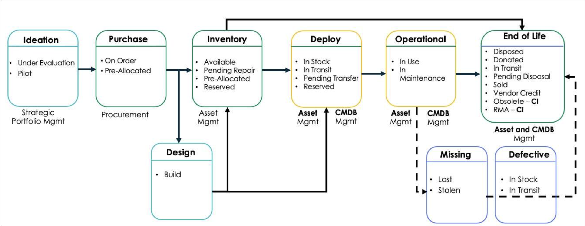

# CMDB Reference Notes

## Resources

### Courses

- [x] [Learning Path CMDB Fundamentals](https://learning.servicenow.com/lxp/en/it-operations-management/configuration-management-database-cmdb?id=learning_course_prev&course_id=c03ca22847ec66547faa0415f16d43f4)
- [x] [CMDB Health Deep Dive](https://learning.servicenow.com/lxp/en/it-operations-management/cmdb-health-deep-dive?id=learning_course_prev&course_id=5c01c5fd93f90690fb94b4886cba109d)
- [x] [MID Server Fundamentals](https://nowlearning.service-now.com/lxp?id=learning_course_prev&course_id=dcfdb5b5dbf5acd030c91fdc1396199a)

### Documentation

- Help for **customers**:
  - [Jumpstart Your CMDB](https://docs.servicenow.com/bundle/washingtondc-impact/page/product/impact/reference/jumpstart-cmdb.html)
  - [TuneUp Your CMDB Accelerator](https://docs.servicenow.com/bundle/washingtondc-impact/page/product/impact/reference/tuneup-your-cmdb.html)
- **CMDB Best Practices**
  - [CMDB Health](https://docs.servicenow.com/csh?topicname=c_CMDBHealth.html&version=latest)
  - [Tables and Classes](https://docs.servicenow.com/csh?topicname=r_TablesAndClasses.html)
  - [Table Hierarchy & the Extension Model](https://docs.servicenow.com/csh?topicname=t_TableHierarchyAndTheExtModel.html)
  - [Tree Picker](https://docs.servicenow.com/csh?topicname=c_TreePicker.html)
  - [Create a CI Class](https://docs.servicenow.com/csh?topicname=t_CreateCIType.html)
  - [Properties for CMDB Query Builder](https://docs.servicenow.com/csh?topicname=cmdb-querybldr-sysproprties.html)
  - [Suggested Class Relationships](https://docs.servicenow.com/csh?topicname=r_SuggestedRelationshipModel.html)
  - [Instance Customization FAQ](https://hi.service-now.com/kb_view.do?sysparm_article=KB0553407)
  - [Add or Edit a Business Application](https://docs.servicenow.com/csh?topicname=manage-business-appln.html)
  - [Activate Multisource CMDB](https://www.servicenow.com/community/itom-forum/task-07-enable-multisource-cmdb-how-to-add-the-property/m-p/967768)
    - [Now CMDB 360](https://docs.servicenow.com/bundle/washingtondc-servicenow-platform/page/product/configuration-management/concept/multisource-cmdb.html#d308326e158)
  - [Best Practices for CMDB Data Management](https://www.servicenow.com/community/cmdb-articles/best-practices-for-cmdb-data-management/ta-p/2841377)
  - CMDB Health References & Further Reading
    - [CMDB Remediation Rules (docs)](https://docs.servicenow.com/bundle/xanadu-servicenow-platform/page/product/configuration-management/task/t_CreateCMDBRemediationRule.html)
    - [CMDB Data Foundations Dashboards](https://docs.servicenow.com/csh?topicname=csdm-cmdb-foundations-dashboards.html)
    - [Attestation & Certification vs. CMDB Health (KB articles)](https://support.servicenow.com/kb?id=kb_article_view&sysparm_article=KB0829106)
    - [Dynamic Reconciliation](https://docs.servicenow.com/bundle/washingtondc-servicenow-platform/page/product/configuration-management/concept/multisource-cmdb.html)
- **Archiving**
  - [CMDB Data archiving (forum)](https://www.servicenow.com/community/cmdb-forum/cmdb-data-archiving/m-p/3077930/highlight/true#M13073)
  - [Non-CMDB Data Archiving Walkthrough](https://www.servicenow.com/community/now-platform-articles/data-archiving-walkthrough/ta-p/2316478)
- **Change & Proposed Changes**
  - [ServiceNow Change Management](https://docs.servicenow.com/csh?topicname=c_ITILChangeManagement.html&version=latest)
  - [Proposed Changes](https://docs.servicenow.com/csh?topicname=c_ProposedChanges.html&version=latest)
- **Identification & Reconciliation**
  - [Identification and Reconciliation Engine (IRE)](https://docs.servicenow.com/csh?topicname=ire.html&version=latest)

### Useful Plugins and Store Apps

- [CMDB CI Class Models](https://store.servicenow.com/sn_appstore_store.do#!/store/application/ae99d84b2320330006c0110d96bf65b3/1.57.0?referer=%2Fstore%2Fsearch%3Flistingtype%3Dallintegrations%25253Bancillary_app%25253Bcertified_apps%25253Bcontent%25253Bindustry_solution%25253Boem%25253Butility%25253Btemplate%25253Bgenerative_ai%25253Bsnow_solution%26q%3Dcmdb%2520ci%2520class%2520model&sl=sh): expand base installation CCI Classes
- [CMDB Workspace](https://store.servicenow.com/sn_appstore_store.do#!/store/application/c8ab76825371201032b7ddeeff7b1280/)
  - free app, no license requirements
- [IntegrationHub ETL](https://store.servicenow.com/sn_appstore_store.do#!/store/application/d43fe173dba23300c121f3c61d961958/)
  - free app, no license requirements
- [Service Graph Connectors](https://store.servicenow.com/sn_appstore_store.do#!/store/search?listingtype=allintegrations%253Bancillary_app%253Bcertified_apps%253Bcontent%253Bindustry_solution%253Boem%253Butility%253Btemplate%253Bgenerative_ai%253Bsnow_solution&q=service%20graph%20connectors)
  - mostly paid, Microsoft SCCM should be free

---

## Introduction

- **Purpose**: Provide a single source of truth for configuration items (CIs) in ServiceNow, aligned with the Common Service Data Model (CSDM).
- **Goals**:
  - Deliver high-quality CMDB data for ITSM, ITOM, and other processes.
  - Ensure consistent service definitions and governance.
  - Drive continuous improvement using best practices and built-in ServiceNow capabilities.

### Marketing Numbers

- CMDB Fundamentals:
  - Gartner estimates that downtime can cost enterprises up to `$300K an hour`
    - can be much more for outages in the financial services industry
  - CMDB can save an organization up to `40%` with respect to ongoing IT efforts
- Health Matters: CMDBs with good health scores result in (CMDB Health Deep Dive):
  - 27% faster Time to resolve high priority Incidents
  - 46% fewer High priority Incidents overall
  - 20% faster Time to fulfill requests
  - 26% Fewer failed Changes
  - 14% Lower age of vulnerabilities
  - 12% Faster time to close Changes
  - 28% Lower age of critical vulnerabilities
  - 22% Fewer reopened Incidents
  - 485% Increase in Incidents resolved by Problem

---

## CMDB Basics

- keep classes simple and use OOB Classes where possible (see also [Plugins](#useful-plugins-and-store-apps)/CMDB CI Class Models)
- use OOB CI attributes where possible. When custom attributes are required, ensure that they:
  - have a solid business case
  - have an authoritative source
  - are useful to manage and report on the CI
  - can be managed or controlled
  - are configured at the correct level of the class hierarchy
  - cite NowLearning CMDB Fundamentals: **ServiceNow has found that customers who add extra custom attributes without a solid business case often experience failing CMDB initiatives.**
- keep non-discoverable attributes filled and up-to-date. Supporting mechanics:
  - [Data Manager](#cmdb-data-manager) with certification policies
  - [Health Dashboard](#cmdb-health-dashboard) with recommended fields

### CMDB Workspace

- Unified platform supporting all [three CMDB pillars](#three-pillars)
- **Single Pane of Glass**: Centralized view of CIs and relationships
- **Dashboards & Charts**: Visualize CMDB health, data quality, and trends; track improvements
- **Task Management**: Create, assign, and monitor CMDB-related tasks
- No paid license required; updates available via [ServiceNow Store](#useful-plugins-and-store-apps)

## Implementation Approach

1. **Set Direction**
   - Define **What**: Specific goals aligned to CMDB use cases (e.g., reduce incidents by `X%`, improve change success rate)
   - Define **How**: Approach, constraints, and assumptions
   - Define **Why**: Target business outcomes the CMDB will support
   - Define **Measure**: KPIs and reporting needs established early to track progress, assess effectiveness, and drive continuous improvement
   - Scope only required data for key processes (e.g., CMDB Health, data policies)
2. **Build a Team & Governance**
   - _Personas_:
     - **Configuration Management Process Owner**: Responsible for strategic development of the process, ensuring resources and consistent execution.
     - **Configuration Manager**: Manages day-to-day activities, resolves compliance issues, approves changes to the CMDB infrastructure.
       - **CMDB Admin**
     - **CI Analyst**: Performs daily operational tasks, audits, and fulfillment of CM service requests.
     - Service and Product **Owners**: Person(s) accountable for managing all elements that makeup a portfolio throughout their entire lifecycle. These portfolios elements include Products, Services and Processes.
   - Implement a **Configuration Control Board (CCB)** as a steering committee for major CMDB changes:
     - Triggers for CCB review: new CI classes, significant changes to the CM plan, major updates from architecture or security processes.
   - Emphasize that _Configuration Management is an ongoing process_, not a one-time project.
3. **Design Your Service Data Model**
   - Identify critical CI classes first; align data sources with the IRE to avoid duplicates.
   - **Start Small**: Only track the data you truly need (e.g., for CMDB Health, audits, or key governance requirements).
   - Implement minimal mandatory fields initially; expand to recommended fields before making them required (see [CMDB Health Dashboard](#cmdb-health-dashboard)).
   - Plan for **Asset–CI Synchronization** if financial lifecycles are relevant.
4. **Operationalize and Govern the Health of the CMDB**
   - [3 Pillars](#three-pillars): Ingest, Govern, Insight

### Key Implementation Best Practices

1. **Start Small**
   - Focus on key CI classes and attributes (e.g., servers, applications).
   - Don’t attempt to populate every table before validating your core needs.
2. **Automate Data Collection**
   - Use Discovery, IntegrationHub ETL, or Service Graph Connectors to reduce manual data entry.
3. **Leverage CMDB Health**
   - Continuously monitor for duplicates, orphans, stale records (see [CMDB Health Dashboard](#cmdb-health-dashboard)).
4. **Align with Change Management**
   - Use Proposed Changes to handle manual CI edits that need approval.
   - Store each CI update in the CMDB only after it’s fully authorized.
5. **Communicate**
   - Keep stakeholders informed about the CMDB plan and data model changes to maintain organizational buy-in.

- **Sources**
  - [Design a Successful CMDB Implementation](https://nowlearning.servicenow.com/lxp/en/pages/learning-course?id=learning_course&path_id=c120bb5bdbd0c8103e3aaca2ca9619bf&course_id=cd7d6ee5db1a7700760a7104399619f1&child_id=7abde9c3db804d109e32db85ca9619a3&spa=1)
  - [CMDB Implementation Best Practices (community)](https://www.servicenow.com/community/cmdb-articles/best-practices-for-cmdb-data-management/ta-p/2841377)

---

## Service Modeling & CSDM

### CSDM Overview

- **Service Definitions**:
  - **CSDM 5**:
    - Technology Management Service -> Technology Management Offering -> Service Instance
      - or: TMS -> TMO -> Dynamic CI Group -> Service Delivery System (Infra)
    - Business Service -> Business Offering -> Service Instance
- **Minimal Overlap**:
  - CSDM guidance: each CI should map to one TSO to avoid conflicting SLAs/OLAs.
- details -> [CSDM Reference Notes](./sn-csdm.md)

### Teams Related List (Multi-Level Support)

- Used on **Service** CI forms to track Approval, Change, Managed By, or Support groups.
- Enable the _Teams_ related list in the form layout.
- To add a custom group type, edit the `group_type` dictionary (roles: `itil_admin`, `asset`, or `cmdb_admin`).

- **Sources**
  - [Teams Related List docs](https://docs.servicenow.com/bundle/xanadu-servicenow-platform/page/product/configuration-management/concept/teams-related-list.html)

### Synchronizing Group Assignment Attributes

- **Purpose**: Automate assignment of support or change groups to CIs:
  - Priority: _TSO_ > _Dynamic CI Group_ > _CI Class_ or individual CIs.
- **Dynamic CI Groups**:
  - Create a CMDB Group (query-based) → Link to a Dynamic CI Group → Optionally attach to a TSO.
    - or: Encoded Query and/or manual selection
- **Scheduled Job**:
  - _CSDM Data Sync_ (if enabled) propagates group assignments from TSOs to associated CIs.
- **Avoid Overlaps**:

  - If multiple TSOs or groups reference the same CI, they can conflict.
  - CSDM recommends one TSO per CI to avoid contradictory assignments.

- **Sources**
  - [Enable the CSDM Data Synchronize plugin](https://docs.servicenow.com/bundle/washingtondc-servicenow-platform/page/product/csdm-implementation/task/csdm-data-synchronize-enable.html)
  - [CMDB Groups (docs)](https://docs.servicenow.com/bundle/washingtondc-servicenow-platform/page/product/configuration-management/concept/cmdb-groups.html)
  - [Manage Technical Services domain (CSDM)](https://docs.servicenow.com/bundle/washingtondc-servicenow-platform/page/product/csdm-implementation/concept/manage-tech-servs-domain.html)

### Incident Alignment with CSDM

- **Form Configuration**:
  - Service Offering first → auto-populate parent Service, filter relevant CIs.
- **Use Cases**:
  - End-users reference Business Services.
  - IT staff references Technical Services.
  - System-generated incidents link to discovered or monitored CIs.
- Recommendations
  - Service Management meets operations - Cls provide incident managers precision
  - Person resolving the incident needs the correct Cl - make field mandatory once state moves from In progress to Resolved
  - Don't use a generic Cl, be specific
  - Use reference qualifiers - category / sub-category (based on roles)
  - Configure Principle classes - expose typical Cl classes, not all to limit scope
  - Event management path - turn Events into an Incidents, identify impacted servicesIncident management advanced feature: related list of bus apps
- **Further Reading**: More details in an ee [Align Incident Management with CSDM](./sn-csdm-incident.md)

---

## Security & Access Control

- **Role-Based Access**:
  - Typically `sn_cmdb_editor` or `sn_cmdb_admin` for editing.
  - _Class Ownership_ can restrict writes for specific CI classes or groups.
- **Auditing**:
  - Enable table audit for sensitive classes but monitor performance impact.
- **Change & Proposed Changes**:
  - [ServiceNow Change Management](https://docs.servicenow.com/csh?topicname=c_ITILChangeManagement.html&version=latest)
  - [Proposed Changes](https://docs.servicenow.com/csh?topicname=c_ProposedChanges.html&version=latest) for manual edits that need approvals.
- **Configure Permissions**:
  - Make sure only authoritative data sources can write to the CMDB.
  - Communicate any changes or expansions in access rights to stakeholders.

---

## Data Maintenance & Quality

### Three Pillars

1. [Ingest](#data-ingestion--reconciliation)
   - Continuously bring in data, merge, update, delete
   - Automate Physical CIs and Cloud resources / structure
   - Merge separate sources into one trusted model
   - Connect the discoverable to non-discoverable
   - Ensure managed ownership
2. Govern
   - Governance team & roles
   - Ensure health metrics improve
   - Establish lifecycle processes
   - Manage & communicate structure and definitions
   - Support use and customization / extension needs
3. Insight
   - Establish analysis guidance
   - Provide operational support for incident, change mgmt.
   - Use in reporting and metrics
   - Leverage for planning
   - Support consuming products, roles, personas, processes

### Tables, Classes, & Relationships

- **Extension Model**: Child classes inherit from parent classes.
- **Suggested Relationships**: Guides valid CI connections.

### Data Ingestion & Reconciliation

- See [Ingest Pillar](#three-pillars) for goals
- **Data Population Best Practices**:
  - Scope only required data for key use cases or policies
  - Define owners and relationships per CSDM guidelines
  - Keep Asset–CI synchronization in mind if tracking financial lifecycles
- **Identification & Reconciliation Engine (IRE)**:
  - Use stable unique attributes (e.g., serial number) for duplicate prevention
  - Apply reconciliation rules to control field update source priority
  - Multisource CMDB stores history and allows reversion of incorrect updates
- Primary ServiceNow Ingestion Methods:
  - **ServiceNow Discovery** (Horizontal, Agentless): Auto-discovers devices/apps; maps dependencies; enrich with non-discoverable data (e.g., managed by, support group); requires ITOM Visibility license
  - **Service Mapping** (Top-down, Tag, ML): Maps services to supporting components; auto-updates maps; define service owners; align with business apps; requires ITOM Visibility license
  - **Agent Client Collector (ACC)**: Agent-based; real-time endpoint hardware/software inventory; software utilization data for SAM; requires license
  - [**Service Graph Connectors**](#useful-plugins-and-store-apps): Prebuilt integrations for external systems (Azure, Intune, SCCM, AWS, Jamf); ensure credentials and data consistency; most require license (SCCM free)
  - [**IntegrationHub ETL**](#useful-plugins-and-store-apps): Imports/transforms data from external sources; supports non-CMDB tables; automates updates; no license required; requires mapping knowledge
  - **Import Sets & Transform Maps**: Legacy method; supports CSV/Excel/DB/API; requires [mapping scripts to route through IRE](https://docs.servicenow.com/csh?version=latest&topicname=identification-import-sets) to avoid duplicates

### CMDB Query Builder

- **Overview**: Build visual or logical queries across CI classes and relationships.
- required role: `cmdb_query_builder`
- **Common Use Cases**:
  - Validate orphan rule results, staleness checks, or discover specific topologies.
  - Generate CMDB Groups from saved queries.
- **Query Types**:
  - _CMDB Query_, _Service Mapping Query_, _Combination Query_.
- **System Properties**:
  - `glide.cmdb.query.max_results_limit` (default 10,000), etc.
- **Sources**
  - [Properties for CMDB Query Builder](https://docs.servicenow.com/csh?topicname=cmdb-querybldr-sysproprties.html)
  - [Tables and Classes docs](https://docs.servicenow.com/csh?topicname=r_TablesAndClasses.html)

### Unified Map

- Visual, interactive representation of CIs and their relationships in the CMDB
- Supports zoom and pan for navigating complex maps
- Enables dependency mapping to understand CI connections and change/incident impact
- No paid license; included in base instance; accessible from CMDB Workspace → Management tab
- Requires knowledge of service-to-infrastructure mapping and the role of visualization in IT operations

### Intelligent Search

- AI-powered natural language query (NLQ) for intuitive CMDB searches
- Improves results over time based on user behavior and feedback
- Supports advanced filtering to refine search results
- No paid license; included in base instance; accessible from CMDB Workspace → Home tab
- Works best with understanding of data model, fields, and relationships, though NLQ reduces the skill required

## CMDB Health

### CMDB Health Dashboard

ServiceNow’s **CMDB Health Dashboard** calculates an overall health score based on three major scorecards: **Completeness**, **Compliance**, and **Correctness**. Each category has its own set of rules and metrics (e.g., required and recommended fields for completeness, audits for compliance, and checks for duplicates/orphans/staleness for correctness).

- **Top 10 View**: High-level visualization of which CI classes most impact each scorecard; drill down for detailed CI information
- **License**: No paid license; part of base instance; accessible from CMDB Workspace → Management tab

1. **Health Remediation Rules**
   - After the CMDB Health jobs run, you can **auto-create remediation tasks** for stale CIs, missing fields, orphaned items, or duplicates.
   - To automate or standardize your remediation, define **CMDB Remediation Rules** via **All → Configuration → CMDB Remediations**.
     - Each rule specifies which health issues it targets (e.g., “stale CIs”) and which workflow to trigger for resolution (e.g., re-discover the CI, merge duplicates, or simply close the task).
   - System properties like `glide.class.upgrade.enabled` or `glide.class.switch.enabled` control whether reclassification happens automatically or creates manual tasks.
2. **Distinguishing CMDB Health From “Get Well” Metrics**
   - The **CMDB Health Dashboard** focuses primarily on the standard CCC (Completeness, Compliance, Correctness) checks.
   - ServiceNow also offers [CMDB & CSDM Data Foundations Dashboards](#cmdb--csdm-data-foundations-dashboards) (sometimes called “Get Well” dashboards) that use Performance Analytics (PA) metrics to track additional data quality indicators.
   - Decide which metrics to enable based on your environment’s needs, since some may overlap with the main health checks.
3. **Scheduled Jobs & Task Creation**
   - OOB CMDB Health Metric jobs recalculate scores daily/weekly and populate scorecards (not enabled by default — must be activated)
   - Task creation optional; controlled by “Create tasks” flag on each rule or automation via remediation workflows
4. **Performance Considerations**
   - If you have a large dataset, reduce overhead by limiting Health checks to only the classes you care about, using **Health Inclusion Rules** and disabling unneeded audits, staleness checks, or orphan rules.

- Overview over CMDB Health Rules
  - Staleness Rules: `cmdb_health_staleness_rule`
  - Orphan rule: `cmdb_health_orphan_rule`
  - Health Inclusion Rules: `cmdb_health_config`
- **Sources**
  - [CMDB Health (docs)](https://docs.servicenow.com/csh?topicname=c_CMDBHealth.html&version=latest)
- additional topics:
  - community
    - [CMDB Query used on Dynamic CI Group returns more CIs than expected](https://www.servicenow.com/community/developer-articles/cmdb-query-used-on-dynamic-ci-group-returns-more-cis-than/ta-p/2597546)
    - [what happens if a same CI is part of 2 different Dynamic CI Groups](https://www.servicenow.com/community/developer-forum/cmdb-dynamic-ci-group-data-sync/td-p/2833966)
    - [Support Group vs Manage by Group](https://www.servicenow.com/community/cmdb-forum/support-group-vs-manage-by-group/m-p/2840779)
    - [What exactly is Data Certification vs CI Attestation?](https://www.servicenow.com/community/cmdb-forum/what-exactly-is-data-certification-vs-ci-attestation/td-p/2695953/page/4)

### De-Duplication

- **Duplicate CI Remediation Wizard**
  - Automated detection of potential duplicates using predefined attribute/relationship rules
  - Guided UI for merge or delete actions
  - No paid license; accessible from CMDB Workspace → Management tab
  - Requires manual resolution of each deduplication task
- **De-Duplication Templates**
  - Pre-configured, customizable templates for bulk duplicate resolution
  - Define matching rules (e.g., class, location, manufacturer, model)
  - Can be scheduled for regular cleanup
  - Merge/delete functionality automated per template rules
  - No paid license; accessible from CMDB Workspace → Management tab
  - Thorough testing recommended before production use
- [Manage Duplicate CIs (ServiceNow docs)](https://docs.servicenow.com)

### CMDB Data Manager

**CMDB Data Manager** provides policy-driven automation for lifecycle events such as attestation, certification, archiving, retiring, or deleting CIs. Includes subflows for task creation, approvals, and action execution (e.g., move CI to ‘Retired’ status, archive, delete).

- **Lifecycle Policies**
  - Retire, Archive, Delete require active lifecycle rule for each targeted class

#### Attestation vs. Certification

- **Attestation**

  - Verifies whether the CI still exists or is valid in an operational sense.
  - Often functions as a simple survey: a user (potentially without any special role) confirms “Yes, this CI still exists” or “No, it’s defunct.”
  - A “Rejected” attestation can trigger follow-up actions (e.g., retire or delete the CI).
  - Key fields include `attested_by`, `attested_date`, and `attestation_status`.
  - Typically does **not** directly allow field edits; it’s more of a yes/no confirmation.

- **Data Certification**
  - Focuses on **verifying specific field values** (e.g., checking that the ‘Owner’ field is correct).
  - Usually requires roles such as `itil` or `sn_cmdb_editor` because users might need to update CMDB data.
  - If a field fails certification, the policy can create tasks to correct the data or update missing fields.

#### Data Manager Flow

1. **Policies & Subflows**
   - Each **Data Manager policy** (Retire, Archive, Attestation, etc.) has an associated subflow that defines what to do with matched CIs.
   - Example: _Retire Policy_ uses a subflow to set `install_status` = ‘Retired’, then triggers a second policy to archive or delete after a defined retention period.
2. **Daily Scheduled Job**
   - Once a policy is active, a daily job evaluates matching CIs (based on the filter criteria).
   - It creates **tasks** for each unique “Managed By” group. If approval is required, the task must be approved before the subflow executes.
3. **Integration With Attestation / Certification**
   - A separate policy can be configured to retire or delete any CI that fails attestation or certification (e.g., `attestation_status` = ‘Rejected’).
   - Additional manual checks can be inserted in the flow if you want a final review step.
4. **Exclusion Lists**
   - Users assigned tasks can add certain CIs to an **exclusion list**, preventing them from being retired/archived/deleted if they are special exceptions.

- **Sources**
  - [CMDB Data Manager Overview (docs)](https://docs.servicenow.com/bundle/washingtondc-servicenow-platform/page/product/configuration-management/concept/cmdb-data-management-landing.html)
  - [Data Manager Retire policy example (KB0853633)](https://support.servicenow.com/kb?id=kb_article_view&sysparm_article=KB0853633)
  - [CMDB Data Archiving (forum)](https://www.servicenow.com/community/cmdb-forum/cmdb-data-archiving/m-p/3077930/highlight/true#M13073)
  - [Non-CMDB Data Archiving Walkthrough](https://www.servicenow.com/community/now-platform-articles/data-archiving-walkthrough/ta-p/2316478)

### Dependent CI Management

- **Cascade Cleanup**: Automatically retire/delete child CIs when a parent is retired.
- **Orphan Rules**: 1 rule/class to detect missing relationships.
- **Properties**:
  - `cmdb.dependent.ci.cascade.op.enabled`, `cmdb.dependent.ci.cascade.retire.enabled`
- **Scheduled Jobs**:
  - _CMDB DependentCI Policy Processor_, _CMDB Cascade Retire Dependent CIs_
- **Cleanup Orphan CIs** can be activated for a one-time cascade cleanup of historical orphans.
- **Sources**
  - [Manage Dependent CI (docs)](https://docs.servicenow.com/bundle/washingtondc-servicenow-platform/page/product/configuration-management/concept/manage-dependent-ci.html)
  - [Dependent CI Retirement (community)](https://www.servicenow.com/community/cmdb-forum/dependent-ci-retirement/m-p/2983566)

### CMDB & CSDM Data Foundations Dashboards

Beyond the standard Health Dashboard (Completeness, Compliance, Correctness), ServiceNow offers **Data Foundations** or **“Get Well” Dashboards** that use Performance Analytics (PA) to track a broader set of metrics:

- Free plugins
- OOB metrics (indicators) with links to Remediation playbooks

1. **Example Metrics**
   - “Hardware CIs Missing Serial Number”
   - “Business Applications Without an Owner”
   - “CIs Missing a Support Group”
   - Many others, found in the `sn_getwell_metric` table.
2. **Enabling / Disabling Indicators**
   - By default, numerous “get well” metrics are active. Evaluate which ones you truly need; excessive metrics can increase performance overhead.
   - **Deactivate** unneeded metrics by setting their `Active` field to false in **All → sn_getwell_metric**.
3. **Scheduled Collection Jobs**
   - These dashboards rely on data collection jobs such as _CMDB Get Well Metric Collection_ and _CSDM Get Well Metric Collection_.
   - You can manually run them or schedule them to run daily/weekly.
4. **Comparing to CMDB Health Dashboard**
   - **CMDB Health Dashboard** = standard CCC checks.
   - **Data Foundations Dashboards** = extended data quality insights (like owners, location data, or other recommended fields).
   - They can overlap, so you’ll want to disable any duplicate checks to avoid confusion or double-counting.
5. **Remediation**
   - You can still create tasks or workflows for these metrics, similar to the core Health Dashboard approach.
   - Performance Analytics allows you to chart trends over time, set improvement targets, and gauge data quality progress.

#### Deep Dive: Identifying and Remediating Duplicate Locations

- Problem: having duplicate locations does mean that location based queries will not find all CIs in a location
- Playbook for unique locations: CMDB Data Foundations Dashboard > Data Management Practices > Unique Locations Indicator
- If locations are provided by or to a third party system: keep in mind to fix them in the upstream system and make sure that fixes propagate to downstream systems

---

## CMDB Delta (Advanced/Newer Features)

This section highlights features not always covered in the classic CMDB documentation.

1. **Recommended Fields (1-Level Dot-Walking)**
   - You can make certain fields “recommended” instead of “required.”
   - Recommended fields appear in Health checks but do **not** block record creation.
   - Supports **one-level dot-walking** (e.g., `location.u_region`) to encourage deeper data completeness.
2. **CMDB 360 & Multisource CMDB**
   - Provides a single view of attribute-level updates from multiple discovery sources.
   - Allows you to revert to a prior source if the current data is invalid.
   - Needs the property `glide.identification_engine.multisource_enabled = true`.
3. **Dynamic Reconciliation Rules**
   - In addition to standard precedence rules (“Source A overrides Source B” for certain attributes), **dynamic** rules can pick field values based on:
     - **First reported** (the earliest data is kept)
     - **Last reported** (the newest data is kept)
     - **Most reported** (the majority value from multiple sources)
     - **Largest or smallest** value (for numeric fields)
   - These rules can reduce manual conflict resolution when multiple data sources supply overlapping attributes.
4. **IRE for Non-CMDB Tables**
   - Extends the **Identification & Reconciliation Engine** to standard ServiceNow tables like `sys_user`, `cmn_location`, and custom app tables.
   - Requires setting the property `glide.identification_engine.non_cmdb_tables` appropriately.
   - Helpful if you want a consistent, “single source of truth” approach across non-CMDB data as well.
5. **Class Switch Properties**
   - Control whether or not the platform **automatically** reclassifies CIs when new data indicates a different class. Examples:
     - `glide.class.switch.enabled`
     - `glide.class.upgrade.enabled`
     - `glide.class.downgrade.enabled`
   - If disabled, the system raises a _Reclassification Task_ instead of switching automatically.

## CMDB Configuration

- **CI Class Manager**: Centralized tool for managing CMDB class hierarchy, attributes, relationships, rules, and health in a tree-view format
  - Accessible via **All → Configuration → CI Class Manager**
  - View, create, or edit CI classes, including:
    - Class definitions & settings
    - Attributes (mandatory/optional)
    - Identification & reconciliation rules
    - Dependent & suggested relationships
    - Compliance audits, certification filters, health metrics
  - Extensible: create new child classes or update existing ones
    - Best practice: avoid custom classes when possible; check CMDB CI Class Models app first
    - If needed, extend existing classes; only `admin`, `sn_cmdb_admin`, or `personalize_dictionary` roles can create classes
    - For retiring custom classes: map/move CIs into baseline classes using CI Class Manager
  - **Principal Class** flag: controls which CIs appear in "Configuration Item" reference fields (e.g., in Incidents, Problems, Changes)
  - **Managed By Group**: set default group for managing CIs in a class (can be overridden by technical service offering settings)
  - **Default Product Model**: standardizes product association for class CIs
  - Supports class-level **Icons** for visual identification
- **Attributes Tab**:
  - Add or edit CI attributes
  - Set attributes as mandatory or optional per class
- **Identification Rules Tab**:
  - Define unique identifiers for CIs (e.g., Class + Serial Number + Version)
  - Ensures duplicate prevention and accurate CI recognition
- **Dependent Relationships Tab**:
  - Define CI dependency mapping (e.g., Application runs on Server)
  - Supports impact analysis and lifecycle management for dependent CIs
- **Reconciliation Rules Tab**:
  - Control which data sources can update specific attributes
  - Define priority among sources and refresh rules when higher priority sources have not updated in a set period
- **Suggested Relationships Tab**:
  - Predefined logical relationship recommendations (e.g., Rack provides power for Server; Database runs on Server)
  - Guide users to create accurate, meaningful CMDB links
- **All Relationship Rules Tab**:
  - View all defined relationships for a class
  - Filter by direction (inbound/outbound), type, and rule category
- **Health Tab**:
  - Configure class-level KPIs and metrics for Completeness, Compliance, Correctness
  - Aggregates scores to overall CMDB level
  - Use Health Inclusion Rules to control CI scope for health checks
- **CI List Tab**:
  - Displays all CIs in the selected class
  - Useful for direct review and management
- **Pinned Classes Tab**:
  - Bookmark frequently accessed CI classes for quick navigation
- **Traditional Navigation** (outside CI Class Manager):
  - Access individual configuration areas via application navigator:
    - Tables & Columns
    - Identification Rules
    - Relationship Rules
    - Health Rules
  - Useful for comparing settings across multiple classes in list view

### Identification & Reconciliation Engine (IRE)

- **Purpose**: Framework to process CI payloads during ingestion, ensuring accurate and consistent CMDB data
  - Reduces duplicate CIs
  - Prevents undesired updates from non-authoritative sources
  - Stops attribute flapping between multiple sources
- **Supported Sources**: Discovery, Service Mapping, Service Graph Connectors, IntegrationHub ETL, REST integrations
- **Integration Flow**: All sources must call IRE APIs; data is evaluated before writing to CMDB
- **Core Features**
  - **Identification**
    - Uniquely identifies incoming CIs based on configured **Identification Rules**
    - Matching logic updates existing CIs; no match creates a new CI
    - Prevents duplicates and overloaded CIs
    - Rules consist of _identifier entries_ with attributes that must be unique and stable over the CI’s lifecycle
    - Examples:
      - **Hardware Rule**: Matches hardware tables (e.g., `cmdb_ci_hardware`) using serial number, name, MAC address, etc.
      - **Application Rule**: Matches application tables (e.g., `cmdb_ci_appl`), often using configuration file path or install directory for uniqueness
    - Navigation: **All → Configuration → Identification/Reconciliation → CI Identifiers** or CI Class Manager → _Identification Rules_ tab
  - **Reconciliation**
    - Applied after identification for updates (not creation)
    - Ensures only authorized, prioritized sources update CI or attribute values
    - Rules defined per class or attribute; prioritize sources with _order_ value (lowest = highest priority)
    - Configure in CI Class Manager → _Reconciliation Rules_ tab
    - **IRE Data Source Rules** can block inserts from specified sources: **Configuration → Identification/Reconciliation → IRE Data Source Rules**
    - **Data Source Histories** (`cmdb_datasource_last_update`) tracks last update per source
  - **Data Refresh Rules**
    - Optional setting under _Reconciliation Rules_ tab
    - Allows lower-priority sources to update a CI if higher-priority source has not updated within a defined interval
    - Example: Altiris allowed to update Windows Server CIs if ServiceNow Discovery has not updated in 14 days
  - **Deduplication**
    - Duplicate CIs detected during IRE processing are grouped into a de-duplication task
    - Remediation via:
      - **Duplicate CI Remediation Wizard**
      - **De-Duplication Templates**
    - See: [De-Duplication](#de-duplication)
  - **Reclassification**
    - Occurs when matched CI needs class change (upgrade/downgrade/switch)
    - If auto-reclassification disabled, system creates a reclassification task for manual review
  - **Optional IRE Condition**
    - Adds extra criteria to identifier entries for fine-tuned matching
    - Enabled for non-lookup fields via system property: `glide.identification_engine.enable_identifier_optional_condition`
    - Once enabled, _Advanced Options_ available for non-lookup identifier entries
  - **IRE Support for Non-CMDB Tables**
    - Limited to preset supported tables:
      - Location (`cmn_location`), Department (`cmn_department`), Cost Center (`cmn_cost_center`), Building (`cmn_building`), User (`sys_user`), Group (`sys_user_group`)
    - Requires creation of a non-CMDB identification rule via list view, not CI Class Manager
    - [Create Non-CMDB Identification Rule](https://docs.servicenow.com/csh?version=latest&topicname=create-non-cmdb-id-rule)
- **Best Practices**
  - Avoid using unstable attributes (e.g., IP address) as identifier entries
  - For applications, prefer configuration file path or installation directory over name or version
  - Always configure reconciliation rules for each authorized source to prevent flapping and conflicts
  - Use CI Class Manager for CMDB table rules; list view for supported non-CMDB tables

### CMDB 360 / Multisource CMDB

- **Purpose**: Retains complete attribute-level history of all discovery sources and proposed values for CI updates
  - Tracks attribute contributions per source
  - Allows reversion of CI updates from a specific source
  - Enables recompute of attributes using updated reconciliation rules
- **CMDB 360 vs. Multisource CMDB**
  - Multisource CMDB: Core functionality — stores all source data (selected and rejected by reconciliation) in `cmdb_multisource_data`
  - CMDB 360: Includes all Multisource features **plus** analytics dashboard and enhanced query tools, accessible in CMDB Workspace
- **Advantages**
  - View data from all sources, not just the last updater
  - Compare reported values between sources (e.g., RAM from SCCM vs. Discovery)
  - Identify data gaps across sources
  - Modify reconciliation rules and immediately recompute CMDB data
  - Remove/replace incorrect source data
- **Architecture Overview**
  - Golden CIs stored in CMDB based on IRE rules
  - All source data stored in `cmdb_multisource_data` (common attributes in columns; all attributes also in JSON)
  - Data accessible from:
    - CI record → Related Links (_CMDB 360 Data Preview_)
    - CI record → Related List (_Multisource Data_)
    - CI Class Manager → _Reconciliation Rules_ tab (_Preview Data_ / _Recompute_)
    - CMDB Workspace → _CMDB 360 view_
- **Activation**
  1. Install **ITOM Discovery License** (`com.snc.itom.vis.license`)
  2. Set system property `glide.identification_engine.multisource_enabled = true`
  3. Optional properties:
     - `glide.cmdb.logger.source.cmdb_multisource` — enable logging
     - `glide.identification_engine.multisource.recompute.max.ci.limit` — max CIs per recompute
     - `glide.identification_engine.multisource_cmdb_ci_enabled` — capture CMDB 360 data for `cmdb_ci`-derived classes
- **Data Preview & Recompute**
  - _Preview Data_: View all source values for a CI/class
  - _Recompute_: Recalculate attributes after rule/source changes (limit: 100,000 CIs; narrow scope by class)
- **CMDB 360 View (CMDB Workspace)**
  - Metrics: # of sources ingested, CIs per source, single-source vs. multi-source CIs
  - Populated daily via **Multisource Dashboard Analytics Population** scheduled job
- **Best Practices**
  - Use CMDB 360 to validate reconciliation rule effectiveness
  - Recompute after refining rules or removing bad sources
  - Regularly review differences between sources to improve data quality

### Dynamic Reconciliation Rules

- **Purpose**: Uses Multisource CMDB data to select CI attribute values based on defined criteria rather than fixed source priority
  - Available only when **Multisource CMDB** is enabled
  - Takes precedence over static reconciliation rules for the same attribute
  - Allows attribute value selection such as first reported, most reported, largest value, etc.
- **Dynamic vs. Static Rules**
  - Static rules: Authorize sources and define fixed priority
  - Dynamic rules: Choose attribute values based on Multisource CMDB data analysis
  - If both exist for the same attribute → dynamic rule overrides static
- **Rule Types**
  - **First Reported** — selects the earliest reported value
  - **Most Reported** — selects the most frequently reported value
  - **Last Reported** — selects the most recently reported value
  - **Largest Value** — selects highest numeric value (numeric fields only)
  - **Smallest Value** — selects lowest numeric value (numeric fields only)
- **Processing Logic**
  - IRE processes current payload
  - Multisource CMDB data reviewed to determine appropriate update
  - Additional factors considered if no clear result (last reported, last discovered, last updated)
- **Advantages**
  - More adaptive and context-aware than static prioritization
  - Supports operational scenarios where value accuracy is based on trend, recency, or quantity of reports
  - Enhances data quality in multi-source environments
- **Example 1 – Largest Value**
  - Attribute: RAM (Windows Server class)
  - Rule: Largest Value
  - Static priorities: ServiceNow (100), Tivoli (200), LANDesk (300)
  - Result: LANDesk’s RAM value selected (largest), static priorities ignored
- **Example 2 – Most Reported**
  - Attribute: RAM
  - Server class rule: Largest Value
  - Windows Server class rule: Most Reported
  - Static priorities: ServiceNow (100), Tivoli (200), LANDesk (300)
  - Result: Tivoli/ServiceNow value selected (most reported); parent class rule ignored due to more specific child class rule
- **Key Points**
  - Class-specific dynamic rules override parent class dynamic rules
  - If no class-specific rule, parent rule applies
  - Dynamic rules always take precedence over static rules for the same attribute