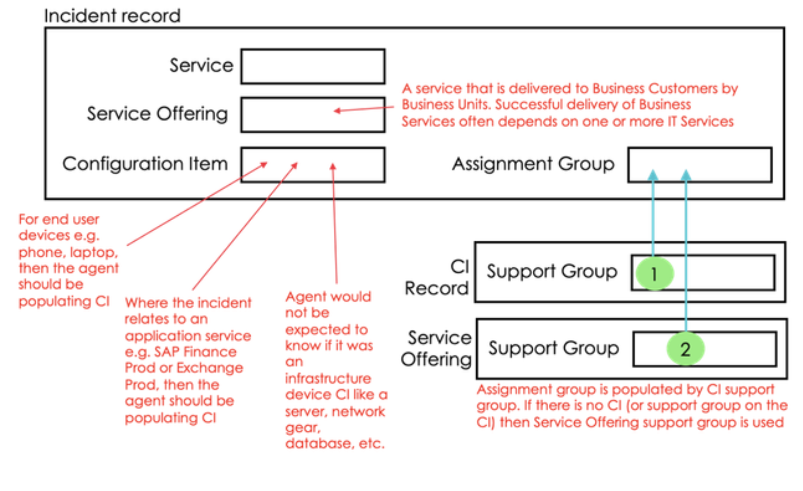
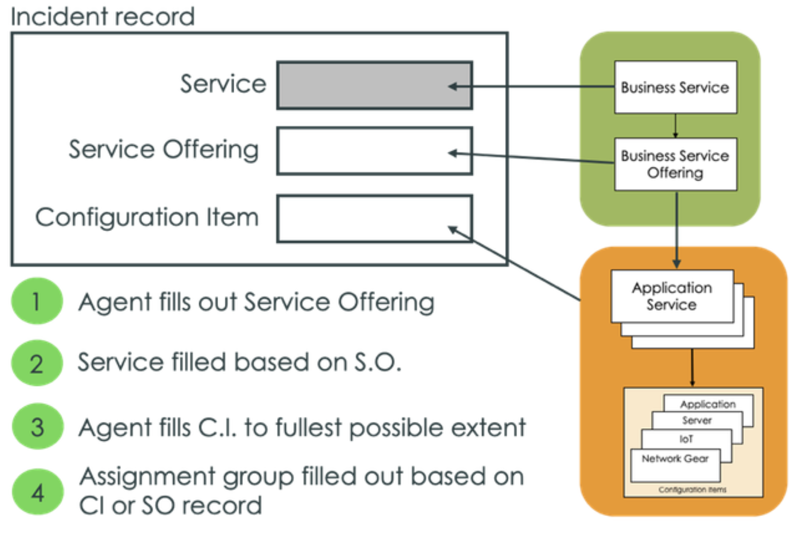
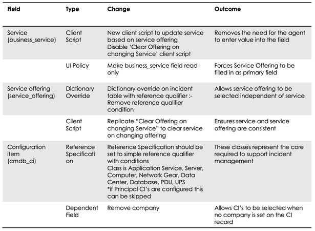
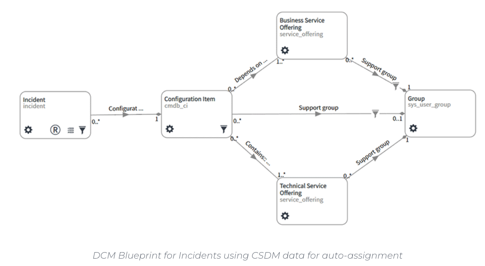

# Align Incident Management with CSDM

This document provides an overview of how to align Incident Management with the Common Service Data Model (CSDM). It covers three primary use cases for creating incidents, recommended configuration changes to the Incident form, and suggested process flows. By aligning Incident Management with CSDM, organizations can reduce ambiguity in selecting services and improve resolution times.

---

## Use Cases for Incident Creation

1. **End User Perspective**

   - Users typically reference an application (e.g., Outlook) or a device (e.g., a printer), without distinguishing between Business or Technical Services.
   - Configure the Incident form so that users can easily report issues without overcomplicating service selection.

2. **IT Staff Perspective**

   - IT teams (network, middleware, database, etc.) may raise incidents for systems or dependencies they own.
   - Ensure that the Incident form supports selecting the relevant Technical Service or Service Offering for a more precise categorization.

3. **System-Generated Incidents**
   - Alerts and events from monitoring systems (e.g., Event Management) or outages (e.g., triggered by changes) can automatically create incidents.
   - Make sure the system maps these incidents to the appropriate Technical or Business Services via the CSDM relationships.

---

## Recommended Changes to the Incident Form

- **Service Field and Service Offering**

  - Set up the form so that entering a **Service Offering** automatically populates the corresponding **Service**.
  - This approach ensures that services are accurately derived from the selected Service Offering.

- **Filtering the CI Field**

  - Filter CI classes to display only those relevant to your typical IT environment or to the selected Service/Service Offering.
  - Reduces clutter and helps ensure consistency between CI data and service data in the CMDB.

- **When the CI is Selected First**
  - Filter the Service Offering field to show only relevant Business or Technical Services linked to the CI.
  - Avoid letting users pick incompatible combinations of CIs and services.

  
_Figure 1: High-level overview of aligning the Incident form with CSDM_

---

## Process Flow for CSDM-Aligned Incident Management

1. **User/IT Staff/System** reports or triggers an incident.
2. **Select Service Offering** on the Incident form.
3. The **Service** field is auto-populated (read-only or hidden, depending on configuration).
4. The **CI** field is filtered to show only those items associated with that Service Offering.
5. **Technical vs. Business Service**:
   - If a user-level service, it likely maps to a **Business Service Offering**.
   - If an IT-level service, it aligns with a **Technical Service Offering**.

  
_Figure 2: Example workflow from user/service selection to resolution_

---

## Required Configuration Changes

- **Make the Service Field Read-Only**

  - Once the Service Offering is selected, automatically set the parent Service field and disable direct edits. This reduces errors.

- **Implement Filtering**

  - Dynamically filter the **CI** field to ensure only valid CIs for the chosen Service/Offering appear.

- **Auto-Populate Parent Service**
  - Scripting or reference qualifiers can be used to set the parent Service whenever the Service Offering is chosen.

  
_Figure 3: Example configuration changes needed_

---

## Process Flow Diagram

Below is an expanded process flow, illustrating how the three use cases converge on a CSDM-aligned Incident form:

  
_Figure 4: Incident management process flow integrating CSDM concepts_

---

## Further Guidance

- [What is a Service and Service Offering (PDF)](https://www.servicenow.com/content/dam/servicenow-assets/public/en-us/doc-type/success/quick-answer/services-service-offerings.pdf)
- [Define and map out your business services (PPT)](https://www.servicenow.com/content/dam/servicenow-assets/public/en-us/doc-type/success/checklist/business-service-definition-mapping.pptx)
- [CSDM workshop](https://nowlearning.servicenow.com/nowcreate?id=nc_asset&asset_id=5c4d48bfdb998d100c912b691396198e)
- [CMDB workshop](https://nowlearning.servicenow.com/nowcreate?id=nc_asset&asset_id=3054c3838795d9d8af9f213acebb35c5)
- [CSDM Data model examples](https://nowlearning.servicenow.com/nowcreate?id=nc_asset&asset_id=c0ddb115db6d0d900c912b6913961987)

---

## Benefits of Aligning Incident Management with CSDM

- **Clarity and Accuracy**: Users or IT staff select the correct service context, ensuring better reporting.
- **Faster Resolution**: Incidents are automatically routed to the right teams based on the associated service or service offering.
- **Improved Reporting**: Consistent service data enables meaningful metrics about incident trends and service impacts.
- **Seamless Integration**: Events and alerts can automatically link to the correct service layer (Business vs. Technical), simplifying triage.

---

## References and Further Reading

- [How to Configure Incident Management to Align with CSDM (community article)](https://www.servicenow.com/community/itsm-articles/how-to-configure-incident-management-to-align-with-csdm-a/ta-p/2340041)
- [CSDM with Incident Management (Data Content Manager blog)](https://datacontentmanager.com/csdm-with-incident-management/)

By following these recommendations, you ensure Incident Management leverages the structured, hierarchical approach that the Common Service Data Model provides.
