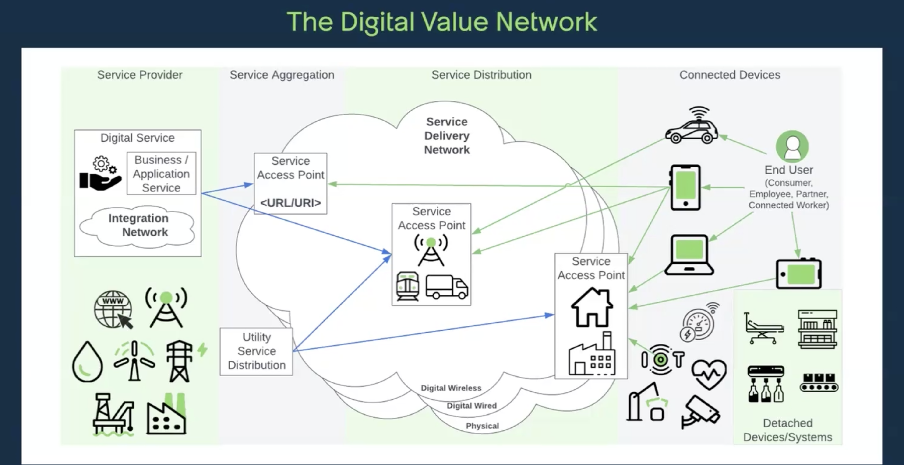
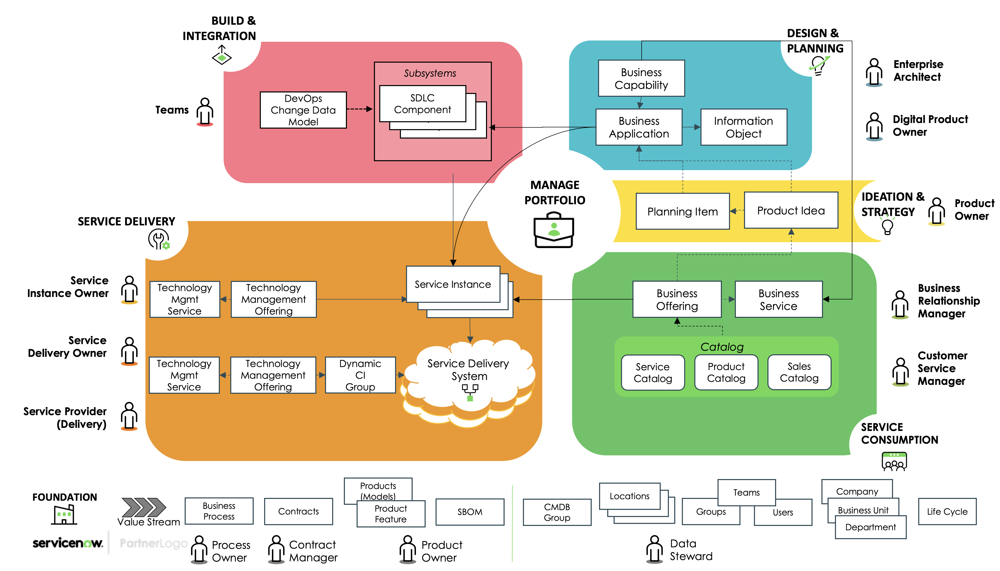
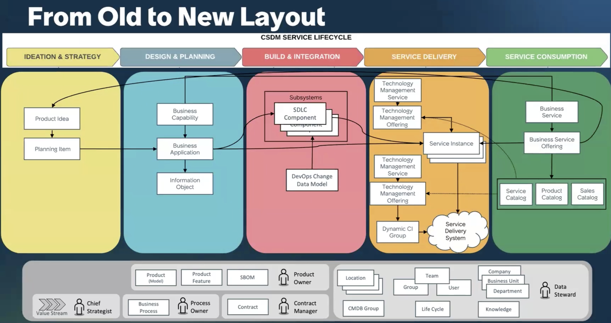
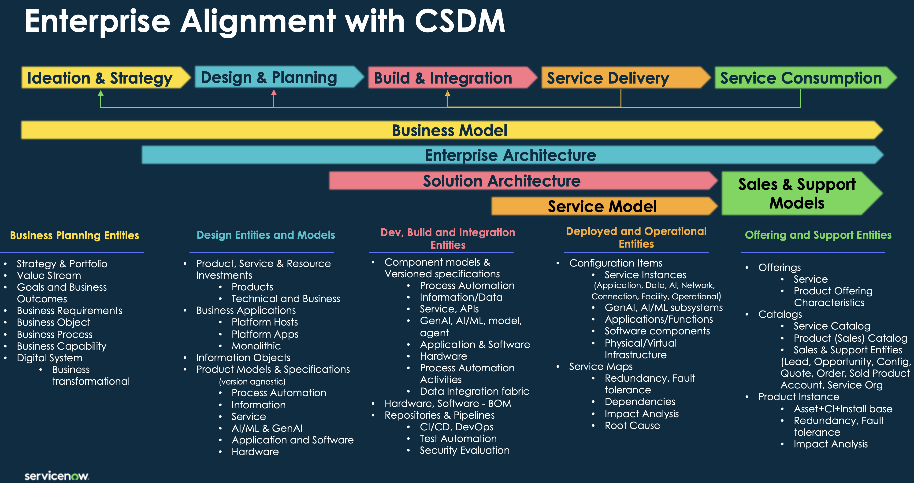
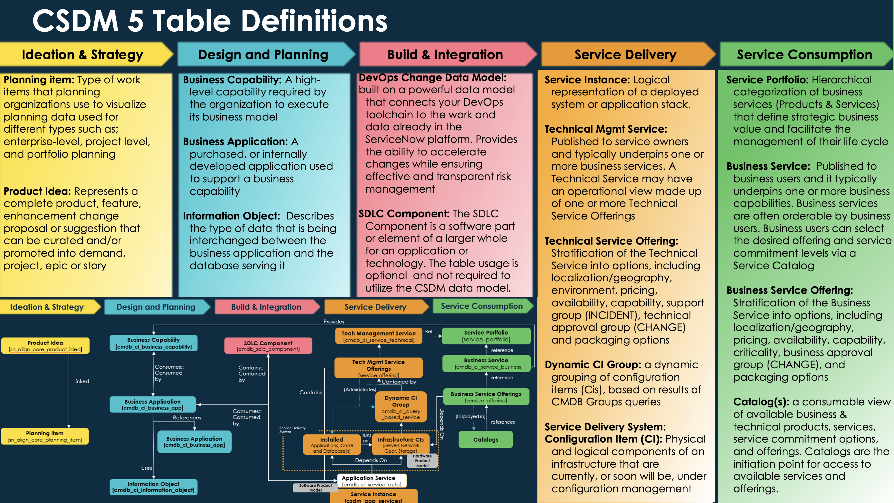
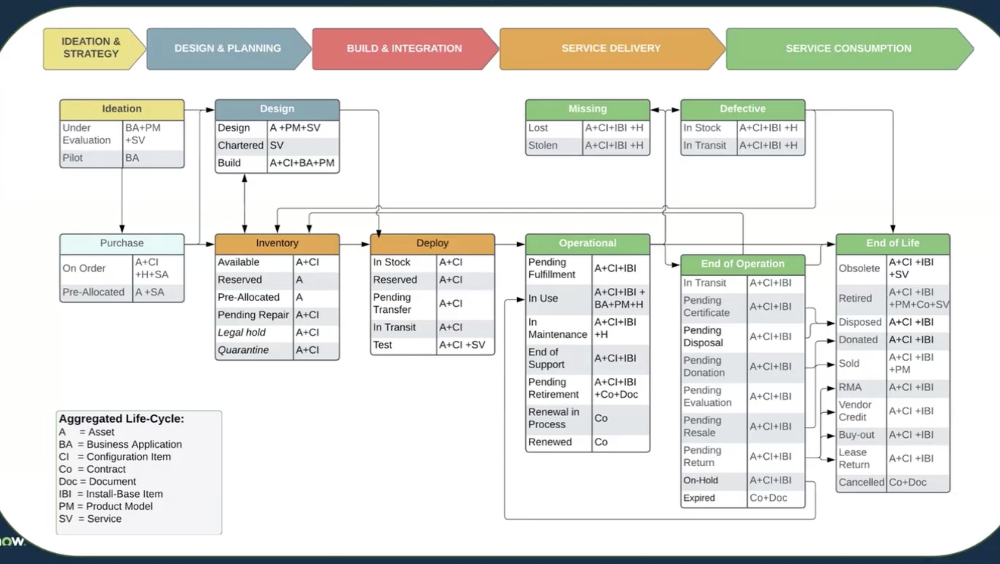

# Common Service Data Model CSDM

## Resources

- [docs: Implementing the CSDM framework in stages](https://www.servicenow.com/docs/bundle/washingtondc-servicenow-platform/page/product/csdm-implementation/concept/csdm-implementation-stages.html)
  - [implementation notes](#implementing-the-csdm-framework)
- **CSDM** Getting Started with Services and Service Offerings
  - [NowCreate: CSDM Workshop - Getting Started](https://nowlearning.servicenow.com/nowcreate?id=nc_asset&asset_id=dde64c62875255d0f2f443f7dabb354b)
  - [CSDM workshop](https://nowlearning.servicenow.com/nowcreate?id=nc_asset&asset_id=5c4d48bfdb998d100c912b691396198e)
  - [CMDB workshop](https://nowlearning.servicenow.com/nowcreate?id=nc_asset&asset_id=3054c3838795d9d8af9f213acebb35c5)
  - [CSDM Data model examples](https://nowlearning.servicenow.com/nowcreate?id=nc_asset&asset_id=c0ddb115db6d0d900c912b6913961987)

### Links

- [Docs](https://docs.servicenow.com/)
  - [CI relationships in the CMDB](https://docs.servicenow.com/csh?topicname=c_CIRelationships&version=latest)
- [Developer](http://developer.servicenow.com/)
- [CSC (Customer Success Center)](https://www.servicenow.com/success.html)
- [Community](https://www.servicenow.com/community/)
  - [List of all "Get Well Playbooks" (CSDM & CMDB)](https://www.servicenow.com/community/cmdb-articles/list-of-all-quot-get-well-playbooks-quot-csdm-amp-cmdb/ta-p/2301917)
- [YouTube](https://www.youtube.com/user/servicenowinc)
- [Center of Excellence and Innovation (CoEI)](https://www.servicenow.com/success/playbook/center-excellence-innovation-coei.html)

## Implementing the CSDM framework

- [docs: Implementing the CSDM framework in stages](https://www.servicenow.com/docs/bundle/washingtondc-servicenow-platform/page/product/csdm-implementation/concept/csdm-implementation-stages.html)
  - [docs: Configure the CSDM Data Foundations dashboard](https://www.servicenow.com/docs/bundle/washingtondc-servicenow-platform/page/product/csdm-implementation/task/csdm-foundations-dashboard.html)
    - [docs: CSDM Data Foundations dashboard](https://www.servicenow.com/docs/bundle/washingtondc-servicenow-platform/page/product/csdm-implementation/concept/csdm-data-foundations-dashboard.html)
    - 1. install free plugin `CSDM and the CMDB Data Foundations Dashboards`
    - 2. populate CSDM metrics by activating and executing the following scheduled jobs:
      - `CSDM Get Well Metric Collection` - collect metrics for compliant CIs, runs daily, stores results in table [sn_getwell_csdm_score]
      - `CSDM Data Foundations PA Metric Collection` - total count of non-compliance CIs
  - [docs: First activation step — Map existing life cycle data to CSDM standards](https://www.servicenow.com/docs/bundle/washingtondc-servicenow-platform/page/product/configuration-management/concept/csdm-life-cycle-standard-values.html)
    - Mapping table: `All > CSDM > Life Cycle Mapping` / [life_cycle_mapping]
      - OOB states should already be mapped to CSDM stage + status
      - incomplete records for custom states are automatically added, map appropriate LC stage + status to activate the records: [docs: Specify how to map legacy life-cycle states to CMDB states](https://www.servicenow.com/docs/bundle/washingtondc-servicenow-platform/page/product/configuration-management/task/create-life-cycle-migration.html)
        - If you map more than one legacy status value set to any single life-cycle value pair, then select the Reverse sync option
      - after checking the mappings, activate LC mapping with the `Activate` button on table level: [docs: Activate life cycle migration](https://www.servicenow.com/docs/bundle/washingtondc-servicenow-platform/page/product/configuration-management/task/activate-life-cycle-migration.html)
  - [docs: Second activation step — Activate the CSDM plugin](https://www.servicenow.com/docs/bundle/washingtondc-servicenow-platform/page/product/csdm-implementation/task/csdm-enable.html)
  - [docs: Third activation step — Migrate existing data to the CSDM framework](https://www.servicenow.com/docs/bundle/washingtondc-servicenow-platform/page/product/csdm-implementation/task/migrate.html)
    - [CSDM migration tools](https://www.servicenow.com/docs/bundle/washingtondc-servicenow-platform/page/product/csdm-implementation/concept/csdm-migrate-tools.html)
    - manage custom attributes by deciding which are actually required:
      - Keep: The custom attribute doesn't have a related base-system attribute but it's required for a unique use case.
      - Refactor: The custom attribute does have a base-system attribute or a capability that can be migrated.
      - Do Not Need: The customization is no longer needed. Delete the attributes that you don’t use or use only rarely. Consider deleting attributes if there’s a better way to address a use case.
    - consider related dependencies: not automatically moved, identify with help of [identifying table dependencies script](https://www.servicenow.com/community/common-service-data-model/migrating-into-csdm-identifying-table-dependencies/ta-p/2308617)
      - use to estimate migration effort
  - CSDM implementation stages
    - [docs: Foundation](https://www.servicenow.com/docs/bundle/washingtondc-servicenow-platform/page/product/csdm-implementation/concept/csdm-implement-foundation-stage.html)
    - [docs: Crawl](https://www.servicenow.com/docs/bundle/washingtondc-servicenow-platform/page/product/csdm-implementation/concept/csdm-implement-crawl-stage.html)
    - [docs: Walk](https://www.servicenow.com/docs/bundle/washingtondc-servicenow-platform/page/product/csdm-implementation/concept/csdm-implement-walk-stage.html)
    - [docs: Run](https://www.servicenow.com/docs/bundle/washingtondc-servicenow-platform/page/product/csdm-implementation/concept/csdm-implement-run-stage.html)
    - [docs: Fly](https://www.servicenow.com/docs/bundle/washingtondc-servicenow-platform/page/product/csdm-implementation/concept/csdm-implement-fly-stage.html)
  - [docs: Auto-generate product models for logical CIs](https://www.servicenow.com/docs/bundle/washingtondc-servicenow-platform/page/product/csdm-implementation/task/csdm-auto-create-prod-model-for-ci.html)

### CSDM Maturity Stages

1. **Foundation**
   - Clean core/foundation data: users, locations, groups
2. **Crawl**
   - Define Business Applications
   - Discover application services
3. **Walk**
   - Add dynamic CI groups, technical services & offerings
   - Enable service portfolio
4. **Run**
   - Business services + offerings
   - Cross-product visibility & cost reporting
5. **Fly**
   - Business capabilities, info objects, catalog integration
   - Rationalized application portfolio

## CSDM Basics

| Aspect                 | Business Application                                                                                                                                                                      | Application Service (subclass of Service Instance)                                                                                       | Application                                                                                                                                                   |
| ---------------------- | ----------------------------------------------------------------------------------------------------------------------------------------------------------------------------------------- | ---------------------------------------------------------------------------------------------------------------------------------------- | ------------------------------------------------------------------------------------------------------------------------------------------------------------- |
| **Description**        | Represents all software and infrastructure environments (Dev, Test, Prod) configured to provide business functionality; supports application rationalization, optimization, modernization | Logical representation of a deployed application stack; may include parent/child relationships for microservices or platform deployments | Any deployed program, module, or group of programs providing specific functionality on compute infrastructure; installed bits and bytes                       |
| **Scope**              | Connects IT to business outcomes; supports business capabilities                                                                                                                          | Operational delivery of a specific business application; connects technical layer with business layer                                    | Technical software components; foundation of application services                                                                                             |
| **CMDB Class**         | `cmdb_ci_business_app`                                                                                                                                                                    | `cmdb_ci_service_auto`                                                                                                                   | `cmdb_ci_appl`                                                                                                                                                |
| **Key Details**        | Not an operational CI; not used in Incident, Problem, Change; not version specific; contains metadata about the business application                                                      | Operational CI; used in Incident, Problem, Change for impact analysis; may be created per environment or geo                             | Operational CI; used in Incident, Problem, Change; unique deployment on specific host; discoverable installation of code communicating over a particular port |
| **Creation Method**    | Manual                                                                                                                                                                                    | Manual mapping; Service Mapping with entry point; Service Mapping with tags; Service Mapping with ML; Dynamic CI Group with query        | ServiceNow Discovery; Service Graph Connectors; Service Mapping                                                                                               |
| **Relationships**      | Business capabilities; application services; information objects                                                                                                                          | Supporting and connected applications; hosting infrastructure; other application services                                                | Hosting infrastructure                                                                                                                                        |
| **Examples**           | Payroll System                                                                                                                                                                            | Americas Payroll Application Service; APAC Payroll Application Service; Payroll Application Service (Dev)                                | MySQL; Apache Tomcat; Websphere                                                                                                                               |
| **Key Reference Data** | Business process; business criticality; support vendor; business owner; IT application owner; life cycle status                                                                           | Managed by group; support group; change group; owned by; life cycle status                                                               | Managed by group; support group; change group; owned by; life cycle status                                                                                    |

## Overview

### CSDM Fundamentals

- CSDM evolved from CMDB-focused to a platform-wide framework
- CSDM 5 enables cross-product data modeling and is a prerequisite for multi-product outcomes
- Aligns data across products and stakeholders (architecture, engineering, external partners)
- Core to AI, automation, and product extensibility

### Benefits of CSDM

- Link infrastructure to strategic services
- Consistent and governed data modeling
- Connects performance to services via offerings
- Enables true ownership: service, support, approval groups
- Unlocks out-of-box CSDM dashboards and reports
- Enables standardization, reduced technical debt, and future readiness
- Business value (based on ServiceNow internal KPIs, assessments, calculators):
  - Faster time to value:
    - 20–40% faster onboarding
    - 10–15% faster service introduction
  - Cost reduction:
    - 10–20% in applications
    - 15–25% in operations
  - Operational efficiency gains:
    - 27% faster incident resolution
    - 46% fewer high-priority incidents
    - 26% fewer failed changes
    - 28% lower critical vulnerability age
    - 485% more problems resolving incidents

### AI Contextual Layers

- **CMDB Layer**:
  - Technical CIs, nodes, software/code, multidimensional relationships
- **Service Graph Layer**:
  - AI-powered mapping, history, situational awareness
- **Knowledge Graph Layer**:
  - Business context, KBs, personalization, GenAI

### AI Strategy Triad

- Data = Workflow Data Fabric (CSDM)
- Workflows = AI Workflows
- Agents = Agentic AI for business context

### Technical Debt Examples

- Wrong CI tables (e.g., Business Apps on wrong table)
- Manual/custom lifecycle processes
- Poor data hygiene: locations, automation gaps
- Result: upgrade issues, ROI drop, product incompatibility

### Service vs. Product

- Product: Can be a service or good (e.g., laptop, excavator, onboarding)
- Service: May be a product or support it

---

## Domains

### Foundation Domain

- Provides referential data (not used in CMDB relationships)
- **Key Tables**:
  - `User`, `Group`, `Team`, `Company`, `Department`, `Location`, `Life Cycle`
  - `Product`, `Product Feature`, `SBOM`
  - `Contract`, `Business Process`, `Value Stream`
- Business Process is a CI class: `cmdb_ci_business_process`
- Life Cycle:
  - Aggregated lifecycle with type-specific status values
  - No customizations allowed (replaces 9 legacy status fields)

### Ideation & Strategy Domain

- Define **Mission**, **Vision**, **Value**
- Goals:
  - Broad outcomes, tied to portfolios
- Features & Tools:
  - Strategic Portfolio Management
  - EA/APM
  - Digital Portfolio Management

### Design & Planning Domain

- **Key Objects**:
  - Business Capability
  - Business Application
  - Information Object
- Tools:
  - SPM, EA, Digital Portfolio Management, Integrated Risk Management

### Build & Integrate Domain

- **Objects**:
  - DevOps Data, SDLC Component
  - AI Digital Assets:
    - `alm_ai_system_digital_asset`, `alm_ai_model_digital_asset`, `alm_ai_dataset_digital_asset`, `alm_ai_prompt_digital_asset`
  - Foundational:
    - `Product Feature`, `cmdb_ai_system_component_product_model`, `cmdb_ai_content_product_model`
- Products:
  - DevOps, Digital Product Release, SecOps, GRC, EA, HAM/SAM

### Service Delivery Domain

- **Service Instance types**:
  - `cmdb_ci_service_auto`: Application Service
    - Mapped: `cmdb_ci_service_discovered`
    - Calculated: `cmdb_ci_service_calculated`
    - Tag-based: `cmdb_ci_service_by_tags`
    - Dynamic Group: `cmdb_ci_query_based_service`
  - `cmdb_ci_data_service_instance`
  - `cmdb_ci_network_service_instance`
  - `cmdb_ci_connection_service_instance`
  - `cmdb_ci_facility_service_instance`
  - `cmdb_ci_operational_process_service_instance`
- **Service Delivery Network**:
  - API (`cmdb_ci_api`)
  - Application (`cmdb_ci_appl`)
  - AI Function (`cmdb_ci_function_ai`)
  - AI Application (`cmdb_ci_ai_application`)
- Foundational:
  - `cmdb_model`, `cmdb_group`, SBOM (`sn_sbom_doc`, `sn_sbom_component`)
- Products:
  - ITOM Visibility, IH-ETL, Service Graph, ITSM, CSM, GRC, EA, Asset Mgmt

### Service Consumption Domain

- **Objects**:
  - Business Service (`cmdb_ci_service_business`)
  - Business Service Offering (`service_offering`)
  - Catalog (`sc_catalog`)
- Products:
  - Service Builder
  - Service Portfolio Management
  - ITSM, GRC, EA, DPM, CSM, BCM

---

## Service Definitions & CI Classes

### Application

- `cmdb_ci_appl`: Deployed executable program on a host
- `cmdb_ci_business_app`: Logical grouping of applications for business value
- `cmdb_ci_service_auto`: Operational instance of a Business Application

### Services

- **Application Service / Service Instance** (`cmdb_ci_service_auto`)
  - Populated via manual mapping, entry point, tags, or dynamic query
- **Business Service** (`cmdb_ci_service`, `cmdb_ci_service_business`)
  - For end users/customers; used in IPC
- **Technical Management Service** (`cmdb_ci_service_technical`)
  - Teams providing/supporting tech services; used in IPC

---

## Tables & Classification

### Key Table Mappings

| Label                               | Table Name                                                                             | Notes               |
| ----------------------------------- | -------------------------------------------------------------------------------------- | ------------------- |
| Product Idea                        | `sn_align_core_product_idea`                                                           |                     |
| Planning Item                       | `sn_align_core_planning_item`                                                          |                     |
| Business Capability                 | `cmdb_ci_business_capability`                                                          |                     |
| Business Application                | `cmdb_ci_business_app`                                                                 |                     |
| Information Object                  | `cmdb_ci_information_object`                                                           |                     |
| DevOps Data Model                   | _(various)_                                                                            |                     |
| SDLC Component                      | `cmdb_ci_sdlc_component`                                                               |                     |
| Tech Mgmt Service                   | `cmdb_ci_service_technical`                                                            | "Technical Service" |
| Tech Mgmt Offering                  | `service_offering`                                                                     | "Technical Service" |
| Service Instance                    | `cmdb_ci_service_auto`                                                                 |                     |
| Application Service                 | `cmdb_ci_service_discovered`, `cmdb_ci_query_based_service`, `cmdb_ci_service_by_tags` |                     |
| Data/Network/Facility/etc. Services | _see specific table names_                                                             |                     |
| API                                 | `cmdb_ci_api`                                                                          |                     |
| Application                         | `cmdb_ci_appl`                                                                         |                     |
| Service Portfolio                   | `service_portfolio`                                                                    | Not a CMDB CI       |
| Business Service Offering           | `service_offering`                                                                     |                     |
| Request Catalog                     | `sc_catalog`                                                                           | Not a CMDB CI       |

---

## Relationships

- Value Stream ↔ Business Capability / Business Process (m:n)
- Value Stream Stage ↔ Business Process / Business Capability
- Business Process [Operationalizes::Operationalized by] Business Capability
- Business Capability [Provides::Provided by] Business App / Business Service
- Business App [Uses::Used by] Info Object / App Service / Business Process
- Application Service [Depends on::Used by] App / Service Instance
- Service Instance [Connected by::Connects] Connection Service
- API ↔ Business Service Offering / App Service / Application
- Application [Runs on::Runs] Infrastructure CI
- Business/Tech Mgmt Service [Published as] Offerings
- Service Instance [Contained by] Offerings / Dynamic CI Group
- Business Service [Is part of] Service Portfolio

_Note_: Relationship "Consumes::Consumed by" deprecated → use "Uses::Used by"

## CSDM Lifecycle Model: Assets & CIs

- problem:
  - In CSDM 4 there where 9 state/status attributes across ITAM and CMDB
  - Most customers (over 50%) customized the choice lists
  - No differentiation between physical and logical CIs
- New: overall aggregated life cycle but based on type different stage/status values are available
  - Must not be customized

---

## Portfolio Management Perspectives

- **Enterprise/Service**: DPM
- **Personal**: DPM
- **Application**: EA
- **Project**: SPM
- **Technology**: EA

### SPM Lenses

- Value Stream
- Product
- Organization
- Goals
- Project Portfolio / Program
- Strategic Investments

---

## Deprecations in CSDM

- `Use_for`, `Hardware status`, `Install status` ❌
- Base Service class ❌ → Use extended classes (Service Builder)
- `cmdb_rel_group`, `cmdb_rel_group_type` ❌ → Use TEAMs
- Software Package/Install tables ❌ → Use SAM (Foundations/Pro)

---

## Transitioning Approaches

- **Outcome-centric**: Align with business priorities
- **Domain-centric**: Progress one domain at a time
- **Step-wise** _(Legacy)_:
  - Foundation → Crawl → Walk → Run → Fly

## Labs

### Lab 1.01 - CSDM Introduction

🎯 **Goal**: Build and model foundational CSDM elements across all domains

- **A. Analyze CSDM Data Foundations Dashboard**

  - Navigate to **Configuration > CSDM Data Foundations Dashboard**
  - Review metrics across tabs: _Foundation_, _Crawl_, _Walk_, _Run_, _Fly_

- **B. Create Foundational Data**

  - Create `CD-Support Group` and `CD-Change Group` in **User Administration > Groups**
    - Add _System Administrator_ to each
  - Create `CD-Parent Location` and `CD-Child Location` in **User Administration > Locations**
    - Set parent-child relationship

- **C. Configure Business Applications and Capabilities**

  - Navigate to **CSDM > Design > Business Application**
    - Create `CD-Business Application` (COTS, Web Based)
    - Owner: _Abel Tuter_
  - Navigate to **CSDM > Design > Business Capability**
    - Create `CD-Capability`
    - Use Relationship Editor: `Provided by (Parent)` → CD-Business Application

- **D. Configure Information Object**

  - Navigate to **CSDM > Design > Information Object**
    - Create `CD-Information Object`
    - Relate to CD-Business Application via `Uses (Parent)`

- **E. Configure Business Service and Offering**

  - Use **Service Portfolio Management > Service Builder**
    - Create `CD-Business Service` → Phase=`Catalog`, Status=`Operational`
    - Create `CD-Business Service Offering` with Support=`CD-Support Group`, Change=`CD-Change Group`

- **F. Configure Technology Management Service and Offering**

  - Create `CD-Technology Management Service` and Offering using same values as above
  - Set both to Catalog/Operational

- **G. Create Service Instance (Application Service)**
  - Use **CSDM Application Service Wizard**
    - Name: `CD-Service Instance/Application Service`
    - Environment: `Production`, Owned by: _Abel Tuter_
    - Relate to business app, business offering, and tech offering
    - Use Manual population method with class `Windows Server` and CI `CD-Windows Server`

---

### Lab 2.01 - CSDM Realized Outcomes

🎯 **Goal**: Visualize how CSDM improves ITSM, change, and operations outcomes

- **A. Explore CSDM Data Foundations Dashboard**

  - Navigate to **Configuration > CSDM Data Foundations Dashboard**
  - Review metrics under all tabs and their improvement through prior labs

- **B. Incident Management**

  - Create new incident for _Abel Tuter_
  - Enter `CD` in _Service_, _Service offering_, _Configuration item_ fields
  - Use _Open in Dependency Views_ to see relationships
  - Save incident and verify auto-populated _Assignment group_

- **C. Change Management**

  - Create new change request
  - Enter _CD-Business Service_, _CD-Business Service Offering_, _CD-Service Instance/Application Service_
  - Use _Open in Dependency Views_ to validate relationships and identify impacted infrastructure
  - Save and confirm _Assignment group_ auto-population

- **D. Unified Map**

  - From the change record, open **CMDB Workspace** and then Unified Map
  - Use filter and _Related items > Active incidents_ to explore relationships

- **E. Enterprise Architecture**

  - Navigate to **Digital Portfolio Management > All Business Applications**
  - Open `CD-Business Application`, select _Show Dependency Views_

- **F. Event Management Simulation**

  - Use **Service Operations Workspace > Event Generator**
    - Source: `SolarWinds`, Node: `CD-Windows Server`
    - Severity: `Major`, Description: `Memory exceeds expected threshold`
  - Verify correlated alert in **Events**
  - Open **Service Dashboard**, check CD-Service Instance now appears orange
  - Open _Service Map_ to trace root cause to impacted CI

- **G. Challenge**
  - Create full new CSDM-based service instance for `SN-ServiceNow` with complete upstream/downstream relationships and groups

---

### Lab 3.01 - Dynamic CI Groups and Foundational Group Data

🎯 **Goal**: Create dynamic CI groups and sync foundational group data to CIs

- **A. View Foundational CI Data**

  - Navigate to **Configuration > Servers > Windows**
  - Search for `SYD` or `CD` servers
  - Personalize list to show _Support group_, _Change group_, _Managed By group_

- **B. Assign Group from CI Class Manager**

  - Create `CD-Managed By Group` in **User Administration > Groups**
  - Add _System Administrator_ as member
  - Navigate to **Configuration > CI Class Manager**
    - Select _Windows Server_ class
    - Set `Managed By group` = `CD-Managed By Group`
  - Run **CSDM Data Sync** job and verify update on SYD servers

- **C. Create CMDB Group and Dynamic CI Group**

  - Create `CD-Sydney Win Servers CMDB Group` in **Configuration > CMDB Groups**
    - Encoded query: `Name starts with syd OR cd`
  - Create `CD-Sydney Win Servers Dynamic CI Group` in **Configuration > Dynamic CI Groups**
    - Link to above CMDB group

- **D. Associate Dynamic CI Group to Service Offering**

  - Use **Service Builder** → Open `CD-Technology Management Service Offering`
  - Under _Application services | contain_ field, add `CD-Sydney Win Servers Dynamic CI Group`
  - Ensure Team tab has Support/Change groups set

- **E. Sync Group Data to CIs**

  - Run **CSDM Data Sync** job to sync group data from offering to CIs
  - Verify `SYD` servers reflect _Support_, _Change_, and _Managed By_ groups

- **F. Change Management with Dynamic CI Group**

  - Create change request with CI = `CD-Sydney Win Servers Dynamic CI Group`
  - Confirm _Assignment group_ auto-filled
  - Verify group unpacking into _Affected CIs_
  - Remove one CI, refresh _Impacted Services/CIs_

- **G. Challenge**
  - Manually create server `SYD51-DC1-WIN12`
  - Run:
    - `Update Query Based Services` job
    - `CSDM Data Sync` job
  - Confirm group attributes populate from service offering

---

### Lab 4.01 - Digital Portfolio Management (DPM)

🎯 **Goal**: Integrate CSDM-modeled services with DPM to visualize portfolios and KPIs

- **A. Add Foundational Data**

  - Create user `CD.DPM Solution Owner`
  - Create group `CD-DPM Solution Owner Group`, add _CD DPM Solution Owner_ and _Abel Tuter_
  - Assign roles: `sn_dpm.dpm_manager`, `portfolio_editor`

- **B. Create Service Portfolio and Taxonomy Node**

  - Create `CD-Service Portfolio` and set owner = _CD DPM Solution Owner_
  - Create `CD-Taxonomy Node` and associate with above portfolio

- **C. Associate Services to Portfolio & Taxonomy**

  - Open `CD-Business Service` and `CD-Technology Management Service` via Service Builder
  - Set _Portfolio_ = `CD-Service Portfolio`, _Node_ = `CD-Taxonomy Node`

- **D. Explore DPM Workspace**

  - Navigate to **Digital Portfolio Management Workspace**
  - Explore:
    - _Home_, _Personal portfolios_, _Enterprise portfolios_
    - Expand portfolio: verify services under taxonomy
    - View _Owned by me_ vs _All_
    - Impersonate _CD DPM Solution Owner_ and _Abel Tuter_ to compare access

- **E. Configure KPI Group Mappings**

  - Navigate to **KPI Groups**, open `Performance snapshot`
  - Add `CD-Service Portfolio` under _KPI Group Mappings_
  - Run **DPM: Daily Data Collection** job (adjust `Relative end` = 0)
  - Return to DPM Workspace, verify KPIs appear in nodes

- **F. Create Custom KPI Group**

  - Create `CD-KPI Group` of type `Service portfolios`, order=`200`
  - Add `CD-Service Portfolio` as mapping
  - Add KPI: `DPM: Number of new incidents`, label: `New Incidents`

- **G. Challenge**
  - Add second KPI to group:
    - KPI: `DPM: Number of new changes`
    - Label: `New Changes`, Order: `200`, Chart type: `Time Series: Line`
  - Run **DPM: Daily Data Collection**
  - In DPM Workspace, verify `CD-KPI Group` and both KPIs display across:
    - CD-Technology Management Service Offering (Run tab)
    - CD-Business Service Offering (Run tab)
    - CD-Service Portfolio (Overview tab)
