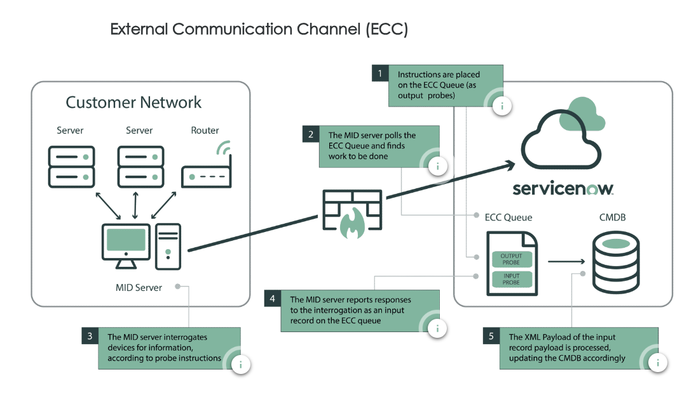

# MID Server

Back to [ServiceNow Discovery](./sn-discovery.md)

## Resources

- [KB0746702: How to Update a MID Server password](https://support.servicenow.com/kb?id=kb_article_view&sysparm_article=KB0746702)

## Overview

- MID: Management, Instrumentation, and Discovery
- lightweight Java application that runs as a Windows service or UNIX daemon
- does not retain any information, is a remote extension of an Instance in the enterprise network
- relevant for the following areas:
  - Discovery, Service Mapping
  - Cloud Provisioning and Governance, Cloud Insights
  - IntegrationHub, Event Management, Operational Intelligence
  - JDBC, LDAP, 3rd Party Integrations
- Outgoing (to SNow): https, port 443
- placement considerations:
  - Available bandwidth
  - Geographic location
  - IP access to targets (DMZs)
    - if port access from the internal network to the DMZ is limited, the DMZ might require an additional MID server
  - -> Always place the MID Server in a location that is not only close to the targets, but also has the most available bandwidth between it and the target.
- All > MID Server > Dashboard
  - MID Server status
  - MID Server Issues
  - Avg Percentage of CPU Used (Last 30 days)
  - Avg Percentage of Max Memory Used (Last 30 days)
- Installation
  - minimum requirements for 25 concurrent threads (base):
    - 2+ GHz Quad core processor
      - 64bit recommended
    - Windows Server 2012 R2
      - Linux possible, but Win recommended
    - PowerShell V3.0-5.1
      - `$PSVersionTable`
    - JRE min 11.0.8
      - `java -XshowSettings:properties -version`
    - connectivity to (only 443/80? or also any other ports required?):
      - servicenow.com
      - install.service-now.com
      - ocsp.entrust.net (or other OCSP CA)
      - External internet access to ServiceNow instance via port 443
  - Instance User
    - create MID server user
      - create a service account for each MID server
      - meaningful name to find in logs
    - create MID server group
    - assign role mid_server to group
    - assign users to group
  - MID server user - Windows
    - create service account
      - no local or domain admin
      - log on as a service permission
      - [step-by-step](#windows)
  - install MID server: elevated CMD Prompt `msiexec /i "Path\to\your\file.msi"`
    - SHIFT + Right-click > Copy as path
    - required information:
      - ServiceNow Instance URL, e.g. `https://instance.service-now.com`
      - ServiceNow MID Server Username
      - ServiceNow MID Server Password
      - MID Server Name - name for the MID server record in the SNow instance
      - Service Account Name - configured local service account with log on as a service permissions
      - Service Account Password
  - Validate: run validation before server is usable
  - Verify connectivity with Quick Discovery or scheduled Discovery
    - Quick Discovery
      - Discovery > Discovery Schedules > Quick Discovery
      - run immediate Discovery against a single IP

## ECC Queue



- External Communication Channel
- Instance places MID server instructions as output record on the queue
- MID server looks for work in the ECC queue via outbound port 443
- return results are placed by the MID server as input record into the queue
- Example: Discovery steps:
  1. instructions put into the ECC queue as outgoing probes
  2. MID Server monitors ECC Queue for jobs
  3. MID Server interrogates devices for information according to probe instructions
  4. MID Server reports responses as input record via the ECC queue
  5. XML payload of the input records is processed to update the CMDB
- default pull interval: 40 seconds
- process flow - Queue / State:
  - Output / Ready: new probe instructions in ECC Queue
  - Output / Processing: MID server is processing the probe instructions
  - Output / Processed: MID server has completed probe instructions
  - Input / Ready: MID server puts results in ECC Queue
  - Input / Processing: Instance is processing the input record
  - Input / Processed: Instance has processed the input record

### High Resource Deployments

- Standard MID server applications can share a MID server:
  - Discovery
  - Event Management
  - Integrations
  - Orchestration
  - Service Mapping
- selected applications are resource intensive and should be installed on dedicated hosts:
  - Cloud Management Platform (CMP)
  - alert aggregation and RCA
  - Operational Intelligence
- configuration:
- [MID server record] > Related Lists >
  - Supported Applications: disallow, for example, Cloud Management Platform, to avoid impacting Discovery
- MID Server Cluster
- cluster multiple MID server with same capabilities for load balancing and failover protection
- managed by business rule MID Server Cluster Management
  - checks to see if the MID Server assigned to a job in the ECC Queue belongs to a cluster
- two types: load balancing and failover protection cluster
  - but MID server can be simultaneous be part of both types of cluster
- creation
  - configure multiple MID server with same capabilities on an Instance
    - all are up and validated
  - All > MID Server > Clusters > New
    - configure name and type
    - Related Lists > Includes MID Servers
      - add MID Server to cluster
    - for failover configure MID server order

## Credential-less (NMap)

- [Install and uninstall Nmap on a MID Server](https://docs.servicenow.com/csh?topicname=install-nmap-on-mid-server.html&version=latest)
- [Credential-less Discovery with Nmap](https://docs.servicenow.com/csh?topicname=nmap-credential-less-discovery.html&version=latest)

## Installation

### Windows

- install MID server: elevated CMD Prompt `msiexec /i "Path\to\your\file.msi"`
  - SHIFT + Right-click > Copy as path
  - required information:
    - ServiceNow Instance URL, e.g. `https://instance.service-now.com`
    - ServiceNow MID Server Username
    - ServiceNow MID Server Password
    - MID Server Name - name for the MID server record in the SNow instance
    - Service Account Name - configured local service account with log on as a service permissions
      - Step 1: Create the Service Account
        - Open Computer Management:
          - Press Windows + R, type compmgmt.msc, and press Enter.
          - In the Computer Management window, expand Local Users and Groups and then click Users.
        - Create a New User:
          - Right-click Users, and then click New User.
          - In the New User window, fill in the required details for the new account:
          - Username: Name the service account (e.g., ServiceAccount1).
          - Password: Set a strong password for this account.
          - Uncheck User must change password at next logon and check Password never expires.
          - Click Create.
      - Step 2: Assign “Log on as a Service” Permission
        - The “Log on as a service” permission must be granted to this service account so that it can be used to run services. Here’s how you can do that:
          - Open Local Security Policy:
            - Press Windows + R, type secpol.msc, and press Enter to open the Local Security Policy editor.
            - Expand Local Policies and then click User Rights Assignment.
          - Grant Log on as a Service Permission:
            - In the right pane, find and double-click Log on as a service.
            - In the Log on as a service Properties window, click Add User or Group.
            - In the dialog box, enter the name of the service account you created (e.g., ServiceAccount1), then click OK.
            - Click OK again to close the properties window.
- Step 3: Configure the Service to Use the Service Account
  - Open Services:
    - Press Windows + R, type services.msc, and press Enter.
    - Locate the service you want to configure to run with the service account.
  - Modify Service Log On Settings:
    - Right-click the service and select Properties.
    - Go to the Log On tab.
    - Choose the option This account and enter the name of the service account (e.g., .\ServiceAccount1 for local accounts or DOMAIN\ServiceAccount1 for domain accounts).
    - Enter the password for the service account and confirm it.
    - Click OK.
  - Restart the Service:
    - After setting the account, restart the service to apply the changes. Right-click the service and choose Restart.

Configuration

- C:\ServiceNow MID Server mid-win22\agent\config.xml
  - `C:\` chosen installation path
  - `mid-win22` - MID server name
- XML parameter
  - url: instance url
  - mid.instance.username: instance mid server user
  - mid.instance.password: instance mid server user password hash
  - name: mid server name

#### Multiple MID Server Services on One Windows Host

- [docs: Install multiple MID Servers on a single system](https://www.servicenow.com/docs/bundle/yokohama-servicenow-platform/page/product/mid-server/task/t_InstallMultplMIDSvrOnASingleSys.html)

When installing multiple MID Servers on the same Windows host, the process differs from a standard single-instance installation in several key ways:

1. **Separate Installation Directories**  
   - Each MID Server must have its own unique installation directory at the top level of the drive (e.g., `C:\MIDServer1\`, `C:\MIDServer2\`).
   - Extract the MID Server installation package into each designated directory separately.

2. **Unique MID Server Names and Service Identifiers**  
   - During installation, provide a distinct name for each MID Server (e.g., `MIDServer_Discovery`, `MIDServer_Integration`).
   - Assign a unique Windows service wrapper name and display name to each MID Server service to avoid conflicts.

3. **Independent Configuration Files**  
   - Each MID Server has its own `config.xml` file, typically located in `C:\<MID Server Directory>\agent\config.xml`.  
   - Modify the parameters separately for each MID Server:
     - `url`: URL of the ServiceNow instance.
     - `mid.instance.username`: MID Server user credentials.
     - `mid.instance.password`: Hashed password for authentication.
     - `name`: Unique MID Server name.

4. **Service Account Considerations**  
   - While multiple MID Servers can run under the same Windows service account, it is best practice to use separate accounts for security and performance management.
   - If using a dedicated service account per MID Server, repeat the process of granting "Log on as a Service" permissions for each account.

5. **Starting Multiple MID Server Services**  
   - Navigate to the respective installation directories and start each MID Server using:

     ```sh
     /agent/start.bat
     ```

   - Ensure each service is registered and recognized in the Windows Services panel (`services.msc`).

6. **Validation in ServiceNow**  
   - Once installed, navigate to the **MID Server List** in ServiceNow.
   - Validate each MID Server separately to ensure proper registration and connectivity.

### Docker

- [docs: Containerized MID Server](https://www.servicenow.com/docs/bundle/xanadu-servicenow-platform/page/product/mid-server/concept/containerized-mid.html)

#### 1. Build a MID Server Docker Image (Linux)

- **Prerequisites and Requirements**
  - **Docker Engine & CLI 20.10.4 or later**
- Keep libraries updated to the newest versions available (or those with security patches).

- **Procedure**

  1. **Download Recipe & Verify**
     - Go to the **MID Server download page** (All > MID Servers > Downloads) and download the Docker recipe (ZIP).
     - Verify its digital signature (see documentation for details).
  2. **Unzip the Recipe**
  3. create MID Server User on Instance
  4. Fill `.env` file with at least the following content:

     ```txt
     DOCKER_TAG=...
     MID_INSTANCE_URL=https://<instance>.service-now.com/
     MID_INSTANCE_USERNAME=...
     MID_INSTANCE_PASSWORD=...
     MID_SERVER_NAME=...
     ```

     - This file can also contain other environment variables for the Docker build process.

  5. **Build the Docker Image**

     ```bash
     cd path/to/Dockerfile
     export $(grep DOCKER_TAG .env)
     docker build --platform=linux/amd64./ --tag "$DOCKER_TAG"
     ```

  6. **List Docker Images** (optional)

     ```bash
     docker image ls
     ```

#### 2. Launch Containerized MID Server (Docker)

1. **Prerequisites**

   - **Docker Engine & CLI 20.10.4+**

2. **Start the Container**

   ```bash
   docker run -d -p 8800:8800 --name "$MID_SERVER_NAME" --env-file ./.env "$DOCKER_TAG"
   ```

   - remarks:
     - `--network host` seems to reliably kill the mid server start
     - `-p 8800:8800` expose port for ACC Listener

#### 7. Additional Notes & Best Practices

- **Auto-upgrade**: For containerized MID Servers, it is recommended to **disable auto-upgrade** and rebuild the Docker image for new releases.
- **Scaling & Orchestration**: Containerization and orchestration (Kubernetes/Swarm) allow for automatic scaling, load-balancing, and self-healing.
- **Security**: Always use Docker/Kubernetes secrets for sensitive data.
- **Cleaning & Maintenance**: Use `docker rmi` or similar commands to keep your environment free of unused images.

With these steps, you can build, launch, and manage Containerized MID Servers on Linux using Docker, Docker Swarm, or Kubernetes, ensuring a secure and flexible approach to MID Server deployment.

## Troubleshooting

### MID Server FileNameComplianceInSync Error

- [community: MID Server FileNameComplianceInSync Error](https://www.servicenow.com/community/itom-forum/mid-server-filenamecomplianceinsync-error/td-p/3017630)

### Logs

#### Agent Logs on Host

- [KB0535148 Review the agent log for MID Server errors](https://support.servicenow.com/kb?id=kb_article_view&sysparm_article=KB0535148)
  - windows (default): `C:\<mid server folder>\logs\agent0.log.0`

#### Tail MID Server Logs

- [KB0534869 Tailing a MID server log file on Linux and Windows](https://support.servicenow.com/kb?id=kb_article_view&sysparm_article=KB0534869)
  - linux: `tail -f agent0.log.0` or `tail -f agent0.log.0 | grep -i "warning"`
  - windows: `C:\ Get-Content agent0.log.0 -Wait` or `C:\ Get-Content agent0.log.0 -Wait | where { $_ -match "warning" }`
