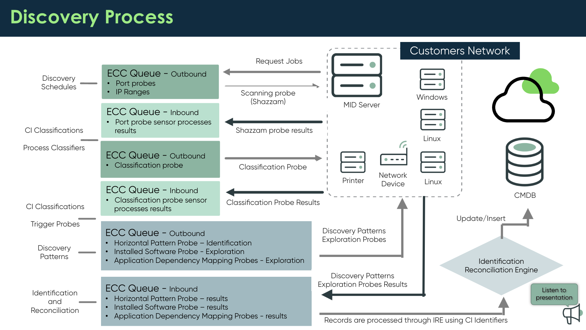

# CIS Discovery

## Further Resources

- Discovery
  - [MID Server](./sn-discovery-mid_server.md)
  - [File Based Discovery](./sn-discovery-file_based.md)
  - [Certificate Discovery](./sn-discovery-certificates.md)
  - [Kubernetes Discovery](./sn-discovery-kubernetes.md)
  - [AWS Discovery](./sn-discovery-aws.md)
  - [VMWare Discovery](./sn-discovery-vmware.md)
- CMDB
  - [CMDB](./sn-cmdb.md)
  - [CMDB Health](./sn-cmdb-health.md)
  - [CSDM: Common Service Data Model](./sn-csdm.md)
- Integration
  - [Intune Spoke](./sn-integration-intune.md)
  - [IntegrationHub](./sn-integration-integrationhub.md)
  - [Import](./sn-integration-import.md)
- [Asset Management](./sn-asset.md)
  - [SAM: Software Asset Management](./sn-asset-sam.md)
  - [HAM: Hardware Asset Management](./sn-asset-ham.md)
- [Service Mapping](./sn-service-mapping.md)

## Discovery Process

## Courses

### Discovery Extras

- 4 phases
  1. **Scanning**: "Are you there? What ports are responding?"
  2. **Classification**: "How should I classify you specifically?"
  3. **Identification**: "Have I seen you before?"
  4. **Exploration**: "What else can you tell me about yourself?"

#### DE: Discovery Subtopics

- [MID Server](./sn-discovery-mid_server.md)
- [File Based Discovery](./sn-discovery-file_based.md)
- [Certificate Discovery](./sn-discovery-certificates.md)
- [Kubernetes Discovery](./sn-discovery-kubernetes.md)
- [AWS Discovery](./sn-discovery-aws.md)
- [VMWare Discovery](./sn-discovery-vmware.md)

#### DE: Discovery Patterns Deep Dive

- How different types of patterns are initiated
  - Application: Pattern is triggered via a Process Classifier
    - shared by Discovery and Service Mapping
  - Infrastructure: pattern is triggered via a Classification record, for example Windows Classification - Windows 2019 Server
    - Triggers probes > HorizontalDiscoveryProbe-Horizontal Patt > Pattern
    - Infrastructure patterns are only used by Discovery
- The different sections to a pattern
  - Identification section
    - provided by ServiceNow, do not change
    - check by opening pattern, going to tab Pattern and verify that no Versions are displayed
  - Extension section
    - use for custom steps
- How Pre/Post scripts are used by patterns
  - Pattern Pre/Post Scripts table: All > Pattern Designer > Pre Post Processing
    - can be filtered, for example for scripts for a specific OS
  - run order
    - Pre execution
    - Pre Sensor
    - Post Sensor
- The pattern structure
  - When using step operation commands, how does ServiceNow know which protocol to use against the OS?
    - build in logic to determine OS
    - leads to using different tools for different OSs, for example SSH for Linux
    - All > Service Mapping > Administration > Discovery Commands
      - check which commands are valid for which OS
- How to use the pattern Retrieve Payload function
  - Discover Status > Discovery Log > Check Pattern Log > Payload Processing > Retrieve Payload (top right corner) > Retrieve Pattern Payload
    - shows input record set from the ECC Queue
      - (de-)select Pre-Sensor scripts and run them to see how payload changes

#### DE: Advanced Discovery Configuration

- [Advanced Discovery configuration](https://docs.servicenow.com/csh?topicname=c_DiscoveryExtendedCapabilities.html&version=latest)

  - [Group managed service accounts (gMSAs) configuration for Discovery](https://docs.servicenow.com/csh?topicname=gmsa-configuration-for-discovery.html&version=latest)
  - [Credential-less Discovery with Nmap](https://docs.servicenow.com/csh?topicname=nmap-credential-less-discovery.html&version=latest)
  - [PowerShell for Discovery and Service Mapping](https://docs.servicenow.com/csh?topicname=r_PowerShellForDiscovery.html&version=latest)
  - [Application Dependency Mapping (ADM) for Discovery](https://docs.servicenow.com/csh?topicname=r_ApplicationDependencyMapping.html&version=latest)
  - [Discovery resource utilization](https://docs.servicenow.com/csh?topicname=discovery-resource-utilization.html&version=latest)
  - [Discovery behaviors](https://docs.servicenow.com/csh?topicname=c_DiscoveryBehaviors.html&version=latest)
  - [CI deletion strategies for pattern discovery](https://docs.servicenow.com/csh?topicname=deletion-strategy.html&version=latest)
  - [Configuration file tracking](https://docs.servicenow.com/csh?topicname=tracked-config-files.html&version=latest)
  - [Change the source name of Discovery results](https://docs.servicenow.com/csh?topicname=t_ChangeTheDiscoverySourceName.html&version=latest)
  - [Discovery API plugin](https://docs.servicenow.com/csh?topicname=discovery-api-plugin.html&version=latest)
  - [Running process filters](https://docs.servicenow.com/csh?topicname=run-process-filters.html&version=latest)

  ### Discovery Fundamentals

  #### DF: Overview

- focus on implementing Configuration Management, not a CMDB
- use cases:
  - Incident: understand users equipment and software
  - Operations: visibility into servers, applications, network devices and relationships
- benefitting personas:
  - Problem Management Team
  - Capacity Management Team
  - Service Desk
  - Data Center Operation
  - Incident Response Staff
  - Asset Management Team
  - Change Manager
  - Internal Audits
  - Support Teams
  - Disaster Recovery
  - Project Managers
  - DevOps Teams
  - Information Security
  - Financial Management Team
- Identification and Reconciliation Engine (IRE)
  - **Identification** rules: New Cl, existing Cl, or is data incomplete?
  - **Reconciliation** rules: Data is only updated if new values are from a more trusted source than existing data
  - **Relationship** rules: Are all desired relationships present?
- phases
  - **Scanning** - Shazzam probe: detect open ports, identify applications based on standard ports
    - if a device has more than one matching port open, it’s classified based on classification priority, e.g. wmi > ssh > snmp > http
  - **Classification** - Classify probe: send specific probes based on Shazzam results - for example WMI for Windows machines
  - **Identification**: match and identify results with CMDB records based on Identification Rules
    - patterns contain steps that collect needed attributes to perform identification, for example the Horizontal Pattern Probe “Windows OS - Servers Pattern”
    - use specific probes to update CI information, for example the Horizontal Pattern Probe “Windows OS - Servers Pattern”
  - **Exploration**: patterns contain steps to launch additional probes and gather more information about a device, e.g. applications running it, memory, network cards, drivers
    - creates relationships between the identified CIs
- discovery approaches
  - **horizontal discovery**: bottom-up
    - uses probes, sensors and patterns to scan networks
    - creates direct relationships like “Runs on”
    - is not service-aware and does not establish service-based relationships
  - **top-down discovery**: Service Mapping technique
    - find CIs that are part of services
- IT Operations Management aspects
  - ITOM Visibility
    - Discovery
    - Service Mapping
  - ITOM Health
    - Event Management
    - Operational Intelligence
  - ITOM Optimization
    - Cloud Management
    - Cloud Insights
- Plugin _Discovery and Service Mapping Patterns_ to update regardless of instance release cycle
- modules
  - Discovery
    - \> Home
      - summary of triggered discoveries for the last 30 days
      - errors
    - \> Dashboard
      - Current progress of the actively running Discovery schedules
      - Discovered devices, by category and time discovered
      - Errors that occurred during a Discovery schedule
      - Credentials that were either not required or unused by a Discovery schedule
      - Upcoming Discovery schedules in the timeline form
    - \> Credentials: Windows, SSH, AWS, SNMP, …
    - \> Discovery Schedules
      - determines frequency, target devices and subnet(s)
      - trigger Quick Discovery on a single IP address
  - Discovery Definition
    - \> Behaviors
      - determine Shazzam probes
      - which probe from which MID server
      - can be configured to target specific types of devices like Windows or Unix
    - \> CI Classification > Processes
      - process classification allows to define a specific CI type (for example application) from information gathered during Identification and Exploration
      - applications can be classified based on running processes
      - relationship can be build between application and hardware
  - Pattern Designer
    - \> Discovery Patterns
      - for Discovery and Service Mapping
      - wide range of OOB patterns
      - additional patterns available in the store
      - ability to create custom patterns
  - Discovery Admin Workspace
    - Discover applications and avoid manually creating patterns
    - Evaluate application suggestions based on machine learning or crowdsourced resources, and create configuration items with a single click
    - Access one central location to monitor Discovery activities and complete Discovery tasks efficiently
  - CMDB Health Dashboard: Configuration > CMDB Dashboard > CMDB View
  - CI Class Manager: Configuration > CI Class Manager

#### DF: Running Discovery

- options
  - Quick Discovery
    - Discovery > Discovery Schedules > Quick Discovery
    - run immediate Discovery against a single IP
  - Scheduled Discovery
    - Discovery > Discovery Schedules
    - roles required: admin or discovery_admin
    - scan types:
      - Configuration Items (default)
      - IP Addresses (credential-less)
        - create device history records, but does not update the CMDB
      - Networks
        - identify routed IP networks via ARP
        - populate the IP Network table [cmdb_ci_ip_network]
      - Service (Service Mapping Discovery)
      - Serverless
        - skip scanning & classification
        - utilizes infrastructure pattern
        - Google Cloud and Kubernetes discovery
      - Cloud application
        - only resources defined by pattern
      - Cloud resources
        - AWS and Azure cloud resources: availability zone, region, image, etc
        - only via service accounts, not available for new Discovery schedules
    - CI Schedules: view at Discovery > Home
    - Discovery Quick Start: Configuration Wizard
      - Tasks: Select MID Server, Add Credentials, Create Schedule
      - Discovery > Home > Discovery Quick Start
    - trigger scheduled Discovery: Discovery > Discovery Schedules > [schedule] > Related Links > Discover now
- CI Schedules
  - Discovery > Home > Schedules
  - specific Discovery Schedule type to create / update CIs
  - Discovered Devices: how many CIs where created / updated
    - grouped by class
- specific Discovery Run
  - Discovery > Status
  - open specific run
    - tab ECC Queue
      - sort Created ascending to start chronological
      - Topic=Shazzam -> Scanning phase
      - Name contains Classify -> Classification phase
      - deep dive:
        - open any probe record and click the orange XML button to the the probe payload
    - tab Discovery Log
      - Exploration phase: follow link for Exploring CI Pattern
        - leads to Horizontal Discovery Log <- use to explore Identification phase (I Entries)
- Discovery > Tracked Configuration files
  - Configuration files that belong to certain applications can be added to the CMDB
  - Tracked files are configured through the Discovery Patterns and initiated by the Discovery Probes
    - Pattern Designer > Discovery Patterns > [specific pattern] > Tracked Files
  - Dependency maps and application service maps display tracked configuration files
    - Parent CI > Related Items > Contains - Tracked Configuration files
  - saved as CI in the Tracked Configuration file table [cmdb_ci_config_file_tracked]
    - including content and previous versions
    - Related Table Content Versions > Compare
- Troubleshooting
  - tool: Discovery > Status
    - Discovery Log
    - Devices
    - ECC Queue
  - trouble areas
    - Connectivity
      - Internet Access
      - Proxy
      - Connectivity to target devices
      - Logical and Physical Firewalls
    - Configuration
      - IP Ranges
      - MID Servers
      - Behaviors
      - Clusters and Capabilities
      - Credentials
      - Cl Classification
      - Cl Identifiers
    - Permissions
      - Community Strings
      - Access to privilege commands (sudo)
      - MID Server credentials
      - PowerShell
    - Probes, Sensors, Process Classifiers
      - Information not returned as expected (probes)
      - Information returned but not displaying correctly (sensors)
      - Process classifiers

#### DF: Credentials and Behaviors

- Requirements Gathering
  - questions
    - what devices?
      - Server
        - Unix?
        - mixed?
        - Windows?
        - separated by network?
      - Clients?
      - Routers?
      - Databases?
        - SQL?
      - Virtual Devices?
      - network and print devices?
    - expectations?
    - cloud env?
      - AWS, GCP, Azure?
    - what are the credentials?
    - policy for credential storing?
      - preventing cloud storage?
- Credential vs Credential-less Discovery
  - Credential-based Discovery
    - Produces richer details
    - Time consuming obtaining credentials
    - Produces errors when incorrect or missing
    - Prevents Service Maps from completing if they are incorrect or missing
    - Delays the discovery process
  - Credential-less Discovery
    - Used as an interim method for Discovery
    - Allows for partial Cl information gathering via NMAP
    - Supports the creation and modification of host and application Cls before credentials are created
    - Data gathering is limited to Windows and Linux
    - configuration
      - needs to be enabled
      - fallback if Credential based Discovery fails
      - Discovery > Mid Server > [specific MID server] > Related Links > Enable Credential-less Discovery
    - Credential-less Discovery Patterns
      - Devices - Credential-less Discovery Network Device
      - Applications - Credential-less Discovery Application
      - HorizontalDiscoveryProbe launches Credential-less discovery patterns
    - Cl Details
      - Nmap uses reverse-DNS to ID the host
      - If no hostname is configured, the IP address will be used
      - Serial number is not captured by Nmap
- Credential-based Discovery
  - required steps:
    - create MID server
    - create credentials
    - create Discovery Schedule
  - credential creation
    - Discovery > Credentials > New
    - select type
    - enter data: recognizable name, User Name & Password
    - Save
    - Related Links > Test credential
      - enter specific IP to test credentials against
      - select MID server
      - only Windows MID server can actually test against Windows credentials (PowerShell required)
      - Dockerized MID server reports success without actually testing Windows credentials
  - Credential type examples
    - SSH:
      - Unix/Linux
      - support for SSH password and Private Key
    - SNMP:
      - network devices and printer
      - SNMP v2 and v3
    - Windows
    - VMware vCenter: discover vCenter running on Windows
    - CIM: Storage server based on Common Information Model (CIM)
  - most credentials are evaluated during Classification
    - exception: SNMP is evaluated during Scanning / Port Scan
  - Credential Management
    - stored in an encrypted field in Credentials table
    - can not be viewed once entered
    - when required by MID server:
      - decrypted on Instance
      - encrypted with MID server public key
      - transport encrypted (SSL) for transfer from Instance to MID server
      - decrypted on MID server with MID server private key
      - only stored in memory on MID server
  - Credential Alias
    - allow to define which Credentials can be used by which Discovery Schedule
    - otherwise Discovery Schedule would have access to all Credentials
    - how to use
      - All > Connections & Credentials > Connection & Credential Aliases
        - create new Alias
        - add new Credential
        - configure schedule to use Alias
  - Credential Affinity
    - Associates a device and a credential
    - First time: Workflow tries all credentials
    - Subsequent: Workflow leverages credential affinity
- create Schedule
  - All > Discovery > Home > IP Schedules > Add (IP) Schedule
  - enter data like a meaningful name, configure schedule or run on demand, MID server, …
  - Save
  - add IP range
    - Related Links > Quick ranges
    - Make Ranges
  - Save
  - test configuration: Related Links > Discover now
    - open Status record
- Troubleshooting
  - discovering Windows devices with different passwords
    - PowerShell must be enabled on the MID server, otherwise only the MID server service credentials are utilized
    - Credential table will only be used when PowerShell is configured correctly on the MID server
  - Unix
    - error message “No credentials found for types [SSH Password, SSH Private Key]”
    - SSH Credentials need to be provided with at least sudo read permissions
  - Discovery > Home > Errors
    - Lists errors by category for all Cl discoveries
    - Select a category tile to display specific error codes that occur
    - Recommended actions are listed for the selected error
- Credential Types
  - External Credential Storage
    - Enables a ServiceNow instance to retrieve Discovery credentials from an external credential's repository rather than directly from a ServiceNow Credentials record
    - The Discovery External Credential Storage plugin must be enabled by support to use this functionality
    - JAR file on the MID server defines how / where to retrieve credentials
  - Microsoft SQL Server
    - two parts
      - first discover server with Windows Credentials
      - secondly: discover application with MS SQL Credentials
  - VMware Credentials
    - VMware credential type allows Discovery to explore VMware's vCenter running on a Windows machine to discover ESX machines, virtual machines, and resource pools
    - The VMware Discovery and automation API (vCenter API) now provides the globally unique serial number for computer Cls
    - CIM credentials are not needed to allow access to each VMware host
    - Windows credentials are not necessary for Center Discovery, when valid VMware credentials are used
  - Storage Credentials
    - CIM and Host credentials for either Windows or UNIX are required
    - CIM credential used to probe SIM Server for SMI-S information to discover Storage server and fabric
    - Host credential used to discover Host server
  - SNMP Credentials
    - can be read only (community string)
    - router, switch, printer
    - if on device ACLs are used, MID server IP must be added
    - SNMP v3 requires protocol, private key and user name to be defined
- Discovery Behavior
  - which protocols are used during scanning
  - can be used to restrict a specific Discovery Schedule to discover only specific devices, for example only Windows (wmi probe)
  - create and use Behavior:
    - All > Discovery Definition > Behaviors
      - New
      - meaningful name, e.g. “Windows Only Machines”
      - Save
      - Related Lists > Discovery Functionality > New
        - Phase: 1
        - Functionality definition: defines which probes are used, e.g. Windows only
        - MID servers
        - Submit
      - Update
    - to use:
      - All > Discovery > Discovery Schedules > [open selected schedule]
      - Mid Server selection method: Use Behavior
      - Behavior: select, e.g. “Windows Only Machines”
      - Save
      - Test: Related Links: Discover now

#### DF: Phases, Probes and Classifications

- Requirements Gathering - example questions
  - Do you have UNIX devices that you want to discover that do not use the standard port 22?
  - Is improving the performance of Discovery a high priority?
  - Are there certain software install packages you want to exclude?
  - Is software discovery in scope or out of scope?
  - Do you have special requirements on how Discovery reconciles or when to create or update a device in the CMDB?
  - Do you have various data sources populating and updating your CMDB?
- Port Scan Phase
  - Shazzam Probe
    - All > Discovery Definition > Port Probes
    - Scan for active devices (are you there?)
    - Ports are determined by Port Probes and/or a specific behavior
    - Port Probes are determined by IP Services
      - Port Probe record > Triggered by service
      - All > Discovery Definition > IP Services
    - Multiple Ports can be configured per Port Probe
    - Port Probes and IP Services Relationship
      - Port Probes IP Services
        - WMI epmap port 135
        - SSH SHH port 22
        - SNMP SNMP port 161
    - key points
      - Assign protocols and port number to port probes
      - Customers may not be using standard ports numbers
      - Modify Port probes and IP Services to adapt to custom
  - Shazzam Batch Size
    - Allows for classification to begin before the entire Port Scan completes
      - Shazzam Probe: Batches port scans
      - Classify Probes: Begin after first batch results are returned
  - ECC Queue
    - Input records in the ECC queue can be used to analyze discovery details
    - Shazzam XML Payload shows:
      - IP address
      - Ports open/refused
      - Banners
      - Host names
    - ECC table size can quickly grow into GBs
      - bei default records are kept for 7 days
  - Troubleshooting
    - Discovery > Status > [select record] > Related Lists > Discovery Log
      - example: Warning - 10.0.0.222 is not a reachable host (no response to target ports scanned by MID).
      - possible reasons:
        - device does not exist or is not turned on
        - device does not respond to the specific port(s) being scanned
        - device firewall rules, for example “File and Printer Sharing Inbound Rules” turned off
- Classification Phase
  - Classify Probe
    - Classifies specifically what type of device responds successfully to port scan
      - Windows, Win NT, 2000-2022, Windows Cluster VIP, Hyper-V Server
      - AIX, HP-UX, Linux, Solaris, Mac OS X
      - Switch, Router, Printer, UPS
    - Computers are classified by operating system
    - Network devices are classified by functionality (power, print, switch, route)
  - Debug
    - goal: view classification log information
    - activate system property glide.discovery.debug.classification
      - provides logging on classification criteria / attributes
    - now when Discovery is run, the [Node Log File Browser application](https://docs.servicenow.com/csh?topicname=r_LogUtilities.html&version=latest) can show tried classifiers
      - All > System Logs > Utilities > Node Log File Browser
  - Classification Types
    - Device Classification: computer, router, etc
    - Process Classification: applications
      - applications are identified during the Exploration phase
    - IP Address(Only) Classification
- Discovery Classification Parameters
  - classifier starts the identification stage
  - All > Discovery Definition > CI Classification > All
  - work mostly OOB
  - create custom Classifier for custom CIs
- Identification Phase
  - CI Identifiers
    - Identify a specific device (have I seen you before?)
    - use the Cls attributes for identification:
      - Unique attributes: can be from the same table or from derived tables
      - Required attributes: cannot be empty
    - uses Identification Trigger Probes from the CI Classifier
      - device classified using SNMP Load Balancer
        - specifies that the Multi Probe SNMP Load Balancer Identification Trigger Probe will be used
          - probe specifies Identification Rules to determine if the CI will be updated
      - Windows and Linux devices: Trigger Probe = Horizontal Pattern Probe
        - follow specified patterns instead of sending additional probes
        - pattern covers both Identification and Exploration
  - CI Identifier Rules
    - From the Discovery Log tab, select the Pattern Log link
      - Horizontal Discovery Log displays hardware rules tried
    - Identifier entries are tried in order until a complete match is found
    - If no match is found, a new Cl is created
    - Identifier Rules are used in order of Priority
    - Hardware Rule
      - Parent Classes and Child Classes
      - if a CI has no Identifier defined or was unsuccessful using it’s own Identifiers, Parent Class Identifiers will be tried
- CMDB 360: Manage multiple data sources
  - Overview
    - retains complete history about discovery sources and proposed values
    - track how the CMDB is populated down to CI attribute level
    - revert Cl updates from a specific discovery source
    - recompute attribute values using updated reconciliation rules
  - Activating
    - Activate the plugin: ITOM Discovery License (com.snc.itom.vis.license)
    - Add the system property: glide.identification_engine.multisource_enabled and set to true
  - CMDB Multisource Data Table
    - data being integrated to the CMDB via the IRE is stored in the CMDB MultiSource Data [cmdb_multisource_data] table
    - Each record in the Multisource Data table tracks all Cl attributes from each discovery source.
    - Some common attributes are stored in column fields while all of them are stored in a JSON blob
  - Visibility to Multisource CMDB Data
    - Within Cl Class Manager from the Reconciliation Rules tab select Preview Data
    - From the Cl record itself, under Related Links, select CMDB 360 Data Preview
    - From the Cl record itself, add the related list called CMDB 360 Data to preview what data sources are responsible for the Cl data
- Exploration Phase
  - Probes and Patterns
    - Explore the device, update CMDB (what else can you tell me about yourself?)
    - Probes and Patterns launched are dictated by the Cl Classification
    - collect details like RAM, CPU, software information
- Troubleshooting
  - Port Scan Phase (Connectivity)
    - Logical or physical firewalls preventing connectivity (i.e. ports 22, 135, 161)
    - IP ranges not defined correctly
    - Inaccurate behavior deployed for device (SSH only behavior used on a Windows IP address)
  - Classification Phase (Permissions)
    - Inaccurate credentials preventing access to device (WMI, SSH, SNMP)
    - Classifiers not accurately defined or inactive
- Discovery Definition > Configuration Console
  - what Discovery data is populated in the CMDB
    - Device: which types of devices are scanned during the Port Scan Phase (i.e. Unix Servers is turned off)
    - Applications
    - Software
    - File Based

#### DF: Application Mapping

- Requirements Gathering - example question:
  - Do you have applications you want to support your incident, problem, and change process?
  - Do you want Discovery to automatically discover applications and display what application services they support?
  - Do you require Discovery to Display application to host Mapping on the dependency view map?
  - Do you have applications that are dependent on others applications and host that you want to display on the Dependency view map?
  - Do you have proprietary applications you want to discover and Display on the dependency View map?
- Application Dependency Mapping
  - Exploration Phase
    - Application Dependency Probes are send out
    - Classify individual applications based on running processes and show the relationship of "runs on" to its host
    - Create relationships between interdependent applications based on TCP ports being communicated on and show a relationship of "depends on" between the applications
  - Dependency Map as Overview
    - “runs on”: App to Host Relationship
    - “depends on”: App to App Relationship
  - TCP Connections
    - [Server CI record] > Related List > TCP Connections
    - Discovery finds application to host dependencies based on the running processes of a computer Cl that have a process classier configured
    - Discovery finds application to application dependencies based on applications that have process classifiers and have TCP communications between them
- Process Classification
  - All > Discovery Definition > CI Classification > Processes
  - Classification Process for Applications
    - Locate Device in CMDB
    - Locate Running Process wanting to Classify
    - Determine Unique Parameters for process
    - Create Process Classifier unique parameter
    - Execute Discovery against device
    - Verify New Application Displays Dependency View
  - Process Handlers
    - All > Discovery Definition > CI Classification > Process Handlers
    - avoid duplication of CIs by filtering out parameters with inconsistent values after process restart
      - for example by identifying processes by their unchanged installation path
    - Process Handlers only need to be used if parameters have inconsistent values that cause duplicate applications. This is an optional configuration, Cl Identification is preferred.
  - Create Process Classifier
    - discover server CI
    - open server CI > Related Lists > Running Processes > open process record
      - look for unique identifiers among Command, Key parameters and Parameters
    - All > Discovery Definition > CI Classification > Processes > New
      - select unique identifier as condition
      - maybe set also exclusion criteria like “Parameter does not contain X”
      - additional scripting is possible
- Cl Identifiers for Applications
  - Application CI Identifiers can fall back to parent table identifiers when Allow fallback to parent's rules is set to true
- CI Class Manager: Centrally view, create, or edit basic class definitions, and class settings for:
  - Identification
  - Reconciliation
  - CMDB Health
- Classification Types
  - Device Classification
  - Process Classification
  - IP Address(Only) Classification

#### DF: Asset Discovery and Agent Client Collector

- [Asset Management](./sn-asset.md)
- Assets and Cls - how are they related?
  - what is an asset?
    - tracked via Asset Management application
    - financial, contractual, location and ownership details
    - focus on financial cost of ownership of a device throughout its lifecycle
    - created during the procurement process, imported from other sources, or manually inputted
    - or auto-created during Discovery when CIs are populated
  - Model Category
    - associate Cl classes with Asset classes
    - **Model Category and Model must be defined before creating an Asset record**
    - Determine if the ServiceNow platform will create an Asset and/or Cl - and in which tables
  - Model
    - template for specific versions or various configurations of an Asset
    - is the common link between Asset (Model) und CI (Model ID)
    - Used for managing and tracking assets through ServiceNow Asset applications, such as:
      - Product Catalogs
      - Asset Management
      - Procurement
    - can be associated to one or more model categories
      - example: Dell Alienware M17 can be part of both Computer and Server model categories and associated CIs would be classified based on the OS they are running
  - example:
    - Model Category: Computer
      - Model: Apple MacBook Pro 15”
    - Asset Class: Hardware [alm_hardware]
      - Asset: P1000479 - Apple MacBook Pro 15”
    - CI Class: Computer [cmdb_ci_computer]
      - CI: MaxMustermann-Mac
  - create an Asset
    - The Model Category and Model determine if an Asset and Cl record will be created and which table they will populate
    - Example:
      - Model - Dell Inc. Alienware M17x is associated to Model Category Computer
      - Model Category Computer creates Asset class Hardware and Cl class Computer records
  - create an CI
    - When creating a Cl record, it's important to populate the Model ID field
    - Model ID is associated to a Model category
    - Only one Model category can be associated to a Cl class
    - Example:
      - If a Cl record is imported into the Computer table, the Model ID will be associated to a specific Model category Computer
      - Model Category Computer also creates an Asset class Hardware record
  - Enforce Cl Class Verification
    - Model categories can override the automatic creation of an Asset using Enforce CI Verification option
    - will affect all Models associated with the Model Category
    - Newly created CIs requires verification through a Ul action to:
      - Create Asset - Creates an Asset associated with the newly created Cl record
      - Merge CI - Merge duplicates of a Cl if the Asset for the Cl was created through a different process and a Cl record already exists

##### DF: Agent Client Collector for Visibility (ACC-V)

- installation
  - required license: ITOM Discovery v2, ITOM Visibility or any bundle that includes ITOM Visibility
  - required plugins
    - _Discovery_ plugin (com.snc.discovery) must be installed and activated
    - _Agent Client Collector Framework_ (ACC-F)
    - ITOM-Discovery or ITOM-Visibility SKUs (SU-based licensing) is required
    - _Discovery and Service Mapping Patterns_ plugin
    - _Visibility Content_ plugin
    - _Agent Client Collector for Visibility_ (ACC-V) application is downloaded from the ServiceNow Store or from the instance (sn_acc_visibility)
  - MID properties to be enabled
    - mid.sa.ssh.use_sncssh set to true
    - mid.ssh.use_snc set to true
  - ACC: check allow list at the responsibility of the user Activation:
    - sn_agent.appl_classification_behavior set to `full` (enable pattern execution)
    - sn_agent.disco_disable_ci_clobber_of_agentless_disco set to false (for horizontal discovery)
  - full prerequisites for patterns with ACC: [Pattern Execution with Agent Client Collector](https://support.servicenow.com/kb?id=kb_article_view&sysparm_article=KB1323623)
- Overview ACC-V
  - installed on Windows, Mac and Linux to collect host data
  - multiple capabilities based on installed plugins:
    - Agent Client Collector Framework (ACC-F)
    - Agent Client Collector Monitoring (ACC-M)
    - Agent Client Collector For Visibility (ACC-V)
      - Discovery & SAM
  - Deploys Ruby scripts that execute OS Query and OS-specific commands to gather information such as:
    - Basic Inventory
    - Serial Numbers
    - Storage Devices
    - File Systems
    - Network Adapters
    - TCP Connections
    - Running Processes
    - Installed Software
    - Local User
  - Powershell is not being used in any of the ACC-V modules
- Process: applies Checks and Policies to schedule and collect host data which is triggered during the following cases:
  - Periodic scheduling: A policy-based approach where Discovery is triggered on a periodic basis
  - On Cl delete: When the computer or server Cl record is deleted
  - MID Server cycle: When the MID Server goes down and comes back up
  - Target host cycle: When the target host goes down and comes back up
  - Network break: When there is a break in the network link to the target
- MID server
  - ACC Listener needs to be installed
  - Agents use the MID server to send data to the ServiceNow Instance
  - Agent send first data > CI is created > CI Class policies are send back to the MID server > policies are pushed to the agent devices
  - Policies include:
    - checks
    - check parameter
    - plugins
    - frequency
- Check Definitions
  - All > Agent Client Collector > Configuration > Check Definitions
    - checks are stored, created and updated on the instance
  - executes the osquery command on agents
  - osquery commands are used to gather specific attribute details from a Cl such as serial number, file systems, running processes, etc
  - four Check Definitions are used by four ACC-V Policies
- Policies
  - four policies for ACC-V
    - Enhanced Discovery Policy
    - Software Installed Policy
    - SAM discovery
    - SAM background policy
  - define which Cl type to monitor
  - defines interval-based scheduling
  - default interval is 86400 seconds, which is every 24
- Discovery Source: ACC-Visibility
- Pattern Execution from the ACC
  - [community post](https://www.servicenow.com/community/itom-blog/running-patterns-with-the-agent-client-collector-check-out-what/ba-p/2568742)
  - Execute discovery patterns on environments that are not typically accessible for agentless discovery
  - Leverage existing connection from the ACC instead of trying SSH and WinRM/ PowerShell to connect to the system
  - Flexibility to execute discovery patterns for both agentless & agent-based discovery
  - Allow discovery admins to run Service Mapping in Hybrid mode (Agentless + Agent-based)
  - Supported from Washington release onwards with Service Mapping Plus application

#### DF: Horizontal Discovery Patterns

- Horizontal Discovery Patterns
  - 4 phases
    - **Scanning** - Shazzam probe: scans common ports, identify applications and devices based on standard ports
    - **Classification** - Classify probe: send specific probes based on Shazzam results - for example WMI for Windows machines
    - **Identification** & **Exploration**: match and identify results with CMDB records based on Identification Rules
      - Patterns unify the Identification and Exploration phases
      - The Classifier specifies the Horizontal Pattern probe
      - The Horizontal Pattern probe specifies which pattern to launch
      - Horizontal Pattern probe also contain a sensor used for updating the CMDB
  - what is a pattern?
    - Series of operations that tell Discovery:
      - Which Cl to find on your network
      - What credentials to use
      - What tables to populate in the CMDB
    - Patterns perform the same function as a probe:
      - Identifies a target Cl
      - Explores a Cl for details, such as RAM, CPU, OS version, etc
    - Differences between Pattern and Probes
      - Patterns run during Identification and Exploration phases, probes run during all phases
      - patterns are much faster than probes in collecting device details
  - Pattern Types
    - Infrastructure: Used to Identify hardware or hosts, such as Servers, Load Balancers, etc.
      - Used only by Discovery for creating lists of devices
    - Application: Identified by a running process on a host, such as HIS, Apache, MSSQL
      - Used by top-down (Service Mapping) and Horizontal discovery
      - Must have a corresponding configuration item type and a Cl classification
    - Shared Library
    - Cloud Resource: discover resources in AWS and Azure datacenters
  - Pattern Sections
    - Identification: Used to Identify a Cl through a series of steps and is part of the baseline pattern record
    - Extension: Used to extend the Identification section, without changing the baseline pattern and is saved as a shared library
  - Example
    - CI Classification is Windows Server 2016
      - Discovery Definitions > CI Classification > Windows
    - triggers the Classifier Probe HorizontalDiscoveryProb - Horizontal Pattern
    - Probe Horizontal Pattern & CI Windows Server trigger the Pattern Windows OS - Server
    - Pattern hat an Identification and an Extension section, each with multiple steps
- Pattern Steps
  - basis for discovery
    - Once a step is created an Operation is selected, which determines how information is gathered, modified, verified within each step
    - each step is evaluated in sequence
    - Each step must be successful during discovery or the pattern will fail
  - each step has an operation, for example:
    - set a device value as value for a CI attribute
    - extract information from the devices registry and store it an a variable for later validation
  - shared libraries
    - Steps can be saved in Shared Libraries and reused between patterns
    - Shared patterns are saved in the Discovery Patterns [sa_pattern] table
    - Can only be modified from the pattern they reference
    - Example:
      - Linux - Memory Modules shared library can be modified by accessing the Linux Server pattern
  - Operation Choices
    - Structure
    - Query
    - Parse
    - Table operations
    - Others (Change user, Create Connection, …)
- Pattern Step Operations
  - Debug Patterns
    - Debug Mode is an option in the Pattern Designer
      - open selected pattern
      - open steps in Identification or Extension section
      - select Debug Mode
        - select MID server
        - select target IP
        - for application debug, also the specific process ID is required
      - will need a few moments to actually run the steps
      - select Test to test individual steps
    - test pattern steps
    - view returned values against an active system
    - without running discovery against a device
    - when Debug is enabled, each step in the pattern will be evaluated and tested
    - display errors
  - Populate Variables: write CI attributes by writing to variables names as the CI attributes
  - Parse Variable
    - Use variables from query to populate pattern tables
    - Multiple parsing strategies: Delimiter, Regex
    - Drag and drop capabilities
    - `[*]` for all in list
  - Set Parameter Values
    - Used to set a value of a variable or field
    - Ideal for constant or static values
    - **Value** field is what will be returned
    - **Name** field is the name of the variable
    - Variable names must match the Column name of a field, not the label, in order for it populate in a table
    - Best Practice: hard code variables only when necessary
      - find for testing, but avoid in production
  - Parse Command Output
    - Used to extract information from the command output
    - Define Parsing determines the strategy used to extract information, such as Delimited text, RegEx, etc.
    - Delimiters and Positions are used to define what specific information will be captured from the Output
  - Merge Table
    - Operation to merge content from two source tables into a target table
    - Great final step if variable names match Cl attributes
    - Target Table should match Cl Type for final step
  - Transform Table
    - Add one or more computed columns to an existing table and place the results in a target table
    - Use this operation to unify information from different sources
    - potential problems:
      - two steps addressing the same table leads to erased variable from step 1
        - use Table Operations instead
  - WMI Query
    - Get variable information from the target using OS tool
    - Break down the query with Ul for fields and condition
    - Namespace: Get Data to be able to pick fields
  - SNMP Query
    - Get variable information from the target
    - Uses OID for SNMP query
    - Populates multiple variables into a pattern table
- Pattern Payload Properties
  - mid.discovery.max_pattern_payload_size
  - With so many Shared Patterns being accessed when using Horizontal patterns, the default payload size may be exceeded
  - Default pattern payload size is 300000 bytes
  - If the pattern payload size is too low, errors may occur when running Debug or Discovery
  - Modify MID Server > Properties to increase the mid.discovery.max_pattern_payload_size
  - Leaving the MID server field blank will apply the modified value to all MID Servers
- Pre / Post Processing Scripts
  - All > Pattern Designer > Pre Post Processing
  - Pre/Post Script types:
    - Pre execution: runs before the execution of the assigned pattern allowing the user to add data that can be accessed by the running pattern
    - Pre sensor: modifies the returned payload before it will be processed by the Identification Engine (IRE)
    - Post sensor: add/update missing information to the database based on the results from the IRE output parameters
  - e.g. Windows OS - Servers Pattern
    - To see which Pre Post Processing scripts run, set your filter to search for the specific pattern used during the Discovery process
    - Pre executions scripts run before the pattern is evaluated, then Pre sensor, and lastly Post sensor
    - Viewing the script details will provide detailed comments on the purpose of the script
    - Windows OS - Pre sensor script
      - Used to modify the pattern payload results before it will be processed by the Identification Engine (IRE)
      - Pre sensor scripts runs after the Pre execution scripts and after the pattern is executed
    - Windows OS - Pre Launch script
      - Runs before the execution of the assigned pattern
      - Example - Is software managed by SCCM? Determine if software should be discovered by the pattern or pattern library
- tricks
  - see pattern output
    - Discovery > Status > [specific record] Related Lists > Discovery Log > [follow link in Exploring CI Pattern entry]
      - you can check individual steps
      - `CMD-F` is your friend to find a specific step
  - modify pattern to capture additional data
    - extend pattern by adding steps to gather additional data
    - first: find field name or add new field
    - find the specific pattern name to be adapted and open the pattern definition in Pattern Designer > Discovery Patterns
    - add steps in the Extension Section
  - MID Servers store all of the patterns locally in the NDL directory
    - -> push changes in patterns to the MID servers before running Discovery
    - All > Discovery > MID server > [select Pattern Sync to Mid]

#### DF: Application Discovery Patterns

- Pattern Types
  - Infrastructure: Used to Identify hardware or hosts, such as Servers, Load Balancers, etc.
    - Used only by Discovery for creating lists of devices
  - Application: Identified by a running process on a host, such as HIS, Apache, MSSQL
    - Used by top-down (Service Mapping) and Horizontal discovery
    - Must have a corresponding configuration item type and a Cl classification
  - Shared Library
  - Cloud Resource: discover resources in AWS and Azure datacenters
- Debug Type
  - Horizontal
    - Used by Horizontal discovery
    - Requires **Host Name/IP** and the **Application PID** (unique identifier for a process running on a host)
  - Top down
    - Used only by Service Mapping
    - Requires an **Entry Point Type** and a unique path, such as a URL, to locate the Application
- Entry Points
  - stored in Endpoint [cmdb_ci_endpoint]
  - how clients access an application service
  - HTTP/S and IP are the most commonly used entry point types
- Finding the PID: essential to running Debug Mode
  - Windows: Task Manager, Details, Column PID
    - each application / host restart might change the PID
    - most up-to-date PID
  - CI record (Host CI): Related Lists > Running Processes, Column PID
  - Pattern Designer > Discovery Pattern Logs, add column Process ID, find pattern
- Host CI Install Status=absent -> no application debugging
- Horizontal Patterns must be triggered via Process Classification
  - Cl Classification > Processes
  - Process Classification is what triggers the Application patterns
  - Use the HorizontalDiscoveryProbe-Horizontal Patt trigger probe to associate the Application Pattern
- use the log
  - either Pattern Designer > Discovery Pattern Log
  - or Discovery Status > Discovery Log
- using patterns with Process Classifiers
  - process classifiers will mostly deliver the application name - can be combined with patterns to extract additional details
  - Process classification in Discovery tracks services, such as database servers, running on computer Cls in your ServiceNow instance
  - Patterns can utilize Process Classifiers to help identify applications based on running processes
  - Enforce Process Classification must be checked for a pattern to utilize the Process Classifiers
  - adapt an existing pattern
    - use to get additional details
    - **Do not modify the default Identification section**
      - this would cause future Instance / Plugin Upgrades to not upgrade the pattern
      - to check if an OOB pattern has an adapted Identification section:
        - [pattern record] > Pattern tab > Versions
        - if there are any versions, any future update will be skipped
    - Use the Extension section to add to the pattern steps
  - create an application pattern
    - Identification Section:
      - Entry Point Type: when in doubt use All
      - Find Process Strategy: Every application uses a pre-defined port number that is used to make connections. HTTP uses port 80 and HTTPS uses port 443
    - expand pattern with additional steps to query additional application details
      - use Debug Mode to see live details
        - Debug Type=Horizontal
        - IP: IP of a host running the application
        - required PID (see “Finding the PID” how to get that)
          - each application / host restart might change the PID
  - now go to the Process Classifier definition, Related List, Trigger probes
    - choose “Horizontal Pattern” and Save
    - back in list view: for column Pattern select the application pattern you did build

#### DF: Configuration Management

- [CMDB](./sn-cmdb.md)
- [CMDB Health](./sn-cmdb-health.md)
- Requirements Gathering - example questions
  - Do you want to be notified of a device that is no longer discoverable?
  - Do you want the Cl owners to be notified of the changes?
  - Do my Cls match corporate policy around?
  - Do you want to automatically update the status of a Cl?
  - Do you want to delete aging Cls?
  - Do you want to configure a single view of everything you are managing?
- Platform Features
  - CMDB Health
  - Business Rules
    - All > Discovery Definitions > Business Rules
    - example: A Business Rule sets Install Status to Pending Install when a record is inserted/updated into the Hardware [cmdb_ci_hardware] table, or an extended table, by a user with the mid_server role.
  - Scheduled Jobs
    - All > System Definition > Scheduled Jobs
    - example: Using the Most recent discovery date as a condition, a Scheduled Job ran on a repeating interval updates Install Status to Absent for Cls not rediscovered in 30 days.
    - first check OOB support like Data Manager policies
  - Data Policies
    - All > System Policy > Rules > Data Policies
    - example: A Data Policy sets the Managed by field to Mandatory when the Install Status is set to Installed.
  - Notifications
    - All > System Notifications > Email
    - All > System Notifications > Push
    - example: A Notification informs the Managed by user when the Cl Install Status is updated to Unknown.
    - check also CMDB Remediation tasks
- Architecture
  - [cmdb] Base Configuration Item table
    - [cmdb_ci] Configuration Item table
  - [cmdb_rel_ci] CI Relationship
  - [cmdb_rel_attributes] CI Relationship Attributes
- CI Lifecycle Challenges
  - Cl Created:
    - How do we manage a process around new Cls being discovered?
    - e.g. Business Rule on insert/update sets Install Status to Pending Install and Data Policy sets Managed by field to mandatory
  - Application dependent to Cl not rediscovered after 14 days
    - How do we manage a process around applications that are no longer discoverable and still display as application-to-host dependencies on the Dependency View map?
    - e.g. Scheduled Job deletes application not seen within 14 days to maintain accurate relationships on the Dependency View Map
  - Cl not rediscovered after 30 days
    - How do we manage a process around Cls that are no longer being discovered?
    - e.g. Scheduled Job updates Install Status to Absent, notification sent to Discovery admin, report generated weekly of Absent devices
- Fields for CI Management
  - Most recent discovery: Can be used to determine aging Cl criteria
  - Discovery source: Can be used to build logic in Business Rules for only Cls discovered by Discovery
  - Managed by: Can be used to determine who manages the Cl
  - Install Status: Can be used to flag a Cl, notify administrators, or report based on specific criteria
- Working with ServiceNow Support
  - Questions to know:
    - Have any of the base installation Discovery probes or sensors been modified by you or your organization?
  - Very important to include steps to reproduce the issue
  - ECC Queue records should be available or have a discovery schedule ready that can be executed on demand
  - Resource should be available that is able to log into the MID Server host to allow the support team to run tests via a virtual room session
- Ready for Implementation Checklist
  - Capable host server with remote access for MID Server
    - Windows (64 bit) with PowerShell 3.0+ installed
  - Credentials
    - Windows Domain User with local admin rights on targets
    - SSH User with limited SUDO permissions
    - SNMP read strings, Center read only username/ password
    - CIM for SMI-S information to discover Storage
  - Target IP Ranges, Subnets or Lists
  - Web Proxy Information (if required)
  - Firewall/ACLs configured for MID Sever
    - Internet (WAN) outbound only access on port 443
    - Intranet (LAN) inbound (wished for)
      - Any/Any for windows desktop firewalls
      - Allow SNMP on network devices if access controls lists are in place (ACLs)

#### DF: Troubleshooting Discovery

- Discovery Phase Process - Review
  - Identify the error message
  - Determine the Discovery Phase the error occurred
    - Port scan
      - example: IP is not a reachable host
    - Classification
      - example:
        - Could not find any valid credentials to authenticate
        - Active, could not classify...
    - Identification
    - Exploration
  - Use the ECC Queue to determine which phases were executed successfully/unsuccessfully
    - Discovery > Status > [Discovery Status record] > Related Lists > ECC Queue
    - Phases are initiated in order based on the positive results from the prior phase
    - Each phase has an output (query) and input (results) probe record
    - Details of the query and results can be viewed from the payload records
- Port Scanning - Review
  - First step in the ServiceNow Discovery process
  - Scan the defined IP's for TCP and UDP IP ports for a response
  - Port scanning is primarily looking for responses from WMI, SSH, and SNMP ports
  - If any of the three IP ports has a state of "open", Discovery moves to the next phase
  - Default Main Ports
    - TCP
      - 135 - (End Point Mapper) looking for WMI/Windows systems
      - 22 - SSH looking for Unix systems
      - 80/443 - HTTP/s looking for web servers
    - UPD
      - 161 - SNMP send a single OlD query (sysdescr) to SNMP devices
      - 53 - DNS query local DNS server for IP/Name resolution
      - 137 - NetBIOS query local domain for IP/ Name resolution
  - Port Scan Payload example
    - Port 135 WMI result = open (Windows)
    - Port 22 SSH result = refused (Unix)
    - Discovery moves to the next phase (Windows Classification)
  - example:
    - IP is not a reachable host
      - From the ServiceNow Instance
        - Status record > Discovery Log, verify the error
        - Status record > ECC Queue, verify which phase failed
      - From the MID Server
        - PING the device to verify connectivity `ping < host IP>`
        - Use TRACEROUTE to determine traffic path and blocks `traceroute <host IP>`
        - Use TELNET to connect to any other TCP ports `telnet <host IP> <port>`
        - Use SNMP scanning tools on network devices for a response
- Classification - Review
  - Second phase of Discovery
  - Classify probes are triggered from the associated Port Probe
    - Example: WMI Probe triggers Windows - Classify probe
    - Windows - Classify probe queries a series of WMI fields on the target device
    - Payload results are processed by Windows - Classify Sensor script
    - Payload results compared to the Cl Classification lists
  - Computer/Server devices are classified by the operating system
  - Network devices classified based on routing/ switching/printing
  - relevant records - example Windows
    - Probe: Windows - Classify
      - All > Discovery Definition > Probes
    - Sensor: Windows - Classify
      - All > Discovery Definition > Sensors
    - Classifications List
      - All > Discovery Definition > Cl Classification > Windows
      - [specific record]
        - Related Lists > Classification Criteria
        - Related Lists > Triggers probes
  - example:
    - Discovery Log
    - Verify the error occurred in the Classify phase
    - If the error states "Could not find any valid credentials to authenticate
      - Create a credential for the class of the device, such as Windows, Unix, SNMP
      - Test the credentials against the devices IP address
      - Login to the device with the same credentials used by Discovery
    - If the error states "Active, could not classify..."
      - This means the device has an active port open, yet could not be classified
      - Verify a classifier exists for the device
      - Add a system property called 'glide.discovery.debug.classification' with true/false property and set the value of 'true'
      - View the system log using Node Log File Browser
- Identification - Review
  - Third phase of Discovery
  - Devices, such as computers, use a Hardware Rule under Identifiers to reconcile Cl entries
  - Identifier entries are assigned to tables, such as Hardware [cmdb_ci_hardware], along with Criterion attributes (fields) to determine the uniqueness of a device
  - Criterion attributes are assigned a priority to determine which value will be used to uniquely identify a device
  - If a device is not found in a table with the criterion field values, the device will be considered a unique record and will be inserted as a new Cl record
  - If there are duplicate records, Discovery will only update the record that was created first and flag the newer records as duplicates. A de-duplication task will be created
  - Identifiers
    - All > Discovery Definition > Cl Identification > Identifiers
    - for example Hardware Rule
      - It is important to ensure a device has a value in the same fields that correspond to the identifier entries defined by Discovery
      - Typically, serial number is an important field used to reconcile a device
      - Correlation ID is used by other discovery software, such as SCCM, for identifying a configuration item.
  - debug:
    - Create a new property called glide.discovery.ire_logs_in_discovery
    - Set Type = string
    - Set the Value = true
    - View Identification rules used under Discovery > Status > Discovery Log tab
    - Under Discovery Properties, activate Cl identification debugging to include Cl identification information in the discovery log for each IP
- Exploration - Review
  - Fourth phase of Discovery
    - Exploration probes are triggered by the associated classifier
    - Patterns used during the exploration phase are launched by the Horizontal Discovery Probe during the Identification phase
  - Pre Post Processing
    - All > Pattern Designer > Pre Post Processing
    - Pre/Post Script types:
      - Pre execution: runs before the execution of the assigned pattern allowing the user to add data that can be accessed by the running pattern
      - Pre sensor: modifies the returned payload before it will be processed by the Identification Engine (IRE)
      - Post sensor: add/update missing information to the database based on the results from the IRE output parameters
    - e.g. Windows OS - Servers Pattern
      - To see which Pre Post Processing scripts run, set your filter to search for the specific pattern used during the Discovery process
      - Pre executions scripts run before the pattern is evaluated, then Pre sensor, and lastly Post sensor
      - Viewing the script details will provide detailed comments on the purpose of the script
      - Windows OS - Pre sensor script
        - Used to modify the pattern payload results before it will be processed by the Identification Engine (IRE)
        - Pre sensor scripts runs after the Pre execution scripts and after the pattern is executed
      - Windows OS - Pre Launch script
        - Runs before the execution of the assigned pattern
        - Example - Is software managed by SCCM? Determine if software should be discovered by the pattern or pattern library
  - Log
    - All > Pattern Designer > Discovery Pattern Log
      - From the Discovery Pattern Logs, select View log to view the Service Discovery Log details
      - From the Service Discovery Log, select View log to view the Horizontal Discovery log details
    - Discovery Pattern Logs lists which patterns were run, the IP address of the device, and the Status of Success or Failure
    - Pattern logs will show the success or failure of each pattern step and if a Cl was created/ updated during the Discovery pattern process
    - Pattern Designer logs can be viewed from the Service Discovery log window or from the Discovery Status > Discovery Log tab

### Populate the CMDB

- [Course-Link](https://nowlearning.servicenow.com/lxp/en/pages/learning-course?id=learning_course&path_id=c120bb5bdbd0c8103e3aaca2ca9619bf&course_id=70880efadb5448103e3aaca2ca96192a&child_id=62bde9c3db804d109e32db85ca961933&spa=1)
- Discovery Options:
  - [x] ServiceNow Discovery
  - [x] ServiceNow Service Mapping Discovery
  - [x] Amazon Web Services Discovery
  - [x] VMWare Discovery
  - [ ] Importing into the CMDB
  - [ ] Storage Discovery
  - [ ] Microsoft SCCM Integration
  - [ ] ServiceNow Store & Google Cloud Discovery
  - [x] Kubernetes Discovery

#### POP: ServiceNow Discovery

- **horizontal discovery**: bottom-up
  - uses probes, sensors and patterns to scan networks
  - creates direct relationships like “Runs on”
  - is not service-aware and does not establish service-based relationships
- **top-down discovery**: Service Mapping technique
  - find CIs that are part of services
- 3rd-party data is often only delivering CI attributes, but are missing CI relations (inventory <> real CMDB)
- phases
  - **Scanning** - Shazzam probe: detect open ports, identify applications based on standard ports
  - **Classification** - Classify probe: send specific probes based on Shazzam results - for example WMI for Windows machines
  - **Identification**: match and identify results with CMDB records based on Identification Rules
    - patterns contain steps that collect needed attributes to perform identification, for example the Horizontal Pattern Probe “Windows OS - Servers Pattern”
    - use specific probes to update CI information, for example the Horizontal Pattern Probe “Windows OS - Servers Pattern”
    - Discovery Status Record >
      - Discovery Log Tab > Check Pattern Log -> detailed information about the device
      - Related Link > Show Discovery Timeline
  - **Exploration**: patterns contain steps to launch additional probes and gather more information about a device, e.g. applications running it, memory, network cards, drivers
    - creates relationships between the identified CIs
    - Application Discovery: which applications run on the device
      - discovered relationships based on TCP connections:
        - host to application: Runs on :: Runs
        - application to application
          - Depends on :: Used by (App <> Database)
          - Receives data from :: Sends data to
- Discovery Schedule module
  - Configure device identification
  - Determine if credentials are used in device probes
  - Name the MID Server to use for a particular type of discovery
  - create / disable schedules
  - Configure the use of multiple Shazzam probes for load balancing
  - Configure the use of multiple MID Servers for load balancing
  - Run a Discovery schedule manually
  - Run Discovery on a single IP address
- Discovery Schedule Scan Types:
  - CIs: complete scan, default
  - IP Addresses: without credentials, discover active IP addresses in the specified range
    - create device history records, but do not update the CMDB
  - Networks:
    - little prior awareness of the network(s)
    - scans and identifies routed IP networks from routers and L3 switches
    - until an edge router is reached or the number of peers is exhausted
    - populate the IP Network [cmdb_ci_ip_network] table
    - will update routers and layer 3 switches, but no other CIs
  - Service: discover services for Service Mapping
    - only available at Service Mapping > Administration > Discovery Schedules
  - Severless: discover applications without discovering the host first
    - two types: standard and host-based, both requiring an infrastructure pattern
    - skips scanning and classification phases
    - Google Cloud and Kubernetes
  - Cloud application: discovers only the cloud resources for the patterns that are specified.
  - Cloud resources: AWS and Azure clouds - availability zone, region, image, etc.
    - only available when run from a service account, not for new Discovery schedules
- ServiceNow Discovery Classification
  - if during scanning a device responds on specific port, Discovery moves forward to Classification
    - on 135: Windows
    - on 161: SNMP
    - on 22: UNIX
  - classifier records determine which specific probe(s) are triggered
    - can also trigger Horizontal Pattern probe, which is a pattern, for Identification and Exploration
    - Discovery Definition > CI Classification
    - default to OOB, use custom classifier for custom CIs
  - probes deliver different results
    - WIM: type=Windows, isNode?, isVIP? (Virtual IP->VM), IP, OS name
    - SNMP: type=SNMP (routers, switches, and printers) and many more attributes
    - UNIX: type=UNIX, IP address, OS name
    - Process: parameter, command, type, PID, name
  - if the returned values match with predefined classifier criteria, the CI will be classified
    - e.g. for Class=Windows 2012: isVIP=false, name contains “2012”
  - if Classify Phase should be logged: create System Property “glide.discovery.debug.classification=true”
    - find resulting log in Utilities > Node Log File Browser
- ServiceNow Discovery Patterns
  - patterns: series of operations stating which CIs to find, what credentials to use and what tables to populate
    - same function as probe: identify and explore target CI
    - only used during last two phases: Identification & Exploration
  - same patterns used for horizontal and top-down discovery, but with modifications
  - types:
    - Infrastructure: list HW like servers, load balancers, power- or network devices
    - Application: which apps run on a host? Must have a corresponding CI class
    - Cloud Resources: GCP, Azure and AWS resources
  - pattern steps: sequential entries used in Identification, Extension or Connection Section
    - each step performs an Operation, determining how info is gathered, modified or verified
    - order of steps is relevant
    - each step must be successful or pattern will fail
  - pattern operation types: Structure, Query, Parse, Table, Others
    - Parse Variable: extract info from variable and store in a variable table
    - WMI Query: query Windows server
    - Parse Command Output: extract info from command output and save result in a variable
  - steps are stored in Shared Libraries and can be reused between patterns
  - shared patterns are stored in [sa_pattern] - can only be modified from referenced pattern
  - Debug Mode: go step by step trough a pattern prior to running Discovery

#### POP: Service Mapping Discovery

- critical services are used to
  - run operations
  - provide to customers
  - drive corporate revenues
  - increase IT efficiency
  - create new business strategies
- focus not on specific infrastructure, but on overall service availability, responsiveness and cost-efficiency
- service maps to provide enterprise visibility: understanding which CIs are critical in supporting a particular service
- Service Mapping Discovery: automate discovery and maintenance of service maps
  - discover and model relationships and dependencies of underlying CIs
  - mapping process can take between minutes to days to map a service
- provides INC, PRB & CHG with awareness of what CIs support critical services
- bridge gap between IT Ops and business users
  - Which IT components deliver this service?
  - The fund transfer service is down. Which IT component caused it?
  - Which services are affected by this failure?
  - Will my change have a business impact? On which services?

## Miscellaneous

### Discovery Configuration Console

Configure which CI Classes are discovered.

- [docs: Discovery Configuration Console](https://docs.servicenow.com/bundle/xanadu-it-operations-management/page/product/discovery/concept/c_DiscoveryConfigurationConsole.html)
