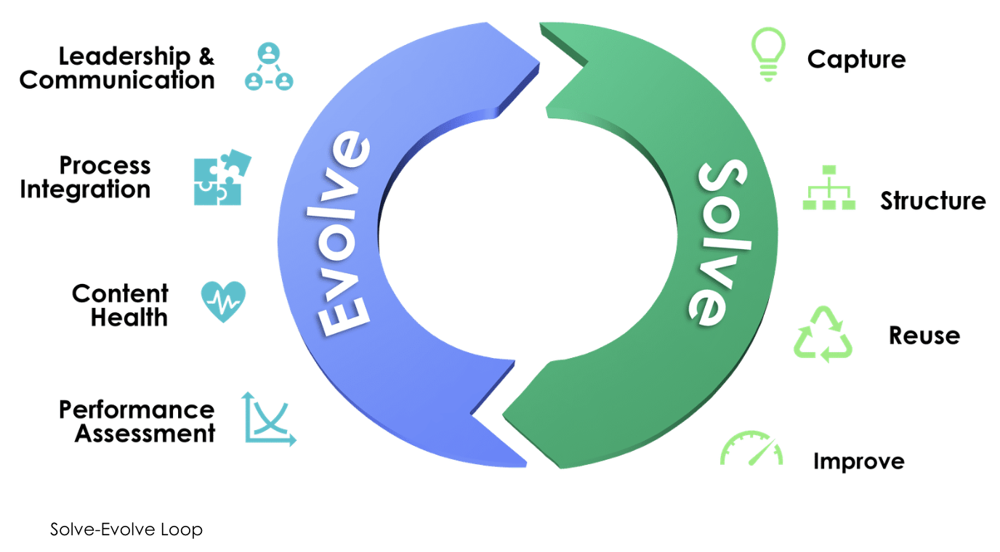

# Knowledge Management

```md
# Knowledge Management

## TODO

## Resources

### Courses

### ServiceNow Documentation

### Community

### Standards

### Labs

## Essential Concepts

## Personas & Roles

## Plugins

### Core Plugin

### Additional Plugins (Common & Recommended)

### Optional Plugins (May Require Additional Licensing)

### Specialized/Utility Plugins

## Knowledge Articles

### Article Structure

### Article Templates

### Knowledge Blocks

## Knowledge Bases

## Workflows & Lifecycles

## Knowledge-Centered Service (KCS)

## Portals & Workspaces

### CSM Portal

### Employee Center

### Service Operations Workspace

### Now Mobile

### Knowledge Management Service Portal

#### Configure the Knowledge Homepage

#### Configure the Knowledge Search Results Page

#### Configure the Knowledge Article View Page #### Integrate KM Portal with Existing Portals

## Application Configuration

### Guided Setup

### Knowledge Properties

### User Criteria & Diagnostics

## Internationalization & Translation

## Feedback & Metrics
```

## TODO

- [ ]

## Resources

### 📘 Courses

- [Knowledge Management (KM) Fundamentals – Vancouver](https://nowlearning.servicenow.com/lxp/en/pages/learning-course?id=learning_course&course_id=b07de32947910e1490542034846d43f1&child_id=a2718de893a9c618f2d9bc686cba1025&spa=1)
- [Knowledge Management (KM) Implementation](https://learning.servicenow.com/lxp?id=learning_course_prev&course_id=1cdf6c8c97ee8e988934b67e6253af07)

---

### 📄 ServiceNow Documentation

- [Knowledge Management Reference Docs](https://docs.servicenow.com/csh?topicname=knowledge-management-reference.html&version=latest)
- [Translation Management](https://docs.servicenow.com/csh?topicname=translation-management.html&version=latest)

---

### 🧠 Community

- [Knowledge Management FAQ](https://www.servicenow.com/community/knowledge-management-articles/knowledge-management-faq/ta-p/2321021)  
  Covers:
  - User Criteria
  - Article Versioning
  - KM Service Portal
  - Feedback Management
  - MS Word Add-In
  - Localization and Translation
  - Knowledge-Centered Service (KCS)
- [Getting Started with Knowledge Management](https://www.servicenow.com/community/knowledge-management-articles/knowledge-management-getting-started/ta-p/2533067)
- [Options for Importing External Articles into ServiceNow](https://www.servicenow.com/community/knowledge-management-articles/options-for-importing-external-articles-into-servicenow/ta-p/2673388)

---

### 📚 Standards

- [KCS v6 Practices Guide (Consortium for Service Innovation)](https://library.serviceinnovation.org/KCS/KCS_v6/KCS_v6_Practices_Guide)

---

### 🧪 Labs

## Essential Concepts

- **Definition**: KM is the process of capturing, distributing, and effective use of information

- **Planning Topics**

  - **Goals**
    - Replace homegrown systems with integrated KM
    - Reduce Help Desk burden and repetitive troubleshooting
    - Deliver a world-class knowledge portal
  - **Consumers**
    - Employees
    - Customers
    - Prospective Customers
  - **Structure (Example Domains)**
    - Products and Services
    - HR
    - Help Desk and IT
    - Sales
    - Marketing
  - **Categorization Example – HR KB**
    - Policies
    - Benefits
    - Training
    - Career Development
  - **Workflows**
    - Auto-retire documents older than 3 years
    - Generate usage reports
  - **Notifications**
    - Alert on article expiration
    - Notify on customer feedback
    - Notify subscribers of new versions
  - **Feedback Options**
    - Flagging
    - Rating
    - Commenting
    - Feedback submission
  - **Templates**
    - Product datasheets (performance, specs, use-cases)
    - Job descriptions (responsibilities, qualifications)
  - **Existing Knowledge Sources**
    - Import Microsoft Word documents (bulk)
    - Use REST API for SharePoint import

- **KM Process**

  - Capture: Create articles from resolved customer requests
  - Structure: Use templates for consistency
  - Reuse: Interlink for comprehensive solutions
  - Improve: Regular reviews and feedback integration

- **Benefits**

  - Better decision-making
  - Greater innovation
  - Efficiency and customer service improvements
  - Knowledge retention
  - Higher employee engagement

- **Knowledge Process Evolution**
  - Empower agents
  - Contextual knowledge creation
  - Promote self-service
  - Crowdsource contributions
  - Predict needs and serve relevant content

---

## Personas & Roles

- **Personas**

  - Consumer
  - Author
  - KM Manager
  - KM Coach
  - KM Admin

- **Roles**
  - `knowledge`
    - Can contribute to default KB
    - Access to Knowledge Application (fulfiller role required)
  - `knowledge_manager`
    - Define categories, pin articles, approve changes
  - `knowledge_admin`
    - Maintain entire system (except scoped KBs)
  - `knowledge_coach`
    - Perform AQI surveys
    - Write, review, and coach
  - `knowledge_domain_expert`
    - Perform AQI
    - Monitor knowledge health
  - `admin`
    - Configure workflows and properties
  - `knowledge_group_manager`
    - Manage ownership group members
    - Handle feedback assignments
  - `knowledge_group_member`
    - Approve/edit assigned articles
    - Self-assign feedback tasks
- KCS Roles (see also [Knowledge-Centered Service](#knowledge-centered-service-kcs))
  - `kcs_candidate`
    - Learner or junior contributor
    - Cannot publish externally
    - Articles default to **Not Validated**
  - `kcs_contributor`
    - Can create and validate articles
    - No coach review required
    - Articles may be **Validated**
  - `kcs_publisher`
    - Trusted expert
    - May publish externally without review
    - Articles may be **Validated**

### Ownership Groups

- **Purpose**: Assign groups instead of individuals to knowledge articles and [knowledge blocks](#knowledge-blocks) for collaborative ownership, quality control, and streamlined feedback handling
- **Requirements**
  - Requires [Knowledge Management Advanced plugin](#plugins)
  - Enable via [Group Ownership Properties](#knowledge-properties) (recommended to keep enabled once active)
- **Access and Roles**
  - Create: `knowledge_domain_expert`, `knowledge_admin`
  - Edit: `knowledge_group_manager`, `knowledge_admin`
- **Management**
  - Menu: `All > Knowledge > Ownership Groups > Manage Group`
  - Only groups with `Type = Knowledge` appear in the "Manage Group" interface
  - To convert a group: open the group record, add `Knowledge` to the Type field  
    _(Requires `admin` role; the Type field must be manually added to the Group form if not visible)_

---

## Plugins

When designing your Knowledge Management (KM) implementation, consider your platform version, which plugins are already activated, and which are available for activation. Some require additional licensing.

---

### Core Plugin

**Knowledge Management v3** _(Activated by default)_

- Supports multiple knowledge bases
- User criteria for read/write permissions
- Custom category and sub-category taxonomies per KB
- Configurable publish/retire workflows
- Notifications for authors and subscribers
- Actionable article feedback
- Knowledge Management Service Portal
- Access via Now Mobile
- Import from Microsoft Word
- Guided Setup for KM

---

### Additional Plugins (Common & Recommended)

- **Knowledge Management Advanced**

  - Article versioning and version comparison  
    ↳ See [Knowledge Articles](#knowledge-articles)

  - In-context article creation (KCS)  
    ↳ See [Knowledge-Centered Service (KCS)](#knowledge-centered-service-kcs)

  - Knowledge article templates  
    ↳ See [Templates](#article-templates)

  - Subscriptions to knowledge articles  
    ↳ See [Feedback & Metrics](#feedback--metrics)

  - Translation management  
    ↳ See [Internationalization & Translation](#internationalization--translation)

  - Article Quality Index (AQI)  
    ↳ See [Feedback & Metrics](#feedback--metrics)

  - Knowledge group ownership and permissions  
    ↳ See [Personas & Roles](#personas--roles)

---

### Optional Plugins (May Require Additional Licensing)

**Predictive Intelligence for Knowledge Management**  
`[com.snc.knowledge_ml]`

- Machine-learning powered suggestions
- Similar article surfacing
- Knowledge demand insights

**Performance Analytics – Content Pack: Knowledge Management**  
`[com.snc.pa.knowledge_v2]`

- Adds KM-specific dashboards and metrics  
  ↳ See [Feedback & Metrics](#feedback--metrics)

**I18N: Knowledge Management Internationalization Plugin v2**  
`[com.glideapp.knowledge.i18n2]`

- Author and manage translations at scale  
  ↳ See [Internationalization & Translation](#internationalization--translation)

**Knowledge Management – External Content Integration**  
`[com.snc.knowledge.external_integration]`

- Index and serve external knowledge sources as articles  
  ↳ See [Application Configuration](#application-configuration)

---

### Specialized/Utility Plugins

**Knowledge Blocks**  
`[com.snc.knowledge_blocks]`

- Reusable content components  
  ↳ See [Templates](#article-templates)

**Knowledge Management Wiki Support**  
`[com.glideapp.knowledge2.wiki]`

- Enables wiki-style article formatting

**Knowledge Management KCS Capabilities**  
`[com.snc.knwoledge_kcs_capabilities]`

- Enables KCS metadata and contributor roles  
  ↳ See [Knowledge-Centered Service (KCS)](#knowledge-centered-service-kcs)

**Knowledge Management – Add-in for Microsoft Word**  
`[com.snc.knowledge.ms_word]`

- Author and publish from Microsoft Word  
  ↳ See [Application Configuration](#application-configuration)

**Knowledge Document**  
`[com.snc.knowledge_document]`

- Sync knowledge content with Managed Documents

---

## Knowledge Articles

- Created via: All > Knowledge > Articles > Create New

- **Related Lists**

  - Affected Products
  - Feedback
  - Feedback Tasks
  - Approvals
  - Article Versions
  - Related Articles
  - Related Catalog Items

- **Lifecycle States**

  - Draft
  - Review
  - Scheduled for Publish _(Advanced plugin)_
  - Published
  - Retired

- **KCS Article States** _(Requires [KCS plugin](#plugins))_
  - Work in Progress
  - Not Validated
  - Validated
  - Archived  
    ↳ See [Knowledge-Centered Service (KCS)](#knowledge-centered-service-kcs)

### Article Structure

- Knowledge articles are records stored within a knowledge base
- Their structure and metadata are shaped by templates and related list components
- Field visibility and behavior may be influenced by [user criteria](#application-configuration)

### Article Templates

- **Purpose**: Standardize layout and improve author efficiency and consistency
- **Location**: All > Knowledge > Administration > Article Templates
- **Activation**
  - Requires [Knowledge Management Advanced plugin](#plugins)
  - Not active by default; can be enabled by a `knowledge_admin`
  - Also accessible via the "Configure Article Template" task in [Guided Setup](#application-configuration)
- **Usage**
  - Authors select from available templates when creating new articles
  - Improves readability and ensures key fields are included
  - Supports role-based visibility for specific template sections (via user criteria)
- **Customization**
  - Templates can be created or modified by a `knowledge_admin`
  - OOB templates include:
    - FAQ (Q&A)
    - How-To (Intro + Instructions)
    - What Is (Intro + Explanation)
    - KCS Article (Issue, Environment, Cause, Resolution)  
      ↳ See [KCS](#knowledge-centered-service-kcs)
    - Standard (freeform)

### Knowledge Blocks

- **Purpose**: Reusable content elements governed by user criteria
- **Location**: All > Knowledge > Knowledge Blocks
- **Usage**
  - Embedded in articles to display context-specific content
  - Example: show different public holiday info based on user location
  - Requires translation support for multi-language KBs  
    ↳ See [Internationalization & Translation](#internationalization--translation)

---

## Knowledge Bases

- Located at: All > Knowledge > Administration > Knowledge Bases

- **Purpose**: Serves as a central repository for knowledge assets such as articles, FAQs, and documents.

- **Attributes**

  - Assigned Owner and Manager
  - Configurable Publish and Retire workflows
  - Fields may vary depending on version, active [plugins](#plugins), and admin customizations

- **Settings and Controls**

  - Enable/disable commenting and suggesting
  - Enable/disable category editing
    - By default, contributors can create/edit categories
    - Recommended: disable and define categories in advance
    - Category editing should be guided by review of [feedback and metrics](#feedback--metrics)
  - Use of AQI checklists
  - Support for [Knowledge Blocks](#knowledge-blocks)

- **Access and Permissions**

  - Defined via `Can Read` and `Can Contribute` user criteria
  - Optional: `Cannot Read` and `Cannot Contribute` lists for granular control
  - Article-level and field-level restrictions may apply (e.g., when using templates)

- **Related Lists (shown after KB creation)**

  - **Knowledge**: List and creation of articles within the KB
  - **Can Read / Can Contribute**: Define user visibility and authoring rights
  - **Article Templates**: Reusable content structures  
    ↳ See [Templates](#article-templates)
  - **Featured Content**: Highlighted articles shown on portal homepages
  - **Knowledge Categories**: Hierarchical taxonomy used for classification

- **Scoped Knowledge Bases**

  - Used to protect sensitive content
  - Administered only by users with `admin` and `knowledge_admin` roles, and visibility to the scoped application
  - Must select the relevant application via the application picker before creation

- **Initial Setup**
  - Recommended to use [Guided Setup](#application-configuration) for configuration sequence and task assignment

---

## Workflows & Lifecycles

- **Purpose**: Automate the movement of knowledge articles between lifecycle states (Draft → Published → Retired)

- **Baseline Workflow Types**

  - **Instant Publish**: No approval; assigned by default
  - **Approval Publish**: Requires approval from KB owner/manager before publishing
  - **Instant Retire**: No approval; assigned by default
  - **Approval Retire**: Requires approval from KB owner/manager before retiring

- **Behavior**

  - Publish workflows control transitions from Draft → Published
  - Retire workflows control transitions from Published → Retired
  - Approvals and notifications can be defined in each workflow

- **Customization**

  - Navigate to: `All > Workflow > Workflow Editor`
  - Only the classic Workflow Editor is supported for KM (not Flow Designer)
  - Recommended: Copy baseline workflows before modifying
    - Example: Replace manager approval with SME group review
  - Must publish the workflow before assigning it to a knowledge base

- **Assignment**

  - Assigned per knowledge base via the KB record  
    ↳ See [Knowledge Bases](#knowledge-bases)
  - Can be configured through the [Guided Setup](#application-configuration)
    - Task: "Assign Workflows"
    - After selection, mark task complete in Guided Setup

- **Reference**
  - [Workflow Editor Documentation – ServiceNow Docs](https://docs.servicenow.com/csh?version=latest&topicname=workflow-editor)

---

## Knowledge-Centered Service (KCS)

- **Verified KCS v6**

  - Article Quality Reviews
    - Pre-defined or custom questionnaires per KB
  - Feedback Management
    - Report gaps and track feedback through revisions  
      ↳ See [Feedback & Metrics](#feedback--metrics)
  - In-Context Knowledge Capture
    - Auto-fill article fields from cases and incidents  
      ↳ See [Configure Case & Incident to Knowledge Properties](#configure-case-and-incident-to-knowledge-properties)

- **Purpose & Methodology**

  - Focuses on real-time creation, reuse, and continuous improvement of knowledge
  - Encourages knowledge capture during issue resolution—not as a separate initiative
  - Relies on collaboration, learning incentives, and ongoing content validation
  - Improves consistency, quality, and findability of knowledge content

- **Benefits**

  - Increased deflection of incidents and cases
  - Faster resolution and reduced onboarding time
  - Higher quality and consistency of knowledge
  - Cross-team contribution and expanded reuse
  - Better insights into customer needs and systemic issues

- **Double Loop Process**

  - **Solve Loop**
    - Capture and reuse knowledge during daily support interactions
  - **Evolve Loop**
    - Assess and improve article quality, structure, and relevance
  - Together, they form a self-correcting, collaborative system  
    

### KCS Setup in ServiceNow

- **Configuration via [Guided Setup](#guided-setup)**

  - Enable KCS-specific roles and article state fields  
    ↳ See [Enable KCS Roles and Article State Fields](#enable-kcs-roles-and-article-state-fields)
  - Create and assign AQI checklists  
    ↳ See [Configure and Assign AQI](#configure-and-assign-aqi)
  - Set up knowledge creation from support tasks  
    ↳ See [Configure Case & Incident to Knowledge Properties](#configure-case-and-incident-to-knowledge-properties)
  - Configure feedback management and actionable feedback  
    ↳ See [Feedback & Metrics](#feedback--metrics)

### Enable KCS Roles and Article State Fields

- **Plugin Activation**

  - Plugin: `Knowledge Management KCS Capabilities` (`com.snc.knowledge_kcs_capabilities`)
  - Enables KCS-specific roles and metadata fields on knowledge articles
  - Activated via [Guided Setup](#guided-setup)

- **KCS Roles**

  - Adds KCS-specific roles:
    - `kcs_candidate`
    - `kcs_contributor`
    - `kcs_publisher`
  - See [Personas & Roles](#personas--roles) for detailed permissions

- **Article Fields**

  - **Confidence**

    - Indicates article maturity and author trust level
    - Automatically set based on article state and author role:
      - _Work in Progress_ (Draft)
      - _Not Validated_ (e.g. `kcs_candidate`)
      - _Validated_ (e.g. `kcs_contributor`, `kcs_publisher`)
      - _Archived_ (Retired)

  - **Governance**
    - Defines contribution model:
      - _Experience Based_: Open and flexible
      - _Compliance Based_: Restricted for regulatory content
    - Editable by users with contribute access

### Configure and Assign AQI

- **Plugin Requirement**

  - Requires `Knowledge Management Advanced`  
    ↳ See [Additional Plugins (Common & Recommended)](#additional-plugins-common--recommended)

- **AQI Checklist**

  - Used by Knowledge Coaches to assess quality of published articles
  - Based on KCS-aligned criteria (true/false questions with weighted values)
  - Must total 100 points
  - Default checklist can be customized or replaced

- **Assignment**

  - Assigned at the **knowledge base** level (not per article)
  - Can be unique or shared across KBs
  - Navigate to: `All > Knowledge > Administration > Knowledge Bases`

- **Review and Scoring**
  - Executed from the article form (post-publish)
  - Results are immutable after submission
  - Scoring reflects cumulative weight of passed checks  
    ↳ See [Feedback & Metrics](#feedback--metrics)

### Configure Case and Incident to Knowledge Properties

- **Purpose**

  - Enables real-time article creation directly from support tasks
  - Templates auto-populate from case/incident fields

- **Case to Article** _(Customer Service Management)_

  - Enable property: `KCS for Customer Service Management` → `true`
  - Activate template: **KCS Article**  
    ↳ `All > Knowledge > Administration > Article Templates`
  - Mapped fields:
    - _Short Description_, _Issue_, _Cause_, _Resolution_, _Source Task_

- **Incident to Article** _(IT Service Management)_

  - Activate plugin: `KCS Integration for Incident Management` (`com.snc.incident.knowledge`)
  - Templates: **Incident KCS Article**, **Incident-KCS Article-HTML**  
    ↳ See [Article Templates](#article-templates)
  - Mapped fields:
    - _Short Description_, _Issue_, _Resolution_, _Source Task_

- **Notes**
  - Articles are created in **Draft** state
  - Source field mapping must be correct for auto-fill to work
  - Final content should be reviewed before publishing

---

## Portals & Workspaces

### Employee Center

- **Overview**

  - AI Search and Unified Taxonomy
  - Recommended for employee-facing experiences
  - Superior performance and discoverability compared to legacy portals
  - Delivered pre-installed; _Employee Center Pro_ is available as a licensed upgrade

- **Knowledge Integration**

  - Knowledge bases can be surfaced through Employee Center taxonomy
  - Articles may be included by:
    - Category
    - Individual selection
  - Supports combining knowledge, catalog items, and external links under unified departmental topics

- **Taxonomy Consideration**

  - Employee Center taxonomy is distinct from KB category hierarchy
  - Designed for curated, cross-content navigation by department or service
  - Platform and Service Portal use native KB structures only

- **Example Use Case**
  - Add new categories and articles to a Field Services knowledge base
  - Create a new Employee Center topic (e.g., "Field Services")
  - Add child topics and map KB content into the structure

### CSM Portal

- External, customer-facing self-service
- Supports knowledge browsing, ticket submission, and agent interaction

### Service Operations Workspace

- Designed for internal operations
- Allows using knowledge to resolve cases or create known errors

### Now Mobile

- **Overview**

  - Now Mobile app allows users to search and view knowledge articles on mobile devices and tablets
  - Users can search by keyword or browse categories via the **Information** icon in the app footer
  - Mobile article view includes: article number, author, publish date, view count
  - Supports commenting and feedback, similar to portal and platform experiences

- **Information Widget**

  - Not enabled by default
  - To add:
    - Navigate to `Now Mobile App > Navigation Bar`
    - Add the **Information** widget to the mobile nav bar

- **Knowledge Base Visibility**
  - Only knowledge bases added to the **Mobile Employee Service Portal** are visible in Now Mobile
  - To configure:
    - Navigate to `Now Mobile App > Knowledge Bases`
    - Add KBs to control what appears in the mobile experience

### Knowledge Management Service Portal

- **Overview**

  - A dedicated portal experience for Knowledge Management
  - Supports all core KM functionality (via Knowledge Management V3 plugin) and advanced features (via [Advanced plugin](#additional-plugins-common--recommended))
  - URL pattern: append `/kb` to your ServiceNow instance URL

- **Availability**

  - Plugin: `com.snc.knowledge_serviceportal`
  - Activated by default on Madrid and later releases

- **Main Pages**

  - **Home Page**
    - Lists accessible knowledge bases
    - Highlights:
      - Pinned articles
      - Most useful articles
      - Most viewed articles
    - Includes a global search bar
  - **Search Results Page**
    - Triggered after performing a search
    - Includes filters and sort options for refining results
  - **Article View Page**
    - Displays full article content and metadata
    - If enabled, allows user feedback and comments

- **Advanced Commenting Features** _(if enabled)_
  - Nested comment threads
  - Attachments (subject to admin-defined limits)
  - Inline image and rich text formatting
  - Like functionality for comments
  - Users can delete their own comments
  - `knowledge_admin` role can delete any comment

#### Configure the Knowledge Homepage

- **Overview**

  - The KM Service Portal homepage includes configurable widgets for search, browsing, and article highlights
  - switch application scope to `Knowledge Management - Service Portal` before attempting any configurations

- **Accessing Widget Configuration**

  - Hold `Ctrl` and right-click on a widget > select **Instance Options**
  - Requires `admin` role

- **Homepage Sections**

  - **Knowledge Homepage Search**

    - Widget: `Knowledge Homepage Search`
    - Customizable options:
      - Title, icon (glyph), placeholder text
      - Bootstrap color/size
      - Instant search toggle
      - Min characters and wait time
      - URL parameters for query and language

  - **Knowledge Bases Browse**

    - Widget: `Knowledge Base Tile`
    - Displays accessible KBs (default alphabetical order)
    - Customizable options:
      - Title, color, order (e.g., `article_count`)
      - Labels and URLs for "Ask a Question" / "Create Article" actions

  - **Article Widgets**
    - Includes: Featured, Most Useful, Most Viewed
    - Common configuration options:
      - Widget title, color, glyph
      - Source table and display fields
      - Max rows, secondary field visibility
      - KB scoping for article list
    - Advanced CSS styling supported (refer to documentation)

- **Advanced Styling**
  - Each widget supports custom CSS
  - For guidance, see:
    - [KM Service Portal Widget Instances – ServiceNow Docs](https://docs.servicenow.com/csh?version=latest&topicname=km-service-portal-widget-instances)

#### Configure the Knowledge Search Results Page

- **Overview**

  - Allows users to search for articles, apply filters, sort results, and view metadata
  - Built using multiple widgets including: `Knowledge Result`, `Filter Facet`, `Sort`, and `Breadcrumb`

- **Accessing Configuration**

  - Hold `Ctrl` and right-click on a widget > select **Instance Options**
  - Requires `admin` role
  - switch application scope to `Knowledge Management - Service Portal` before attempting any configurations

- **Knowledge Result Widget**

  - Display Options:
    - Relevancy score toggle
    - Attachment display mode
    - Article metadata fields (author, view count, etc.)
  - Pagination:
    - Type: Standard or Infinite Scroll
    - Max articles per page / per fetch
  - Sort defaults and custom labels
  - Table: `kb_knowledge`
  - Secondary fields and labels for both articles and social Q&A

- **Filter Facet Widget**

  - Source Table: `kb_knowledge`
  - Source Field: Supports string, reference, boolean, integer, glide list
  - Facet Types:
    - Single Select, Multi-Select, Dropdown, Rating, Custom
  - Options:
    - Show empty values
    - Category hierarchy (up to 4 levels)
    - Alternate URL parameters
    - Field order and max string length

- **Sort Widget**

  - Sort fields and labels (e.g., Views, Newest, Alphabetical)
  - Hide relevancy option
  - Table: `kb_knowledge`
  - Bootstrap color

- **Breadcrumb Widget**
  - Hide or customize KB/category breadcrumb display
  - Set custom separator characters

#### Configure the Knowledge Article View Page

- **Overview**

  - Displays full knowledge article content
  - Supports comments, ratings, subscriptions, and related content
  - Advanced features (e.g., version info, incident creation) require [Advanced plugin](#additional-plugins-common--recommended)

- **Accessing Configuration**

  - Hold `Ctrl` and right-click on a widget > select **Instance Options**
  - Requires `admin` role
  - switch application scope to `Knowledge Management - Service Portal` before attempting any configurations

- **Article Content Widget**

  - Bootstrap color
  - Option to hide actions (Subscribe, overflow menu)
  - Show version info (requires Advanced plugin)
  - Create Incident button:
    - Label, URL override
    - Fallback: `glide.knowman.create_incident_link` system property

- **Article Helpful Widget**

  - Show star rating (1–5) or hide
  - Show helpfulness percentage
  - Customize feedback message and helpful action label
  - Bootstrap color

- **Related Catalog Items Widget**

  - Source Table: `kb_2_sc`
  - Source/Target Columns: define article-to-item relationship
  - Layout: full-width toggle (100% vs 75%)
  - Max items to display (default: 5)
  - Title, source ID via `sys_kb_id` URL parameter

- **Related Articles Widget**

  - Source Table: `kb_2_kb`
  - Table: `kb_knowledge`
  - Display Field: article short description
  - Secondary Fields: author, views, modified date, rating
  - Options:
    - Title, color, icon, full-width toggle
    - Max articles, empty state handling
    - Secondary field labels toggle
    - KB filter, source ID via `sys_kb_id`

- **Article Comments Widget**
  - Bootstrap color
  - Enable/disable user comments
  - Customizable add-comment label
  - Attachment limits (default: 3 files, 2 MB each)

#### Integrate KM Portal with Existing Portals

- Legacy Service Portal _(Not recommended for production)_

  - Zing-based search and KB browsing
  - Serves as a legacy structure reference

- **Overview**

  - The CSM Portal integrates automatically with the KM Service Portal (as of the New York release)
  - Other portals (e.g., Service Portal) do **not** include KM Service Portal features by default

- **Redirection Option**

  - To redirect legacy V3 UI article views to KM Service Portal:
    - Set the system property `sn_km_portal.glide.knowman.serviceportal.enable_redirect = true`
    - This can be configured via the _Redirect Legacy UI Pages_ task or manually in system properties

- **Feature Differences**

  - Default Service Portal lacks:
    - Filter facets beyond category
    - Advanced KM widgets (e.g., sort configuration, feedback enhancements)

- **Manual Integration**
  - Use a **Page Route Map** to reroute views from another portal to the KM Service Portal
  - Example: Redirect Service Portal article search to KM Service Portal's search results page

---

## Application Configuration

- **Importing Articles**
  - Microsoft Word (manual + bulk)
    - Manual: All > Knowledge > Import Articles
    - Bulk: List > Import > Create Excel Template
  - REST API
    - Table: `kb_knowledge`
    - Use: Table API in REST API Explorer
  - SharePoint / WebDAV
    - Define external sources
    - Import and open search results externally

### Guided Setup

- **Purpose**: Provides a sequenced checklist for configuring Knowledge Management before users begin publishing or consuming articles.
- **Access**
  - Navigation: `All > Knowledge > Administration > Guided Setup`
  - Role required: `admin` (system administrator)

### Knowledge Properties

- **Access**

  - Navigation: `All > Knowledge > Administration > Properties`
  - Also accessible via the "Review Knowledge Properties" task in Guided Setup

- **Note**: Available properties vary by platform version and [active plugins](#plugins)

- **Property Categories**

  - **Knowledge Portal Properties**
    - Configure legacy portal layout and article visibility by role or state
  - **Article View Properties**
    - Control display of ratings, comments, and flagging per user role
  - **Knowledge Search Properties**
    - Search order, result attributes, multi-language support, attachments
  - **Knowledge Homepage Properties**
    - Control featured content, visibility logic, and pinned articles
  - **Other Knowledge Properties**
    - Task record field mapping, KM logo, import behavior, notifications
  - **Article Versioning Properties**
    - Enable versioning and allow minor edits without creating a new version  
      ↳ See [Knowledge Articles](#knowledge-articles)
  - **KM Subscription Properties**
    - Enable subscriptions, define allowed roles and workflow states  
      ↳ See [Feedback & Metrics](#feedback--metrics)
  - **Actionable Feedback Properties**
    - Trigger feedback tasks based on ratings  
      ↳ See [Feedback & Metrics](#feedback--metrics)
  - **Article Quality Index (AQI) Properties**
    - Define pass scores and states where AQI can be executed  
      ↳ See [Feedback & Metrics](#feedback--metrics)
  - **Group Ownership Properties**
    - Enable group ownership and self-approval controls

- **Reference**
  - [Knowledge Properties – ServiceNow Docs](https://docs.servicenow.com/csh?version=latest&topicname=r_KnowledgeProperties.html)

### User Criteria & Diagnostics

- **User Criteria**

  - Defined via: `All > Knowledge > Administration > User Criteria`
  - Control read/write access based on user, role, group, location, department, or company
  - Assigned at knowledge base, article, or [knowledge block](#knowledge-blocks) level
  - Advanced scripting supported for custom logic

- **Diagnostics**

  - Tool: `All > Knowledge > Administration > User Criteria Diagnostics`
  - Also accessible via "Related Links" on KB or article records
  - Allows testing access for specific users and shows matched criteria

- **Unauthenticated Access**

  - Public KB access allowed if no user criteria are assigned
  - To restrict: add user criteria or set system property  
    `glide.knowman.block_access_with_no_user_criteria = true`

- Setup:

  - Define and assign user criteria
  - Run diagnostics
  - Review unauthenticated access

- Reference: [User Access to Knowledge – ServiceNow Docs](https://docs.servicenow.com/csh?version=latest&topicname=user-access-knowledge)

---

## Internationalization & Translation

- **Language Support**

  - Default system language: American English
  - Multi-language support requires:
    - Activation of the `I18N: Knowledge Management Internationalization Plugin v2`  
      ↳ See [Plugins – Optional](#optional-plugins-may-require-additional-licensing)
    - Activation of individual language-specific plugins (one per language)
  - Supported languages include:
    - Brazilian Portuguese, Chinese (Simplified & Traditional), Czech, Dutch, Finnish, French, French Canadian, German, Hebrew, Hungarian, Italian, Japanese, Korean, Norwegian, Polish, Portuguese, Russian, Spanish, Swedish, Thai, Turkish
  - Enabling multi-language support allows users to search and view knowledge across languages

- **Manual Translation**

  - Article > Related Links > Request Translation
  - One language per task

- **Automatic Translation Tasks**

  - Can be enabled at the knowledge base level
  - Generates tasks automatically upon article publishing

- **Bulk Translation**

  - Managed via the Localization Framework
  - Allows batch translation into multiple languages
  - **Validation Rules**:
    - Requested language is allowed in the knowledge base
    - Used [knowledge blocks](#knowledge-blocks) have corresponding translations
    - Source article is not retired, outdated, or already a translated version
    - Source and target languages must differ
    - Limit: <200 articles per operation

- **Guided Setup**
  - Task: _Activate Support Other Languages_
    - Navigates directly to the language plugins list
    - Once plugins are activated, mark the task as complete
  - ↳ See [Guided Setup](#guided-setup)

---

## Feedback & Metrics

- **User Feedback Options**

  - Available via portal, mobile, or platform views:
    - Comments (if enabled)
    - Helpful / Not Helpful toggle
    - Star rating (1–5)
    - Flag as incorrect or inappropriate (requires contributor role)

- **Feedback Records**

  - All feedback actions create a record in the `kb_feedback` table
  - Fields captured:
    - User action (rating, flag, etc.)
    - Comments and feedback type
    - Optional: **Work notes** for internal tracking by knowledge managers
  - Feedback records are visible to knowledge managers and `knowledge_admin`  
    ↳ See [Personas & Roles](#personas--roles)

- **Actionable Feedback**

  - Automatically generates **Knowledge Feedback Tasks** for negative input
  - Controlled via [Knowledge Properties](#knowledge-properties) → _Actionable Feedback Properties_
  - Typical triggers:
    - Article flagged
    - Marked "Not Helpful"
    - Rated 3 stars or below
  - Tasks appear under:  
    `All > Knowledge > Feedback Management > My Assigned Tasks`
  - Feedback is considered resolved when the **Flagged** field is cleared  
    → This sets a hidden `Resolved = true` field (used for tracking/reporting)

- **Feedback Configuration**

  - Actionable feedback must be explicitly enabled by an admin
  - Configuration includes:
    - Thresholds for triggering tasks
    - Assignment logic (e.g., group vs individual)
  - Customization is available through [Knowledge Properties](#knowledge-properties)

- **Article Versioning**

  - Versions tracked via the **Versions** tab on the article record
  - **Major Revision**: for published content updates
  - **Minor Revision**: for edits to drafts or scheduled content
  - Compare versions using:  
    `Actions > Compare` (select two versions from the list)

- **Article Quality Index (AQI)**

  - Structured quality checklist based on [KCS standards](#knowledge-centered-service-kcs)
  - Reviews conducted by Knowledge Coaches  
    ↳ See [Configure and Assign AQI](#configure-and-assign-aqi)
  - Immutable once submitted; scored out of 100
  - Example checklist items:
    - Accuracy, relevance, completeness
    - Metadata, formatting, access control

- **Dashboard Metrics**  
  `All > Knowledge > Administration > Overview`

  - **Lifecycle**

    - Articles by workflow state: Draft, Review, Published, Retired
    - Articles pending review or aging in draft
    - Creation and update trends

  - **Feedback**

    - Comments, flags, star ratings, "Not Helpful" trends
    - Average article rating

  - **Usage**

    - View counts, attachments, click-through rates
    - Monthly usage trends by user, article, or group

  - **Authors**

    - Article views and contributions per author
    - Monthly author activity summaries

  - **Content Quality**
    - Average AQI score
    - % of articles flagged, outdated, or inactive
    - Articles older than 1 year or unpublished

- **Usage Logs**

  - Track user interaction with knowledge content:
    - Views, searches, search locations, and usage confirmation
  - **Knowledge Use Records** (`kb_use`)
    - Stores article view activity per user
    - Includes:
      - Article number
      - User
      - View timestamp
      - Article usage confirmation
    - Navigate to: `All > Knowledge > Administration > View Log`
  - **Knowledge Search Records** (`kb_knowledge_search`)
    - Stores search activity per user
    - Includes:
      - Search terms
      - Search source (e.g., portal, mobile)
      - User domain
      - Number of results returned
    - Navigate to: `All > Knowledge > Administration > Search Log`

### Performance Analytics

- **Purpose**

  - Track, aggregate, and visualize knowledge management data trends
  - Assess article performance, effectiveness, and opportunities for improvement

- **Prerequisites**

  - Requires plugin: `Performance Analytics - Content Pack - Knowledge Management` (`com.snc.pa.knowledge_v2`)
  - Available with ServiceNow Professional or Enterprise subscriptions  
    ↳ See [Optional Plugins (May Require Additional Licensing)](#optional-plugins-may-require-additional-licensing)

- **Indicators and Indicator Sources**

  - Indicators measure and track specific KPIs over time (e.g., article views, feedback ratings)
  - Indicator sources define the underlying data set (e.g., knowledge articles, feedback records)
    - Example tables: `kb_knowledge`, `kb_feedback`
  - Default indicator sources provided by the plugin; additional sources can be created:
    - Navigate: `Performance Analytics > Indicator Sources`
    - Roles required: `admin`, `pa_admin`, or `pa_data_collector`
    - Avoid duplicate sources; changing later affects existing data
    - [Indicator Sources Documentation](https://docs.servicenow.com/csh?version=latest&topicname=c_IndicatorSources)
  - Indicators can use shared sources for consistency and optimized data collection

- **Key Indicator Elements**

  - **Frequency**: How often indicators are displayed (Daily, Weekly, Monthly); independent from data collection schedule
  - **Direction**: Improvement direction (Minimize or Maximize)
  - **Unit**: Measurement unit (Number, %, Days, $, etc.)
  - **Aggregate**: Calculation method (Count, Sum, Average, Min, Max, Count distinct)
  - **Conditions**: Additional filters applied at the indicator level; case-sensitive and complement indicator source conditions
  - **Breakdowns**: Group or filter indicator scores by specific attributes (e.g., Category, Priority) for detailed analysis

- **Breakdowns and Breakdown Sources**

  - Breakdowns group or filter indicator scores by attributes (e.g., priority, category)
    - [Breakdowns Documentation](https://docs.servicenow.com/csh?version=latest&topicname=c_CreatingBreakdowns)
  - Breakdown sources specify the data available for breakdown elements
    - [Breakdown Sources Documentation](https://docs.servicenow.com/csh?version=latest&topicname=t_DefiningABreakdownSource)
  - Types:
    - Automated (dynamic from tables)
    - Manual (user-defined)
    - External (SQL or external data sources)
  - Configure breakdown sources and breakdowns:
    - Navigate: `Platform Analytics Administration > Breakdown Sources` and `Platform Analytics Administration > Breakdowns`

- **Data Collection**

  - Data collected via scheduled jobs
  - Historical data collection: run once to populate initial data
  - Scheduled data collection: automate recurring data updates
    - Navigate: `Platform Analytics Administration > Data Collector > Jobs`
    - Roles required: `admin`, `pa_admin`, or `pa_data_collector`

- **Analytics Hub**

  - Displays detailed scores and trends for individual indicators
  - Publish indicators to Analytics Hub:
    - Open indicator record → Access Control tab → Set `Publish on Analytics Hub` = `true`
    - Navigate: `Platform Analytics Administration > Analytics Hub`

- **Dashboards**
  - Interactive, actionable data visualizations on a single screen
  - Default KM Dashboard (provided by content pack) includes tabs:
    - Content Usage (effectiveness of published content)
    - Content Governance (process adherence)
    - Content Quality (AQI scores, feedback trends)
  - Access and manage dashboards:
    - Navigate: `Platform Analytics Administration > Usage and governance > Dashboards`
  - [Dashboards Documentation](https://docs.servicenow.com/csh?version=latest&topicname=dashboards-landing-page)
