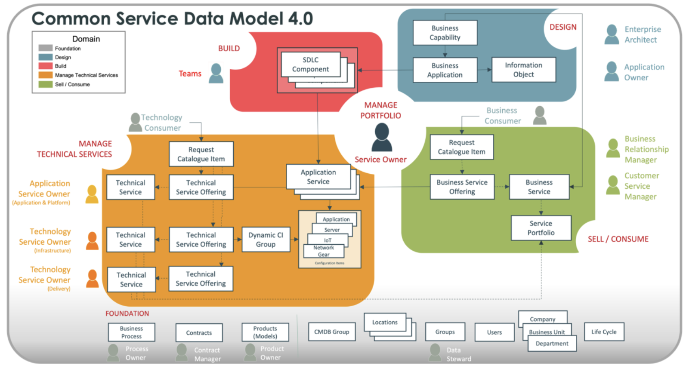
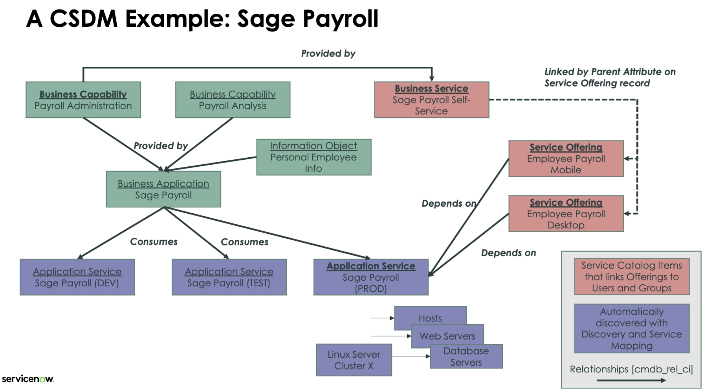

# SNow CIS Service Mapping

Back to [SNow ITOM](./sn-itom.md)

## Resources

- [KB: Probe to Pattern Migration: Procedure for switching from probe-based Discovery to pattern-based Discovery](https://support.servicenow.com/kb?id=kb_article_view&sysparm_article=KB0694477)

### Requirements CIS Voucher

- [x] Service Mapping Fundamentals
  - [notes](#service-mapping-fundamentals-on-demand)
- [x] [Service Mapping Advanced](https://nowlearning.servicenow.com/lxp/en/it-operations-management/service-mapping-advanced?id=learning_course_prev&course_id=72774609c3b77d905922751ce00131d2)
  - [eBook](https://servicenow.read.inkling.com/a/b/19c4613ca7d841ee9b3cc5f1bd05302d/p/18356415fd69484b9dd3100dfd444379)
  - [notes](#service-mapping-advanced)
- [x] [Service Mapping Advanced Simulator](https://nowlearning.servicenow.com/lxp/en/it-operations-management/service-mapping-advanced-simulator-washington?id=learning_course_prev&course_id=e3db6a8487760a1024e0bb39dabb35b7)
  - testing knowledge from SM Fundamentals and Advanced courses
- Recommended:
  - [x] [Service Mapping Extras](https://nowlearning.servicenow.com/lxp/en/it-operations-management/service-mapping-extras?id=learning_course_prev&course_id=293e0527477d19505cbdaf44846d4383)
    - [notes](#extras)
    - additional material on ML Power Mapping
    - additional material on integrating Service Mapping with Event Management
    - more stuff
  - [x] [Discovery Fundamentals](./sn-discovery.md#discovery-fundamentals)
  - [ ] [Event Management Fundamentals](https://nowlearning.servicenow.com/lxp/en/it-operations-management/event-management-fundamentals?id=learning_course_prev&course_id=4f84d9c7c323315043395230a0013108)

### Links

- [Docs](https://docs.servicenow.com/)
- [Developer](http://developer.servicenow.com/)
- [CSC (Customer Success Center)](https://www.servicenow.com/success.html)
- [Community](https://www.servicenow.com/community/)
- [YouTube](https://www.youtube.com/user/servicenowinc)
- [Center of Excellence and Innovation (CoEI)](https://www.servicenow.com/success/playbook/center-excellence-innovation-coei.html)
- Additional Resources
  - [Mainline Exam Blueprint: Certified Implementation Specialist - Service Mapping (CIS-SM)](https://nowlearning.servicenow.com/lxp/en/credentials/certified-implementation-specialist-service-mapping-mainline?id=kb_article_view&sysparm_article=KB0011558)
  - [eBook: Service Mapping Advanced](https://servicenow.read.inkling.com/a/b/19c4613ca7d841ee9b3cc5f1bd05302d/p/18356415fd69484b9dd3100dfd444379)

### Labs

#### Labs: Service Mapping Advanced

##### L2.3: Map Services with CI Tagging

- [course book](https://servicenow.read.inkling.com/a/b/19c4613ca7d841ee9b3cc5f1bd05302d/p/52d7650bd2bd4e8f855131b64d62dd32)
  - [TagMappingCIs.txt](https://nowlearning.servicenow.com/sys_attachment.do?sys_id=d02ccac68796421424e0bb39dabb354a)
    - create 2 x Windows Servers CIs
    - create 3 x application Cis
    - create Tags for the Applications and Windows Servers
- Run the TagMappingCIs.txt as a Background Script
  - All > System Definition > Scripts - Background
  - paste and _Run Script_
- Observe the New CIs, Relationships and Tag Key Values
  - All > Configuration > Servers > Windows
  - open record
    - Related Items > _Show dependency views_
  - All > `cmdb_key_value.list`
    - see tags
- Create Tag Categories and Tag Based Service Families
  - All > Service Mapping > Administration > CI Tag Categories > New
    - Tag category name: `Service`
    - CI tag keys: `Service`, `Serv`
    - _Submit_
  - All > Service Mapping > Administration > Tag-based Service Families > New
    - Service family name: `Services by Service and Environment`
    - Tag category: `Service`, `Environment`
    - _Save_
    - Related Links > _Manually update candidates_
    - _View service candidates_
      - select all
      - _Map selected_
      - _OK_
- Manually Calculate the Two New Application Services
  - All > Service Mapping > Services > Tag-based Services
    - open record
    - Related Links > _Recalculate Service_
    - _View Map_

##### L2.4: Discover Ruby on Rails Service

- [course book](https://servicenow.read.inkling.com/a/b/19c4613ca7d841ee9b3cc5f1bd05302d/p/5d1c9bc81a794619aba09355e2155671)
- Create and Discover the Ruby on Rails Service
  - All > Service Mapping > Home
    - _Additional Options_ > _Define A Single Service Map_
      - Name: `Ruby on Rails Application`
      - Owner: `<Service Owner>`
      - Web Application
        - Entry Point URL: `http://<ip>/posts`
        - _Add_
      - _Save_
      - Traffic based discovery: false
      - _Update_
      - _View Map_
- Create Custom CI Type
  - All > Configuration > CI Class Manager
  - Hierarchie > Application Server > [right-click] > Add Child Class
    - Display Name: `Ruby on Rails Application Server`
    - Table Name: _auto-generates_
    - _Next_ (until _Set Identification Rule_)
    - _Replace_
      - Dependent: true
      - _Save_
    - _Add_
      - _Use attributes from main table_
      - _Next_
      - Criterion Attributes: Class, Configuration file
      - Allow fallback to parent's rules: true
      - _Save_
    - _Next_ until and including _Done_
- Create Custom Discovery Pattern
  - All > Pattern Designer > Discovery Patterns
  - New
    - Name: `Ruby on Rails Application`
    - CI Type: `Ruby on Rails Application Server`
    - Operating System: All
    - _Done_
    - Identification Section > New
      - Name: `Identify Ruby on Rails Application Server`
      - Entry Point Type: `HTTP(S) Endpoint`
      - _Done_
    - _Save_
    - Identification Section > _Identify Ruby on Rails Application Server_
      - Debug Mode
        - URL: `http://<ip>:8080/posts`
      - step _Match Process Name_
        - Operation: Match
        - Condition: `$process.executable` | `equals` | `"ruby"`
        - _Test_
      - _Command Prompt_:
        - Command: `cat /usr/local/rvm/rubies/ruby-3.0.0/config`
        - _Run Command_
        - notice output and _Close_
      - step _Set Config File_
        - Operation: Set Parameter Value
        - Value: `$process.environmentVariables.MY_RUBY_HOME.value +"/config"`
      - _Save_
      - _Publish_
- Test New Identification Rule and Pattern
  - All > Service Mapping > Services > Application Services
  - open record > View Map > Run Discovery
- Create New Connectivity Section
  - pattern _Ruby on Rails Application_
  - Connection Section > New
    - Name: `Connect to Database`
    - _Done_
  - _Save_
  - Connection Section > _Connect to Database_
    - Debug Mode
      - URL: `http://<ip>:8080/posts`
    - step 1 _Find DBMS_
      - Operation: Parse File
      - Select File: `$process.currentDir + "/config/database.yml"`
      - Define Parsing: Delimited text
      - Include Lines: `adapter`
      - Variable: `DBMS`
        - Delimiter: (space)
        - Positions: `2`
      - _Test_
      - _Save_
    - step 2 _Get Database Connection Host_
      - Operation: Parse File
      - Select File: `$process.currentDir + "/config/database.yml"`
      - Define Parsing: Delimited text
      - Include Lines: `host`
      - Exclude Lines: `#`
      - Variable: `database_host`
        - Delimiter: (space)
        - Positions: `2`
      - _Test_
      - _Save_
    - step 3 _Get Port Information_
      - Operation: Parse File
      - Select File: `$process.currentDir + "/config/database.yml"`
      - Define Parsing: Delimited text
      - Include Lines: `port`
      - Exclude Lines: `#`
      - Variable: `port`
        - Delimiter: (space)
        - Positions: `2`
      - _Test_
      - _Save_
    - challenge step _Get Instance Information_
      - Operation: Parse File
      - Select File: `$process.currentDir + "/config/database.yml"`
      - Define Parsing: Delimited text
      - Include Lines: `database`
      - Exclude Lines: `#`
      - Variable: `instance`
        - Delimiter: (space)
        - Positions: `2`
      - _Test_
      - _Save_
    - step 4 _Create Database Connection_
      - Operation: Create Connection
      - Precondition: true
        - `$DBMS` | `equals` | `"postgresql"`
      - Select Connection Type: `Application Flow`
      - Entry point type: `PostgresQL DB Endpoint`
      - Connection attributes:
        - host: `$database_host`
        - instance: `$instance` (challenge step)
        - port: `$port`
      - _Test_
      - _Save_
    - _Publish_
- Create Discovery Schedule
  - All > Discovery > Discovery Schedules
  - New
    - Name: `198.51.0.0/16 subnet`
    - Discover: `Configuration Items`
    - MID Server selection method: `Auto-Select Mid Server`
    - Run: `Daily`
    - Time: `20` (Hours)
    - _Save_
    - Related Lists > Discovery IP Ranges > New
      - Name: `IP Network`
      - Type: `IP Network`
      - Network IP: `198.51.0.0`
      - Network mask (or bits): `16`
      - _Submit_
    - _Update_
  - All > Service Mapping > Administration > Discovery Schedules
  - New
    - Name: `Ruby Application Schedule`
    - Discover by: `CI Type`
    - CI Type: `Ruby on Rails Application Server`
    - Run: `Daily`
    - Time: `4` (Hours)
    - _Submit_
- View Configuration Items Associated to the Service
  - All > `svc_ci_assoc.list`
  - All > Service Mapping > Services > Application Services
    - open record
    - Related Links > List CIs

##### L2.5: Create a CSDM Model for Services and Link to Service Maps




- [course book](https://servicenow.read.inkling.com/a/b/19c4613ca7d841ee9b3cc5f1bd05302d/p/9183f4220faf4fdfa83cc050850fc700)
  - [CSDM-SagePayroll.txt](https://nowlearning.servicenow.com/sys_attachment.do?sys_id=5433ee0e875e421424e0bb39dabb359e)
- Review the Tables That Will Be Populated and Their Purpose

| Table Name                                                                                           | Function                                                                                                                                                                                                                                           | CSDM Domain  | Example records for this Lab                                            |
| ---------------------------------------------------------------------------------------------------- | -------------------------------------------------------------------------------------------------------------------------------------------------------------------------------------------------------------------------------------------------- | ------------ | ----------------------------------------------------------------------- |
| Business Capability [cmdb_ci_business_capability]                                                    | A high-level capability that an organization must have to complete a business objective – Non-Operational                                                                                                                                          | Design       | Payroll Analysis Payroll Administration                                 |
| Information Object [cmdb_ci_information_object]                                                      | Used to identify types of data being used in the Application (e.g., sensitive personal info or financial info) – Non-Operational                                                                                                                   | Design       | Personal Employee Information                                           |
| Business Application [cmdb_ci_business_app]                                                          | An organizational definition of a Business Application that is used to provide key business functionality – Non-Operational                                                                                                                        | Design       | Sage Payroll                                                            |
| Application Service [cmdb_ci_service_auto]                                                           | An operational implementation of the Business Application. This type of record can be linked to Incidents, Problems, and Changes and is also discovered via Service Mapping – Operational                                                          | Manage       | Sage Payroll Prod, Sage Payroll QA, Sage Payroll Test, Sage Payroll Dev |
| Business Service Offering [service_offering] – Service Classification attribute = Business Service   | A Service Offering is subscribed to by users, groups and departments and uses a service level definition to measure performance. Performance is defined with linked SLAs, response times, etc. – Can be linked to Incidents, Problems, and Changes | Sell/Consume | Employee Payroll Desktop, Employee Payroll Mobile                       |
| Business Service [cmdb_ci_service]                                                                   | A container to define the service to end users. The Business Service contains one or more Service Offerings – Can be linked to Incidents, Problems, and Changes                                                                                    | Sell/Consume | Sage Payroll Self-Service                                               |
| Technical Service Offering [service_offering] – Service Classification attribute = Technical Service | Similar to a Business Service Offering but refers to an infrastructure technology (e.g., Windows Servers, Networking)                                                                                                                              | Manage       | Linux Host Management, Windows Host Management                          |

- Run Script to Populate the CSDM Tables for This Lab Example
  - All > System Definition > Scripts - Background
    - paste and _Run Script_
  - All > CSDM > Design > Business Application
    - open record _Sage Payroll_ and adapt to:
      - Application type: `COTS`
      - Department: `Finance`
      - User base: `1000+`
      - Related Lists > Owners
        - Business Owner: set a Finance Manager
        - IT Application Owner: set an IT Manager
      - _Save_
      - _View Dependency Map_
- Configure the Business Application
  - All > CSDM > Application Service Settings
    - Required attributes: `Number`, `Name`, `Version`, `Environment`, `Operational Status`, `Support Group`, `Change Group`
    - Required relationships: `Business Application`, `Technical Service Offering`, `Business Service Offering`
    - _Save_
  - All > CSDM > Manage Technical Services > Application Service > New
    - key to linking operational Application to operational CI stack in the Manage domain - and to the Design and Consume domains
    - Name: `Sage Payroll Prod`
    - Environment: `Production`
    - Version: `2.0`
    - Operational Status: `Operational`
    - Support Group: `Service Desk`
    - Change Group: `ITSM Engineering`
    - Set Relationships
      - Business Application: `Sage Payroll`
      - Technical Service Offering: `Linux Host Management`
      - Business Service Offering: `Employee Payroll Desktop`, `Employee Payroll Mobile`
    - _Next_
    - Chose a Method
      - Service Population Method: `Manual`
      - Class: `Web Server`
      - CI: `Apache Sage Payroll`
      - _Save_
    - _Next_
    - _Done_
    - _View Map_
      - select Apache Web Server CI > right-click > Add a CI
        - CI Type: `Linux Server`
        - CI Name: select Linux server CI
        - _Add_
- View the New Dependency Map
  - All > CSDM > Design > Business Application > record [Sage Payroll] > Show Dependency Map
    - select Mapped Application _Sage Payroll Prod_ > right-click > Load more
- Use the CSDM Data Model to Provide Full Information for Incident Management
  - All > Incident > Create New
    - Caller: select
    - Category: `Hardware`
    - Subcategory: `CPU`
    - Impact: `1-High`
    - Urgency: `1-High`
    - Configuration Item: select application service Linux server
    - Short Description: describe a server CPU issue
    - _Save_
    - Additional Actions > Refresh Impacted Services
    - Refresh page
    - see Related Lists > Impacted Services/CIs

##### L3.1: Service Mapping Pattern Techniques

- [course book](https://servicenow.read.inkling.com/a/b/19c4613ca7d841ee9b3cc5f1bd05302d/p/efd89c1726e64d768822c33324e61f5e#ab226878187f4c38bda26322c6e64a55)
- Run Discovery on Your Windows MID Server
  - All > Discovery > Discovery Schedules > Quick Discovery
    - Target IP: MID Server IP (can be found in the MID server record)
- Add New Attributes to the Window Cl Class
  - All > Configuration > CI Class Manager > Hierarchy > Windows Server > Attributes > Added
    - Insert a new row (all String):
      - `OS architecture`, max=10
      - `OS system dir`, max=75
      - `DHCP enabled`, max=10
      - `DHCP server`, max=25
      - `Server Domain Role`, max=25
    - _Save_
- Configure the Windows Server Form to Display the New Attributes
  - All > Configuration > Servers > Windows > [mid server record]
    - Additional Actions > Configure > Form Layout
      - Section: `Configuration`
      - add _OS architecture_ and _OS system dir_ under _OS Service Pack_
      - _Save_
    - Additional Actions > Configure > Form Layout
      - Section (New): `Networking`
      - add the other three new attributes
      - _Save_
- Configure the Window OS - Server Pattern to Add an Extension Section
  - All > Pattern Designer > Discovery Patterns > record [Windows OS - Servers]
    - Extension Section > New
      - Name: `Windows extra data`
      - _Done_
- Develop an Extension Pattern to Collect the New Windows Data
  - Windows OS - Servers pattern > Extension Section > Windows extra data
    - Debug Mode
      - Host name/IP: MID Server IP
      - _Connect_
    - step 1 `Collect WMI OS data`
      - Operation: `WMI Query`
      - _Get Data_
      - Namespace: `"root/CIMV2"`
      - Select Table Name And Fields: `Win32_OperatingSystem` | `OSArchitecture`, `SystemDirectory`
      - Target Table: `$os_data`
      - _Test_
    - _Save_
    - step 2 `Update OS Architecture`
      - Operation: `Set Parameter Value`
      - Value: `$os_data[1].OSArchitecture`
      - Name: `$cmdb_ci_win_server[1].u_os_architecture`
      - _Test_
    - _Save_
    - step 3 `Update OS System Dir`
      - Operation: `Set Parameter Value`
      - Value: `$os_data[1].SystemDirectory`
      - Name: `$cmdb_ci_win_server[1].u_os_system_dir`
      - _Test_
    - _Save_
    - step 4 `Collect DHCP data`
      - Operation: `Parse Command Output`
      - Set command details: `systeminfo`
        - [MS systeminfo docs](https://docs.microsoft.com/en-us/windows-server/administration/windows-commands/systeminfo)
        - _Run Command_
      - Define Parsing: `Delimited text`
      - Include Lines: `DHCP`
      - Variables: Table
        - Name: `dhcp_data`
        - Columns: `name`, `value`
      - Delimiter: `\n`, `:`
      - Positions: `1,2`
      - _Test_
    - _Save_
    - step 5 `Extract DHCP Enabled`
      - Operation: `Filter Table`
      - Source table: `$dhcp_data`
      - Target table: `$dhcp_enabled`
      - Condition: `$dhcp_data[].name` | `contains` | `"DHCP Enabled"`
      - _Test_
    - _Save_
    - step 6 `Extract DHCP Server`
      - Operation: `Filter Table`
      - Source table: `$dhcp_data`
      - Target table: `$dhcp_server`
      - Condition: `$dhcp_data[].name` | `contains` | `"DHCP Server"`
      - _Test_
    - _Save_
    - step 7 `Populate DHCP Enabled`
      - Operation: `Set Parameter Value`
      - Value: `$dhcp_enabled[1].value`
      - Name: `$cmdb_ci_win_server[1].u_dhcp_enabled`
      - _Test_
    - _Save_
    - step 8 `Populate DHCP Server`
      - Operation: `Set Parameter Value`
      - Value: `$dhcp_server[1].value`
      - Name: `$cmdb_ci_win_server[1].u_dhcp_server`
      - _Test_
    - _Save_
    - step 9 `Collect System Data PS`
      - Operation: `Parse Command Output`
      - Set command details: `"powershell -command Get-ComputerInfo"`
      - Define Parsing: `Delimited text`
      - Include Lines: `CsDomainRole`
      - Variables: `domain_role`
        - Delimiter: `:`
        - Positions: `2`
      - _Test_
    - _Save_
    - step 10 `Populate the Domain Role`
      - Operation: `Set Parameter Value`
      - Value: `$domain_role`
      - Name: `$cmdb_ci_win_server[1].u_server_domain_role`
      - _Test_
    - _Save_
- Rediscover Your MID Server Host and Validate the Pattern Extension
  - All > Discovery > Discovery Schedules > Quick Discovery
    - Target IP: MID Server IP
  - open Discovery Status record and wait for completion
    - Devices > open CI record
      - observe new attributes

##### L3.2: Discover Felinism Service

(skipped - test server not available?)

- [course book](https://servicenow.read.inkling.com/a/b/19c4613ca7d841ee9b3cc5f1bd05302d/p/f663939c3a624f01a0cb2a9779655e61#76529dc41bc84af9b94562948e130958)
- Configure Credentials
- Start Discovery of Felinism Service
- Identify Load Balancer
- Create Nginx Load Balancer Outbound Connection to Web Server Tier
- Identity/Create the Apache on Windows Outbound Connection to Application Tier
- Identify the Application Tier as ServiceWatch
- Create Service Watch Outbound Connection to the Database

#### Labs: Service Mapping Fundamentals

##### L1: Navigate Service Mapping

- [lab pdf](https://nowlearning.servicenow.com/sys_attachment.do?sys_id=db96f12b87828e54af9f213acebb3546)
- Service Mapping and Discovery Applications
  - All > Service Mapping > Home
    - Start point for Service Mapping Discovery
    - Access Service Mapping workflow tasks
    - Progress statistics: services with errors, waiting for approval, completed
    - -> Additional Options link (below statistics, left)
    - -> Readiness Checklist (cogwheel, top right)
  - All > Service Mapping > Administration > Discovery Dashboard
  - All > Pattern Designer > Discovery Patterns
    - Pattern is responsible for identifying a specific CI Type
  - All > Service Mapping > Administration > Credentials
  - All > Service Mapping > Administration > MID Servers
  - All > Discovery > Discovery Schedules
    - Quick Discovery
  - All > Service Mapping > Administration > Discovery Schedules

##### L2.1: MID Server Validation

- [lab pdf](https://nowlearning.servicenow.com/sys_attachment.do?sys_id=7f5f8cc9878642d052417445dabb3536)
- collect information
  - **ServiceNow Instance URL:**
    - `https://nowlearning-nlinst02158679-001.lab.service-now.com/`
  - **ServiceNow Instance Username/Password:**
    - `lab.midserver`
    - `?`
  - **Windows Server Public IP and FQDN (for RDP):**
    - `nowlearning-nlinst02158679-mid-001.lab.service-now.com`
  - **Windows Server Private IP**
    - `198.51.159.51`
  - **Windows Server Administrative Username/Password:**
    - `administrator`
    - `2MwFCKnxc6Qw`
- validate MID Server

##### L2.2: Run Horizontal Discovery

- [lab pdf](https://nowlearning.servicenow.com/sys_attachment.do?sys_id=5920100187c642d052417445dabb3593)
- Quick Discovery
  - All > Discovery > Discovery Schedules
  - _Quick Discovery_ button
    - Target IP
    - MID Server
  - check results via _Discovery Status_ record
- Discovery Status Details
  - All > Discovery > Discovery Status
  - _Discovery Status_ record
    - _Discovery Log_ related list
    - _Devices_ related list
      - Discovered CIs with links to CI records
    - _ECC Queue_ related list
    - _Show Discovery timeline_ related link
      - select probes and sensors to see individual runtimes
- Create Credentials
  - All > Discovery > Credentials
  - create Windows Credentials matching `Windows Server Administrative Username/Password`

##### L3: Map an Individual Service

- [lab pdf](https://nowlearning.servicenow.com/sys_attachment.do?sys_id=ff10a46f87020e54af9f213acebb3545)
- Create Credential
- Configure Service Mapping to Discover the EMEA Dispatch Scanning Service
- View the Service Mapping Discovery Log
- View the Results

##### L5.1: Delimited Text Parsing Strategy

- [lab pdf](https://nowlearning.servicenow.com/sys_attachment.do?sys_id=908a11d2874a8e1452417445dabb3505)
- Review Apache Configuration File
  - All > Service Mapping > Application Services > [EMEA Dispatch Scanning Service] > View Map
  - select [Apache] > Properties > Application
    - notice: no field _App Release Version_
- Add New Field Attribute to the Apache Web Server Class
  - All > Configuration > CI Class Manager
  - Hierarchy > Apache Web Server > Attributes > Tab _Added_
  - Insert a new row...
    - Column label: App Release Version
    - Column name: u_app_release_version
    - Type: string
    - Max length: 40
    - Save
- Modify an Existing Discovery Pattern
  - All > Pattern Designer > Discovery Patterns
  - select _Apache On Windows_ pattern
  - Extension Section
    - New
      - Name: Apache On Windows Extension
      - Done
    - select _Apache On Windows Extension_
      - rename first step: _Collect App Release Version_
      - activate Debug Mode:
        - Select MID Server: Automatic MID Server selection
        - Debug Type: Top down
        - Select Entry Point Type: HTTP(S) Endpoint
        - URL: `http://198.51.147.201`
        - Connect, wait to finish
      - configure _Collect App Release Version_
        - Operation: Parse File
        - Browse & Select File: `$install_directory+"/conf/apache.cfg.txt"`
        - Retrieve File Content
        - Includes Lines: `AppReleaseVersion`
        - Add Variable
          - Name: `u_app_release_version` (double click _Name_ and replace)
        - Delimiter: (space)
        - Positions: `2`
        - verify with _Test_ button
        - _Add step comments_: "Collect and store App Release for deployed Apache Server."
      - _Save_
  - verify via Discovery Run, Service Map Attributes & Discovery Log
- Navigate Easily to a Discovery Pattern
  - from _Discovery Log_:
    - select Extension section _Apache On Windows Extension_
    - select _Debug_ (top, next to _Incoming Connections_ Dropdown)

##### L5.2: Regular Expression Parsing Strategy

- [lab pdf](https://nowlearning.servicenow.com/sys_attachment.do?sys_id=ccbfd0c5874e42d052417445dabb3582)
- View Configuration File Using Command Line Console
- Add New Field Attribute for Apache Web Server
- Modify Apache on Windows Extension Section
  - activate Debug Mode
  - new step _Collect Country Name_
    - Operation: Parse File
    - Select File: `$install_directory+"/conf/apache.cfg.txt"`
    - Define Parsing: Regular Expression
    - Variable: `u_country_name`
    - Regular Expression: `CountryLocation (.*)`
    - Add step comments: "Collect and store Country Name for deployed Apache Server."

##### L7: Build Connection Section

- [lab pdf](https://nowlearning.servicenow.com/sys_attachment.do?sys_id=81bb24c1878282d052417445dabb355b)
- Add a New Connection Section
  - build an Apache to Tomcat connection section
  - All > Pattern Designer > Discovery Patterns
  - open _Apache On Windows_ pattern
    - Connection Section > New
      - Name: `CD Apache to Tomcat Connection`
      - _Done_
    - _Save_
    - open _CD Apache to Tomcat Connection_
      - activate _Debug Mode_
        - URL: `http://198.51.147.201`
      - rename step _Get Tomcat proxy params_
        - Operation: Parse File
        - Select File: `$process.currentDir+"conf\httpd.conf"`
        - Define Parsing: Delimited text
        - Include Lines: `ProxyPass`
          - (use `|` as OR to filter for multiple strings)
        - Exclude Lines: `Reverse`
        - Variables: Table
          - Name: `proxy_params_table`
          - Columns: `key_column`, `path_column`, `url_column`
        - Delimiter: (space)
        - Positions: `1,2,3`
      - _Test_
      - new step _Parse Proxy URL_
        - Operation: Parse URL
        - Source: `$proxy_params_table[*].url_column`
        - Target: `$proxy_url_table`
      - _Test_
      - new step _Create Tomcat Connection_
        - Connection Type: Apache to Tomcat
        - Operation: Create connection
        - Select Connection Type: Application Flow
        - Select Entry Point: HTTP(S) Endpoint
        - Connection attributes:
          - host: `$proxy_url_table[*].host`
          - port: `$proxy_url_table[*].port`
          - protocol: `$proxy_url_table[*].protocol`
          - url `$proxy_url_table[*].url`
      - _Test_
      - _Save_
      - _Publish_
- Verify via All > Service Mapping > Application Services > [EMEA Dispatch Scanning Service] > View Map > Run Discovery
  - should showcase new Apache to Tomcat connection

##### L9.1: Dynamic CI Groups

- [lab pdf](https://nowlearning.servicenow.com/sys_attachment.do?sys_id=34da985d87c6c6d052417445dabb354b)
- Create a CMDB Group
  - All > Configuration > CMDB Groups > New
    - Group Name: `Windows SAP Servers`
    - _Save_
    - Tab _CMDB Group Contains Encoded Queries_ > New
      - Group: `Windows SAP Servers`
      - Class: `Windows Server [cmdb_ci_win_server]`
      - Filter Condition (NOT “CI Overview Condition”): `Name` | `starts with` | `SAP`
      - _Submit_
    - _Show All CI_
      - _<_ (back)
    - _Update_
  - All > Service Mapping > Services > Dynamic CI Groups > New
    - Name `Windows SAP Dynamic Group`
    - Business criticality: `1 – most critical`
    - CMDB Group: `Windows SAP Servers`
    - _Save_

##### L9.2: Create a Tag-based Service

- [lab pdf](https://nowlearning.servicenow.com/sys_attachment.do?sys_id=696f281b878e8654af9f213acebb3599)
  - [cmdb key value import file](https://nowlearning.servicenow.com/sys_attachment.do?sys_id=9efbdc55870ac6d052417445dabb3552)
- Import Tagging Data in the CMDB
  - All > cmdb_key_value.list
    - delete old records
    - import new records from file
- Configure Tag Categories
  - All > Service Mapping > Administration > CI Tag Categories
    - delete old records
    - _New_
      - Tag category name: `Application`
      - CI tag keys: `Application`, `App`, `AppName`
      - _Submit_
    - _New_
      - Tag category name: `Environment`
      - CI tag keys: `Environment`, `Env`
      - _Submit_
- Create Tag-based Service Families and Service Candidates
  - All > Service Mapping > Administration > Tag-based Service Families
    - delete old records
    - _New_
      - Service family name: `Services by App-Env`
      - Tag category: `Application`, `Environment`
      - _Save_
      - Related Links > Manually update candidates
      - _View service candidates_
        - select candidates
        - _Map selected_
      - select _View Map_ for _hr::production_
        - _Service Map Form button_ (cogwheel)
          - Related Links > Recalculate Service
          - _View Map_

## Delta Content

### Xanadu

- **Upgrading to Xanadu**
  - Install **Service Mapping Plus version 1.13.0** from the ServiceNow® Store for improved Service Mapping.
  - Install the **App Service Extension** app to further enhance application service mapping (especially for Service Mapping Plus customers).
  - **Discovery and Service Mapping Patterns** are available in the ServiceNow Store (see "Activation information" in the release notes).
- **ITOM Visibility Enhancements**
  - **Discovery Admin Workspace**:
    - Unified location to configure Discovery, track progress, manage errors, and leverage diagnostic tools.
    - Home: View discovery trends, tasks, and access relevant ITOM Visibility apps.
    - Schedules: Gain insights into discovery performance.
    - Diagnostics: Troubleshoot discovery errors.
    - Insights: Access reports to optimize discovery operations.
  - **Data Enrichment**:
    - Expand discovered data in the CMDB using ITOM Content Service.
    - Create application services using CMDB-based mapping.
  - **Kubernetes Integration**:
    - Upgrade and configure Informer pods from the ServiceNow instance (no direct Kubernetes admin dependency).
    - Use OAuth2.0 authorization for enhanced security.
  - **MID Server Enhancements**:
    - Run other applications without storing credentials on the instance (Microsoft Azure Key Vault).
    - Log file compression available (disabled by default).
  - **CMDB-Based Mapping**:
    - Use Automated Service Suggestions and existing CMDB data (no MID Server needed) to create new application services.
  - **Cloud Native Operations (CNO) for Visibility**:
    - From version 3.6.3, upgrade the CNO Informer directly from the instance.
    - Control Informer execution parameters from the instance.
    - Store instance credentials in Microsoft Azure Vault (when using AKS).
- **Key Changes in This Release**
  - **Shazzam Probe Enhancements**:
    - Collect expanded data from devices.
    - View extended Shazzam data in Discovery Admin Workspace (Insights tab).
  - **Service Mapping Roles**:
    - `service_mapping_admin` replaces `sm_admin`.
    - `service_mapping_user` replaces `sm_user`.
    - Updated roles improve visibility into ML-powered candidate suggestions.
  - **New/Updated Discovery & Service Mapping Patterns**:
    - Discover Dell EMC Data Domain storage and Dell EMC PowerMax storage.
    - New pattern extensions: Pure Storage FlashArray, Azure SQL license information.
  - **Integration with Agent Client Collector**:
    - Top-down Service Mapping supports Automated Service Suggestions using Agent Client Collector.

## Courses

### Service Mapping Advanced

#### SMA: Introduction

- ITOM Overview
  - ITOM Visibility
    - [Discovery](./sn-discovery.md)
      - populate the CMDB with devices and applications
    - [Service Mapping](./sn-service-mapping.md)
      - provide a service-centric CMDB
  - ITOM Health
    - Event Management
      - Event and Alert processing to provide overall service health
      - incorporate existing monitoring systems for a real-time state of IT infrastructure
      - process and consolidate events to produce relevant alerts
    - Agent Client Collector and Metric Intelligence: proactively identify anomalies before they impact services
    - Predictive AIOps
    - Orchestration and IntegrationHub leverage workflows, MID server and network processing for automated investigation and remediation
  - ITOM Optimization
    - Cloud Provisioning & Governance
    - Site Reliability Operations
  - holistic approach to eliminate service outages:
    1. map services to infrastructure
    2. keep service maps current
    3. ingest events from across the IT landscape
    4. prioritize issues and automate fixes
    5. gain visibility into services health
- Discovery vs. Service Mapping
  - Discovery provides a comprehensive inventory of IT resources and relationships
    - Horizontal Discovery: get a complete inventory
  - Service Mapping connects services with underlying infrastructure (service aware CMDB)
    - Top-Down Mapping: map services to infrastructure
  - both work together to decrease service outages and costs and increase service availability
- ServiceNow Store
  - install _Discovery and Service Mapping Patterns_ to keep up-to-date
- Service Mapping Business Value
  - business problem to be addressed: bridging The Gap between IT Operations managing Technology Silos and Business Users consuming software services
    - Which IT components deliver this service?
    - The fund transfer service is down. Which IT component caused it?
    - Which services are affected by this failure?
    - Will my change have a business impact? On which services?
  - addressed business cases:
    - Reduce Mapping Efforts
      - avg. manual mapping time: 2 weeks
      - with SM support: 1-4 days
    - Reduce Mapping Maintenance Efforts
    - Reduce MTTR by Restoring Services Faster
      - missing up-to-date knowledge of underlying infrastructure makes service outages hard to diagnose and resolve
      - a service-aware CMDB helps to quickly identify the root cause
    - Reduce Risk of Change
      - without up-to-date and comprehensive understanding of underlying infrastructure, the impact of changes is hard to predict
      - a service-aware CMDB helps to predict the impact of changes and schedule them accordingly

#### SMA: Level Set ITOM Knowledge

- [MID server](./sn-discovery-mid_server.md)
- [Discovery](./sn-discovery.md)
- [Service Mapping Overview](#service-mapping-overview)
- [Event Management notes](#event-management-and-service-mapping)
- what is a Service?
  - ITIL: A Service that is delivered to customers by business units
  - ServiceNow:
    - **Business Service**: An offering that is delivered to business customers or internal customers
    - **Application Service**: An Application Service is a discoverable running Application that processes IT transactions in real-time
    - **Business Application**: A business application is a general representation of an IT system that provides a business function
  - Application Service
    - table `[cmdb_ci_service_auto]`
      - extended by:
        - Mapped Application Service `[cmdb_ci_service_discovered]`
        - Dynamic CI Group `[cmdb_ci_query_based_service]`
        - Manual Service `[cmdb_ci_service_manual]`
    - represents a deployed Application Stack
    - can be populated through:
      - Service Mapping discovery through Entry Points `[cmdb_ci_service_discovered]`
      - Tag based mapping `[cmdb_ci_service_by_tags]`
      - Query based Dynamic CI Groups `[cmdb_ci_query_based_service]`
      - Manual Configuration `[cmdb_service_manual]`
    - CSDM: Links Services and Infrastructure to performance levels (Offerings)
      - guidance on service modeling by recommending CI relationships

#### SMA: Discovery Patterns

##### SMA: Service Mapping Patterns

- what are Service Mapping patterns?
  - templates to identify applications and create connections to other applications
  - create and extend with Pattern Designer
  - stored in the _Neebula Discovery Language_ (NDL)
  - synced with MID server upon _Publish_ or manually
    - stored on MID server in `agent/work/ndl` directory
- when do patterns and sections execute?
  - Patterns:
    - only on OS specified in the pattern
    - in random order, but can be specified to run before / after specific patterns
  - Identification Sections:
    - run in order until match is found
    - run only if _Entry Point Type_ matches
  - Extension Sections:
    - after all Identification Sections
    - only if at least one Identification Section succeeded
  - Connection Sections: if at least one Identification Section succeeded, all Connection Sections are tried
- it is possible to (temporary) deactivate a pattern / step:
  - pattern: set Active = false
  - section steps: set Active = false
- best practices:
  - **Extend Baseline Patterns**: use Extension Sections, do not touch oob Identification Sections
  - **Create New Patterns**: for proprietary applications / when extensive modifications to a baseline pattern would be required
  - **Set Relevant OS and Entry Point(s)**: saves time during discovery, as non relevant patterns do not have to be tested
  - **Avoid Hardcoding Paths**: use variables
- strategies for identification sections
  - fails fast: identify the application or fail the pattern
  - populate any required attributes for the CI Type Identification Rule
  - populate any other required (mandatory) attributes
  - collect any recommended attributes and additional attributes requested by the customer
  - set variables for long file paths that may be referenced in following steps (both Identification and Connection Sections)
  - use Extension Sections to populate custom attributes
- for using Service Mapping with ACC see [Discovery: ACC-V](./sn-discovery.md#df-agent-client-collector-for-visibility-acc-v)

##### SMA: Migrating Patterns and Services

- exporting patterns
  - All > Pattern Designer > Discovery Patterns > Actions on selected rows
    - Export Pattern: use to migrate updates to an existing pattern in the target instance
      - Patterns
      - Related Libraries
      - Related Extensions
      - Related References to Related CI types
      - Related References to Classifications
      - Related Custom Operations and Strategies
      - Related Tracked files
    - Export patterns with CMDB items: used to migrate new patterns to the target instance
      - Everything from Export Patterns, plus:
      - CI Type
      - Related CI Types
      - Entry point types
      - Identifiers
      - Hosting and reconciliation rules
      - Lookup tables
  - no shared libraries
  - only Infrastructure and Application patterns
  - does not export service or entry point
  - exported as Update Sets
- export/import services
  - export:
    - an Application Service table > Actions on selected rows > Export Service Definitions
    - exports metadata: Service Name, Business Criticality, Traffic Based Discovery flag, Comments, Entry Points, Group to which the service belongs
    - does not export full service maps, manual services and manual entry points
  - import: Import Service Definitions
    - unclear where to find this option
- migrating: transfer pattern + service!
  - easiest solution: export
    - source instance (DEV)
      - Configure:
        - Credential
        - Service
        - CI Type
        - CI Identifier
        - Discovery Pattern
      - Export patterns with CMDB items
      - Export Service Definitions
    - target instance (TEST/PROD)
      - Import Update Set
      - Verify the following:
        - CI Type
        - CI Identifier
        - Discovery Pattern
      - Recreate Credential
      - Import Service Definition
      - Run Service Mapping Discovery
  - when manually creating an Update Set:
    - source:
      - Create an Update Set
      - Configure:
        - Credential
        - Service
        - CI Type
        - CI Identifier
        - Discovery Pattern
      - Use [Add to Update Set Utility](https://community.servicenow.com/community?id=community_blog&sys_id=dd0d9079db858098d58ea345ca961925) to add Service, Entry Point and Credential to Update Set
      - Complete and Export Update Set
    - target: as before, just skip step _Import Service Definition_

##### SMA: Variables and Pattern Operations

- variables
  - parsing tables
    - `$table_name[].field_name` - use for filter, does not work for parsing
      - result: table with all rows matching the filter
    - `$table_name[1].field_name` - parse the value from column `field_name`, row 1
      - result: single value
    - `$table_name[*].field_name` - parse the values from column `field_name`, all rows
      - result: all values
  - syntax
    - `+` - concatenation
    - `"hardcoded value"` - use `" "` to hardcode a value
    - `$variable_name` - use `$` to reference a variable
- useful operations
  - **Parse File**: parse a file
    - Delimited Text: split text by delimiter
    - Regular Expression: split text by regex
    - use `Line Separator` to split by line
  - **Parse URL**: parse a URL, for example `$entry_point.url`
    - result: table with columns path, protocol, file, port, query, host, url
  - **Filter Table**: filter a table for columns with a specific value
  - **Upstream Table**: get a table from a parent pattern
  - **Connections Table**: get a table of connections
  - **Transform Table**: can add computed columns, target table can be source table or a new table
- custom pattern operations
  - All > Pattern Designer > Custom Operations
  - create new, reusable script-defined operations
    - define with Javascript
    - define input parameters
    - make input parameters mandatory or optional
- regular expressions - [docs: Regular Expression Parsing](https://docs.servicenow.com/bundle/vancouver-it-operations-management/page/product/service-mapping/task/t_RegularExpParsStratPatDef.html)

#### SMA: Identification Rules

- application CI types
  - each application CI Type is stored in it's own table
  - extending a generic parent class, for example Application Server [cmdb_ci_app_server] is extended by Tomcat [cmdb_ci_app_server_tomcat]
  - can have attributes unique to the application CI Type (added attributes), for example Tomcat attribute `configuration_directory`
  - all applications extend from [cmdb_ci_appl]

##### SMA: Identification and Reconciliation Engine (IRE)

- centralized framework for identifying and reconciling data from different data sources
- hardware identification rules:
  - multiple prioritized criteria based on one or more attributes
    - default Hardware Identification Rule [cmdb_ci_hardware]:
      - serial number + serial number type
      - serial number
      - name
      - IP Address + MAC Address
  - independent of other CIs
- application identification rules
  - default Application Identification Rule [cmdb_ci_appl]:
    - running process command + running process command parameters + class
  - depending on _runs on_ relationship if _Independent_ = false
- bad practices
  - identify applications based on _name_ and _version_:
    - each new version would be an new CI
    - if an application runs twice on the same host, they would be identified as the same CI and overwrite each other
  - identify applications based on _version_ and _cfg file name_:
    - each new version would be an new CI
- best practice: identify application based on _config file path_:
  - unique by host based on _runs on_ relationship
  - unique on host based on _config file path_
  - unique between different applications based on _config file path_
- Identification Engine Logs
  - for temporary debug session / on dev systems activate verbose IE logging:
    - All > Service Mapping > Administration > Properties
      - _Enable verbose mode for identification engine_ = true
      - _Identification Engine Logging: Identification Engine severity level_ = DebugVerbose
  - find entries in System Log
    - **Input**: Displays the payload passed to the identification engine for the run
    - **Logs**: Displays all the logged messages generated from the identification engine while
      running the payload based on log level
    - **Output**: Displays the output payload returned by the identification engine
  - use a(n online) JSON Beautifier for improved readability

#### SMA: Security

- types:
  - **SSH**
    - used for Linux and Unix
    - username password or Private Key
    - default port: 22 (TCP)
    - selective sudo access
  - **SNMP**
    - used for Network and print Devices
    - SNMP v2 and v3
    - default port: 161 (UDP)
    - read only community string
    - if Access Control List (ACL) is used, ensure MID server IPs are allowed
  - **Windows**
    - default port: 135 (WMI), 445 (SMB) (TCP)
    - Domain user with local admin rights
    - SMB admin access to `C$`
    - for domain controller: domain admin rights
  - **VMware vCenter**
    - discover vCenter running on Windows
  - **CIM**
    - used for ESX servers - obtain serial number
    - Common Information Model (CIM)
  - **Applicative Credentials**
    - used when an application requires separate credentials from the host
- specific storage devices
  - NetApp Filer Credentials
    - SNMP V1/v2c read-only community string
    - Read-only user via HTTP for config data
  - NetApp Filer Connectivity
    - SNMP via open UDP port (configurable, default 161)
    - HTTP via open TCP port 80
  - EMC Credentials
    - SYMCLI server user with access to symcfg, symdev, symmaskdb, symaccess
  - EMC Connectivity
    - SSH via open TCP port (configurable, default 22)
- Credential Affinity
  - associate credentials and CIs
  - find affinities by trying all available credentials
  - stored in the Credential Affinity [dscy_credentials_affinity] table
    - delete records to reset affinities
- `netstat`
  - credentials required to run `netstat` on a host
  - Discovery: determine application dependencies
  - Service Mapping: perform process detection

##### SMA: External Storage Credentials

- plugin: _External Credential Storage_
  - activate via Support Portal
- mechanism
  - instance stores
    - unique identifier for each credential
    - credential type
    - credential affinities
  - MID server
    - obtains credential identifier from instance
    - uses a customer-provided JAR file to retrieve credentials from external storage
  - Credential record needs flag _External Storage_ to be true
- example: CyberArk Integration
  - requires _CyberArk AIM client_ on MID server

#### SMA: Engagement Readiness

### Service Mapping Fundamentals On Demand

- [course](https://nowlearning.servicenow.com/lxp/en/pages/learning-course?id=learning_course&course_id=8a3364af87bf71505aa9ca2d0ebb35a5&group_id=1b43ecefc33fbd14acc871f9d0013136&child_id=6f43ecefc33fbd14acc871f9d0013195&spa=1)

#### SMF: Service Mapping Overview

- Services Mapping
  - does: Map all software and hardware components associated with a service.
  - is:
    - agentless
      - service centric
      - configuration based (does not rely on network traffic)
  - top-down instead of bottom-up
  - does not map the whole inventory, but only the specific CIs supporting a given entry point
- service examples
  - Email Service - relies on: Unix Server, AD/LDAP, Storage/SAN, Network devices, ESX server
  - Internal Web Service - relies on: IIS, Windows Server, Load Balancer, MSSQL, Storage and Network
  - Database Service - relies on: Unix, ESX, Storage
  - Stock Trader Service - relies on: IIS, Windows Server, MSSQL
- ITOM Solutions: see [SMA Introduction](#sma-introduction)
- Service Mapping Business Value: see [SMA Introduction](#sma-introduction)
- architecture
  - requires MID server (see [SNow MID Server](./sn-discovery-mid-server.md))
- phases:
  - Entry Point: identify entry point, e.g. URL, TCP connection, Citrix entry point, ...
  - ServiceNow Discovery: targeted port scan, classification, identification, exploration
  - Process Detection: determine process behind IP and port (entry point)
  - Identification/Classification of Applications: pattern identification section
  - Connection: discover outgoing connections -> new entry point to start with first step

#### SMF: Horizontal Discovery

- Application Dependency Mapping (ADM)
  - Dependency View / Unified Map displays relevant dependency relationships:
    - App to Host
    - App to App
      - based on which app listens to which port on which host
      - not service aware
  - utilizes the _Application Dependency Mapping_ probe
  - Process Classifier
    - Locate unique process that reveals a specific application is running on a host
    - Determine unique conditions for process
    - Configure new or update process classifier and discovery pattern

#### SMF: Service Lifecycle

- Mapping Discovery Lifecycle Flow
  - **Start**: Readiness Checklist (All > Service Mapping > Home)
    - Mandatory
      - MID Server installation
      - Credentials configuration
      - Discover load balancers
      - Discover hosts
    - Optional
      - NetFlow
      - Cloud discovery
  - **Map**: Service Discovery
    - Bulk Discovery
      - Services suggested by discovering load balancers
      - CSV Import of candidate services
    - Single Creation
      - Manual creation
  - **Fix**: Error Handling
    - Bulk Error Handling
      - Category tiles
      - Fix one test all
    - Single Map Refinement
      - Group errors
      - Ignore errors
      - Next error
      - Skip and Resume
      - Create pattern from generic application
      - Pattern customization
  - **Review**: Review and Refine
    - Send for SME review
    - Interact with SME
    - Receive feedback from SME
    - Refine map
  - **Approve**: Activation of Service
    - Approval of service by application owner
    - Deployment of the service to production based on use case
    - Activation of the service on the Dashboard

#### SMF: Service Mapping

- focus on **Start** (details see [Service Lifecycle](#service-lifecycle))
  - ensure `Service Mapping` plugin is purchased and activated
  - prepare credentials:
    - hosts: SSH, SNMP, Windows
    - application specific credentials: VMware Center, CIM, Applicative Credentials
  - prepare MID Server
  - review Readiness Checklist (All > Service Mapping > Home)
- roles
  - **sm_admin** / admin:
    - Maps, fixes, and maintains services
    - Performs advanced configuration
  - **sm_user**:
    - Views service maps to plan change or migration
    - Analyzes maps for continuity and availability
  - **sm_app_owner**:
    - Reviews, approves, and owns service
- Credentials
  - security:
    - credentials are AES128 encrypted in the instance
    - for transport to MID server decrypted and re-encrypted with MID server key
    - never stored in clear text on MID server storage, only in memory
    - third-party credential providers are possible
  - permission requirements:
    - Windows:
      - credentials:
        - domain user with local admin rights
        - SMB admin access to C$
      - connectivity:
        - WMI port open
        - SMB port open
    - Linux & Unix: selective sudo access, SSH port open (TCP, default 22)
    - Network Devices
      - credentials:
        - SNMP v1/2/3 read only community string
        - ACL on network device must include MID Server IP
      - connectivity: SNMP port open (UDP, default 161)
    - Applicative Credentials: used in Discovery Patterns, tied to specific CI Type
      - examples: basic auth., NTLM, Windows, SSH
- focus on **Map** (details see [Service Lifecycle](#service-lifecycle))
  - Service Mapping Application
    - requirements:
      - Credentials
      - Entry Point (individual or in bulk)
    - provides:
      - baseline CI Types & Discovery Patterns (common enterprise applications and connections)
      - continuous collection of traffic-based connection information (ADM probes)
  - Entry Points
    - define top level applications that comprise services (e.g. `http://cloud.cd.com:8081)`)
    - starting point for mapping process
    - created via import from CSV, manually entered, or suggested by Discovery of Load Balancers
      - All > Service Mapping > Home > Additional Options
  - use **Bulk Mapping** to scale mapping process: parallel, speed and quality over time
  - tools
    - Service Mapping Homepage: All > Service Mapping > Home
      - Map Candidates: _Map your Services_
      - Fix Service maps: _Fix your Services_
      - Approve Service maps: _Approve your Services_
      - Completed Service maps: _View your Services_
    - Service Map Views:
      - Application View vs. Host View
      - show dependent Services
      - visibility to changes of discovered CIs (bubbles on the Timeline)
    - Discovery Log: All > Discovery > Discovery Status > [specific record] Related List
      - Discovery Patterns tried and executed
      - Identification and Connection sections tried
      - Identification and Connection steps executed
  - Data Structure and Flow
    - Application Services are comprised by
      - an Entry Point
      - Host CIs
      - Application CIs
      - connections between CIs
    - Patterns have three sections:
      - Identification
      - Extension
      - Connection (only for Application Patterns)
    - 
- focus on **Fix** (details see [Service Lifecycle](#service-lifecycle))
  - Errors
    - are categorized and displayed in prioritized tiles
    - Each group of errors may be assigned to an owner for resolution
    - Assignment may be done based on platform task
    - Information is provided on suggested actions for common errors
  - Focus on the first 5 categories
    - Resolve errors in order of the categories from top left to bottom right
    - Resolving an error in a category may yield errors in subsequent categories
    - Work by selecting a sample error in each group and diagnose the problem
    - User can drill down into specific category and error group and try to resolve multiple errors at once
    - User task to delegate work to other teams (e.g. network, Unix)
    - Define SLAs on tasks if needed
- focus on **Review** (details see [Service Lifecycle](#service-lifecycle))
  - **Review** <> **Fix** cycle until approval:
    - SM Admin adapts service map and sends for review
    - Owner reviews service map and sends back / approves
- focus on **Approve** (details see [Service Lifecycle](#service-lifecycle))
  - service after approval:
    - Process Status -> Approved
    - appears in SM > Home > Completed
    - Operational Status -> Operational
    - appears on the Event Management Dashboard
    - Discovery Schedule can be created to rediscover supporting application service / CIs
  - Event Management:
    - operational services are displayed on the Event Management Operator Workspace
    - Service health can be monitored (Nagios, SolarWinds, ...)
  - Discovery Schedules:
    - rediscover service CIs based on:
      - CI Type
      - Specific CI
      - Service Attributes
      - Service Group Attributes
    - use default `All Applications` schedule to rediscover all applications for all services

#### SMF: Extending Patterns

- CI Type/Class Definition
  - every application needs a corresponding CI type / classifier
  - CI type is used by Discovery Patterns to identify applications
  - used by Identification Rules to determine if application needs to be updated or inserted
- Patterns
  - pattern identify: applications, CI Type Attributes and Outgoing Connections
    - predefined patterns for common enterprise applications
    - create custom patterns for unique applications
  - structure: Identification, Extension, Connection Sections
    - Identification: determine if application is present
    - Extension: add additional attributes to CI
    - Connection: determine connections between CIs
  - steps: each Section leverages steps to: collect information, set variables and populate CI Type attributes
- Parsing Strategies
  - [Delimited Text Parsing](https://docs.servicenow.com/bundle/vancouver-it-operations-management/page/product/service-mapping/task/t_DelimitedTextParsStratPatDef.html)
  - [Regular Expression Parsing](https://docs.servicenow.com/bundle/vancouver-it-operations-management/page/product/service-mapping/task/t_RegularExpParsStratPatDef.html)
- Gathering
  - Command Prompt: Pattern Designer, requires active Debug Mode
  - Command Line Console: `[instance]/SaCmdManager.do?ip=[Target IP]`
    - Requires horizontal discovery to run if the host is not in the CMDB
    - Works only if the target IP is reachable by a validated MID Server
    - Leverages the credentials already entered into the credentials
  - helpful Unix commands
    - `find /home/ubuntu -name "Ibapp*"` - Determine if a file starting with Ibapp exists in the Ubuntu directory
    - `find. -name "Ibapp*"` - Search for a file starting with Ibapp in the current directory or one of its sub directories
    - `grep location /home/ubuntu/Ibappinfo` - Display any lines in the Ibappinfo file containing the word location
    - `sudo netstat-anp | grep :8080` - Returns the process ID listening on port 8080 as a non root user
  - tracked configuration files
    - requires Horizontal Discovery
    - supports file path variables
    - Tracked files have their changes collected and can be viewed by comparing them to previous versions
  - Pattern Orchestrator
    - allows to run multiple patterns in a specific order
    - can address issues with large datasets (or large payloads)
      - speed up discovery
      - avoid OOM (out-of-memory) issues on MID server

#### SMF: Building Identification Sections

- goals for application patterns Identification Section:
  - fail fast to apply the next pattern immediately
  - apply appropriate patterns (no Windows patterns for a Linux host)
  - if no specific pattern matches, apply generic application pattern
- patterns are tried in random order
  - use Run order on specific patterns to define dependencies (run after...)
    - Pattern, Tab Basic
- filter applied patterns based on host OS and Entry Point protocols
  - OS: Pattern, Tab Basic
  - Entry Point: Pattern, Identification Section
- steps:
  - Identify and match on process information
    - first to fail fast
  - Retrieve data from configuration files
  - Set variables
  - Perform evaluations
  - Populate variables, tables, and CI Type attributes
  - each step can have a precondition. Failure skips the step, but does not fail the Identification Section
  - example steps:
    - Get Registry Key
    - Match
    - Set Parameter Value
    - Parse File
- Shared Libraries
  - groups of reusable steps
  - to be used in multiple patterns
  - access in patterns via _Library Reference_ operation
- Variables
  - Scalar: single value
  - Tabular: multiple values like a table (column names, row numbers)
    - only option if a step wants to populate multiple variables
- Identification Section strategies
  - fails fast: identify the application or fail the pattern
  - populate any required attributes for the CI Type Identification Rule
  - populate any other required (mandatory) attributes
  - collect any recommended attributes and additional attributes requested by the customer
  - set variables for long file paths that may be referenced in following steps (both Identification and Connection Sections)
- Generic Application Pattern
  - when no discovery pattern matches the criteria of the application
    - Patterns fail because one step in each of its identification sections fail or terminate
    - Steps in an identification section terminate because some condition is not met such as performing a match on a process executable name
  - generic applications use a cog wheel icon
  - two ways to handle generic applications
    - manually create a CI Type and pattern
    - action "Create pattern from generic application": Service Map, right-click on generic application
      - creates CI Type, skeleton Pattern, and a Process Classifier

#### SMF: Building Connection Sections

- order of execution
  - if Identification Section succeeds, **all** Connection Subsections are tried
    - subsections for each Protocol and End Point Type
    - if all subsection steps are successful:
      - create connection
      - connection type defines connection relationship
- connection parameters
  - step _Create Connection_:
    1. Connection Type
    2. Entry Point
    3. Connection Attributes (specific to Entry Point Type)
    4. Target CI Type
  - obtain connection parameters:
    - research connection parameters via Google, application SMEs, application docs or configuration files
    - use _Command Prompt_ and _Command Line Console_ to determine parameters
  - target application
    - should have a valid CI Type and pattern to avoid generic applications
    - target application Entry Point Type determines Connection Attributes

#### SMF: CMDB Reconciliation

- Identification and Reconciliation Engine (IRE): centralized framework for identifying and reconciling data from different data sources
- IRE modules:
  - CI Identifier
    - for both hardware and application CIs
    - one or more identification entries that specify the attributes that uniquely identify a CI
  - Reconciliation Rules
    - which data sources can update which tables or table attributes
    - assign priorities to data sources
    - assign time window after which a lower priority data source can overwrite
  - De-Duplication Tasks: track duplicate CIs until resolved
  - Reclassification Tasks
    - either reclassify automatically or create tasks
    - sys properties:
      - allow upgrading: `glide.class.upgrade.enabled`
      - allow downgrading: `glide.class.downgrade.enabled`
      - allow switching: `glide.class.switch.enabled`
  - Metadata Rules Editor: defines dependency structure of the CI types and relationship types in service definitions

#### SMF: Other Service Mapping Approaches

- Dynamic CI Groups
  - group CIs by shared criteria - example: all Windows Server in location X
- Tag-based Mapping
  - requires Cloud Discovery
  - used for (dynamic) cloud resources
  - requires tagging standards
  - includes tag normalization approach
  - advantages:
    - no configuration credentials required
    - no elevated user rights required
  - disadvantage: only correctly tagged CIs are discovered
  - relationships:
    - Application Services [svc_traversal_rules] table
    - preconfigured CI relationships can not be deleted or edited
  - configuration
    - All > Service Mapping > Administration > Properties
      - include CIs based on classes
      - exclude CIs based on installation status
    - Service Mapping > Administration > Tag-based Service Traversal Rules
      - Modify CI relationships used for tag-based discovery
- ML Powered Mapping
  - Discovery of Running processes / TCP Traffic
  - requires Predictive Intelligence Plug-in
  - part of Service Mapping Plus, includes the Service Mapping Workspace
    - Application readiness dashboard
    - ML powered candidates
    - Unified map
      - required roles
        - access: sn_cmdb_user, sn_cmdb_editor or sn_cmdb_admin roles
        - access maps with operational application services: app_service_user, and sm_user or sm_admin
        - access maps with operational and non-operational application services: app_service_admin, and sm_user or sm_admin
        - access and view related items: itil

### Extras

#### Event Management and Service Mapping

- ITOM Spectrum
  - ITOM Visibility
    - Discovery
    - Service Mapping
  - ITOM Health: Event Management and ACC
  - ITOM Optimization
    - Cloud Provisioning & Governance
    - Site Reliability Operations
  - more details see [SMA Introduction](#sma-introduction)
- Event Management tools:
  - **Operator Workspace**: service-centric view showing how alerts impact application services
  - **Event Management Overview Dashboard**: quick summary of active alerts and affected services
  - Custom Reports
- Event Management
  - definition: consolidates events from existing monitoring systems to provide real-time state of it infrastructure
  - alerts and impact profiles
    - Alerts apportioned against the CMDB and the Service Map
    - Impact defined against the Parent CI or the Service
    - Impact Calculation based upon
      - Impact Rules Table [em_impact_rule]
      - If an association exists between the CI and the Service as defined in the Service Configuration Table [svc_ci_assoc]
      - CI linked to Service or CI linked to Parent
      - A cluster member always effects the cluster and not the Service directly
  - process
    - event sources provide events via REST APIs
    - Event Management applies:
      - Mapping Rules
      - Transform Rules
      - Threshold Rules
      - Filters
    - to produce Alerts
    - Alert Management creates Incidents

##### Event Processing in the ServiceNow Platform

- connectors:
  - definition: Configurations for specific vendors that define the MID Server script used to pull events from external sources
  - Available Connectors: SolarWinds, Microsoft, IBM Netcool, HP Operations Manager, vRealize, Hyperic, and SCOM
  - Connector Instances: Configurations that establish connections to specific monitoring systems for event data integration
- tables:
  - Events Table: Receives real-time events with details like Source, Severity, Node, and Description
  - Alerts Table: Processes events, promoting significant ones to actionable alerts tied to IT infrastructure
- rules:
  - Event Rules: Filter, transform, and process events to ignore or promote them to alerts.
  - Event Field Mapping: Maps source data to corresponding ServiceNow attributes.
  - Alert Management Rules: Configure alerts to trigger related records (e.g., Incident, Knowledge, Problem) and enable remediation via Flow Designer.
- event vs Metric vs Alert
  - **Event**: Notification of a notable occurrence in infrastructure (e.g., “Gateway down,” “Low disk space”). Processed through event rules (ignore, create/update alert)
  - **Metric**: Measurement of a device’s operating characteristic over time (e.g., CPU load, disk usage).
  - **Alert**: Created for important events or when no event rule applies. Alerts can be acknowledged, trigger tasks (e.g., Incident), or initiate remediation (e.g., run scripts, restart services). Alerts display impact on application services via Service Mapping integration
- Event Table Rotation: Clears events older than 5 days daily for performance. Altering rotation is not recommended

##### Event Management Application and Use Case

- application overview:
  - Combines monitoring tools into a single dashboard to enhance service availability and performance.
  - Uses machine learning to assess service health and the impact of issues.
  - Integrates with a service-aware CMDB to manage service availability and performance
- operator workspace
  - Offers a single, color-coded view of application service states.
  - Allows grouping of services with summary and drill-down options.
  - Includes advanced mapping with alerts, incidents, and changes.
  - Designed for operators to work efficiently without switching between multiple screens.
  - Aids in root cause analysis.
- Event Integration Key Tables:
  - Events [em_event]: Generated from monitoring sources and integrated into ServiceNow.
  - Alerts [em_alert]: Correlated events consolidated in the Alerts module; can link to incidents.
  - Incidents [incident]: Created automatically via alert management rules or manually.

#### Introduction: Service Mapping with Machine Learning

- introduction
  - acronyms
    - **AFP** Application Fingerprinting
    - **ASC** Application Service Candidate
    - **EP** Entry Point
    - **ML** Machine Learning
    - **SM** Service Mapping
    - **SME** Subject Matter Expert
  - SM options
    - **Top Down**: use pattern-based discovery to identify service connections
    - **Tag-Based**: harness metadata from virtualization, cloud, and container technologies
    - **ML-Based**: identify entry points and add meaningful traffic-based connections from ML
  - ML-based SM evolution
    - Quebec (spring 2021): introduced
    - Rome (fall 2021):
      - added **Rules Engine** to automatically add connections to service maps
      - Service Mapping Plus app introduced
    - San Diego (spring 2022): added load balancer connection suggestions to detect virtual IP connections
    - Tokyo (fall 2022): added **Automated Service Suggestions** to identify entry points wit sets of pre-identified resources
  - Automated Service Suggestions
    - Identifies potential application services using Predictive Intelligence.
    - Creates application fingerprints from discovered processes.
    - Evaluates traffic between fingerprints and CIs to form connections.
    - Calculates entry points using machine learning clustering.
    - Generates a list of service candidates for review.
    - Simplifies the creation of application services to a few steps
- implementation
  - **Prerequisites**:
    - Service Mapping plugin
    - Service Mapping Plus via ServiceNow Store
  - **Verify Prerequisites**:
    - Enable ADME Property:
      - Ensure the property `glide.discovery.enable_adme` is set to `True` in the system.
      - Follow [additional instructions](https://www.servicenow.com/docs/bundle/xanadu-it-operations-management/page/product/discovery/reference/r_ApplicationDependencyMapping.html) to enable ADME probes for specific operating systems.
    - Install and Enable Predictive Intelligence Plugin:
      - Confirm the **Predictive Intelligence** plugin is installed and active.
      - Navigate to the Predictive Intelligence tile and verify the **Status** is `Active`.
      - If inactive, click the **Activate/Repair** link under **Related Links**.
    - Enable Relevant ADME Probes:
      - Activate all necessary ADME data collector probes to discover Configuration Items (CIs) in your environment.
      - Ensure probes match the operating systems in use.
    - Enable Application Fingerprint (AFP) Scheduled Job:
      - Confirm the scheduled job _Applications suggestion - ITOM Autodiscovery_ is set to `Active`.
      - This job manages fingerprint-based discovery processes.
    - Enable Connection Suggestion Property:
      - Navigate to the System Property [sys_properties] table.
      - Verify the property `sa_ml.connection_suggestions.active` is set to `True` to enable Predictive Intelligence-based discovery.
    - Enable Connection Suggestion Scheduled Job:
      - Ensure the **Service Mapping - Traffic Process to Process** scheduled job is set to `Active`.
      - This job triggers the generation of connection suggestions.
    - Assure Minimum Number of Running Processes:
      - Verify that the clustering solution created enough process groups for suggestions.
      - Calibrate fingerprint-based discovery if there are insufficient processes.
    - Allow IP Address Expansion:
      - Check the `sn.adm.ip_expansion_limit` property:
        - A value of `0` disables expansion.
        - A negative value allows expansion to all IPs.
        - A positive value limits expansion to the specified number (default: `1000`).
  - **Application Service Readiness Dashboard**:
    - Displays service discovery readiness and tracks ML-based connection suggestions.
    - Relies on:
      - **TCP data** in `cmdb_tcp` table.
      - **Running processes** in `cmdb_running_process` table.
    - Suggests connections for servers and load balancers using Predictive Intelligence.
  - **Dashboard Reports**:
    - Mapping Status of Application Services:
      - **Source Table**: `ML-Related Service Status [ml_related_service_status]`
      - **Description**: Summarizes ML-related issues in mapped application services.
    - Application Fingerprints Training Status:
      - **Source Table**: `AFP Training Status [afp_training_status]`
      - **Description**: Displays the training status of application fingerprints.
        - Reflects the readiness of Predictive Intelligence for application service mapping.
    - Discovered Connection Suggestion Status:
      - **Source Table**: `Connection Suggestions Training Status [connection_suggestion_training_status]`
      - **Description**: Shows the training status of connection suggestions, indicating readiness for Predictive Intelligence-driven connections.
  - **Service Issues**: Lists services with ML-related problems and traffic-based feature status.
- mapping service candidates
  - **Connection Suggestions**:
    - **Predictive Intelligence** ranks the relevancy of connections between application fingerprints, CIs, and processes.
    - Generates connection suggestions for servers and load balancers to decide on inclusion in application services.
    - **Confidence Levels**:
      - **High**: Likely an internal connection for a specific component or application.
      - **Medium**: Likely a middleware connection (e.g., IBM MQ, Oracle WebLogic Server).
      - **Low**: Likely a connection to monitoring applications (e.g., Tivoli, MID Server).
      - **Very Low**: Likely a central application connection (e.g., Active Directory, Okta).
  - **Mapping Application Services Based on Suggestions**:
    - **How It Works**:
      - Uses Predictive Intelligence to identify application fingerprints and relationships to CIs.
      - Generates entry points and application service candidates for review and mapping.
    - **Procedure**:
      1. Navigate to **Service Mapping Workspace** and select **ML powered candidates**.
      2. Review the list of candidates and their AFP-based suggestions.
      3. Select **Preview map** to evaluate the suitability of a candidate.
      4. Choose **Map application service** to:
         - **Create a New Service**:
           - Fill out fields: `Name`, `Number`, `Description`, `Service owner`, and `Service group`.
         - **Add to Existing Service**:
           - Search and select an existing service.
      5. Select **Map service** and view the newly created or modified service.

## Probe to Pattern Migration

### PtPM: Verify Prerequisites

- Instance must be on **New York release or later** and using probes for OS Discovery.
- Deactivate **Discovery**, **Service Mapping jobs**, and any import jobs that could affect CMDB data.
- Confirm the presence of **Horizontal Pattern probe records** in the `discovery_probes` table.
- Ensure required **relationship type records** exist in the `cmdb_rel_type` table with correct `sys_id` values.
- Validate the existence of required **classifier records** and their associated **trigger probes** (e.g., Windows, Linux, Load Balancers).
- Ensure corresponding **patterns** (e.g., Windows OS - Servers, Linux Server) are available in the `sa_pattern` table.

### PtPM: Run Prerequisite Script

- For **Orlando release or later**, execute the `ProbeToPatternPrerequisiteScript` to validate prerequisites.

### PtPM: Migration Procedure

- **Option 1: Individual Conversion Scripts** (Recommended for larger CMDBs):

  - Navigate to `System Definition > Scheduled Jobs`.
  - Create jobs for each CI type (e.g., Windows, Unix, Load Balancers).
  - Use the provided script snippets, such as:

    ```javascript
    var fix = new FixWindowsModelForPatterns();
    fix.addMissingRelationsForWindows();
    ```

  - Repeat for other CI types (Unix, Routers & Switches, Load Balancers).

- **Option 2: Full Conversion Script** (Recommended for smaller CMDBs):

  - Navigate to `System Definition > Scheduled Jobs`.
  - Create a job with the script:

    ```javascript
    FixMissingRelationsFromProbesToPatterns.moveProbesToPatterns();
    ```

### PtPM: Post-Migration Steps

- Confirm that the property `glide.discovery.ip_based.active` is set to `false`.
- Address any known issues, such as duplicate storage devices or unsupported OS packages.
- Review logs in the `syslog` table (`Source: DiscoveryMigrateToPatterns`) or the `probe_to_pattern_log` table for troubleshooting.

### PtPM: Address Custom Configurations

- Update custom probes, classifier names, or pattern records in the migration scripts.
- Recreate missing relationship or classifier records if they deviate from out-of-box configurations.

### PtPM: Known Issues and Workarounds

- Duplicate storage devices during Windows migration (refer to KB0748332).
- OS packages migration supported in **Orlando Patch 7** and later (refer to KB0827777).
- Additional discrepancies between probes and patterns (see KB0827212 for details).

### PtPM: Logs and Support

- Review logs in `syslog` or `probe_to_pattern_log` for details on migration steps and errors.
- Contact **ServiceNow Technical Support** for further assistance if required.

### PtPM: Related KB articles

- [KB: Probe to Pattern Migration: Procedure for switching from probe-based Discovery to pattern-based Discovery](https://support.servicenow.com/kb?id=kb_article_view&sysparm_article=KB0694477)
- [Using Patterns For Horizontal Discovery](https://docs.servicenow.com/bundle/new-york-it-operations-management/page/product/discovery/concept/pattern-based-discovery.html)
- [Probe to Pattern Migration Log Details (KB0781470)](https://support.servicenow.com/kb?id=kb_article_view&sysparm_article=KB0781470)
