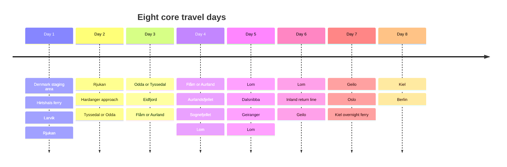

# Norway Fjord and Mountain Motorcycle Loop from Berlin

## Executive summary

This plan treats **Friday, 12 June 2026** as a necessary **staging evening** before the eight core trip days. That is the cleanest way to respect your fixed **Color Line Hirtshals→Larvik ferry on Saturday, 13 June at 12:45**, while still keeping the riding in Norway focused on fjords, mountain roads, and photo stops rather than on excessive transit. The route I recommend is: **Denmark staging stop → Larvik → Rjukan → Hardanger/Odda-Tyssedal → Flåm/Aurland → Lom → Geiranger day loop → Geilo → Oslo→Kiel overnight ferry → Berlin**. It builds around official Norwegian Scenic Routes in **Hardanger, Hardangervidda, Aurlandsfjellet, Sognefjellet, and the Geiranger corridor**, which are among the strongest road-riding highlights in southern Norway.

The route is intentionally biased toward **asphalt scenic riding**, with **few ferries** and no dependence on repeated daily ferry hops. The only “must-do” ferry besides your long Color Line links is optional on the Geiranger day, where you can choose either **more asphalt and hairpins** or the **Geiranger–Hellesylt scenic ferry** depending on weather and mood. Mountain routes in Norway can still be weather-sensitive in June, so this is a **good-weather plan** that should be cross-checked against the Norwegian road authority before each mountain leg.

For the **Friday Denmark overnighter**, the best fully documented **late-arrival** option I found is **BB-Hotel Vejle**, which uses **24/7 door-code self-check-in**, but it is more central than ideal. The better **motorway compromise** is **Scandic Kolding**, which is close to **E45**, has **200+ free parking spaces**, and is very easy to reach, but its public page does **not** document late self-check-in as clearly as BB-Hotel does. In other words: if guaranteed after-hours arrival matters most, pick Vejle; if easier motorway access matters most and you expect to arrive before very late evening, pick Kolding.

## Route at a glance

I am assuming your **Oslo→Kiel** ferry is the intended **Friday, 19 June 2026** departure, which creates a clean eight-day structure from **Saturday, 13 June through Saturday, 20 June**, plus the **Friday, 12 June** Denmark staging evening. Color Line’s **Kiel–Oslo** crossing departs **daily at 14:00** and arrives **10:00** the following morning; the **Hirtshals–Larvik** route is the fast Denmark–Norway entry route on the SuperSpeed ships.

The mileage below is **planning mileage**, not locked routing. It is intentionally approximate because you asked for **waypoints and decision freedom**, with detailed turn-by-turn routing left to your navigation app.

| Day   | Start → End                                        |                Approx. km | Main highlight                                        |
| ----- | -------------------------------------------------- | ------------------------: | ----------------------------------------------------- |
| Day 1 | Denmark staging area → Hirtshals → Larvik → Rjukan | 450–480 riding km + ferry | Fast approach, then Telemark mountains                |
| Day 2 | Rjukan → Tyssedal/Odda                             |                240–280 km | E134/Rv13 rhythm, Hardanger entry, Låtefossen         |
| Day 3 | Tyssedal/Odda → Flåm/Aurland                       |                260–320 km | Hardangerfjord, Eidfjord, Vøringsfossen, fjord finish |
| Day 4 | Flåm/Aurland → Lom                                 |                300–340 km | Aurlandsfjellet + Sognefjellet                        |
| Day 5 | Lom → Geiranger loop → Lom                         |                260–330 km | Dalsnibba, Geirangerfjord, Ørnesvingen                |
| Day 6 | Lom → Geilo                                        |                300–360 km | Final inland riding day, easier pace before ferry day |
| Day 7 | Geilo → Oslo → Kiel ferry                          |        220–240 km + ferry | Easy run-in, overnight return sailing                 |
| Day 8 | Kiel → Berlin                                      |                    350 km | Clean home leg                                        |

This synthesis is built around the official scenic-route backbone and your fixed ferry constraints.

The scenic spine in that timeline is grounded in official route information for **Hardanger, Hardangervidda, Aurlandsfjellet, Sognefjellet, and Geiranger–Trollstigen**.

## Detailed itinerary

**Friday staging evening**  
Leave **Berlin on Friday, 12 June at 16:00** and treat Denmark as a pure logistics leg. My practical recommendation is: **default to Scandic Kolding** if you expect to reach the hotel at a reasonable hour and want the easiest motorway approach, parking, and low-friction Saturday morning. Scandic Kolding is **6 km from the city center**, close to **E45**, and offers **200+ free parking spaces**. If you want the strongest documented **late-arrival guarantee**, use **BB-Hotel Vejle**, which provides **24/7 door-code access** after online booking, though it is more central than ideal. A third useful compromise is **Hotel Medio Fredericia**, which is very near the motorway and has parking outside rooms, but its public English-facing information is less explicit on after-hours procedures than BB-Hotel’s. Recommended links: [Scandic Kolding](https://www.scandichotels.com/en/hotels/scandic-kolding), [BB-Hotel Vejle](https://bbhotels.dk/en/hotel-in-vejle/), [Hotel Medio Fredericia](https://www.hotelmedio.dk/).

**Saturday**  
Ride from Denmark to **Hirtshals** in the morning, aiming to be at the terminal **well before 11:45**; Color Line’s Denmark–Norway guidance says check-in should be completed **no later than 60 minutes before departure**, and you already have the **12:45** sailing booked. After arrival in **Larvik**, the riding leg to **Rjukan** is roughly **183 km**, which makes the day a very sensible “ferry + intro ride” rather than an overstretched first Norway day. Riding character is mixed: fast Danish approach, ferry reset, then a proper mountain-country arrival in Telemark. If you feel fresh, add **Vemork / Rjukan’s industrial-history stop** or a **Gaustatoppen photo stop** area before checking in. Recommended stay: [Rjukan Hotell](https://rjukanhotell.com/en/). The hotel’s public page is solid on location and facilities, but I did **not** find a reliable public late-check-in cutoff on the English page, so if you will arrive late, use the contact/booking form directly: [Rjukan Hotell contact and booking form](https://rjukanhotell.com/kontakt/).

Fuel note for Saturday: this is not a “range anxiety” day on a 30 L bike, but it is the first day where I would start the Norwegian habit of **filling before mountain sections rather than after them**. Larvik and the larger Telemark towns are the easy spots; do not overthink it, just start the mountain pattern early.

**Sunday**  
Ride **Rjukan → Tyssedal/Odda**, roughly **240–280 km** once you include the more rewarding line over the mountains rather than taking the most purely efficient route. This day is where the trip starts to feel like the trip: the road rhythm improves, the scenery sharpens, and the Hardanger arrival is properly earned. The key road logic is to work southwest toward **E134 / Rv13**, then use the **Kinsarvik–Låtefoss** part of the Hardanger scenic route as your gateway into fjord country. The signature stop is **Låtefossen**, a twin waterfall right beside **Rv13**, one of the easiest “park-bike-and-shoot” photo stops on the whole loop.

For the hotel, I would choose **Tyssedal Hotel** over central Odda if you want the quieter and more motorcycle-trip-friendly base. Tyssedal is on the fjord, just north of Odda, and its public FAQ is unusually useful: **check-in from 15:00**, **reception 07:00–23:00**, and **late/self check-in can be arranged in advance**; it also has guest parking and can provide after-hours access details if you warn them. That makes it one of the strongest practical motorcycle-stop hotels on the route. If you prefer staying directly in Odda, **Trolltunga Hotel** is the easier “book direct” choice, but it asks guests to **provide expected arrival time in advance**. Recommended links: [Tyssedal Hotel booking](https://tyssedalhotel.no/en/booking/), [Trolltunga Hotel booking](https://booking.trolltungahotel.no/en/).

Fuel note for Sunday: top up before you commit to the mountain-fjord section, then again in the **Odda/Tyssedal** area at the end of the day. That keeps Monday completely relaxed.

**Monday**  
Ride **Tyssedal/Odda → Flåm/Aurland**, about **260–320 km** depending on whether you keep the day tight or add more Hardanger stops. This is the best day to combine **fjord-road riding** with a couple of short, high-value scenic stops. The clean version is to ride north from Odda/Tyssedal through the Hardangerfjord belt, work toward **Eidfjord**, stop at **Vøringsfossen**, then continue toward **Flåm/Aurland** for an evening on the fjord. **Vøringsfossen** drops **182 m** and has major viewing infrastructure right by **Route 7**, making it ideal for a short, high-reward stop.

For lodging, the most balanced motorcycle-friendly stop is **Flåmsbrygga Hotel**: it is open year-round, directly in the activity hub, and the official site specifically notes practical room details and that parking is **limited on-site** with **public parking available for a fee**. If you want a slightly quieter stop with easy private parking, **Hotel Aurlandsfjord** in Aurland is a good alternative and Booking shows **check-in from 16:00**. Recommended links: [Flåmsbrygga Hotel](https://book.flamsbrygga.no/en/accommodation?filter=a%3D0-165%2C0-832%2C0-86%2C0-599), [Hotel Aurlandsfjord](https://www.booking.com/hotel/no/aurland-fjordhotel.en-gb.html). Flåmsbrygga check-in is listed from **15:00**; Hotel Aurlandsfjord from **16:00**. If you will check in late, Flåm Marina’s local booking guidance is a useful regional rule of thumb: after-hours arrival should be advised in advance.

Fuel note for Monday: make sure you leave the Hardanger side full enough that you do not need to hunt mid-afternoon. This is a stop-heavy riding day where time disappears easily.

**Tuesday**  
Ride **Flåm/Aurland → Lom**, about **300–340 km**, using the true high-mountain backbone of the trip: **Aurlandsfjellet** and then **Sognefjellet**. This is the day I would protect hardest from over-programming. Aurlandsfjellet is a **47 km** scenic route rising from fjord level to **1308 m**, and Sognefjellet is **108 km** up to **1434 m**, the highest mountain pass in northern Europe that is open to cars in summer. That combination is exactly the kind of “fast curves + giant scenery + frequent short photo stops” riding you described. The must-stop viewpoint is **Stegastein**, one of the most photographed viewpoints in the region.

The right overnight base is **Lom**, because it leaves you perfectly set up for the Geiranger day and avoids unnecessary repacking. My primary recommendation is **Fossheim Hotel**, which is central, historic, and practical rather than flashy; Booking lists **check-in from 15:00** and **check-out until 12:00**. The more budget-minded alternative is **Nordal Turistsenter**, which has **check-in from 14:00** and specifically asks you to **inform them in advance if arriving after 19:00**. Recommended links: [Fossheim Hotel](https://www.fossheimhotel.no/en/home), [Nordal Turistsenter booking](https://www.nordalturistsenter.no/booking/).

Fuel note for Tuesday: this is the day to follow the classic Norway strategy—**fill before the mountain, not in the mountain**. I would top up before Aurlandsfjellet and again before or in **Lom**.

**Wednesday**  
Make **Lom** your base again and ride a **Geiranger day loop**, roughly **260–330 km** depending on how many photo stops you take and whether you add optional spurs. The essential line is **Lom → Grotli → Dalsnibba / Nibbevegen optional spur → Geiranger → Ørnesvingen → return to Lom**. Officially, the **Geiranger–Trollstigen** scenic route is a **104 km** route with one ferry on the full line, but you do **not** need to commit to the entire northbound line to enjoy its best southern highlights. **Ørnesvingen** and **Flydalsjuvet** are classic viewpoints, and **Dalsnibba** gives the high overview if the weather is clear. The Geirangerfjord itself is one of Norway’s marquee fjord landscapes.

If you want a more road-focused version of the day, stay on asphalt and ride the climbs up and down yourself. If the weather is absolutely perfect and you want to trade some asphalt for fjord perspective, you can swap the return leg for the **Geiranger–Hellesylt car ferry**, which takes about **65 minutes** and runs in the UNESCO-listed fjord environment. That keeps you within your “few ferries are fine” rule without turning the trip into a ferry holiday. citeturn22search14turn22search10

Because you sleep in **Lom** again, this is the least stressful day of the whole loop: no hotel chase, no luggage problem, no need to ride conservatively just to protect tomorrow’s schedule.

**Thursday**  
Ride **Lom → Geilo**, approximately **300–360 km** depending on how curvy a line you want on the first half of the day. This is the deliberate **transition day** that turns the western-mountain loop back toward Oslo without wasting the whole day on boring transport. I would ride it in one of two ways: either use a **curvier inland line** first and then join the faster roads later, or, if you feel saturated with weather/plateau exposure, keep the day simpler and treat it as your recovery day before the ferry. The key idea is not to over-romanticize this leg: the previous three Norway days are your headliners; Thursday’s job is to keep you fresh, dry, and on schedule.

For Geilo, my pick is **Geilo Hotel** if you want the classic practical stop with central location, or **Ustedalen Hotel & Resort** if you want the slightly more relaxed resort-style base. Booking shows **Geilo Hotel check-in from 16:00** and **Ustedalen check-in from 15:00**. Recommended links: [Geilo Hotel](https://geilohotel.no/en/), [Ustedalen Hotel & Resort](https://www.ustedalen.no/?lang=en).

Fuel note for Thursday: fill in **Lom** before departure and again in the **Geilo** area at the end. That leaves Friday completely buffer-rich.

**Friday**  
Ride **Geilo → Oslo** and board your booked **Oslo→Kiel** ferry. Color Line’s public route page states the sailing departs **14:00** and arrives **10:00** the next morning. I would treat this as a deliberately easy morning: coffee, pack, leave Geilo early enough to arrive in Oslo around **12:00**, which gives you a generous city/terminal buffer for a vehicle check-in even if traffic is ugly. Recommended ferry page: [Color Line Kiel–Oslo route](https://www.colorline.com/kiel-oslo).

This is not the day to squeeze in “one more scenic detour.” You have already banked the mountain/fjord highlights. Use Friday to finish the Norwegian land leg calmly and board without stress.

**Saturday**  
Arrive in **Kiel at 10:00** and ride back to **Berlin**, roughly **350 km**. This is the clean, efficient wrap-up day. By the time you disembark, the long scenic work is done; the value here is simply a smooth ride home. Color Line’s Kiel–Oslo route page gives the standard overnight **14:00 / 10:00** schedule.

## Optional scenic stops

If the weather is excellent and you want more stops than the base plan strictly needs, these are the best extras to keep in reserve rather than pre-committing to all of them.

- **Vemork / Rjukan industrial-history stop** near your first Norway overnight; it is one of the area’s signature off-bike visits. citeturn29search3
- **Låtefossen** on **Rv13**, the easiest high-reward roadside waterfall stop on the Hardanger leg. citeturn9search1turn39view1
- **Vøringsfossen** above Eidfjord, right on the Hardangervidda corridor. citeturn9search0turn39view0
- **Skjervsfossen** or **Steinsdalsfossen** if you decide to push farther into the western Hardanger sections. citeturn39view1
- **Stegastein Viewpoint** above Aurland, which is almost mandatory if the light is good. citeturn9search2turn39view2
- **A short Flåm-area fjord activity** only if you arrive unusually early; Flåmsbrygga’s activity base is right there. citeturn37search5turn32search9
- **Dalsnibba** if visibility is strong on the Geiranger day. citeturn9search3
- **Ørnesvingen** and **Flydalsjuvet** for Geirangerfjord overview photos. citeturn39view5
- **Trollstigen** only as an optional detour if you verify same-day status first. Fjord Norway’s April 2026 update says Trollstigen is planned to open normally from **27 April 2026**, weather permitting, but live conditions can still cause closures, and the road authority remains the real source of truth on the day.

## Practical ride notes

The best ferry habit is simple: **arrive earlier than you think you need to**, sort luggage before entering the queue, and keep only the valuables and anything you need on board in an easy-to-grab bag. For **Hirtshals→Larvik**, Color Line’s Denmark–Norway guidance says vehicle check-in must be completed **no later than 60 minutes before departure**, so treating **11:30** as your actual personal deadline is sensible for the **12:45** sailing. For **Oslo→Kiel**, the public route page confirms the **14:00** departure; because you are boarding with a motorcycle and city-terminal traffic can be messy, I would not aim later than **around 12:00** at the terminal even if your booking confirmation allows a tighter cutoff.

For the motorcycle itself, I would carry **two soft loops, two compact ratchet straps, and a microfiber cloth**. That is not because you will always need your own straps, but because Color Line’s public vehicle-transport rules place responsibility on the traveler to comply with vehicle-transport conditions and deck procedures. In practice, the right move is: follow deck-crew instructions, bring your own small tie-down kit as backup, and do not leave delicate luggage mounted on the bike if you can avoid it.

Your **30 L tank** means range is not the limiting factor here; **time and convenience** are. The winning Norway strategy is to fuel in the **larger valley/fjord towns before climbing into the scenic sections**. For this route that means thinking in terms of **Larvik / Telemark**, **Odda or Tyssedal**, **Eidfjord / Aurland side**, **Lom**, and **Geilo**. In other words: do not wait for the reserve light in mountain country when a painless fill-up 30 minutes earlier would have kept the whole day mentally lighter.

The single most useful operational habit is a **same-morning road-status check** for the weather-exposed mountain roads. Official scenic-route pages explicitly note that **Hardangervidda** weather can be volatile even in summer, and **Aurlandsfjellet** and **Sognefjellet** are seasonal mountain roads. If you decide to add **Trollstigen**, treat same-day status checking as mandatory.

## Booking and GPX

The two ferry links below are **direct official Color Line booking pages** for the correct route pairs, plus the official route-information pages in English.

**Hirtshals → Larvik**

- Direct booking: [Color Line booking page for Hirtshals–Larvik](https://www.colorline.com/booking/?p=eyJwcmUiOnsibG8iOiJlbiIsImRvIjoiY29tIiwiZW4iOiJwcm9kIiwibHAiOiJcL19mcmFnbWVudCIsInBhIjp7ImFkdCI6MiwiY2hkIjowfSwidHQiOiJvbmV3YXkiLCJvciI6IkhJUnxMQVIiLCJkZSI6IkxBUnxISVIifSwicmVzIjp7ImVtIjpmYWxzZSwibHIiOmZhbHNlLCJ2ciI6ZmFsc2UsImh2IjpmYWxzZSwiaGMiOmZhbHNlLCJ2cm8iOlsiTEFSfEhJUiIsIkhJUnxMQVIiXSwidnR0IjpbIm9uZXdheSIsInJldHVybiJdfX0)
- Route page: [Color Line Hirtshals–Larvik](https://www.colorline.com/denmark-norway/ferry-hirtshals-larvik)

**Oslo → Kiel**

- Direct booking: [Color Line booking page for Kiel–Oslo / Oslo–Kiel](https://www.colorline.com/booking/?p=eyJwcmUiOnsibG8iOiJlbiIsImRvIjoiY29tIiwiZW4iOiJwcm9kIiwibHAiOiJcL19mcmFnbWVudCIsInBhIjp7ImFkdCI6MiwiY2hkIjowfSwidHQiOiJvbmV3YXkiLCJvciI6IktFTHxPU0wiLCJkZSI6Ik9TTHxLRUwifSwicmVzIjp7ImVtIjpmYWxzZSwibHIiOmZhbHNlLCJ2ciI6ZmFsc2UsImh2IjpmYWxzZSwiaGMiOmZhbHNlLCJ2cm8iOlsiT1NMfEtFTCIsIktFTHxPU0wiXSwidnR0IjpbIm9uZXdheSIsInJldHVybiJdfX0)
- Route page: [Color Line Kiel–Oslo](https://www.colorline.com/kiel-oslo)

The existing waypoint GPX file is available here:

[Download the GPX waypoint file](sandbox:/mnt/data/norway_motorcycle_trip_waypoints_8_days.gpx)

Because you specifically wanted **waypoints rather than locked routing**, the right workflow is to import the GPX, inspect the stop list, and then let your routing app calculate the actual road line between those points.

For **Kurviger**, the official process is straightforward: open the website or app, use **Import**, select the GPX file, then inspect the imported track and adjust waypoints if needed. Kurviger explicitly notes that for GPX imports the route should be stabilized with **as few waypoints as possible, as many as necessary**.

For **Garmin**, Garmin officially supports importing **waypoints, routes, and tracks** into the **Garmin Explore website**; after import, sync the collection to your device or app. If you prefer desktop prep, Garmin’s support article also points users toward **BaseCamp** when separating tracks and routes before import.

For **OsmAnd**, the import/export tools are under **Menu → Settings → Import/Export**. OsmAnd’s documentation groups imported travel data under **My Places**, including **Tracks**, which is the right home for a waypoint/track-based touring file like this one.

## Open questions and limitations

The main itinerary assumption is that your already-booked **Oslo→Kiel** sailing is the **Friday, 19 June 2026** departure. If your booked return is on a different date, the land loop structure still works, but the last two days should be shifted to match your actual ferry.

The biggest accommodation trade-off is the **Friday Denmark stop**: I found a clearly documented **24/7 self-check-in** solution in **BB-Hotel Vejle**, and a clearly documented **motorway-friendly practical stop** in **Scandic Kolding**, but not a single property that publicly documented **all** of your Friday requirements equally well in one place. I therefore gave you the best **late-arrival** option and the best **motorway-access** option separately.

The attached GPX file is confirmed as present and downloadable, but because it is a **waypoint file rather than a route-locked file**, you should compare the waypoint names against the final hotel choice you actually book before importing it into your navigator.
